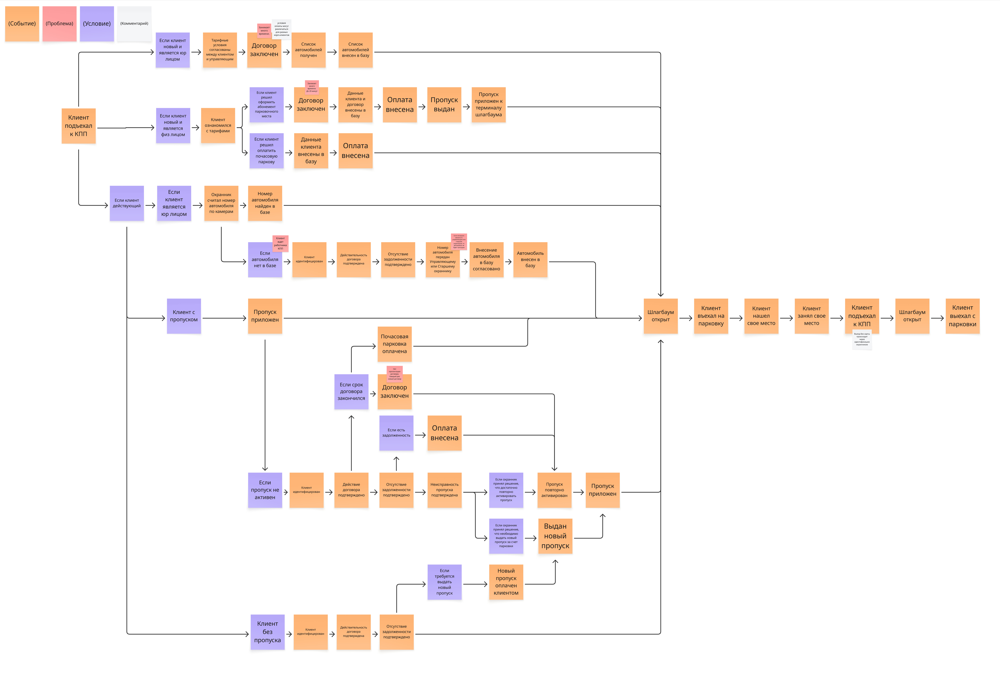
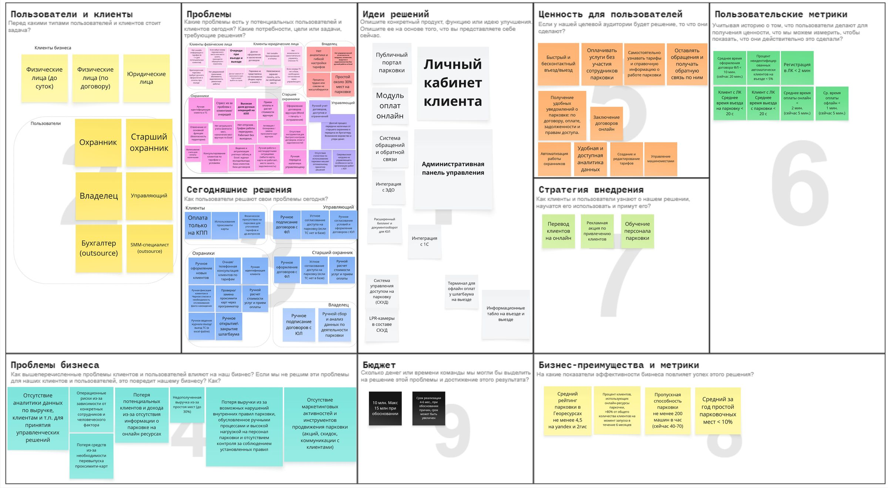
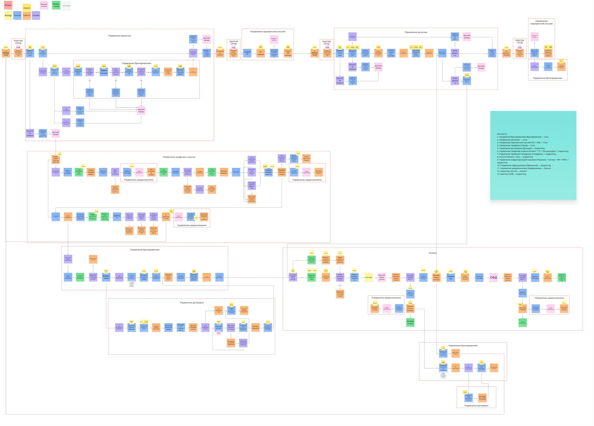

# Цифровая платформа парковки

**Languages:** **Русский** · [English](README.en.md)


[](https://github.com/CeJIDb/sab-win-26-parking/actions/workflows/ci.yml)

[](LICENSE)
[](https://sab-win-26-parking.netlify.app/)

<!--
OG-image для Social Preview этого репозитория — docs/assets/social-preview.png.
Загружается через GitHub Settings → General → Social Preview (это ручное действие).
Процедура — docs/process/branding-checklist.md.
-->

Учебный проект курса [Systems Analyst Bootcamp](https://systems.education/systems-analyst-bootcamp).
Портфолио системного аналитика — от исследования бизнеса AS-IS до интеграций и архитектурных решений.

**Репозиторий:** [CeJIDb/sab-win-26-parking](https://github.com/CeJIDb/sab-win-26-parking)

## Проблема — Решение — Цель

**Проблема:** очереди на КПП при пропускной способности 40–70 машин/час, ручная обработка въезда и выезда, фрагментированные данные в Excel-журналах, нет онлайн-пути для клиента — около 30% мест простаивает, зависимость от персонала для каждой операции.

**Решение:** цифровая платформа с онлайн-кабинетом клиента, автоматизированным КПП (СКУД + LPR), административным контуром и интеграциями с внешними системами.

**Цель:** **Увеличить долю клиентов, использующих парковку через онлайн-ресурсы, с 0% до 80%** от общего количества клиентов на дату запуска решения — в течение **6 месяцев** после ввода системы в эксплуатацию.

## 8 ключевых артефактов

### 1. AS-IS Event Storming

TL;DR: ключевые события, роли и болевые точки текущего процесса; ручная обработка на КПП и зависимость от сотрудника при каждой операции.

<details>
<summary>Подробнее</summary>

[](docs/artifacts/as-is/event-storming-as-is.md)

**Контекст:** Этап 1 «Исследование бизнеса заказчика»; источник — интервью с заказчиком и рабочая доска команды; артефакт использован как вход для AS-IS → TO-BE, Opportunity Canvas и User Story Map.

**Решение:** Выявлены 5+ узких мест ручной обработки (идентификация, оплата, договор, пропуск, охрана); проблемные стикеры диаграммы легли в основу скоупа TO-BE и требований.

**Связанные артефакты:** [Opportunity Canvas](docs/artifacts/opportunity-canvas.md), [Контекстная диаграмма](docs/artifacts/context-diagram.md), [User Story Map](docs/artifacts/user-story-map.md)

</details>

→ [Открыть артефакт](docs/artifacts/as-is/event-storming-as-is.md)

### 2. Opportunity Canvas

TL;DR: формализованное проблемное поле и ценность платформы — болевые точки AS-IS, ценностные предложения по группам пользователей и измеримые критерии успеха MVP.

<details>
<summary>Подробнее</summary>

[](docs/artifacts/opportunity-canvas.md)

**Контекст:** Этап 2 «Концептуальное проектирование решения»; источник — workshop команды, интервью с заказчиком, протоколы №2, №3, №5; задал проблемное поле для Event Storming TO-BE и Контекстной диаграммы.

**Решение:** Зафиксированы болевые точки AS-IS (ручной учет, нет онлайн-оплаты, нет ЭДО), ценностные предложения по группам пользователей и измеримые критерии успеха — основа скоупа MVP.

**Связанные артефакты:** [Event Storming AS-IS](docs/artifacts/as-is/event-storming-as-is.md), [Контекстная диаграмма](docs/artifacts/context-diagram.md), [User Story Map](docs/artifacts/user-story-map.md)

</details>

→ [Открыть артефакт](docs/artifacts/opportunity-canvas.md)

### 3. Контекстная диаграмма

TL;DR: границы системы, внешние участники (клиенты, персонал, СКУД, платежная система, сервис уведомлений) и потоки данных на уровне DFD L0.

<details>
<summary>Подробнее</summary>

[](docs/artifacts/context-diagram.md)

**Контекст:** Этап 2 «Концептуальное проектирование решения»; источник — Impact Map, Opportunity Canvas, User Story Map, протоколы №1.1–№5.

**Решение:** Зафиксированы границы поставки и все внешние системы (4 типа акторов, 10 интегрированных систем); диаграмма служит точкой отсчета для проектирования use-case, требований, ERD и интеграций.

**Связанные артефакты:** [DFD L1](docs/artifacts/dfd-l1.md), [UC-7.1 Создать бронирование](docs/artifacts/use-case/uc-7-1-create-booking.md), [Требования к интеграции](docs/specs/integration/integration-requirements.md)

</details>

→ [Открыть артефакт](docs/artifacts/context-diagram.md)

### 4. FR Бронирование

TL;DR: функциональные требования к центральному доменному объекту — 10 главных UC бронирования (создание, изменение, отмена, просмотр), 5 акторов, реестр FR-BOOKING-NNN с трассировкой к договорам, оплате и автоматизации на КПП.

<details>
<summary>Подробнее</summary>

**Контекст:** Этап 3 «Функциональное проектирование решения»; объект Бронирование — Core BC №2 в DDD-декомпозиции; FR покрывают клиентские, операционные и автоматические сценарии (UC-7.x, UC-8.x договор, UC-10.x оплата, UC-12.2/12.9 автоввод и автозавершение).

**Решение:** Сформирован иерархический реестр требований (Роль.Объект.Действие), сгруппированный по 6 акторам с обоснованиями и трассировкой к UC; реестр служит входом в Sequence UC-10.2 и DFD L1.

**Связанные артефакты:** [UC-7.1 Создать бронирование](docs/artifacts/use-case/uc-7-1-create-booking.md), [DDD Bounded Contexts](docs/architecture/ddd/ddd-bounded-contexts.md), [Концептуальная модель](docs/artifacts/conceptual-model-with-attributes.md)

</details>

→ [Открыть артефакт](docs/specs/functional-requirements/fr-booking.md)

### 5. Event Storming TO-BE: контексты

TL;DR: декомпозиция TO-BE сценариев на 15 доменных контекстов (5 Core, 8 Supporting, 2 Generic) через Event Storming Software Design — методологический мост от ES к DDD bounded contexts и C4.

<details>
<summary>Подробнее</summary>

[](docs/architecture/ddd/es-tobe-sd-contexts.md)

**Контекст:** Этап 4 «Техническое проектирование решения. Архитектура»; тип артефакта — Event Storming / контекстная декомпозиция; источник — рабочая TO-BE доска и декомпозиция контекстов; служит входом в DDD и C4 (L1 → L2 → L3).

**Решение:** Зафиксированы 15 контекстов, включая 2 supporting integration contexts (Адаптер СКУД, Адаптер дисплеев); разделены «Тариф» (правила) и «Расчет стоимости» (исполнение); переходы между контекстами — через явные события и команды.

**Связанные артефакты:** [DDD Bounded Contexts](docs/architecture/ddd/ddd-bounded-contexts.md), [ADR-003 Модульный монолит](docs/architecture/adr/adr-003-modular-monolith.md), [C4-диаграммы](docs/architecture/c4/c4-diagrams.md)

</details>

→ [Открыть артефакт](docs/architecture/ddd/es-tobe-sd-contexts.md)

### 6. C4 — Context и Container

TL;DR: архитектура на трех уровнях детализации — L1 граница системы, L2 контейнеры и интеграции, L3 20 внутренних компонентов Backend и 11 внешних систем.

<details>
<summary>Подробнее</summary>

[](docs/architecture/c4/c4-diagrams.md)

[](docs/architecture/c4/c4-diagrams.md)

[](docs/architecture/c4/c4-diagrams.md)

**Контекст:** Этап 4 «Техническое проектирование решения. Архитектура»; каноничный комплект C4, источник — draw.io (3 страницы); основан на ADR-001, ADR-002, ADR-003 и DDD Bounded Contexts.

**Решение:** Единый источник истины для архитектурных обсуждений, ADR, ревью интеграций и технической части Demo Days; согласован с DDD Bounded Contexts и DFD L1.

**Связанные артефакты:** [ADR-003 Модульный монолит](docs/architecture/adr/adr-003-modular-monolith.md), [DDD Bounded Contexts](docs/architecture/ddd/ddd-bounded-contexts.md), [DFD L1](docs/artifacts/dfd-l1.md)

</details>

→ [Открыть артефакт](docs/architecture/c4/c4-diagrams.md)

### 7. DFD L1

TL;DR: 20 компонентов, единое хранилище PostgreSQL и 10 внешних систем — полный контур потоков данных для интеграционных артефактов.

<details>
<summary>Подробнее</summary>

[](docs/artifacts/dfd-l1.md)

**Контекст:** Этап 5 «Техническое проектирование решения. Интеграции»; промежуточный слой между DFD L0 (контекстная диаграмма) и C4 L3; источник истины — JPG-экспорт из draw.io; акторы — на L0.

**Решение:** Каждый из 20 компонентов Backend сопоставлен с внешними системами и таблицами PostgreSQL; словарь потоков покрывает сценарии оплаты, СКУД и ЭДО; согласован с ADR-003 (единая БД), ADR-005 и ADR-006.

**Связанные артефакты:** [Контекстная диаграмма DFD L0](docs/artifacts/context-diagram.md), [C4 L3 Component](docs/architecture/c4/c4-diagrams.md), [ADR-003 Модульный монолит](docs/architecture/adr/adr-003-modular-monolith.md)

</details>

→ [Открыть артефакт](docs/artifacts/dfd-l1.md)

### 8. Sequence UC-10.2 — онлайн-оплата

TL;DR: интеграционная последовательность оплаты краткосрочной аренды — взаимодействие компонентов платформы с ЮKassa, статусы платежа, квитанция, уведомление клиенту.

<details>
<summary>Подробнее</summary>

[](docs/architecture/integration/sequence-uc-10-2-pay-online-short-term-rental.md)

**Контекст:** Этап 5 «Техническое проектирование решения. Интеграции»; детализирует UC-10.2 на уровне межсистемных взаимодействий; охватывает требования INT-\* для онлайн-оплаты.

**Решение:** Зафиксированы взаимодействия 6 компонентов (включая Модуль уведомлений и Сервис уведомлений); ранние внутренние сбои создания платежа и обновления статуса сессии покрыты отдельными alt-блоками (расширения 1a и 7 соответственно).

**Связанные артефакты:** [UC-10.2 Оплатить онлайн](docs/artifacts/use-case/uc-10-2-pay-online-short-term-rental.md), [Требования к интеграции](docs/specs/integration/integration-requirements.md), [Маппинг ЮKassa](docs/architecture/integration/yookassa-data-mapping.md)

</details>

→ [Открыть артефакт](docs/architecture/integration/sequence-uc-10-2-pay-online-short-term-rental.md)

## 5 этапов / 5 demo

5 demo-дней соответствуют 5 этапам системного проектирования проекта. Каждое demo — контрольная точка, на которой результаты этапа выносились на показ.

| Этап                             | Demo                                      | Что показывали                                                  |
| -------------------------------- | ----------------------------------------- | --------------------------------------------------------------- |
| 1. Исследование бизнеса AS-IS    | [Demo 1](docs/demo-days/demo-1/readme.md) | Event Storming AS-IS, BPMN, UML Class, StateChart               |
| 2. Концептуальное проектирование | [Demo 2](docs/demo-days/demo-2/readme.md) | Opportunity Canvas, Impact Map, User Story Map                  |
| 3. Функциональное проектирование | [Demo 3](docs/demo-days/demo-3/readme.md) | ES TO-BE, Контекстная диаграмма, Use Case, FR/NFR               |
| 4. Архитектура                   | [Demo 4](docs/demo-days/demo-4/readme.md) | Анализ угроз (галстук-бабочка), ES TO-BE с контекстами, C4, ERD |
| 5. Проектирование интеграций     | [Demo 5](docs/demo-days/demo-5/readme.md) | DFD, Sequence, JSON/XML, требования к брокерам                  |

История этапов — в [docs/process/project-journey.md](docs/process/project-journey.md).

## Команда

Проект выполнен в команде системных аналитиков из 5 человек:

- [Denis333admin](https://github.com/Denis333admin)
- [malinkaemail-blip](https://github.com/malinkaemail-blip)
- [mrneatly](https://github.com/mrneatly)
- [skifup](https://github.com/skifup)
- [CeJIDb](https://github.com/CeJIDb)

Командная работа велась на общей [доске в Miro](https://miro.com/app/live-embed/uXjVHUcg6W8=/?embedMode=view_only_without_ui&moveToViewport=-28200%2C-14096%2C41087%2C20436&embedId=685005867404) (Event Storming, контекстные диаграммы, схемы процессов) и в базе знаний buildin.ai; этот репозиторий вел [@CeJIDb](https://github.com/CeJIDb) как maintainer.

## Навигация

- [Обзор проекта](docs/project-overview.md) — предметные области и технологии репозитория
- [Wireframe — демо](https://sab-win-26-parking.netlify.app/) — задеплоенный интерфейсный макет
- [Доска команды — Miro](https://miro.com/app/live-embed/uXjVHUcg6W8=/?embedMode=view_only_without_ui&moveToViewport=-28200%2C-14096%2C41087%2C20436&embedId=685005867404) — общее рабочее пространство команды (view-only)
- [Артефакты системного анализа](docs/artifacts/readme.md) — use case, BPMN, ES, контекстная диаграмма
- [Архитектура](docs/architecture/readme.md) — DDD, C4, ADR, интеграции
- [Спецификации](docs/specs/readme.md) — функциональные и нефункциональные требования

Маршрут знакомства с документацией — [docs/readme.md](docs/readme.md#с-чего-начать)

Проект прошел 5 этапов: исследование бизнеса заказчика, концептуальное проектирование, функциональное проектирование, техническое проектирование (архитектура и интеграции). [Подробная история →](docs/process/project-journey.md)

## Стек

- Markdown — основной формат проектной документации
- Node.js + Nunjucks + Sass — сборка wireframe-макета
- Python — вспомогательные скрипты
- SQL (PostgreSQL) — практика и проверка модели данных

Подробнее — [Обзор проекта](docs/project-overview.md)

## Wireframe-макет

Для визуализации пользовательских сценариев в репозитории есть статический wireframe.

Задеплоенная версия UI доступна по ссылке: [sab-win-26-parking.netlify.app](https://sab-win-26-parking.netlify.app/).

Чтобы пересобрать его локально:

```bash
npm ci
npm run build
```

После этого можно открыть `ui/index.html` и перейти в нужный контур.
