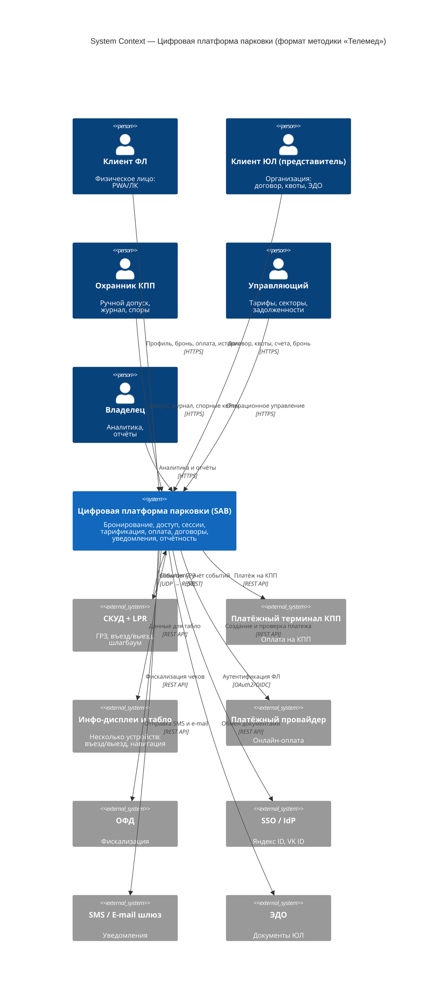

# C4 Level 1 (System Context): цифровая платформа парковки — формат методики «Телемед»

Текстовая выкладка **пользователей** и **внешних систем** для диаграммы уровня контекста (C4 L1) по той же логике, что в примере **Телемед**: центральная система `[Software System]`, сверху — актёры `[Person]` с перечислением действий, снизу — внешние системы с подписями связей; в легенде — условные цвета (как в референсе: «свой» периметр vs сторонний сервис). Канонические роли и интеграции согласованы с [`c4-parking-platform.md`](c4-parking-platform.md) (Level 1).

## Оглавление

- [Целевая система](#целевая-система)
- [Пользователи Person](#пользователи-person)
- [Внешние системы Software System](#внешние-системы-software-system)
- [Легенда (как в примере Телемед)](#легенда-как-в-примере-телемед)
- [Диаграмма Mermaid (C4 Context)](#диаграмма-mermaid-c4-context)
- [Связанные документы](#связанные-документы)

---

## Целевая система

| Элемент | C4-тип | Описание |
| --- | --- | --- |
| **Цифровая платформа парковки (SAB)** | `[Software System]` | Веб-ориентированная система управления парковкой (в т.ч. ~600 мест): бронирование, контроль доступа на КПП, тарификация, приём оплат, договоры с юридическими лицами, уведомления, отчётность; интеграции с оборудованием (СКУД/LPR, терминалы, табло) и внешними сервисами (платежи, фискализация, идентичность, коммуникации, ЭДО). Архитектурная база: модульный монолит — см. [ADR-003](../adr/adr-003-modular-monolith.md). |

---

## Пользователи (Person)

Под каждым актёром — **что он делает с платформой** (активные формулировки, как в примере Телемед).

### Клиент ФЛ

- **Имя:** Клиент ФЛ  
- **Тип:** `[Person]`  
- **Роль:** посетитель парковки (физическое лицо).  
- **Взаимодействие с платформой:** регистрируется и ведёт личный профиль; входит в систему (в т.ч. через SSO); бронирует места; оплачивает парковку онлайн; просматривает историю парковочных сессий и уведомления в PWA/личном кабинете.

### Клиент ЮЛ (представитель)

- **Имя:** Клиент ЮЛ (представитель)  
- **Тип:** `[Person]`  
- **Роль:** уполномоченный представитель организации по договору.  
- **Взаимодействие с платформой:** ведёт профиль организации; управляет договором, квотами и бронированиями; работает со счетами; согласует электронный документооборот по договорным документам через интеграцию с ЭДО.

### Охранник КПП

- **Имя:** Охранник КПП  
- **Тип:** `[Person]`  
- **Роль:** сотрудник контрольно-пропускного пункта.  
- **Взаимодействие с платформой:** использует интерфейс КПП для ручного допуска и отказа; фиксирует события в журнале; разбирает спорные ситуации (несовпадение ГРЗ, оплата, ручной въезд/выезд).

### Управляющий

- **Имя:** Управляющий  
- **Тип:** `[Person]`  
- **Роль:** операционное управление парковкой.  
- **Взаимодействие с платформой:** настраивает тарифы и секторы; ведёт учёт задолженностей; обрабатывает обращения пользователей; задаёт операционные настройки площадки в админ-панели.

### Владелец

- **Имя:** Владелец  
- **Тип:** `[Person]`  
- **Роль:** владелец бизнеса / стратегическое руководство.  
- **Взаимодействие с платформой:** просматривает аналитику и отчёты; опирается на показатели для бизнес-решений в админ-панели.

---

## Внешние системы (Software System)

Ниже — **внешние программные системы** и **что делает с ними платформа** (направление и смысл связи). Для соответствия **легенде Телемеда** системы сгруппированы: *внутренний периметр объекта / контролируемые интеграции* (в референсе — серые прямоугольники) и *сторонние облачные/банковские сервисы* (в референсе — фиолетовые).

### Внутренний периметр объекта (в референсе — серый прямоугольник)

На уровне контекста **несколько физических устройств одного класса** (несколько дисплеев и табло с разным назначением) допустимо объединять в **один** внешний узел `[Software System]`, если для платформы это одна и та же граница интеграции (типовой контракт: выдача данных для отображения). Различие «дисплей въезда / выезда / навигационное табло» отражает **контент и сценарии**, а не обязательно отдельные системы на диаграмме L1; при разных вендорах или протоколах узлы разносят на L1 или детализируют на Level 2–3.

| Система | C4-тип | Назначение | Взаимодействие с платформой |
| --- | --- | --- | --- |
| **СКУД + LPR-видеосистема** | `[Software System]` | Распознавание государственных регистрационных знаков; события въезда/выезда; исполнение решений доступа (шлагбаум). | Платформа получает события распознавания и сессионную логику; отправляет команды разрешения/запрета проезда. |
| **Платёжный терминал КПП** | `[Software System]` | Приём оплаты на КПП (наличные, карта). | Платформа инициирует и согласует платежи, получает результат для закрытия сессии. |
| **Инфо-дисплеи и табло (объект)** | `[Software System]` | **Несколько** устройств на площадке: в т.ч. дисплей въезда и выезда (ГРЗ, право доступа, тариф, сумма/статус оплаты, инструкции), навигационные/статистические табло (свободные места, направления). Контент разный, интеграция с платформой — одного типа. | Платформа передаёт данные для отображения на соответствующие устройства. |

### Сторонние сервисы — вне периметра проекта (в референсе — фиолетовый прямоугольник)

| Система | C4-тип | Назначение | Взаимодействие с платформой |
| --- | --- | --- | --- |
| **Платёжный провайдер (онлайн)** | `[Software System]` | Онлайн-эквайринг: карты, СБП и т.п. | Платформа создаёт и проверяет онлайн-платежи, обрабатывает статусы оплаты. |
| **ОФД** | `[Software System]` | Фискализация чеков (54-ФЗ). | Платформа передаёт данные для регистрации чеков. |
| **SSO / IdP (Яндекс ID, VK ID и др.)** | `[Software System]` | Внешний поставщик идентичности для клиентов ФЛ. | Платформа выполняет OAuth2/OIDC-аутентификацию, проверяет токены, связывает внешнюю учётную запись с профилем. |
| **SMS / E-mail шлюз** | `[Software System]` | Доставка SMS и электронных писем. | Платформа отправляет транзакционные и сервисные уведомления. |
| **ЭДО** | `[Software System]` | Электронный документооборот (договоры с ЮЛ). | Платформа обменивается документами и статусами с контуром ЭДО. |

---

## Легенда (как в примере Телемед)

| Условное обозначение | Значение |
| --- | --- |
| Человек (силуэт / иконка пользователя) | `[Person]` — пользователь системы. |
| Синий прямоугольник (центр диаграммы) | Целевая `[Software System]` — описываемая цифровая платформа парковки. |
| Серый прямоугольник | Внешняя `[Software System]`, относящаяся к **объекту / контролируемому периметру** (оборудование и интеграции на площадке). |
| Фиолетовый прямоугольник | Внешняя `[Software System]` **вне периметра** проекта — сторонний поставщик (банк, облако, провайдеры). |
| Стрелка с подписью | Взаимодействие; текст на стрелке — конкретное действие или поток данных. |

В **Mermaid C4** ниже все внешние системы отображаются как `System_Ext` (единый стиль); разделение «серый / фиолетовый» задано **в таблицах выше**, как в текстовой части референса.

---

## Диаграмма Mermaid (C4 Context)

---

## Связанные документы

- [`c4-parking-platform.md`](c4-parking-platform.md) — полный C4 по уровням 1–3, превью HTML, сценарии.
- [`c4-external-context.md`](c4-external-context.md) — индекс C4 model и ссылки на материалы.
- [`../readme.md`](../readme.md) — оглавление раздела архитектуры.
- [ADR-003: модульный монолит](../adr/adr-003-modular-monolith.md).
