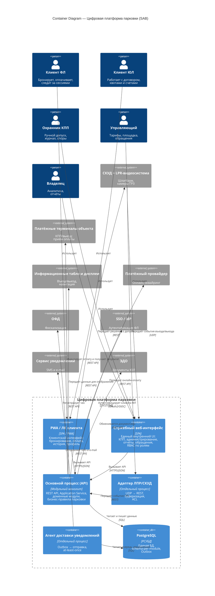

# C4 Level 2 (Container): цифровая платформа парковки — в формате референса «Телемед»

> **Каноническим источником** C4-диаграмм является [`c4-parking-platform.md`](c4-parking-platform.md) (L1 + L2 + L3 + сценарии). Этот файл содержит автономную копию L2 для быстрого просмотра — при редактировании синхронизируйте оба файла.

Контейнерная диаграмма (C4 L2) для ИС парковки с композиционной логикой, близкой к примеру **Телемед**: акторы вокруг системы, внутри границы системы — только **контейнеры** (приложения, процессы и БД), снаружи — внешние системы.

Важное отличие от примера: у нас по [ADR-003](../adr/adr-003-modular-monolith.md) выбрана архитектура **модульного монолита**, поэтому Level 2 получается заметно компактнее. Доменные модули (`Доступ`, `Бронирование`, `Сессия`, `Тариф` и т.д.) на этом уровне **не** показываются как отдельные контейнеры; они раскрываются на Level 3.

## Оглавление

- [Назначение](#назначение)
- [Граница системы](#граница-системы)
- [Контейнеры внутри системы](#контейнеры-внутри-системы)
- [Внешние системы вокруг контейнеров](#внешние-системы-вокруг-контейнеров)
- [Легенда](#легенда)
- [Диаграмма Mermaid (C4 Container)](#диаграмма-mermaid-c4-container)
- [Связанные документы](#связанные-документы)

---

## Назначение

Диаграмма уровня **Container** отвечает на вопрос:

- из каких исполняемых частей состоит система;
- какие контейнеры взаимодействуют между собой;
- где находятся базы данных;
- через какие внешние системы проходят ключевые интеграции.

На этом уровне мы **не** показываем внутренние модули монолита и не пытаемся заменить Container Diagram диаграммой компонентов или инфраструктурным deployment view.

---

## Граница системы

| Элемент | C4-тип | Описание |
| --- | --- | --- |
| **Цифровая платформа парковки (SAB)** | `[Software System]` | Система управления парковкой: бронирование, контроль доступа на КПП, тарификация, оплата, договоры с юридическими лицами, уведомления и отчётность. |

---

## Контейнеры внутри системы

| Контейнер | C4-тип | Технология / форма | Назначение |
| --- | --- | --- | --- |
| **PWA / ЛК клиента** | `[Container]` | SPA / PWA | Интерфейс клиента ФЛ и представителя ЮЛ: профиль, бронирование, оплата, история, квоты, счета |
| **Служебный веб-интерфейс** | `[Container]` | SPA | Единый внутренний интерфейс для охранника, управляющего и владельца. Разные экраны и действия открываются по ролям и уровням доступа (RBAC) |
| **Основной процесс (API)** | `[Container]` | Модульный монолит | Основной backend: REST API, `Application Service`, доменные модули, бизнес-правила парковки |
| **Адаптер ЛПР/СКУД** | `[Container]` | Отдельный процесс / ACL | Принимает UDP от LPR/СКУД и переводит его в REST-вызовы к основному процессу |
| **Агент доставки уведомлений** | `[Container]` | Отдельный процесс / Worker | Читает очередь уведомлений из Outbox и отправляет их во внешние каналы |
| **PostgreSQL** | `[ContainerDb]` | PostgreSQL | Единая БД системы, `schema-per-module`, Outbox-таблица для уведомлений |

> На Level 2 `Application Service`, `Access`, `Booking`, `Session`, `Tariff`, `Payment` и остальные bounded contexts не выделяются в отдельные контейнеры, потому что исполняются внутри **одного** контейнера `Основной процесс (API)`.

> **Владение ACL-адаптерами к внешним системам** (раскрывается на Level 3):
>
> | Внешняя система | Модуль — владелец ACL |
> | --- | --- |
> | Платёжный провайдер (онлайн-эквайринг) | `Платёж` |
> | ОФД (фискализация чеков) | `Платёж` |
> | Платёжные терминалы объекта | `Платёж` |
> | ЭДО (договоры с ЮЛ) | `Договор` |
> | Информационные табло и дисплеи | `Площадка` |

---

## Внешние системы вокруг контейнеров

### Контролируемый периметр объекта

| Система | C4-тип | Назначение | Связь с контейнерами |
| --- | --- | --- | --- |
| **СКУД + LPR-видеосистема** | `[Software System]` | Камеры ГРЗ, шлагбаум, события въезда/выезда | Работает через `Адаптер ЛПР/СКУД` и получает решения о допуске от `Основного процесса` |
| **Платёжные терминалы объекта** | `[Software System]` | Оплата на КПП и/или выезде | `Основной процесс` инициирует оплату и получает результат |
| **Информационные табло и дисплеи** | `[Software System]` | Въезд/выезд, навигация, отображение состояния | `Основной процесс` передаёт данные для отображения |

### Сторонние сервисы вне периметра проекта

| Система | C4-тип | Назначение | Связь с контейнерами |
| --- | --- | --- | --- |
| **Платёжный провайдер** | `[Software System]` | Онлайн-эквайринг | `Основной процесс` проводит онлайн-платежи |
| **ОФД** | `[Software System]` | Фискализация чеков | `Основной процесс` регистрирует чеки |
| **SSO / IdP** | `[Software System]` | Внешняя аутентификация клиентов ФЛ | `Основной процесс` выполняет OAuth2/OIDC-поток |
| **Сервис уведомлений** | `[Software System]` | Отправка SMS и e-mail | `Агент доставки уведомлений` передаёт сообщения во внешние каналы |
| **ЭДО** | `[Software System]` | Электронный документооборот с ЮЛ | `Основной процесс` обменивается договорными документами |

Внешние объекты вроде `1С`, гео-сервисов или внешнего BI здесь намеренно не показаны: для текущего объёма проекта они не формируют основную **контейнерную картину** системы и при необходимости должны оформляться отдельным расширением контекста.

---

## Легенда

| Условное обозначение | Значение |
| --- | --- |
| Человек | `[Person]` — пользователь системы |
| Прямоугольник внутри границы системы | `[Container]` — исполняемый контейнер платформы |
| Цилиндр внутри границы системы | `[ContainerDb]` — база данных платформы |
| Пунктирная рамка | Граница `[Software System]` — сама цифровая платформа парковки |
| Внешний прямоугольник | `[Software System]` — внешняя система, с которой взаимодействуют контейнеры |

В **Mermaid C4** внешние системы отображаются единым стандартным стилем `System_Ext`, поэтому различие между “контролируемым периметром объекта” и “сторонними сервисами” задаётся структурой разделов и подписями, а не цветом блоков.

---

## Диаграмма Mermaid (C4 Container)

---

## Связанные документы

- [c4-l1-system-context.md](c4-l1-system-context.md) — C4 Level 1 (System Context) в стиле референса `Телемед`
- [c4-parking-platform.md](c4-parking-platform.md) — полный C4 для парковки (Level 1–3)
- [../adr/adr-003-modular-monolith.md](../adr/adr-003-modular-monolith.md) — архитектурный стиль и границы контейнеров
- [../ddd/ddd-bounded-contexts.md](../ddd/ddd-bounded-contexts.md) — bounded contexts, раскрываемые на Level 3
