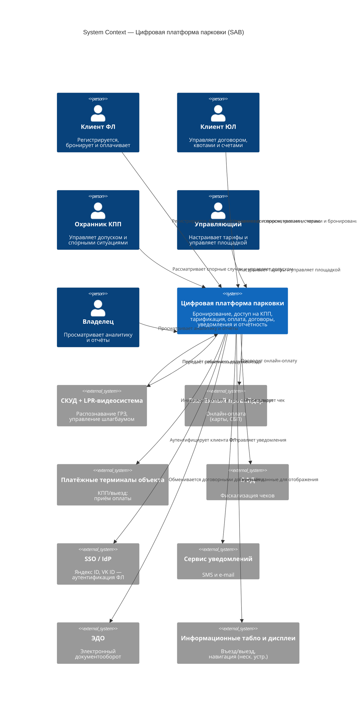
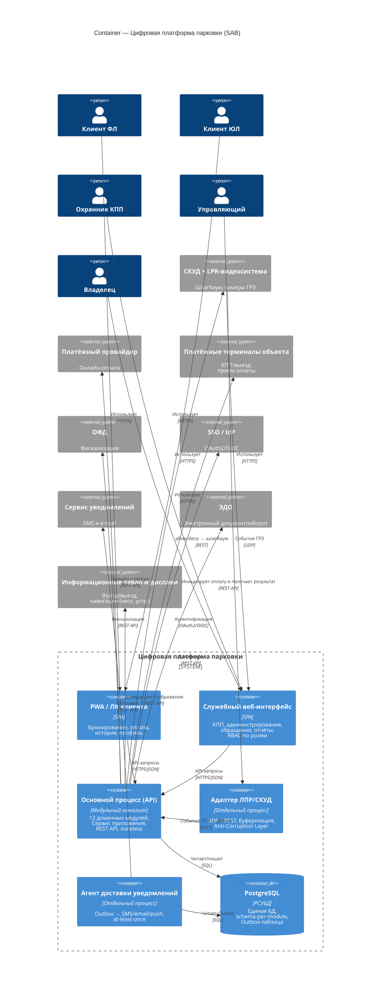

# C4 Model: Цифровая платформа парковки (SAB)

Диаграммы по модели [C4](https://c4model.com/) для системы управления парковкой. Основой служат [ADR-001](../adr/adr-001-online-access-rights-evaluation.md)–[ADR-003](../adr/adr-003-modular-monolith.md), [DDD bounded contexts](../ddd/ddd-bounded-contexts.md) и [чартер проекта](../../artifacts/project-charter.md).

## Оглавление

- [Как посмотреть диаграммы](#как-посмотреть-диаграммы)
- [Level 1 — System Context](#level-1--system-context)
- [Level 2 — Container](#level-2--container)
- [Level 3 — Component (основной процесс)](#level-3--component-основной-процесс)
- [Ключевые сценарии](#ключевые-сценарии)
- [Связанные документы](#связанные-документы)

---

## Как посмотреть диаграммы

1. **Браузер (надёжный вариант для C4):** в корне репозитория выполните `npm run docs:c4-preview` и откройте в браузере файл [`c4-parking-platform-preview.html`](c4-parking-platform-preview.html) (двойной клик по файлу или контекстное меню «Открыть с помощью…»). HTML собирается скриптом [`../../../scripts/build-c4-preview-html.mjs`](../../../scripts/build-c4-preview-html.mjs) из fenced-блоков Mermaid в этом же документе — после правок диаграмм пересоберите превью той же командой.
2. **Cursor / VS Code:** установите рекомендуемые расширения рабочей области (в т.ч. **Markdown Preview Mermaid Support**), откройте этот файл и команду **Markdown: Open Preview** (обычно Ctrl+Shift+V). Встроенный движок превью иногда отстаёт от полной сборки Mermaid: если блоки C4 пустые или с ошибкой, используйте пункт 1.
3. **GitHub:** после push fenced-блоки с языком `mermaid` в этом файле рендерятся на странице просмотра в репозитории.

---

## Level 1 — System Context

Показывает платформу как «чёрный ящик», акторов и внешние системы.

### Текстовое описание (Level 1)

**Система:** Цифровая платформа парковки (SAB) — веб-приложение для управления парковкой на 600 мест: бронирование, контроль доступа на КПП, тарификация, оплата, договоры, уведомления, аналитика.

**Акторы (люди):**

| Актор | Взаимодействие с платформой |
| --- | --- |
| Клиент ФЛ | PWA/ЛК: бронирование, оплата, история сессий, профиль, уведомления |
| Клиент ЮЛ (представитель) | ЛК: договоры, квоты, бронирование, счета, профиль организации |
| Охранник КПП | Служебный веб-интерфейс: ручной допуск, журнал, спорные ситуации |
| Управляющий | Служебный веб-интерфейс: тарифы, секторы, задолженности, обращения, настройки |
| Владелец | Служебный веб-интерфейс: аналитика, отчёты, бизнес-решения |

**Внешние системы:**

| Система | Протокол | Назначение |
| --- | --- | --- |
| СКУД + LPR-видеосистема | UDP / REST | Распознавание ГРЗ, события въезда/выезда; исполнение allow/deny (шлагбаум) |
| Платёжный провайдер (онлайн) | REST API | Приём онлайн-оплаты (карты, СБП) |
| Платёжные терминалы объекта | REST API | Терминалы оплаты на КПП/выезде; на L1 — один внешний узел |
| ОФД | REST API | Фискализация чеков |
| SSO/IdP (Яндекс ID, VK ID) | OAuth2/OIDC | Аутентификация клиентов ФЛ |
| Сервис уведомлений | REST API | Доставка SMS и e-mail |
| ЭДО | REST API | Электронный документооборот (договоры ЮЛ) |
| Информационные табло и дисплеи | REST API | Несколько устройств (въезд/выезд, навигация и т.д.); на L1 — один внешний узел, см. [`c4-l1-system-context.md`](c4-l1-system-context.md) |

### Mermaid-диаграмма (Level 1)



---

## Level 2 — Container

Показывает развёртываемые единицы внутри платформы: основной процесс, изолированные адаптеры, БД и фронтенды.

> Отдельные процессы выделяются только при несовместимости транспорта (UDP у СКУД/LPR) или при необходимости изолировать блокирующую асинхронную операцию (пакетная рассылка уведомлений). Платёжные терминалы объекта и информационные табло/дисплеи интегрируются напрямую через REST API из основного процесса; для каждого внешнего вендора внутри основного процесса предусмотрен ACL-слой (Anti-Corruption Layer), но как самостоятельный развёртываемый артефакт не выделяется.

### Текстовое описание (Level 2)

| Контейнер | Технология | Назначение |
| --- | --- | --- |
| **Web-приложение (PWA/ЛК)** | SPA / PWA | Клиентский интерфейс: бронирование, оплата, история, профиль |
| **Служебный веб-интерфейс** | SPA | Единый внутренний интерфейс для охранника, управляющего и владельца; доступ к разделам определяется ролями |
| **Основной процесс (API)** | Модульный монолит | Единый развёртываемый артефакт: 12 доменных модулей + Сервис приложения + инфраструктура аутентификации. Stateless. REST API. |
| **Адаптер ЛПР/СКУД** | Отдельный процесс | Принимает UDP от LPR-видеосистемы → REST-вызовы к основному процессу. Буферизация при недоступности. Anti-Corruption Layer. |
| **Агент доставки уведомлений** | Отдельный процесс | Потребляет очередь уведомлений (Outbox) → отправка через внешние шлюзы. At-least-once, idempotency key. |
| **БД PostgreSQL** | PostgreSQL | Единая БД с изоляцией по схемам (schema-per-module). Outbox-таблица для Агента доставки уведомлений. |

### Mermaid-диаграмма (Level 2)



---

## Level 3 — Component (основной процесс)

Показывает доменные модули (bounded contexts) внутри основного процесса и их ключевые зависимости.

### Текстовое описание (Level 3)

Основной процесс содержит 12 доменных модулей, координируемых через Сервис приложения. Модули взаимодействуют только через публичные интерфейсы (прямой доступ к таблицам другого модуля запрещён). `Доступ` остаётся одним модулем, но внутри разделяется на `ПолитикаДопускаНаВъезд` и `ПолитикаДопускаНаВыезд`.

**Core-домены** (уникальная бизнес-логика):

| Модуль | Ответственность |
| --- | --- |
| **Доступ** | Решение разрешить/запретить на КПП; чёрный список; аудит решений. Для въезда проверяет бронь и при необходимости запрашивает авто-бронирование через интерфейс `Бронирование`; для выезда проверяет активную сессию и статус оплаты. |
| **Бронирование** | Планирование и резервирование ресурса; автоматическое бронирование по запросу `Доступ`. |
| **Сессия** | Фактическое использование парковки; журнал въезда/выезда; корректировки охранника. Всегда привязана к Бронирование (ADR-002). |
| **Тариф** | Тарифные планы, правила применимости, расчёт стоимости в реальном времени. Получает льготы и договорные ставки как входные параметры. |

**Supporting-домены:**

| Модуль | Ответственность |
| --- | --- |
| **Платёж** | Платежи, возвраты, задолженности, чеки, счета ЮЛ; фиксация зафиксированной суммы в момент оплаты. Владеет ACL-адаптерами для трёх внешних систем: **платёжный провайдер** (онлайн-эквайринг), **платёжные терминалы объекта** (КПП/выезд) и **ОФД** (фискализация чеков). |
| **Договор** | Договоры, шаблоны, квоты, абонементные правила. Владеет ACL-адаптером для **ЭДО** (подписание и хранение договорных документов с ЮЛ). |
| **Клиент** | Мастер-данные: клиент, организация, ТС (ГРЗ), ПДн, согласия. |
| **Площадка** | Инфраструктура парковки: секторы, ПМ, КПП, конфигурация и статусы. Владеет ACL-адаптером для **информационных табло и дисплеев** (передача операционного статуса мест и направлений на устройства въезда/выезда и навигации). |
| **Обращение** | Обращения, тикеты, история переписки. |
| **Сотрудник** | Сотрудники, роли (RBAC), служебные профили. |

**Generic-домены:**

| Модуль | Ответственность |
| --- | --- |
| **Уведомление** | Уведомления, шаблоны, очередь на доставку. |
| **Отчёт** | Read-модели (CQRS), аналитические агрегаты, отчёты. |

**Сквозные компоненты:**

| Компонент | Ответственность |
| --- | --- |
| **Сервис приложения** | Оркестрация сценариев, пересекающих несколько модулей (въезд, выезд, оплата). |
| **Инфраструктура аутентификации** | SSO, пароли, TOTP 2FA, JWT — инфраструктурный слой, не доменный модуль. |

### Mermaid-диаграмма (Level 3)

```mermaid
C4Component
    title Component — Основной процесс (API)

    Container_Boundary(api, "Основной процесс (модульный монолит)") {

        Component(app_svc, "Сервис приложения", "Оркестрация", "Координация сквозных<br>сценариев (въезд, выезд,<br>оплата, ручной допуск)")
        Component(auth, "Инфраструктура аутентификации", "Инфраструктура", "SSO, пароли, TOTP 2FA,<br>JWT-проверка")

        Component(access, "Доступ", "Core", "разрешить/запретить на КПП,<br>политика въезда/выезда,<br>чёрный список, аудит")
        Component(booking, "Бронирование", "Core", "Бронирование,<br>авто-бронирование,<br>резервирование ПМ")
        Component(session, "Сессия", "Core", "Парковочная сессия,<br>журнал въезда/выезда")
        Component(tariff, "Тариф", "Core", "Тарифы,<br>preview суммы,<br>расчёт стоимости")

        Component(payment, "Платёж", "Supporting", "Платежи, фиксированная сумма,<br>возвраты, чеки")
        Component(contracts, "Договор", "Supporting", "Договоры, квоты,<br>абонементы")
        Component(client, "Клиент", "Supporting", "Клиент, организация,<br>ТС, ГРЗ, ПДн")
        Component(facility, "Площадка", "Supporting", "Секторы, ПМ, КПП,<br>конфигурация")
        Component(support, "Обращение", "Supporting", "Обращения, тикеты")
        Component(employee, "Сотрудник", "Supporting", "Сотрудники, RBAC")

        Component(notification, "Уведомление", "Generic", "Уведомления, шаблоны,<br>очередь (Outbox)")
        Component(report, "Отчёт", "Generic", "Read-модели, аналитика,<br>отчёты (CQRS)")
    }

    Container_Ext(lpr_adapter, "Адаптер ЛПР/СКУД", "Отдельный процесс")
    Container_Ext(notif_worker_ext, "Агент доставки уведомлений", "Отдельный процесс")
    Container_Ext(spa, "SPA (клиент / админ / КПП)", "Фронтенд")
    ContainerDb_Ext(db, "PostgreSQL", "schema-per-module")

    System_Ext(skud_lpr_ext, "СКУД + LPR-видеосистема", "Шлагбаум, камеры ГРЗ")
    System_Ext(idp_ext, "SSO / IdP", "OAuth2/OIDC, Яндекс ID / VK ID")
    System_Ext(notify_gw_ext, "Сервис уведомлений", "SMS / email")
    System_Ext(payment_provider_ext, "Платёжный провайдер", "Онлайн-оплата")
    System_Ext(ofd_ext, "ОФД", "Фискализация чеков")
    System_Ext(payment_terminal_ext, "Платёжные терминалы объекта", "Оплата на КПП/выезде")
    System_Ext(edo_ext, "ЭДО", "Документы ЮЛ")
    System_Ext(displays_ext, "Информационные табло и дисплеи", "Статус мест, навигация")

    Rel(spa, app_svc, "REST API", "HTTPS/JSON")
    Rel(lpr_adapter, app_svc, "Событие ГРЗ", "REST")
    Rel(spa, auth, "JWT / OIDC callback")
    Rel(auth, idp_ext, "OAuth2/OIDC flow", "HTTPS")

    Rel(app_svc, access, "проверитьВъезд() / проверитьВыезд()")
    Rel(app_svc, booking, "получить / завершить")
    Rel(app_svc, session, "открыть() / завершить() / read-view охранника")
    Rel(app_svc, tariff, "рассчитатьТекущуюСумму() / договорные ставки через Договор")
    Rel(app_svc, payment, "создать() / провести()")
    Rel(app_svc, skud_lpr_ext, "allow/deny → шлагбаум", "REST")

    Rel(access, booking, "естьАктивнаяБронь? / создатьАвтоБронирование()")
    Rel(access, contracts, "естьАктивныйДоговор?")
    Rel(access, session, "естьАктивнаяСессия?")
    Rel(access, payment, "естьДолг? / оплатаПроведена?")
    Rel(access, client, "ГРЗ → тсИд → клиентИд")
    Rel(access, facility, "Конфигурация КПП")
    Rel(access, notification, "Отказ / предупреждение")
    Rel(access, report, "Аудит решений")

    Rel(booking, facility, "Доступность ПМ")
    Rel(booking, client, "ТС / клиентИд")
    Rel(booking, session, "Сессия всегда привязана к Бронированию (ADR-002, ACID)")
    Rel(booking, contracts, "Проверка квоты по договору")
    Rel(booking, notification, "Событие бронирования")
    Rel(booking, report, "Доменные события")

    Rel(session, facility, "Данные ПМ")
    Rel(session, notification, "Событие сессии")
    Rel(session, report, "Доменные события")

    Rel(tariff, facility, "Зона / тип ПМ")

    Rel(payment, session, "Данные сессии для расчёта")
    Rel(payment, notification, "Чек / возврат")
    Rel(payment, report, "Доменные события")
    Rel(payment, payment_provider_ext, "Онлайн-платежи", "REST API / ACL")
    Rel(payment, ofd_ext, "Фискализация", "REST API / ACL")
    Rel(payment, payment_terminal_ext, "Инициирует оплату", "REST API / ACL")

    Rel(contracts, client, "Данные организации / клиента")
    Rel(contracts, edo_ext, "Обмен документами", "REST API / ACL")

    Rel(notification, client, "Настройки уведомлений")

    Rel(support, client, "Привязка к клиенту")
    Rel(support, session, "Привязка к сессии")
    Rel(support, employee, "Сотрудник в разборе")
    Rel(support, payment, "Запрос возврата")

    Rel(employee, access, "Ручной допуск охранника")

    Rel(report, notification, "Доменные события")
    Rel(report, support, "Доменные события")

    Rel(facility, displays_ext, "Статус мест и направлений", "REST API / ACL")

    Rel(notif_worker_ext, db, "Читает Outbox", "SQL")
    Rel(notif_worker_ext, notify_gw_ext, "SMS / email", "REST API")

    Rel(access, db, "", "")
    Rel(booking, db, "", "")
    Rel(session, db, "", "")
    Rel(tariff, db, "", "")
    Rel(payment, db, "", "")
    Rel(contracts, db, "", "")
    Rel(client, db, "", "")
    Rel(facility, db, "", "")
    Rel(support, db, "", "")
    Rel(employee, db, "", "")
    Rel(notification, db, "", "")
    Rel(report, db, "", "")

    UpdateLayoutConfig($c4ShapeInRow="4", $c4BoundaryInRow="1")
```



---

## Ключевые сценарии

### Въезд без предварительной брони

```
Камера LPR ──UDP──▶ Адаптер ЛПР/СКУД ──REST──▶ Сервис приложения
                                                       │
                                           (чтение вне транзакции):
                                           Бронирование.получитьСтатус()
                                           Договор.получитьОснование()
                                           Платёж.получитьСтатусДолга()
                                                       │
                                                       ▼
                                        ┌──────── ACID-транзакция ────────┐
                                        │  Доступ.проверитьВъезд()        │
                                        │    └─ Бронирование.создатьАвтоБронь│
                                        │       (если брони нет)          │
                                        │  Сессия.открыть(бронированиеИд) │
                                        └─────────────────────────────────┘
                                                       │
                                                       ▼
                              Сервис приложения ──REST──▶ СКУД → шлагбаум ▲
```

### Расчёт суммы, оплата и выезд

```
PWA/ЛК клиента или выездной КПП ──REST──▶ Сервис приложения
                                                       │
                                                       ▼
                                              Тариф.рассчитатьТекущуюСумму()
                                         [preview суммы в реальном времени]
                                                       │
                    ┌──────────────────────────────────┴──────────────────────────────────┐
                    ▼                                                                     ▼
      Клиент нажал «Оплатить» в ЛК                                          Автомобиль подъехал к выезду
                    │                                                                     │
                    └──────────────────────────────────┬──────────────────────────────────┘
                                                       ▼
                           Платёж.создать(фиксированнаяСумма, источник=ЛК_КЛИЕНТА | ВЫЕЗДНЫЕ_ВОРОТА)
                                                       │
                                              ┌────────┴────────┐
                                              ▼                 ▼
                                    Платёжный провайдер   Платёжный терминал объекта
                                              │                 │
                                              └────────┬────────┘
                                                       ▼
                                        ┌──────── ACID-транзакция ────────┐
                                        │  Доступ.проверитьВыезд()        │
                                        │  Бронирование.завершить()       │
                                        │  Сессия.завершить()             │
                                        │  ИсходящиеСообщения.сохранить() │
                                        └─────────────────────────────────┘
                                                       │
                                    ┌──────────────────┴──────────────────┐
                                    ▼                                     ▼
                         Уведомление.добавитьВОчередь(чек)          Отчёт.обновитьReadМодели()
                                    │
                                    ▼
                        Агент доставки уведомлений → SMS/email/push
```

---

## Связанные документы

- [ADR-001 — Онлайн-проверка доступа](../adr/adr-001-online-access-rights-evaluation.md)
- [ADR-002 — Бронирование vs Парковочная сессия](../adr/adr-002-booking-vs-session.md)
- [ADR-003 — Модульный монолит](../adr/adr-003-modular-monolith.md)
- [DDD Bounded Contexts](../ddd/ddd-bounded-contexts.md)
- [Чартер проекта](../../artifacts/project-charter.md)
- [Глоссарий проекта](../../artifacts/project-glossary.md)
