# Нормализованная ER-модель

## Table of Contents

- [Related Documents](#related-documents)
- [Назначение документа](#назначение-документа)
- [Легенда имен](#легенда-имен)
- [Соглашения по типам данных (PostgreSQL)](#соглашения-по-типам-данных-postgresql)
- [Атрибуты по сущностям (PostgreSQL)](#атрибуты-по-сущностям-postgresql)
- [Таблицы](#таблицы)
- [Сводка ключевых связей](#сводка-ключевых-связей)
- [Замечания по реализации](#замечания-по-реализации)
- [Статус документа](#статус-документа)

## Related Documents

- [Концептуальная модель с атрибутами](../../../artifacts/conceptual-model-with-attributes.md)
- [ADR-002: бронирование и парковочная сессия](../../adr/adr-002-booking-vs-session.md)
- [Глоссарий проекта](../../../artifacts/project-glossary.md)
- [ФТ: парковочная сессия](../../../specs/functional-requirements/fr-parking-session.md)

```mermaid
erDiagram
    parkings ||--o{ parking_schedules : has
    parkings ||--o{ sectors : contains
    parkings ||--o{ aps : has

    zone_types ||--o{ sectors : classifies
    zone_types ||--o{ zone_type_vehicle_types : allows
    vehicle_types ||--o{ zone_type_vehicle_types : allowed_for
    zone_types ||--o{ zone_type_tariffs : supports
    tariffs ||--o{ zone_type_tariffs : applies_to
    tariffs ||--o{ tariff_rates : has_rates

    operational_statuses ||--o{ parkings : has_status
    operational_statuses ||--o{ sectors : has_status
    operational_statuses ||--o{ parking_places : has_status
    operational_statuses ||--o{ aps : has_status

    sectors ||--o{ parking_places : contains
    tariffs ||--o{ parking_places : overrides

    clients |o--|| organizations : has_ul_profile
    clients ||--|| notification_settings : has
    notification_settings ||--o{ notification_settings_channels : has
    clients ||--|| payment_settings : has
    clients ||--o{ client_accounts : authenticates
    clients ||--o{ vehicles : owns
    clients ||--o{ agreements : agrees
    clients ||--o{ notifications : receives
    clients ||--o{ appeals : creates
    clients ||--o| passport_data : uses
    clients ||--o| benefit_documents : has
    organizations ||--o{ organization_bank_accounts : has

    contract_templates ||--o{ contracts : generates
    clients ||--o{ contracts : has

    vehicle_types ||--o{ vehicles : classifies

    contracts ||--o{ bookings : governs
    vehicles ||--o{ bookings : booked_for
    parking_places ||--o{ bookings : reserved_as
    tariffs ||--o{ bookings : priced_by

    bookings ||--o{ parking_sessions : results_in
    aps ||--o{ parking_sessions : entry_exit_for
    employee_roles ||--o{ employees : defines
    employees ||--o{ parking_sessions : handles
    employees ||--o| employee_accounts : authenticates

    bookings ||--o{ invoices : billed_as
    invoices ||--o{ payments : paid_by
    payment_methods ||--o{ payments : uses
    payments ||--o| receipts : fiscalized_as
    payments ||--o{ refunds : has_refunds
    invoices ||--o| debts : generates

    employees ||--o{ notifications : initiates
    notification_templates ||--o{ notifications : generates

    employees ||--o{ appeals : handles

    aps ||--o{ access_logs : records

    access_logs {
        bigint id
        bigint ap_id
        bigint vehicle_id
        string direction
        string decision
        string reason
        datetime decided_at
    }

    parkings {
        bigint id
        string name
        string address
        string parking_type
        string description
        bigint operational_status_id
    }

    parking_schedules {
        bigint id
        bigint parking_id
        int day_of_week
        time open_time
        time close_time
        bool is_closed
        date effective_from
        date effective_to
    }

    sectors {
        bigint id
        bigint parking_id
        bigint zone_type_id
        string name
        bigint operational_status_id
    }

    zone_types {
        bigint id
        string name
        string description
    }

    vehicle_types {
        bigint id
        string name
        string description
    }

    zone_type_vehicle_types {
        bigint zone_type_id
        bigint vehicle_type_id
    }

    zone_type_tariffs {
        bigint zone_type_id
        bigint tariff_id
    }

    parking_places {
        bigint id
        bigint sector_id
        bigint override_tariff_id
        string place_number
        bool is_reserved
        bool is_occupied
        bigint operational_status_id
    }

    clients {
        bigint id
        string type
        string phone
        string email
        string status
        string status_reason
        string last_name
        string first_name
        string middle_name
    }

    client_accounts {
        bigint id
        bigint client_id
        string auth_provider
        string login
        string phone_e164
        string email_normalized
        string password_hash
        string provider_subject_id
        string account_status
        datetime created_at
        datetime last_login_at
    }

    notification_settings {
        bigint id
        bigint client_id
        bool parking_session_enabled
        bool booking_enabled
        bool contract_enabled
        bool payment_enabled
        bool marketing_enabled
    }

    notification_settings_channels {
        bigint settings_id
        string channel
    }

    payment_settings {
        bigint id
        bigint client_id
        string external_payer_id
        bool auto_debit_contract
        bool auto_debit_parking_session
        bigint monthly_limit_minor
    }

    passport_data {
        bigint id
        string document_type
        string series
        string number
        date issue_date
        string issued_by
        string department_code
        bigint client_id
    }

    benefit_documents {
        bigint id
        string benefit_category
        string document_type
        string document_number
        date issue_date
        date expiry_date
        string document_image_ref
        string verification_status
        bigint client_id
    }

    organizations {
        bigint id
        bigint client_id
        string name
        string legal_form
        string legal_address
        string actual_address
        string inn
        string kpp
        string ogrn
        string email
        string phone
        string status
    }

    organization_bank_accounts {
        bigint id
        bigint organization_id
        string bank_name
        string bik
        string account_number
        string correspondent_account
        bool is_primary
    }

    agreements {
        bigint id
        bigint client_id
        string agreement_type
        bool accepted
        datetime accepted_at
        datetime revoked_at
    }

    employees {
        bigint id
        bigint role_id
        string last_name
        string first_name
        string middle_name
        string phone
        string email
        string status
    }

    employee_accounts {
        bigint employee_id
        string login
        string password_hash
        string totp_secret_encrypted
        string account_status
    }

    vehicles {
        bigint id
        bigint client_id
        bigint vehicle_type_id
        string license_plate
        string brand
        string model
        string color
    }

    aps {
        bigint id
        bigint parking_id
        string name
        string type
        string direction
        bigint operational_status_id
    }

    tariffs {
        bigint id
        string name
        string type
        string benefit_category
        string billing_step_unit
        int billing_step_value
        bigint max_amount_minor
        int grace_period_minutes
        date effective_from
        date effective_to
    }

    tariff_rates {
        bigint id
        bigint tariff_id
        bigint rate_minor
        int day_of_week
        time time_from
        time time_to
        int priority
    }

    contract_templates {
        bigint id
        string code
        string name
        string version
        string type
        string body
        date effective_from
        date effective_to
    }

    contracts {
        bigint id
        bigint client_id
        bigint contract_template_id
        string contract_number
        date start_date
        date end_date
        string status
        string document_file_ref
    }

    bookings {
        bigint id
        string booking_number
        bigint vehicle_id
        bigint parking_place_id
        bigint contract_id
        bigint tariff_id
        datetime start_at
        datetime end_at
        int duration_minutes
        string license_plate_snapshot
        string type
        string status
        bigint amount_due_minor
    }

    invoices {
        bigint id
        bigint booking_id
        bigint contract_id
        string invoice_number
        string type
        string status
        bigint amount_due_minor
        date billing_period_from
        date billing_period_to
        date issued_at
        date due_at
        datetime paid_at
    }

    parking_sessions {
        bigint id
        bigint booking_id
        bigint entry_ap_id
        bigint exit_ap_id
        bigint employee_id
        datetime entry_time
        datetime exit_time
        string license_plate_snapshot
        string access_method
        string access_comment
        string status
    }

    payments {
        bigint id
        bigint invoice_id
        bigint amount_minor
        string currency
        bigint payment_method_id
        string status
        datetime initiated_at
        datetime completed_at
        string provider_id
    }

    receipts {
        bigint id
        bigint payment_id
        string fiscal_number
        datetime receipt_at
        string fiscal_status
        bigint amount_minor
    }

    refunds {
        bigint id
        bigint payment_id
        bigint amount_minor
        string reason
        string refund_provider_id
        string status
        datetime initiated_at
        datetime completed_at
    }

    debts {
        bigint id
        bigint invoice_id
        bigint client_id
        bigint amount_minor
        bigint remaining_amount_minor
        date overdue_since
        string status
    }

    notification_templates {
        bigint id
        string code
        string name
        string type
        string subject
        string body
    }

    notifications {
        bigint id
        bigint notification_template_id
        bigint client_id
        bigint initiator_employee_id
        string subject_type
        bigint subject_id
        string channel
        string delivery_address
        string delivery_status
    }

    appeals {
        bigint id
        bigint client_id
        bigint employee_id
        string subject_type
        bigint subject_id
        string type
        string channel
        string subject
        string description
        string status
    }

    operational_statuses {
        bigint id
        string name
        string description
    }

    employee_roles {
        bigint id
        string code
        string name
        string description
    }

    payment_methods {
        bigint id
        string code
        string name
        string description
    }
```



> В блоке `erDiagram` выше типы атрибутов условные (`uuid`, `string`, …) и не задают физическую схему. Полный перечень атрибутов с целевыми типами PostgreSQL — в разделе [Атрибуты по сущностям (PostgreSQL)](#атрибуты-по-сущностям-postgresql); политика PK, деньги и время — в [Соглашения по типам данных (PostgreSQL)](#соглашения-по-типам-данных-postgresql).

## Назначение документа

Этот документ фиксирует **нормализованную ER-модель** предметной области парковочной платформы на основе текущей концептуальной модели.

Связь «бронирование — парковочная сессия» и отсутствие парковочной сессии без бронирования соответствуют решению **Option D** в [ADR-002](../../adr/adr-002-booking-vs-session.md) (сессия опирается на `bookings`).

Цель модели:

- показать, как концептуальные сущности могут быть преобразованы в более строгую логическую схему;
- устранить основные замечания по 1НФ, 3НФ и 4НФ;
- зафиксировать кандидатов в будущие таблицы и связи между ними.

Основные отличия от исходной концептуальной модели:

- `Клиент` разделен на общую сущность, подтипы `КлиентФЛ` и `КлиентЮЛ`, а также `Учетная запись клиента`;
- `Организация.банковскиеРеквизиты` вынесены в отдельную таблицу `organization_bank_accounts`;
- `Парковка.временнойРежим` вынесен в отдельную таблицу `parking_schedules`;
- `Счет` (`invoices`) выделен как отдельная сущность финансового требования между основанием начисления и фактом оплаты;
- предмет обращения зафиксирован полиморфной парой `subject_type + subject_id` вместо набора отдельных nullable-FK на допустимые предметы;
- `M:N` связи оформлены отдельными таблицами.

## Легенда имен

В Mermaid используются ASCII-имена сущностей и атрибутов для совместимости с редакторами и рендерерами; в тексте ниже пояснения по-русски. Связь `CLIENT ||--o{ CONTRACT : has` отражает доменную связь «клиент — договор».
Во всех разделах ниже кросс-контекстные связи документируются как логические ссылки (без `REFERENCES`).

## Соглашения по типам данных (PostgreSQL)

Раздел описывает целевые практики производительности и эксплуатации (индексы под FK, компактные ключи, денежная точность). Он не подменяет физическую миграцию и может уточняться при реализации.

### Идентификаторы: везде `BIGINT`

Все первичные ключи (`id`) и внешние ключи используют тип **`BIGINT GENERATED BY DEFAULT AS IDENTITY`**. Единое правило исключает расхождения типов между родительскими и дочерними таблицами и снимает риск переполнения диапазона при росте данных.

- **Не-ID целые** (`billing_step_value`, `grace_period_minutes`, `priority`, `duration_minutes`) — остаются `INTEGER`.
- **День недели** (`day_of_week`) — `SMALLINT` + `CHECK (day_of_week BETWEEN 1 AND 7)`.
- **Тип FK** всегда совпадает с типом PK родителя — `BIGINT`.
- Справочники с полем **`code`** — по-прежнему `VARCHAR` + `UNIQUE`; PK — `BIGINT`.

### Деньги, время, текст, булевы

- Суммы в валюте (тарифы, бронь, счет, платеж, чек, лимиты) — **`*_minor BIGINT`** (сумма в минорных единицах валюты, для `RUB` — копейки); тип `money` в PostgreSQL для целевой схемы не использовать как дефолт.
- Моменты событий (въезд, выезд, оплата, уведомления, согласия) — **`TIMESTAMPTZ`**; календарные даты без времени суток — **`DATE`**.
- Длительность в минутах (`duration_minutes`, льготные/тарифные интервалы) — **`INTEGER`**: диапазона `SMALLINT` может не хватить (например сутки = 1440 минут; длинные периоды — больше).
- Для **минут льготы/тарифа** (`grace_period_minutes` и т.п.) — тоже **`INTEGER`**, если домен допускает значения больше ~32767; иначе — `SMALLINT` + `CHECK`.
- Строки: осмысленные лимиты — **`VARCHAR(n)`**; длинный неструктурированный текст — **`TEXT`** (`contract_templates.body`, описания, комментарии).
- Флаги — **`BOOLEAN`**.

### Идемпотентность и внешние платежные ссылки

- Идентификатор операции у провайдера и ключи идемпотентности — **`TEXT`** или **`VARCHAR(512)`** с **`UNIQUE`** по канонической строке от PSP, без принудительного приведения к UUID, если формат в контракте не фиксирован как UUID.
- Поле вроде `provider_subject_id` у учетной записи — **`VARCHAR(255)`** или **`TEXT`** по фактической длине у IdP.

### Сводка: сущность — PK и типы ключевых полей

В таблице ниже все **PK** — `BIGINT`; **FK** — `BIGINT` (совпадают с типом PK родителя). **`INT`** в столбце «Ключевые атрибуты» обозначает `INTEGER` для не-ключевых числовых полей.

| Сущность | PK | Ключевые атрибуты (целевой PostgreSQL) |
|----------|-----|----------------------------------------|
| `parkings` | **BIGINT** | `name` VARCHAR, `address` TEXT; `parking_type` CHECK('SURFACE','MULTILEVEL','UNDERGROUND','ROOFTOP'); `operational_status_id` FK BIGINT → `operational_statuses` |
| `parking_schedules` | **BIGINT** | FK **BIGINT** на парковку; `day_of_week` **SMALLINT** + `CHECK` 1–7; `open_time`/`close_time` TIME; даты DATE |
| `sectors` | **BIGINT** | FK **BIGINT** на парковку и тип зоны; `operational_status_id` FK BIGINT → `operational_statuses` |
| `zone_types` | **BIGINT** | суррогатный `id` без отдельного поля `code`; `name` VARCHAR; `description` TEXT |
| `vehicle_types` | **BIGINT** | суррогатный `id` без отдельного поля `code`; `name` VARCHAR; `description` TEXT |
| `operational_statuses` | **BIGINT** | справочник `facility`; суррогатный `id` без отдельного поля `code`; FK из `parkings`, `sectors`, `parking_places`, `aps` |
| `zone_type_vehicle_types`, `zone_type_tariffs` | составной PK (BIGINT, BIGINT) | FK типов совпадают с PK `zone_types` / `vehicle_types` / `tariffs` |
| `parking_places` | **BIGINT** | `place_number` VARCHAR; FK **BIGINT** на сектор и опционально на тариф; `is_reserved`/`is_occupied` BOOLEAN; `operational_status_id` FK BIGINT → `operational_statuses` |
| `clients` | **BIGINT** | `type` CHECK('FL','UL'); `status` CHECK('ACTIVE','BLOCKED','PENDING'); ФИО (для FL) в `clients` |
| `client_accounts` | **BIGINT** | схема `auth`; идентификаторы входа: `login` (nullable), `phone_e164` (nullable), `email_normalized` (nullable); `auth_provider` (открытый список); `account_status` CHECK |
| `notification_settings`, `payment_settings` | **BIGINT** | FK `client_id` BIGINT NOT NULL UNIQUE; булевы BOOLEAN; `monthly_limit_minor` BIGINT |
| `notification_settings_channels` | составной PK (BIGINT, VARCHAR) | FK BIGINT на `notification_settings`; `channel` VARCHAR — литералы `SMS`/`EMAIL`/`PUSH` (не суррогатный id); `CHECK` |
| `passport_data`, `benefit_documents` | **BIGINT** | схема `pii` (152-ФЗ); связь с `clients` через `client_id` (логическая); в `passport_data` — `series`/`number` BYTEA (зашифровано) и `document_type` CHECK; в `benefit_documents` — реквизиты льготы по разделу ниже; даты DATE |
| `organizations` | **BIGINT** | профиль ЮЛ; `client_id` BIGINT UNIQUE `REFERENCES clients(id)`; ИНН/КПП/ОГРН VARCHAR; адреса TEXT; `status` CHECK('ACTIVE','BLOCKED','PENDING') |
| `organization_bank_accounts` | **BIGINT** | FK **BIGINT** на организацию; реквизиты VARCHAR; `is_primary` BOOLEAN |
| `agreements` | **BIGINT** | схема `client`; FK **BIGINT** на клиента; `agreement_type` CHECK; `accepted` BOOLEAN; `accepted_at`/`revoked_at` TIMESTAMPTZ |
| `employees` | **BIGINT** | `role_id` FK BIGINT → `employee_roles`; контакты VARCHAR; `status` CHECK('ACTIVE','DISMISSED') |
| `employee_roles` | **BIGINT** | справочник `employee`; `code` VARCHAR UNIQUE; FK из `employees.role_id` |
| `employee_accounts` | **BIGINT** (PK=FK) | схема `auth`; `login` VARCHAR UNIQUE; `account_status` CHECK; `totp_secret_encrypted` TEXT |
| `vehicles` | **BIGINT** | FK **BIGINT** на клиента и тип ТС; `license_plate` VARCHAR `UNIQUE` (с нормализацией) |
| `aps` | **BIGINT** | FK **BIGINT** на парковку; `type` CHECK('MANUAL','AUTOMATIC','SEMI_AUTO'); `direction` CHECK; `operational_status_id` FK BIGINT → `operational_statuses` |
| `tariffs` | **BIGINT** | `type` CHECK('STANDARD','BENEFIT','SUBSCRIPTION'); `billing_step_unit` CHECK; `benefit_category` CHECK (nullable); `effective_from/to` DATE |
| `tariff_rates` | **BIGINT** | FK **BIGINT** на тариф; `rate_minor` BIGINT `CHECK (rate_minor >= 0)`; `day_of_week` SMALLINT; `time_from/to` TIME |
| `contract_templates` | **BIGINT** | `type` CHECK('INDIVIDUAL','CORPORATE'); `body` TEXT; период DATE |
| `contracts` | **BIGINT** | FK **BIGINT** на клиента; `contract_number` VARCHAR `UNIQUE`; `status` CHECK('DRAFT','ACTIVE','EXPIRED','TERMINATED') |
| `bookings` | **BIGINT** | FK логические; `status` CHECK; `type` CHECK `('AUTO','SHORT_TERM','CONTRACT')`; `start_at`/`end_at` TIMESTAMPTZ; `amount_due_minor` nullable для AUTO |
| `invoices` | **BIGINT** | `type` CHECK('SINGLE','PERIODIC'); `status` CHECK('ISSUED','PAID','OVERDUE','CANCELLED'); `amount_due_minor` |
| `parking_sessions` | **BIGINT** | FK логические; `access_method` CHECK; `status` CHECK; `duration_minutes` GENERATED ALWAYS AS STORED |
| `payments` | **BIGINT** | FK **BIGINT** на счет; `payment_method_id` FK BIGINT → `payment_methods`; `status` CHECK; `amount_minor` |
| `payment_methods` | **BIGINT** | справочник `payment`; `code` VARCHAR UNIQUE; FK из `payments.payment_method_id` |
| `receipts` | **BIGINT** | FK **BIGINT** на платеж; `fiscal_number` VARCHAR UNIQUE; `fiscal_status` CHECK('PENDING','ISSUED','FAILED'); `amount_minor` |
| `refunds` | **BIGINT** | схема `payment`; FK **BIGINT** на `payments`; `amount_minor`; `refund_provider_id` VARCHAR PARTIAL UNIQUE; `status` CHECK |
| `debts` | **BIGINT** | схема `payment`; FK **BIGINT** на `invoices`; `client_id` BIGINT логический; `amount_minor`; `remaining_amount_minor NOT NULL`; `overdue_since` DATE; `status` CHECK |
| `notification_templates` | **BIGINT** | `type` CHECK('SMS','EMAIL','PUSH'); `body` TEXT; `subject` VARCHAR |
| `notifications` | **BIGINT** | схема `notification`; `channel` CHECK; `delivery_status` CHECK; `delivery_address` VARCHAR(320) NOT NULL |
| `appeals` | **BIGINT** | схема `support`; `subject_type` VARCHAR CHECK; `subject_id` BIGINT; CHECK((subject_type IS NULL)=(subject_id IS NULL)) |
| `access_logs` | **BIGINT** | схема `report`; `ap_id` BIGINT NOT NULL логический; `vehicle_id` BIGINT nullable; `direction` CHECK('IN','OUT'); `decision` CHECK('ALLOW','DENY','MANUAL'); `decided_at` TIMESTAMPTZ NOT NULL; append-only |

Индексы: на каждом столбце FK на стороне «многие» — B-tree (и частичные индексы под типовые `WHERE`, когда появятся профили нагрузки).

### Аудитные поля и перечисления (применяются ко всем таблицам)

- **Аудитные метки** — в целевой БД у **каждой** таблицы есть `created_at TIMESTAMPTZ NOT NULL DEFAULT now()` и `updated_at TIMESTAMPTZ NOT NULL DEFAULT now()`. Обновление `updated_at` обеспечивается триггером `moddatetime`. Для **наглядности** (и при переносе в DrawSQL) эти два поля **перечислены в каждом разделе атрибутов** ниже; в Mermaid-диаграмме в начале документа они опущены, чтобы не перегружать схему.
- **Поля-перечисления** (`status`, `type`, `channel` и аналоги) — хранить как `VARCHAR(n)` с `CHECK(field IN (...))` или через `CREATE DOMAIN`. Конкретные допустимые значения фиксируются в ФТ и миграциях; в этом документе тип указывается как `VARCHAR(n)`.
- **Схемная изоляция** — таблицы распределяются по PostgreSQL-схемам в соответствии с bounded context (ADR-003): `facility`, `booking`, `session`, `tariff`, `payment`, `contract`, `client`, `support`, `employee`, `notification`, `auth`, `pii`. В REFERENCES ниже имена схем опущены — уточняются в миграциях.

## Атрибуты по сущностям (PostgreSQL)

Ниже — **целевой тип PostgreSQL для каждого атрибута** из диаграммы. **`INT`** = `INTEGER`. `NULL` допускается там, где в модели связь опциональна или поле необязательно по смыслу; иначе `NOT NULL` (в миграциях уточнять по ФТ). В конце каждой таблицы даны **`created_at`** и **`updated_at`** (общая конвенция; см. подраздел «Аудитные поля» выше).

> **DrawSQL.app — совместимость.** DrawSQL (PostgreSQL dialect) поддерживает: `INTEGER`, `BIGINT`, `SMALLINT`, `VARCHAR(n)`, `TEXT`, `BOOLEAN`, `DATE`, `TIME`, `TIMESTAMPTZ`, `NUMERIC(p,s)`, `CHAR(n)`, `BYTEA`, `UUID`. **Не поддерживаются в UI:** `CHECK` constraints, `GENERATED ALWAYS AS`, частичные индексы (`WHERE`), составные UNIQUE, `DEFAULT`-значения, типы-массивы (`TEXT[]`). Для каждого несовместимого элемента ниже добавлена пометка *DrawSQL*. Используйте поле **Table Notes** / Description в DrawSQL для документирования этих ограничений.

### `parkings`

| Атрибут | Тип PostgreSQL |
|---------|------------------|
| `id` | `BIGINT` `GENERATED BY DEFAULT AS IDENTITY` `PRIMARY KEY` |
| `name` | `VARCHAR(200)` `NOT NULL` |
| `address` | `TEXT` `NOT NULL` |
| `parking_type` | `VARCHAR(64)` `NOT NULL` `CHECK (parking_type IN ('SURFACE','MULTILEVEL','UNDERGROUND','ROOFTOP'))` |
| `description` | `TEXT` |
| `operational_status_id` | `BIGINT` `NOT NULL` `REFERENCES operational_statuses(id)` |
| `created_at` | `TIMESTAMPTZ` `NOT NULL` `DEFAULT now()` |
| `updated_at` | `TIMESTAMPTZ` `NOT NULL` `DEFAULT now()` — обновление триггером `moddatetime` |

### `parking_schedules`

| Атрибут | Тип PostgreSQL |
|---------|------------------|
| `id` | `BIGINT` `GENERATED BY DEFAULT AS IDENTITY` `PRIMARY KEY` |
| `parking_id` | `BIGINT` `NOT NULL` `REFERENCES parkings(id)` |
| `day_of_week` | `SMALLINT` `NOT NULL` `CHECK (day_of_week BETWEEN 1 AND 7)` |
| `open_time` | `TIME` |
| `close_time` | `TIME` |
| `is_closed` | `BOOLEAN` `NOT NULL` `DEFAULT false` |
| `effective_from` | `DATE` `NOT NULL` |
| `effective_to` | `DATE` |
| `created_at` | `TIMESTAMPTZ` `NOT NULL` `DEFAULT now()` |
| `updated_at` | `TIMESTAMPTZ` `NOT NULL` `DEFAULT now()` — обновление триггером `moddatetime` |

Уникальное ограничение: `UNIQUE (parking_id, day_of_week, effective_from)`. *DrawSQL: составные UNIQUE в UI не задаются — используйте **Import from SQL** или укажите в Table Notes.*

### `sectors`

| Атрибут | Тип PostgreSQL |
|---------|------------------|
| `id` | `BIGINT` `GENERATED BY DEFAULT AS IDENTITY` `PRIMARY KEY` |
| `parking_id` | `BIGINT` `NOT NULL` `REFERENCES parkings(id)` |
| `zone_type_id` | `BIGINT` `NOT NULL` `REFERENCES zone_types(id)` |
| `name` | `VARCHAR(200)` `NOT NULL` |
| `operational_status_id` | `BIGINT` `NOT NULL` `REFERENCES operational_statuses(id)` |
| `created_at` | `TIMESTAMPTZ` `NOT NULL` `DEFAULT now()` |
| `updated_at` | `TIMESTAMPTZ` `NOT NULL` `DEFAULT now()` — обновление триггером `moddatetime` |

### `zone_types`

| Атрибут | Тип PostgreSQL |
|---------|------------------|
| `id` | `BIGINT` `GENERATED BY DEFAULT AS IDENTITY` `PRIMARY KEY` |
| `name` | `VARCHAR(200)` `NOT NULL` |
| `description` | `TEXT` |
| `created_at` | `TIMESTAMPTZ` `NOT NULL` `DEFAULT now()` |
| `updated_at` | `TIMESTAMPTZ` `NOT NULL` `DEFAULT now()` — обновление триггером `moddatetime` |

### `vehicle_types`

| Атрибут | Тип PostgreSQL |
|---------|------------------|
| `id` | `BIGINT` `GENERATED BY DEFAULT AS IDENTITY` `PRIMARY KEY` — стабильный суррогатный идентификатор; отдельное поле `code` не вводится |
| `name` | `VARCHAR(200)` `NOT NULL` |
| `description` | `TEXT` |
| `created_at` | `TIMESTAMPTZ` `NOT NULL` `DEFAULT now()` |
| `updated_at` | `TIMESTAMPTZ` `NOT NULL` `DEFAULT now()` — обновление триггером `moddatetime` |

### `operational_statuses`

> **Схема `facility`.** Единый справочник эксплуатационных статусов для инфраструктурных объектов: `parkings`, `sectors`, `parking_places`, `aps`. Общая таблица гарантирует согласованность набора значений.

| Атрибут | Тип PostgreSQL |
|---------|------------------|
| `id` | `BIGINT` `GENERATED BY DEFAULT AS IDENTITY` `PRIMARY KEY` |
| `name` | `VARCHAR(200)` `NOT NULL` |
| `description` | `TEXT` |
| `created_at` | `TIMESTAMPTZ` `NOT NULL` `DEFAULT now()` |
| `updated_at` | `TIMESTAMPTZ` `NOT NULL` `DEFAULT now()` — обновление триггером `moddatetime` |

### `zone_type_vehicle_types`

| Атрибут | Тип PostgreSQL |
|---------|------------------|
| `zone_type_id` | `BIGINT` `NOT NULL` `REFERENCES zone_types(id)` |
| `vehicle_type_id` | `BIGINT` `NOT NULL` — логическая ссылка на `facility.vehicle_types(id)` (без `REFERENCES`, ADR-003) |
| `created_at` | `TIMESTAMPTZ` `NOT NULL` `DEFAULT now()` |
| `updated_at` | `TIMESTAMPTZ` `NOT NULL` `DEFAULT now()` — обновление триггером `moddatetime` |

Составной первичный ключ: `PRIMARY KEY (zone_type_id, vehicle_type_id)`.

### `zone_type_tariffs`

| Атрибут | Тип PostgreSQL |
|---------|------------------|
| `zone_type_id` | `BIGINT` `NOT NULL` `REFERENCES zone_types(id)` |
| `tariff_id` | `BIGINT` `NOT NULL` — кросс-схемная логическая ссылка на `tariff.tariffs(id)` (без `REFERENCES`, ADR-003) |
| `created_at` | `TIMESTAMPTZ` `NOT NULL` `DEFAULT now()` |
| `updated_at` | `TIMESTAMPTZ` `NOT NULL` `DEFAULT now()` — обновление триггером `moddatetime` |

Составной первичный ключ: `PRIMARY KEY (zone_type_id, tariff_id)`.

### `parking_places`

| Атрибут | Тип PostgreSQL |
|---------|------------------|
| `id` | `BIGINT` `GENERATED BY DEFAULT AS IDENTITY` `PRIMARY KEY` |
| `sector_id` | `BIGINT` `NOT NULL` `REFERENCES sectors(id)` |
| `override_tariff_id` | `BIGINT` — кросс-схемная логическая ссылка на `tariff.tariffs(id)` (без `REFERENCES`, ADR-003) |
| `place_number` | `VARCHAR(32)` `NOT NULL` |
| `is_reserved` | `BOOLEAN` `NOT NULL` `DEFAULT false` |
| `is_occupied` | `BOOLEAN` `NOT NULL` `DEFAULT false` |
| `operational_status_id` | `BIGINT` `NOT NULL` `REFERENCES operational_statuses(id)` |
| `created_at` | `TIMESTAMPTZ` `NOT NULL` `DEFAULT now()` |
| `updated_at` | `TIMESTAMPTZ` `NOT NULL` `DEFAULT now()` — обновление триггером `moddatetime` |

### `clients`

| Атрибут | Тип PostgreSQL |
|---------|------------------|
| `id` | `BIGINT` `GENERATED BY DEFAULT AS IDENTITY` `PRIMARY KEY` |
| `type` | `VARCHAR(32)` `NOT NULL` `CHECK (type IN ('FL','UL'))` |
| `phone` | `VARCHAR(32)` |
| `email` | `VARCHAR(320)` |
| `status` | `VARCHAR(32)` `NOT NULL` `CHECK (status IN ('ACTIVE','BLOCKED','PENDING'))` |
| `status_reason` | `TEXT` |
| `last_name` | `VARCHAR(100)` — только для `type='FL'` |
| `first_name` | `VARCHAR(100)` — только для `type='FL'` |
| `middle_name` | `VARCHAR(100)` — только для `type='FL'` |
| `created_at` | `TIMESTAMPTZ` `NOT NULL` `DEFAULT now()` |
| `updated_at` | `TIMESTAMPTZ` `NOT NULL` `DEFAULT now()` — обновление триггером `moddatetime` |

### `client_accounts`

> **Схема `auth` (инфраструктурный слой).** Таблица содержит credential-данные клиента и выделена из доменной схемы `client`. Только инфраструктурный слой аутентификации имеет доступ к этой схеме напрямую.

| Атрибут | Тип PostgreSQL |
|---------|------------------|
| `id` | `BIGINT` `GENERATED BY DEFAULT AS IDENTITY` `PRIMARY KEY` |
| `client_id` | `BIGINT` `NOT NULL` |
| `auth_provider` | `VARCHAR(64)` `NOT NULL` — открытый список провайдеров (LOCAL, PHONE, GOOGLE, YANDEX и т.п.); не фиксируется CHECK — расширяется при добавлении нового IdP |
| `login` | `VARCHAR(255)` |
| `phone_e164` | `VARCHAR(32)` — телефон в международном формате **E.164** (ITU-T); имя поля задает формат хранения, **по аналогии с** `email_normalized` |
| `email_normalized` | `VARCHAR(320)` — email после нормализации (lower + trim), каноническое представление для поиска и уникальности |
| `password_hash` | `VARCHAR(255)` — NULL для внешних IdP (GOOGLE, YANDEX, PHONE); NOT NULL при `auth_provider = 'LOCAL'`. Инвариант проверяется триггером или Application Service |
| `provider_subject_id` | `VARCHAR(255)` |
| `account_status` | `VARCHAR(32)` `NOT NULL` `CHECK (account_status IN ('ACTIVE','BLOCKED','PENDING_VERIFICATION'))` |
| `created_at` | `TIMESTAMPTZ` `NOT NULL` `DEFAULT now()` |
| `updated_at` | `TIMESTAMPTZ` `NOT NULL` `DEFAULT now()` — обновление триггером `moddatetime` |
| `last_login_at` | `TIMESTAMPTZ` |

### `notification_settings`

| Атрибут | Тип PostgreSQL |
|---------|------------------|
| `id` | `BIGINT` `GENERATED BY DEFAULT AS IDENTITY` `PRIMARY KEY` |
| `client_id` | `BIGINT` `NOT NULL` `UNIQUE` `REFERENCES clients(id)` |
| `parking_session_enabled` | `BOOLEAN` `NOT NULL` `DEFAULT false` |
| `booking_enabled` | `BOOLEAN` `NOT NULL` `DEFAULT false` |
| `contract_enabled` | `BOOLEAN` `NOT NULL` `DEFAULT false` |
| `payment_enabled` | `BOOLEAN` `NOT NULL` `DEFAULT false` |
| `marketing_enabled` | `BOOLEAN` `NOT NULL` `DEFAULT false` |
| `created_at` | `TIMESTAMPTZ` `NOT NULL` `DEFAULT now()` |
| `updated_at` | `TIMESTAMPTZ` `NOT NULL` `DEFAULT now()` — обновление триггером `moddatetime` |

Каналы доставки хранятся в отдельной таблице `notification_settings_channels`.

### `notification_settings_channels`

| Атрибут | Тип PostgreSQL |
|---------|------------------|
| `settings_id` | `BIGINT` `NOT NULL` `REFERENCES notification_settings(id)` |
| `channel` | `VARCHAR(32)` `NOT NULL` `CHECK (channel IN ('SMS','EMAIL','PUSH'))` — строковый код канала (`SMS`/`EMAIL`/`PUSH`), не суррогатный ключ |
| `created_at` | `TIMESTAMPTZ` `NOT NULL` `DEFAULT now()` |
| `updated_at` | `TIMESTAMPTZ` `NOT NULL` `DEFAULT now()` — обновление триггером `moddatetime` |

Составной первичный ключ: `PRIMARY KEY (settings_id, channel)`. *DrawSQL: отметьте оба поля как PK через флажок — DrawSQL поддерживает составные PK при PostgreSQL dialect.*

### `payment_settings`

| Атрибут | Тип PostgreSQL |
|---------|------------------|
| `id` | `BIGINT` `GENERATED BY DEFAULT AS IDENTITY` `PRIMARY KEY` |
| `client_id` | `BIGINT` `NOT NULL` `UNIQUE` `REFERENCES clients(id)` |
| `external_payer_id` | `VARCHAR(100)` |
| `auto_debit_contract` | `BOOLEAN` `NOT NULL` `DEFAULT false` |
| `auto_debit_parking_session` | `BOOLEAN` `NOT NULL` `DEFAULT false` |
| `monthly_limit_minor` | `BIGINT` |
| `created_at` | `TIMESTAMPTZ` `NOT NULL` `DEFAULT now()` |
| `updated_at` | `TIMESTAMPTZ` `NOT NULL` `DEFAULT now()` — обновление триггером `moddatetime` |

### `passport_data`

> **Схема `pii` (152-ФЗ).** Таблица хранится в отдельной схеме с ограниченными GRANT-правами. Только модуль `Клиент` (роль `client_app_role`) имеет доступ к данной схеме. Поля `series` и `number` рекомендуется хранить в зашифрованном виде (pgcrypto или шифрование на уровне приложения с ротацией ключей).

| Атрибут | Тип PostgreSQL |
|---------|------------------|
| `id` | `BIGINT` `GENERATED BY DEFAULT AS IDENTITY` `PRIMARY KEY` |
| `document_type` | `VARCHAR(32)` `NOT NULL` `CHECK (document_type IN ('RF_PASSPORT','FOREIGN_PASSPORT','TEMP_ID'))` |
| `series` | `BYTEA` `NOT NULL` — серия документа; *DrawSQL: тип `BYTEA` поддерживается в PostgreSQL dialect* |
| `number` | `BYTEA` `NOT NULL` — номер документа; *DrawSQL: тип `BYTEA` поддерживается в PostgreSQL dialect* |
| `issue_date` | `DATE` `NOT NULL` |
| `issued_by` | `VARCHAR(500)` |
| `department_code` | `VARCHAR(32)` |
| `client_id` | `BIGINT` `NOT NULL` — логическая ссылка на `client.clients(id)` (без `REFERENCES`; схемная изоляция); `UNIQUE(client_id)` для 0..1 |
| `created_at` | `TIMESTAMPTZ` `NOT NULL` `DEFAULT now()` |
| `updated_at` | `TIMESTAMPTZ` `NOT NULL` `DEFAULT now()` — обновление триггером `moddatetime` |

### `benefit_documents`

> **Схема `pii` (152-ФЗ).** Аналогично `passport_data` — ограниченный доступ.

| Атрибут | Тип PostgreSQL |
|---------|------------------|
| `id` | `BIGINT` `GENERATED BY DEFAULT AS IDENTITY` `PRIMARY KEY` |
| `benefit_category` | `VARCHAR(64)` `NOT NULL` `CHECK (benefit_category IN ('DISABLED_1','DISABLED_2','DISABLED_3','VETERAN','LARGE_FAMILY','OTHER'))` |
| `document_type` | `VARCHAR(32)` `NOT NULL` `CHECK (document_type IN ('CERTIFICATE','ID_CARD','BOOKLET','OTHER'))` |
| `document_number` | `VARCHAR(64)` `NOT NULL` |
| `issue_date` | `DATE` `NOT NULL` |
| `expiry_date` | `DATE` |
| `document_image_ref` | `VARCHAR(512)` |
| `verification_status` | `VARCHAR(32)` `NOT NULL` `CHECK (verification_status IN ('PENDING','VERIFIED','REJECTED'))` |
| `client_id` | `BIGINT` `NOT NULL` — логическая ссылка на `client.clients(id)` (без `REFERENCES`; схемная изоляция); `UNIQUE(client_id)` для 0..1* |
| `created_at` | `TIMESTAMPTZ` `NOT NULL` `DEFAULT now()` |
| `updated_at` | `TIMESTAMPTZ` `NOT NULL` `DEFAULT now()` — обновление триггером `moddatetime` |

\* Если требуется хранить несколько льготных документов, `UNIQUE(client_id)` убирается и вводится политика “активный/основной документ”.

### `organizations`

| Атрибут | Тип PostgreSQL |
|---------|------------------|
| `id` | `BIGINT` `GENERATED BY DEFAULT AS IDENTITY` `PRIMARY KEY` |
| `client_id` | `BIGINT` `NOT NULL` `UNIQUE` `REFERENCES clients(id)` — связь 1:1 с `clients` при `clients.type='UL'` |
| `name` | `VARCHAR(500)` `NOT NULL` |
| `legal_form` | `VARCHAR(64)` |
| `legal_address` | `TEXT` |
| `actual_address` | `TEXT` |
| `inn` | `VARCHAR(12)` `NOT NULL` `UNIQUE` — ИНН обязателен при регистрации ЮЛ; однозначно идентифицирует организацию; UNIQUE исключает дубли и документирует функциональную зависимость |
| `kpp` | `VARCHAR(9)` |
| `ogrn` | `VARCHAR(13)` `UNIQUE` — ОГРН тоже уникален; *NULL допустим при поэтапном заполнении реквизитов* |
| `email` | `VARCHAR(320)` |
| `phone` | `VARCHAR(32)` |
| `status` | `VARCHAR(32)` `NOT NULL` `CHECK (status IN ('ACTIVE','BLOCKED','PENDING'))` |
| `created_at` | `TIMESTAMPTZ` `NOT NULL` `DEFAULT now()` |
| `updated_at` | `TIMESTAMPTZ` `NOT NULL` `DEFAULT now()` — обновление триггером `moddatetime` |

`inn NOT NULL UNIQUE` — ИНН обязателен; устраняет потенциальное нарушение BCNF: ИНН функционально определяет организацию, без UNIQUE `name`/`kpp` транзитивно зависели бы от `inn`, а не от `id`.

### `organization_bank_accounts`

| Атрибут | Тип PostgreSQL |
|---------|------------------|
| `id` | `BIGINT` `GENERATED BY DEFAULT AS IDENTITY` `PRIMARY KEY` |
| `organization_id` | `BIGINT` `NOT NULL` `REFERENCES organizations(id)` |
| `bank_name` | `VARCHAR(255)` `NOT NULL` |
| `bik` | `VARCHAR(9)` `NOT NULL` |
| `account_number` | `VARCHAR(32)` `NOT NULL` |
| `correspondent_account` | `VARCHAR(32)` |
| `is_primary` | `BOOLEAN` `NOT NULL` — *DrawSQL: тип `BOOLEAN`; снять Unique. Частичный индекс указать в Table Notes: `CREATE UNIQUE INDEX ON organization_bank_accounts(organization_id) WHERE is_primary = true`* |
| `created_at` | `TIMESTAMPTZ` `NOT NULL` `DEFAULT now()` |
| `updated_at` | `TIMESTAMPTZ` `NOT NULL` `DEFAULT now()` — обновление триггером `moddatetime` |

Единственность основного счета обеспечивается частичным уникальным индексом: `CREATE UNIQUE INDEX ON organization_bank_accounts(organization_id) WHERE is_primary = true`.

### `agreements`

> **Схема `client`.** Запись о согласии клиента (ПДн, маркетинг, ЭДО). Имя таблицы **`agreements`** (в т.ч. взамен исторического `CONSENT`).

| Атрибут | Тип PostgreSQL |
|---------|------------------|
| `id` | `BIGINT` `GENERATED BY DEFAULT AS IDENTITY` `PRIMARY KEY` |
| `client_id` | `BIGINT` `NOT NULL` `REFERENCES clients(id)` |
| `agreement_type` | `VARCHAR(64)` `NOT NULL` `CHECK (agreement_type IN ('PERSONAL_DATA','MARKETING','ELECTRONIC_DOCS'))` |
| `accepted` | `BOOLEAN` `NOT NULL` |
| `accepted_at` | `TIMESTAMPTZ` `NOT NULL` |
| `revoked_at` | `TIMESTAMPTZ` |
| `created_at` | `TIMESTAMPTZ` `NOT NULL` `DEFAULT now()` |
| `updated_at` | `TIMESTAMPTZ` `NOT NULL` `DEFAULT now()` — обновление триггером `moddatetime` |

### `employees`

| Атрибут | Тип PostgreSQL |
|---------|------------------|
| `id` | `BIGINT` `GENERATED BY DEFAULT AS IDENTITY` `PRIMARY KEY` |
| `role_id` | `BIGINT` `NOT NULL` `REFERENCES employee_roles(id)` |
| `last_name` | `VARCHAR(100)` `NOT NULL` |
| `first_name` | `VARCHAR(100)` `NOT NULL` |
| `middle_name` | `VARCHAR(100)` |
| `phone` | `VARCHAR(32)` |
| `email` | `VARCHAR(320)` |
| `status` | `VARCHAR(32)` `NOT NULL` `CHECK (status IN ('ACTIVE','DISMISSED'))` |
| `created_at` | `TIMESTAMPTZ` `NOT NULL` `DEFAULT now()` |
| `updated_at` | `TIMESTAMPTZ` `NOT NULL` `DEFAULT now()` — обновление триггером `moddatetime` |

### `employee_accounts`

> **Схема `auth` (инфраструктурный слой).** Credential-данные сотрудника вынесены из доменной таблицы `employee`. `totp_secret_encrypted` хранится в зашифрованном виде (алгоритм и ротация ключей фиксируются в политике ИБ).

| Атрибут | Тип PostgreSQL |
|---------|------------------|
| `employee_id` | `BIGINT` `PRIMARY KEY` |
| `login` | `VARCHAR(64)` `NOT NULL` `UNIQUE` |
| `password_hash` | `VARCHAR(255)` `NOT NULL` |
| `totp_secret_encrypted` | `TEXT` |
| `account_status` | `VARCHAR(32)` `NOT NULL` `CHECK (account_status IN ('ACTIVE','BLOCKED','SUSPENDED'))` |
| `created_at` | `TIMESTAMPTZ` `NOT NULL` `DEFAULT now()` |
| `updated_at` | `TIMESTAMPTZ` `NOT NULL` `DEFAULT now()` — обновление триггером `moddatetime` |
| `last_login_at` | `TIMESTAMPTZ` |

### `employee_roles`

> **Схема `employee`.** Справочник ролей сотрудников. Использование словарной таблицы вместо CHECK позволяет добавлять новые роли без изменения схемы БД.

| Атрибут | Тип PostgreSQL |
|---------|------------------|
| `id` | `BIGINT` `GENERATED BY DEFAULT AS IDENTITY` `PRIMARY KEY` |
| `code` | `VARCHAR(64)` `NOT NULL` `UNIQUE` |
| `name` | `VARCHAR(200)` `NOT NULL` |
| `description` | `TEXT` |
| `created_at` | `TIMESTAMPTZ` `NOT NULL` `DEFAULT now()` |
| `updated_at` | `TIMESTAMPTZ` `NOT NULL` `DEFAULT now()` — обновление триггером `moddatetime` |

Примеры значений `code`: `OPERATOR`, `ADMIN`, `SECURITY`, `MANAGER`. *DrawSQL: добавить через Table Notes.*

### `vehicles`

| Атрибут | Тип PostgreSQL |
|---------|------------------|
| `id` | `BIGINT` `GENERATED BY DEFAULT AS IDENTITY` `PRIMARY KEY` |
| `client_id` | `BIGINT` `NOT NULL` `REFERENCES clients(id)` |
| `vehicle_type_id` | `BIGINT` `NOT NULL` — логическая ссылка на `facility.vehicle_types(id)` (без `REFERENCES`, ADR-003) |
| `license_plate` | `VARCHAR(32)` `NOT NULL` `UNIQUE` |
| `brand` | `VARCHAR(100)` |
| `model` | `VARCHAR(100)` |
| `color` | `VARCHAR(64)` |
| `created_at` | `TIMESTAMPTZ` `NOT NULL` `DEFAULT now()` |
| `updated_at` | `TIMESTAMPTZ` `NOT NULL` `DEFAULT now()` — обновление триггером `moddatetime` |

`license_plate` хранится в нормализованном виде (UPPER + TRIM); нормализация применяется на уровне приложения или триггером `BEFORE INSERT/UPDATE`.

### `aps`

| Атрибут | Тип PostgreSQL |
|---------|------------------|
| `id` | `BIGINT` `GENERATED BY DEFAULT AS IDENTITY` `PRIMARY KEY` |
| `parking_id` | `BIGINT` `NOT NULL` `REFERENCES parkings(id)` |
| `name` | `VARCHAR(200)` `NOT NULL` |
| `type` | `VARCHAR(32)` `NOT NULL` `CHECK (type IN ('MANUAL','AUTOMATIC','SEMI_AUTO'))` |
| `direction` | `VARCHAR(16)` `NOT NULL` `CHECK (direction IN ('ENTRY','EXIT','BIDIRECTIONAL'))` |
| `operational_status_id` | `BIGINT` `NOT NULL` `REFERENCES operational_statuses(id)` |
| `created_at` | `TIMESTAMPTZ` `NOT NULL` `DEFAULT now()` |
| `updated_at` | `TIMESTAMPTZ` `NOT NULL` `DEFAULT now()` — обновление триггером `moddatetime` |

### `tariffs`

| Атрибут | Тип PostgreSQL |
|---------|------------------|
| `id` | `BIGINT` `GENERATED BY DEFAULT AS IDENTITY` `PRIMARY KEY` |
| `name` | `VARCHAR(200)` `NOT NULL` |
| `type` | `VARCHAR(32)` `NOT NULL` `CHECK (type IN ('STANDARD','BENEFIT','SUBSCRIPTION'))` |
| `benefit_category` | `VARCHAR(64)` `CHECK (benefit_category IN ('DISABLED_1','DISABLED_2','DISABLED_3','VETERAN','LARGE_FAMILY','OTHER'))` — NULL для нельготных тарифов; домен совпадает с `benefit_documents.benefit_category` |
| `billing_step_unit` | `VARCHAR(16)` `NOT NULL` `CHECK (billing_step_unit IN ('MINUTE','HOUR','DAY'))` |
| `billing_step_value` | `INTEGER` `NOT NULL` `DEFAULT 1` |
| `max_amount_minor` | `BIGINT` |
| `grace_period_minutes` | `INTEGER` `NOT NULL` `DEFAULT 0` |
| `effective_from` | `DATE` `NOT NULL` |
| `effective_to` | `DATE` |
| `created_at` | `TIMESTAMPTZ` `NOT NULL` `DEFAULT now()` |
| `updated_at` | `TIMESTAMPTZ` `NOT NULL` `DEFAULT now()` — обновление триггером `moddatetime` |

### `tariff_rates`

Ставки тарифа в зависимости от дня недели и времени суток. При отсутствии записи на конкретный интервал применяется базовая ставка (запись с `day_of_week IS NULL` и `time_from IS NULL`).

| Атрибут | Тип PostgreSQL |
|---------|------------------|
| `id` | `BIGINT` `GENERATED BY DEFAULT AS IDENTITY` `PRIMARY KEY` |
| `tariff_id` | `BIGINT` `NOT NULL` `REFERENCES tariffs(id)` |
| `rate_minor` | `BIGINT` `NOT NULL` `CHECK (rate_minor >= 0)` |
| `day_of_week` | `SMALLINT` `CHECK (day_of_week BETWEEN 1 AND 7)` |
| `time_from` | `TIME` |
| `time_to` | `TIME` |
| `priority` | `INTEGER` `NOT NULL` `DEFAULT 0` |
| `created_at` | `TIMESTAMPTZ` `NOT NULL` `DEFAULT now()` |
| `updated_at` | `TIMESTAMPTZ` `NOT NULL` `DEFAULT now()` — обновление триггером `moddatetime` |

Уникальность применимой ставки гарантируется expression UNIQUE index (секция 5) и Application Service-проверкой перед INSERT/UPDATE. *DrawSQL Table Notes: `CREATE UNIQUE INDEX ON tariff_rates(tariff_id, COALESCE(day_of_week,0), COALESCE(time_from,'00:00'::TIME), COALESCE(time_to,'00:00'::TIME));`*

### `contract_templates`

| Атрибут | Тип PostgreSQL |
|---------|------------------|
| `id` | `BIGINT` `GENERATED BY DEFAULT AS IDENTITY` `PRIMARY KEY` |
| `code` | `VARCHAR(64)` `NOT NULL` `UNIQUE` |
| `name` | `VARCHAR(200)` `NOT NULL` |
| `version` | `VARCHAR(32)` `NOT NULL` |
| `type` | `VARCHAR(32)` `NOT NULL` `CHECK (type IN ('INDIVIDUAL','CORPORATE'))` |
| `body` | `TEXT` `NOT NULL` |
| `effective_from` | `DATE` `NOT NULL` |
| `effective_to` | `DATE` |
| `created_at` | `TIMESTAMPTZ` `NOT NULL` `DEFAULT now()` |
| `updated_at` | `TIMESTAMPTZ` `NOT NULL` `DEFAULT now()` — обновление триггером `moddatetime` |

### `contracts`

| Атрибут | Тип PostgreSQL |
|---------|------------------|
| `id` | `BIGINT` `GENERATED BY DEFAULT AS IDENTITY` `PRIMARY KEY` |
| `client_id` | `BIGINT` `NOT NULL` `REFERENCES clients(id)` |
| `contract_template_id` | `BIGINT` `REFERENCES contract_templates(id)` |
| `contract_number` | `VARCHAR(64)` `NOT NULL` `UNIQUE` |
| `start_date` | `DATE` `NOT NULL` |
| `end_date` | `DATE` |
| `status` | `VARCHAR(32)` `NOT NULL` `CHECK (status IN ('DRAFT','ACTIVE','EXPIRED','TERMINATED'))` |
| `document_file_ref` | `VARCHAR(512)` |
| `created_at` | `TIMESTAMPTZ` `NOT NULL` `DEFAULT now()` |
| `updated_at` | `TIMESTAMPTZ` `NOT NULL` `DEFAULT now()` — обновление триггером `moddatetime` |

### `bookings`

| Атрибут | Тип PostgreSQL |
|---------|------------------|
| `id` | `BIGINT` `GENERATED BY DEFAULT AS IDENTITY` `PRIMARY KEY` |
| `booking_number` | `VARCHAR(64)` `NOT NULL` `UNIQUE` |
| `vehicle_id` | `BIGINT` `NOT NULL` |
| `parking_place_id` | `BIGINT` |
| `contract_id` | `BIGINT` |
| `tariff_id` | `BIGINT` `NOT NULL` |
| `start_at` | `TIMESTAMPTZ` `NOT NULL` |
| `end_at` | `TIMESTAMPTZ` |
| `duration_minutes` | `INTEGER` — nullable; `NULL` для открытых бронирований без фиксированного конца (`end_at IS NULL`); устанавливается Application Service при завершении брони |
| `license_plate_snapshot` | `VARCHAR(32)` `NOT NULL` |
| `type` | `VARCHAR(32)` `NOT NULL` `CHECK (type IN ('AUTO', 'SHORT_TERM', 'CONTRACT'))` — `AUTO`: создается системой при въезде ТС через точку доступа `aps`; `SHORT_TERM`: краткосрочное бронирование клиентом; `contracts`: долгосрочное по договору (ЮЛ) |
| `status` | `VARCHAR(32)` `NOT NULL` `CHECK (status IN ('PENDING','CONFIRMED','ACTIVE','COMPLETED','CANCELLED','NO_SHOW'))` |
| `amount_due_minor` | `BIGINT` — NULL при создании AUTO-брони (сумма не известна на момент въезда); заполняется Application Service при завершении сессии. NOT NULL для SHORT_TERM и CONTRACT. Инвариант проверяется Application Service |
| `created_at` | `TIMESTAMPTZ` `NOT NULL` `DEFAULT now()` |
| `updated_at` | `TIMESTAMPTZ` `NOT NULL` `DEFAULT now()` — обновление триггером `moddatetime` |

Все FK в `bookings` хранятся без `REFERENCES`-constraint (схемная изоляция ADR-003). `license_plate_snapshot` — иммутабельный снимок ГРЗ на момент создания брони.

### `invoices`

> Таблица принадлежит схеме `payment` (контекст `Платеж`). FK на `booking` и `contract` хранятся без `REFERENCES`-constraint (схемная изоляция ADR-003).

| Атрибут | Тип PostgreSQL |
|---------|------------------|
| `id` | `BIGINT` `GENERATED BY DEFAULT AS IDENTITY` `PRIMARY KEY` |
| `booking_id` | `BIGINT` |
| `contract_id` | `BIGINT` |
| `invoice_number` | `VARCHAR(64)` `NOT NULL` `UNIQUE` |
| `type` | `VARCHAR(32)` `NOT NULL` `CHECK (type IN ('SINGLE','PERIODIC'))` |
| `status` | `VARCHAR(32)` `NOT NULL` `CHECK (status IN ('ISSUED','PAID','OVERDUE','CANCELLED'))` |
| `amount_due_minor` | `BIGINT` `NOT NULL` |
| `billing_period_from` | `DATE` |
| `billing_period_to` | `DATE` |
| `issued_at` | `DATE` `NOT NULL` |
| `due_at` | `DATE` |
| `paid_at` | `TIMESTAMPTZ` |
| `created_at` | `TIMESTAMPTZ` `NOT NULL` `DEFAULT now()` |
| `updated_at` | `TIMESTAMPTZ` `NOT NULL` `DEFAULT now()` — обновление триггером `moddatetime` |

При `type = 'PERIODIC'`: `contract_id NOT NULL`, `billing_period_from NOT NULL`, `billing_period_to NOT NULL`, `booking_id IS NULL`. При `type = 'SINGLE'`: `booking_id NOT NULL`. Инвариант проверяется триггером или Application Service. *DrawSQL: условные NOT NULL в UI не задаются — указать в Table Notes.*

Оплаченная сумма по счету вычисляется через запрос: `SELECT COALESCE(SUM(amount_minor), 0) FROM payments WHERE invoice_id = ? AND status = 'COMPLETED'`. Поле `amount_paid` не хранится — исключает риск рассинхронизации между кэшем и фактом.

### `parking_sessions`

| Атрибут | Тип PostgreSQL |
|---------|------------------|
| `id` | `BIGINT` `GENERATED BY DEFAULT AS IDENTITY` `PRIMARY KEY` |
| `booking_id` | `BIGINT` `NOT NULL` |
| `entry_ap_id` | `BIGINT` |
| `exit_ap_id` | `BIGINT` |
| `employee_id` | `BIGINT` |
| `entry_time` | `TIMESTAMPTZ` `NOT NULL` |
| `exit_time` | `TIMESTAMPTZ` |
| `duration_minutes` | `INTEGER` `GENERATED ALWAYS AS (EXTRACT(EPOCH FROM (exit_time - entry_time)) / 60)::INTEGER STORED` — *DrawSQL: тип `INTEGER`, NOT NULL снять; вычислимое поле в UI недоступно — добавить в Table Notes: `GENERATED ALWAYS AS (EXTRACT(EPOCH FROM (exit_time - entry_time)) / 60)::INTEGER STORED`* |
| `license_plate_snapshot` | `VARCHAR(32)` `NOT NULL` |
| `access_method` | `VARCHAR(32)` `NOT NULL` `CHECK (access_method IN ('PLATE_RECOGNITION','QR','RFID','MANUAL'))` |
| `access_comment` | `TEXT` |
| `status` | `VARCHAR(32)` `NOT NULL` `CHECK (status IN ('ACTIVE','COMPLETED'))` |
| `created_at` | `TIMESTAMPTZ` `NOT NULL` `DEFAULT now()` |
| `updated_at` | `TIMESTAMPTZ` `NOT NULL` `DEFAULT now()` — обновление триггером `moddatetime` |

FK в `parking_sessions` хранятся без `REFERENCES`-constraint (схемная изоляция ADR-003). `license_plate_snapshot` — иммутабельный снимок ГРЗ ТС на момент въезда.

Примечание (совместимость с ранними версиями модели): ранее допускалось значение `INTERRUPTED`; теперь заменено на `COMPLETED` (причина завершения фиксируется отдельно на уровне домена/сервиса, не в этом поле).

### `payments`

| Атрибут | Тип PostgreSQL |
|---------|------------------|
| `id` | `BIGINT` `GENERATED BY DEFAULT AS IDENTITY` `PRIMARY KEY` |
| `invoice_id` | `BIGINT` `NOT NULL` |
| `amount_minor` | `BIGINT` `NOT NULL` |
| `currency` | `CHAR(3)` `NOT NULL` `DEFAULT 'RUB'` — ISO 4217; на момент разработки используется только `RUB` |
| `payment_method_id` | `BIGINT` `NOT NULL` `REFERENCES payment_methods(id)` |
| `status` | `VARCHAR(32)` `NOT NULL` `CHECK (status IN ('INITIATED','COMPLETED','FAILED','REFUNDED','CANCELLED'))` |
| `initiated_at` | `TIMESTAMPTZ` `NOT NULL` |
| `completed_at` | `TIMESTAMPTZ` |
| `provider_id` | `VARCHAR(512)` — *DrawSQL: тип `VARCHAR(512)`, без Unique-флажка. Частичный уникальный индекс указать в Table Notes: `CREATE UNIQUE INDEX ON payments(provider_id) WHERE provider_id IS NOT NULL`* |
| `created_at` | `TIMESTAMPTZ` `NOT NULL` `DEFAULT now()` |
| `updated_at` | `TIMESTAMPTZ` `NOT NULL` `DEFAULT now()` — обновление триггером `moddatetime` |

`provider_id` — idempotency key от платежного провайдера. Частичный уникальный индекс: `CREATE UNIQUE INDEX ON payments(provider_id) WHERE provider_id IS NOT NULL`.

### `receipts`

| Атрибут | Тип PostgreSQL |
|---------|------------------|
| `id` | `BIGINT` `GENERATED BY DEFAULT AS IDENTITY` `PRIMARY KEY` |
| `payment_id` | `BIGINT` `NOT NULL` `REFERENCES payments(id)` |
| `fiscal_number` | `VARCHAR(64)` `NOT NULL` `UNIQUE` |
| `receipt_at` | `TIMESTAMPTZ` `NOT NULL` |
| `fiscal_status` | `VARCHAR(32)` `NOT NULL` `CHECK (fiscal_status IN ('PENDING','ISSUED','FAILED'))` |
| `amount_minor` | `BIGINT` `NOT NULL` |
| `created_at` | `TIMESTAMPTZ` `NOT NULL` `DEFAULT now()` |
| `updated_at` | `TIMESTAMPTZ` `NOT NULL` `DEFAULT now()` — обновление триггером `moddatetime` |

### `refunds`

> Таблица принадлежит схеме `payment`. Фиксирует факт возврата средств — отдельную транзакцию у PSP с собственным идентификатором, суммой и статусом.

| Атрибут | Тип PostgreSQL |
|---------|------------------|
| `id` | `BIGINT` `GENERATED BY DEFAULT AS IDENTITY` `PRIMARY KEY` |
| `payment_id` | `BIGINT` `NOT NULL` `REFERENCES payments(id)` |
| `amount_minor` | `BIGINT` `NOT NULL` |
| `reason` | `TEXT` |
| `refund_provider_id` | `VARCHAR(512)` — idempotency key возврата у PSP. Частичный уникальный индекс: `CREATE UNIQUE INDEX ON refunds(refund_provider_id) WHERE refund_provider_id IS NOT NULL`. *DrawSQL: тип `VARCHAR(512)`, без Unique-флажка; индекс указать в Table Notes* |
| `status` | `VARCHAR(32)` `NOT NULL` `CHECK (status IN ('INITIATED','COMPLETED','FAILED'))` |
| `initiated_at` | `TIMESTAMPTZ` `NOT NULL` |
| `completed_at` | `TIMESTAMPTZ` |
| `created_at` | `TIMESTAMPTZ` `NOT NULL` `DEFAULT now()` |
| `updated_at` | `TIMESTAMPTZ` `NOT NULL` `DEFAULT now()` — обновление триггером `moddatetime` |

### `debts`

> Таблица принадлежит схеме `payment`. Фиксирует просроченную задолженность клиента-ЮЛ по периодическому счету. Создается scheduled job при `invoices.due_at < now()` и `status != 'PAID'`.

| Атрибут | Тип PostgreSQL |
|---------|------------------|
| `id` | `BIGINT` `GENERATED BY DEFAULT AS IDENTITY` `PRIMARY KEY` |
| `invoice_id` | `BIGINT` `NOT NULL` `REFERENCES invoices(id)` |
| `client_id` | `BIGINT` `NOT NULL` — логическая ссылка (без `REFERENCES`; схемная изоляция) |
| `amount_minor` | `BIGINT` `NOT NULL` — сумма задолженности на момент создания; иммутабельна |
| `remaining_amount_minor` | `BIGINT` `NOT NULL` — текущий остаток долга; инициализируется `= amount_minor`; уменьшается Payment Service атомарно при каждой частичной оплате; `CHECK (remaining_amount_minor >= 0 AND remaining_amount_minor <= amount_minor)` |
| `overdue_since` | `DATE` `NOT NULL` — дата возникновения просрочки (= `invoices.due_at`) |
| `status` | `VARCHAR(32)` `NOT NULL` `CHECK (status IN ('ACTIVE','PAID','WRITTEN_OFF'))` |
| `created_at` | `TIMESTAMPTZ` `NOT NULL` `DEFAULT now()` |
| `updated_at` | `TIMESTAMPTZ` `NOT NULL` `DEFAULT now()` — обновление триггером `moddatetime` |

Инвариант: при `remaining_amount_minor = 0` Payment Service устанавливает `status = 'PAID'` в той же транзакции. *DrawSQL: CHECK не поддерживается в UI — указать в Table Notes.*

### `payment_methods`

> **Схема `payment`.** Справочник способов оплаты. Использование словарной таблицы позволяет добавлять новые методы (например, при интеграции нового PSP) без изменения схемы БД.

| Атрибут | Тип PostgreSQL |
|---------|------------------|
| `id` | `BIGINT` `GENERATED BY DEFAULT AS IDENTITY` `PRIMARY KEY` |
| `code` | `VARCHAR(64)` `NOT NULL` `UNIQUE` |
| `name` | `VARCHAR(200)` `NOT NULL` |
| `description` | `TEXT` |
| `created_at` | `TIMESTAMPTZ` `NOT NULL` `DEFAULT now()` |
| `updated_at` | `TIMESTAMPTZ` `NOT NULL` `DEFAULT now()` — обновление триггером `moddatetime` |

Примеры значений `code`: `CARD`, `SBP`, `ACCOUNT_DEBIT`, `CASH`. *DrawSQL: добавить через Table Notes.*

### `notification_templates`

| Атрибут | Тип PostgreSQL |
|---------|------------------|
| `id` | `BIGINT` `GENERATED BY DEFAULT AS IDENTITY` `PRIMARY KEY` |
| `code` | `VARCHAR(64)` `NOT NULL` `UNIQUE` |
| `name` | `VARCHAR(200)` `NOT NULL` |
| `type` | `VARCHAR(32)` `NOT NULL` `CHECK (type IN ('SMS','EMAIL','PUSH'))` |
| `subject` | `VARCHAR(500)` |
| `body` | `TEXT` `NOT NULL` |
| `created_at` | `TIMESTAMPTZ` `NOT NULL` `DEFAULT now()` |
| `updated_at` | `TIMESTAMPTZ` `NOT NULL` `DEFAULT now()` — обновление триггером `moddatetime` |

### `notifications`

> Таблица принадлежит схеме `notification`. FK на `client` и `employee` хранятся без `REFERENCES`-constraint (схемная изоляция ADR-003). Адресат доставки передается в поле `delivery_address` и не требует JOIN к `clients`.

| Атрибут | Тип PostgreSQL |
|---------|------------------|
| `id` | `BIGINT` `GENERATED BY DEFAULT AS IDENTITY` `PRIMARY KEY` |
| `notification_template_id` | `BIGINT` |
| `client_id` | `BIGINT` `NOT NULL` |
| `initiator_employee_id` | `BIGINT` |
| `subject_type` | `VARCHAR(32)` `CHECK (subject_type IN ('BOOKING','SESSION','PAYMENT','RECEIPT','CONTRACT'))` |
| `subject_id` | `BIGINT` |
| `channel` | `VARCHAR(32)` `NOT NULL` `CHECK (channel IN ('SMS','EMAIL','PUSH'))` |
| `delivery_address` | `VARCHAR(320)` `NOT NULL` |
| `delivery_status` | `VARCHAR(32)` `NOT NULL` `CHECK (delivery_status IN ('PENDING','SENT','DELIVERED','FAILED'))` |
| `created_at` | `TIMESTAMPTZ` `NOT NULL` `DEFAULT now()` |
| `updated_at` | `TIMESTAMPTZ` `NOT NULL` `DEFAULT now()` — обновление триггером `moddatetime` |

`subject_type IS NULL AND subject_id IS NULL` — уведомление без конкретного предмета; `subject_type IS NOT NULL AND subject_id IS NOT NULL` — предмет задан. Инвариант: оба поля либо оба NULL, либо оба NOT NULL — обеспечивается `CHECK ((subject_type IS NULL) = (subject_id IS NULL))`. *DrawSQL: CHECK не поддерживается в UI — указать в Table Notes. Индекс `(subject_type, subject_id)` также добавить в Table Notes.*

### `appeals`

> Таблица принадлежит схеме `support`. Все FK хранятся без `REFERENCES`-constraint (схемная изоляция ADR-003). Предмет обращения задается полиморфной парой `subject_type + subject_id`.

| Атрибут | Тип PostgreSQL |
|---------|------------------|
| `id` | `BIGINT` `GENERATED BY DEFAULT AS IDENTITY` `PRIMARY KEY` |
| `client_id` | `BIGINT` `NOT NULL` |
| `employee_id` | `BIGINT` |
| `subject_type` | `VARCHAR(32)` `CHECK (subject_type IN ('BOOKING','SESSION','PAYMENT','RECEIPT','CONTRACT'))` |
| `subject_id` | `BIGINT` |
| `type` | `VARCHAR(32)` `NOT NULL` `CHECK (type IN ('COMPLAINT','QUESTION','REQUEST','FEEDBACK'))` |
| `channel` | `VARCHAR(32)` `NOT NULL` `CHECK (channel IN ('APP','EMAIL','PHONE','CHAT'))` |
| `subject` | `VARCHAR(500)` `NOT NULL` |
| `description` | `TEXT` |
| `status` | `VARCHAR(32)` `NOT NULL` `CHECK (status IN ('OPEN','IN_PROGRESS','RESOLVED','CLOSED'))` |
| `created_at` | `TIMESTAMPTZ` `NOT NULL` `DEFAULT now()` |
| `updated_at` | `TIMESTAMPTZ` `NOT NULL` `DEFAULT now()` — обновление триггером `moddatetime` |

`subject_type IS NULL AND subject_id IS NULL` — обращение без конкретного предмета; `subject_type IS NOT NULL AND subject_id IS NOT NULL` — предмет задан. Инвариант: оба поля либо оба NULL, либо оба NOT NULL — обеспечивается `CHECK ((subject_type IS NULL) = (subject_id IS NULL))`. *DrawSQL: CHECK не поддерживается в UI — указать в Table Notes. Индекс `(subject_type, subject_id)` также добавить в Table Notes.*

### `access_logs`

> Таблица принадлежит схеме `report`. Append-only журнал событий допуска на точках доступа `aps`. Все FK — логические (без REFERENCES-constraint; схемная изоляция ADR-003).

| Атрибут | Тип PostgreSQL |
|---------|------------------|
| `id` | `BIGINT` `GENERATED BY DEFAULT AS IDENTITY` `PRIMARY KEY` |
| `ap_id` | `BIGINT` `NOT NULL` |
| `vehicle_id` | `BIGINT` |
| `direction` | `VARCHAR(8)` `NOT NULL` `CHECK (direction IN ('IN', 'OUT'))` |
| `decision` | `VARCHAR(16)` `NOT NULL` `CHECK (decision IN ('ALLOW', 'DENY', 'MANUAL'))` |
| `reason` | `TEXT` |
| `decided_at` | `TIMESTAMPTZ` `NOT NULL` |
| `created_at` | `TIMESTAMPTZ` `NOT NULL` `DEFAULT now()` |
| `updated_at` | `TIMESTAMPTZ` `NOT NULL` `DEFAULT now()` — обновление триггером `moddatetime`; для append-only журнала может совпадать с `created_at` |

`vehicle_id` — nullable: при некоторых отказах (нераспознанный ГРЗ) идентифицировать ТС невозможно. Таблица immutable (INSERT only). *DrawSQL: CHECK не поддерживается в UI — указать в Table Notes.*

---

## Таблицы

> **Аудит (`created_at`, `updated_at`):** у каждой сущности в разделе [«Атрибуты по сущностям (PostgreSQL)»](#атрибуты-по-сущностям-postgresql) поля заданы явно. В списках «Ключевые поля» ниже они не дублируются.

### 1. `parkings` — Парковка

Назначение: парковочный объект, в рамках которого определяются сектора, точки доступа `aps` и график работы.

Ключевые поля:

- `id` — идентификатор парковки;
- `name` — наименование;
- `address` — адрес;
- `parking_type` — тип парковки;
- `description` — описание;
- `operational_status` — статус эксплуатации.

Связи:

- одна парковка имеет много записей графика работы;
- одна парковка имеет много секторов;
- одна парковка имеет много точек доступа `aps`.

### 2. `parking_schedules` — График работы парковки

Назначение: нормализованное представление режима работы парковки по дням недели и периодам действия.

Ключевые поля:

- `id`;
- `parking_id`;
- `day_of_week`;
- `open_time`;
- `close_time`;
- `is_closed`;
- `effective_from`;
- `effective_to`.

Связи:

- каждая запись графика относится к одной парковке.

### 3. `sectors` — Сектор

Назначение: логически или физически выделенная часть парковки.

Ключевые поля:

- `id`;
- `parking_id`;
- `zone_type_id`;
- `name`;
- `operational_status`.

Связи:

- каждый сектор принадлежит одной парковке;
- каждый сектор относится к одному типу зоны;
- один сектор содержит много парковочных мест.

### 4. `zone_types` — Тип зоны

Назначение: справочник бизнес-режимов зон парковки.

Ключевые поля:

- `id`;
- `name`;
- `description`.

Связи:

- один тип зоны назначается многим секторам;
- один тип зоны может допускать много типов ТС через таблицу связи;
- один тип зоны может поддерживать много тарифов через таблицу связи.

### 5. `vehicle_types` — Тип ТС

Назначение: справочник категорий транспортных средств.

Ключевые поля:

- `id` — суррогатный PK (отдельное поле `code` не используется);
- `name`;
- `description`.

Связи:

- один тип ТС назначается многим транспортным средствам;
- один тип ТС может быть разрешен во многих типах зон через таблицу связи.

### 5б. `operational_statuses` — Эксплуатационный статус

Назначение: единый справочник эксплуатационных статусов для инфраструктурных объектов. Используется таблицами `parkings`, `sectors`, `parking_places`, `aps` через поле `operational_status_id`.

Ключевые поля:

- `id`;
- `name` — отображаемое наименование;
- `description` — описание.

Связи:

- один статус назначается многим объектам через `*_id`-поля в `parkings`, `sectors`, `parking_places`, `aps`.

Комментарий:

- единый справочник вместо четырех отдельных `CHECK`-ограничений исключает расхождение набора допустимых значений между таблицами инфраструктуры.

### 6. `zone_type_vehicle_types` — Разрешенный тип ТС в типе зоны

Назначение: нормализованная таблица `M:N` между `zone_types` и `vehicle_types`.

Ключевые поля:

- `zone_type_id`;
- `vehicle_type_id`.

Связи:

- каждая запись связывает один тип зоны с одним типом ТС.

Рекомендация:

- использовать составной первичный ключ `(zone_type_id, vehicle_type_id)`.

### 7. `zone_type_tariffs` — Применимость тарифа к типу зоны

Назначение: нормализованная таблица `M:N` между `zone_types` и `tariffs`.

Ключевые поля:

- `zone_type_id`;
- `tariff_id`.

Связи:

- каждая запись связывает один тип зоны с одним тарифом.

Рекомендация:

- использовать составной первичный ключ `(zone_type_id, tariff_id)`.

### 8. `parking_places` — Парковочное место

Назначение: конкретное физическое место в секторе.

Ключевые поля:

- `id`;
- `sector_id`;
- `override_tariff_id`;
- `place_number`;
- `is_reserved`;
- `is_occupied`;
- `operational_status`.

Связи:

- каждое место принадлежит одному сектору;
- место может иметь опциональный индивидуальный тариф;
- место может фигурировать во многих бронированиях.

Комментарий:

- `is_reserved` и `is_occupied` хранятся как простые флаги состояния места (см. артефакт `erd-relationships-facility-access-log.md`); более сложные производные (например, `current_booking_id`) намеренно не включены в базовую таблицу, так как их лучше рассчитывать или материализовывать отдельно.

### 9. `clients` — Клиент

Назначение: общая сущность клиента как получателя услуг парковки.

Ключевые поля:

- `id`;
- `type` — `'FL'` (физическое лицо) или `'UL'` (юридическое лицо);
- `phone`;
- `email`;
- `status`;
- `status_reason`.

Связи:

- при `type = 'FL'`: профиль ФЛ хранится в `clients` (ФИО заполнены); `organizations` отсутствует;
- при `type = 'UL'`: существует запись `organizations` (строго 1:1 через `organizations.client_id`); поля ФЛ в `clients` должны быть NULL;
- инвариант обеспечивается триггером или Application Service;
- настройки уведомлений и настройки оплаты ссылаются на клиента через FK в `notification_settings.client_id` и `payment_settings.client_id` (а не наоборот);
- один клиент может иметь много учетных записей (схема `auth`);
- один клиент может иметь много ТС, согласий, договоров, уведомлений и обращений.

### 10. Профиль клиента ФЛ (внутри `clients`)

Назначение: профиль клиента-физического лица хранится в `clients` (поля ФИО). Паспортные данные и льготные документы хранятся в `pii` и связываются с `clients` через поля `pii.*.client_id` (логические ссылки).

### 12. `client_accounts` — Учетная запись клиента

Назначение: данные аутентификации клиента и его способов входа.

Ключевые поля:

- `id`;
- `client_id`;
- `auth_provider`;
- `login`;
- `phone_e164`;
- `email_normalized`;
- `password_hash`;
- `provider_subject_id`;
- `account_status`;
- `created_at`;
- `updated_at`;
- `last_login_at`.

Связи:

- одна учетная запись принадлежит одному клиенту;
- один клиент может иметь одну или несколько учетных записей.

Комментарий:

- именно сюда вынесены локальная аутентификация и SSO-идентичности.
- для локальной аутентификации используется хотя бы один идентификатор входа: `phone_e164`, `email_normalized` или `login`.

### 13. `notification_settings` — Настройки уведомлений

Назначение: предпочтения клиента по типам уведомлений.

Ключевые поля:

- `id`;
- `client_id`;
- `parking_session_enabled`;
- `booking_enabled`;
- `contract_enabled`;
- `payment_enabled`;
- `marketing_enabled`.

Связи:

- одна запись настроек принадлежит одному клиенту;
- одна запись настроек имеет один или несколько разрешенных каналов через `notification_settings_channels`.

### 13а. `notification_settings_channels` — Разрешенный канал

Назначение: нормализованная таблица допустимых каналов доставки уведомлений.

Ключевые поля:

- `settings_id` — FK на `notification_settings`;
- `channel` — строковые литералы `'SMS'`, `'EMAIL'`, `'PUSH'` (тип `VARCHAR`, не числовой id).

Рекомендация:

- составной первичный ключ `(settings_id, channel)` исключает дублирование канала.

### 14. `payment_settings` — Настройки оплаты

Назначение: настройки автосписания и лимитов клиента.

Ключевые поля:

- `id`;
- `client_id`;
- `external_payer_id`;
- `auto_debit_contract`;
- `auto_debit_parking_session`;
- `monthly_limit_minor` — лимит в минорных единицах валюты.

Связи:

- одна запись настроек оплаты принадлежит одному клиенту.

### 15. `passport_data` — Паспортные данные

Назначение: отдельное хранение реквизитов удостоверяющего документа клиента-ФЛ.

Ключевые поля:

- `id`;
- `document_type`;
- `series`;
- `number`;
- `issue_date`;
- `issued_by`;
- `department_code`.
- `client_id` — логическая ссылка на `clients`.

Связи:

- принадлежит одному клиенту через `pii.passport_data.client_id` (логическая ссылка).

### 16. `benefit_documents` — Льготный документ

Назначение: документ, подтверждающий право на льготу.

Ключевые поля:

- `id`;
- `benefit_category`;
- `document_type`;
- `document_number`;
- `issue_date`;
- `expiry_date`;
- `document_image_ref`;
- `verification_status`.
- `client_id` — логическая ссылка на `clients`.

Связи:

- принадлежит одному клиенту через `pii.benefit_documents.client_id` (логическая ссылка).

### 17. `organizations` — Организация

Назначение: юридическое лицо клиента-ЮЛ.

Ключевые поля:

- `id`;
- `client_id`;
- `name`;
- `legal_form`;
- `legal_address`;
- `actual_address`;
- `inn` — `NOT NULL UNIQUE`; обязателен при регистрации ЮЛ;
- `kpp`;
- `ogrn`;
- `email`;
- `phone`;
- `status`.

Связи:

- организация связана с одним клиентом-ЮЛ через `organizations.client_id` (строго 1:1);
- организация может иметь много банковских счетов.

### 18. `organization_bank_accounts` — Банковский счет организации

Назначение: нормализованное хранение банковских реквизитов организации.

Ключевые поля:

- `id`;
- `organization_id`;
- `bank_name`;
- `bik`;
- `account_number`;
- `correspondent_account`;
- `is_primary`.

Связи:

- каждый счет принадлежит одной организации;
- одна организация может иметь много счетов.

### 19. `agreements` — Согласие (договоренность)

Назначение: история юридически значимых согласий клиента. Таблица названа **`agreements`** по ревью доменной модели; смысл тот же, что у прежнего `CONSENT`.

Ключевые поля:

- `id`;
- `client_id`;
- `agreement_type`;
- `accepted`;
- `accepted_at`;
- `revoked_at`.

Связи:

- каждая запись принадлежит одному клиенту;
- один клиент может иметь много записей.

### 20. `employees` — Сотрудник

Назначение: служебный профиль сотрудника парковки (контекст `Сотрудник`). Credential-данные (`login`, `password_hash`, `totp_secret_encrypted`) вынесены в `employee_accounts` (схема `auth`).

Ключевые поля:

- `id`;
- `role_id`;
- `last_name`;
- `first_name`;
- `middle_name`;
- `phone`;
- `email`;
- `status`.

Связи:

- сотрудник может обрабатывать парковочные сессии (как actor reference);
- сотрудник может инициировать уведомления;
- сотрудник может обрабатывать обращения.

### 20а. `employee_accounts` — Учетные данные сотрудника

Назначение: credential-модель сотрудника, вынесенная в инфраструктурную схему `auth`. `totp_secret_encrypted` хранится в зашифрованном виде.

Ключевые поля:

- `employee_id` — PK совпадает с `employees.id`;
- `login`;
- `password_hash`;
- `totp_secret_encrypted`;
- `account_status`.

### 20б. `employee_roles` — Роль сотрудника

Назначение: справочник ролей сотрудников. Заменяет поле `employees.role VARCHAR` — позволяет добавлять новые роли без изменения схемы.

Ключевые поля:

- `id`;
- `code` — строковый код (например, `OPERATOR`, `ADMIN`, `SECURITY`, `MANAGER`);
- `name` — отображаемое наименование;
- `description` — описание.

Связи:

- одна роль назначается многим сотрудникам.

### 21. `vehicles` — Транспортное средство

Назначение: транспортное средство клиента.

Ключевые поля:

- `id`;
- `client_id`;
- `vehicle_type_id`;
- `license_plate`;
- `brand`;
- `model`;
- `color`.

Связи:

- каждое ТС принадлежит одному клиенту;
- каждое ТС относится к одному типу ТС;
- одно ТС может участвовать во многих бронированиях.

### 22. `aps` — точка доступа (Access Point)

Назначение: точка въезда, выезда или двустороннего проезда. Поле `direction` явно кодирует направление движения и используется политиками доступа `ПолитикаДопускаНаВъезд` / `ПолитикаДопускаНаВыезд`.

Ключевые поля:

- `id`;
- `parking_id`;
- `name`;
- `type`;
- `direction` — `'ENTRY'`, `'EXIT'` или `'BIDIRECTIONAL'`;
- `operational_status_id`.

Связи:

- каждая точка доступа принадлежит одной парковке;
- точка доступа может использоваться как точка въезда или выезда во многих парковочных сессиях.

### 23. `tariffs` — Тариф

Назначение: правило тарификации парковки. Конкретные ставки (в т.ч. зависящие от времени суток/дня недели) хранятся в `tariff_rates`. Поле `effective_from`/`effective_to` поддерживает версионирование тарифов.

Ключевые поля:

- `id`;
- `name`;
- `type`;
- `benefit_category`;
- `billing_step_unit` — единица тарифного шага: `'MINUTE'`, `'HOUR'`, `'DAY'`;
- `billing_step_value` — количество единиц в одном шаге;
- `max_amount_minor`;
- `grace_period_minutes`;
- `effective_from`;
- `effective_to`.

Связи:

- тариф может быть применим ко многим типам зон через `zone_type_tariffs`;
- тариф имеет одну или несколько ставок через `tariff_rates`;
- тариф может использоваться многими бронированиями;
- тариф может быть опционально назначен конкретному парковочному месту.

### 23а. `tariff_rates` — Ставка тарифа

Назначение: ставки тарифа с поддержкой дифференциации по дню недели и времени суток.

Ключевые поля:

- `id`;
- `tariff_id`;
- `rate_minor` — ставка (минорные единицы валюты);
- `day_of_week` — день недели 1–7 или NULL (любой);
- `time_from`, `time_to` — интервал времени или NULL (весь день);
- `priority` — приоритет применения при пересечении правил (больше = выше приоритет).

### 24. `contract_templates` — Шаблон договора

Назначение: шаблон текста и условий договора.

Ключевые поля:

- `id`;
- `code`;
- `name`;
- `version`;
- `type`;
- `body`;
- `effective_from`;
- `effective_to`.

Связи:

- один шаблон договора может породить много договоров.

### 25. `contracts` — Договор

Назначение: юридическое соглашение между клиентом и оператором парковки.

Ключевые поля:

- `id`;
- `client_id`;
- `contract_template_id` — в целевой физической схеме допускает **NULL**, если договор может существовать без привязки к шаблону (согласование с концептуальной моделью);
- `contract_number`;
- `start_date`;
- `end_date`;
- `status`;
- `document_file_ref`.

Связи:

- договор принадлежит одному клиенту;
- договор может ссылаться на один шаблон;
- договор может использоваться во многих бронированиях;
- договор может фигурировать во многих обращениях.

### 26. `bookings` — Бронирование

Назначение: запись о плановом использовании парковочного пространства.

Ключевые поля:

- `id`;
- `booking_number`;
- `vehicle_id` — ID ТС (без FK-constraint; схемная изоляция);
- `parking_place_id` — конкретное место (опционально);
- `contract_id` — договор (опционально; без FK-constraint);
- `tariff_id` — примененный тариф (без FK-constraint);
- `start_at`;
- `end_at` — необязательное поле; фиксируется при завершении брони или задается при предварительном бронировании;
- `duration_minutes` — nullable; `NULL` для открытых бронирований (`end_at IS NULL`); устанавливается при завершении;
- `license_plate_snapshot` — ГРЗ ТС на момент создания брони (иммутабельный снимок);
- `type`;
- `status`;
- `amount_due_minor`.

Связи:

- бронирование создается для одного ТС;
- бронирование может ссылаться на конкретное место;
- бронирование может ссылаться на договор;
- бронирование рассчитывается по одному тарифу;
- по одному бронированию может быть много счетов;
- по одному бронированию может быть много парковочных сессий;
- по одному бронированию может быть много обращений.

Комментарий:

- `booking_number` — внешний человекочитаемый идентификатор для интерфейсов, уведомлений, поиска;
- `amount_due_minor` — снимок расчета тарифа: NULL при создании AUTO-брони (сумма неизвестна на въезде); заполняется Application Service при завершении сессии; NOT NULL для SHORT_TERM и CONTRACT; не пересчитывается автоматически; юридически авторитетны суммы в `INVOICE.amount_due_minor`;
- `sector_id` удален: сектор выводится через `parking_place_id → parking_place.sector_id`.

### 27. `parking_sessions` — Парковочная сессия

Назначение: фактический период нахождения ТС на парковке.

Ключевые поля:

- `id`;
- `booking_id` — обязательная ссылка на бронирование (инвариант ADR-002; без FK-constraint);
- `entry_ap_id`, `exit_ap_id` — точки доступа въезда и выезда (без FK-constraint);
- `employee_id` — сотрудник, если допуск был ручным (без FK-constraint);
- `entry_time`;
- `exit_time`;
- `duration_minutes` — `GENERATED ALWAYS AS` (вычисляется из `exit_time - entry_time`; NULL пока сессия активна);
- `license_plate_snapshot` — ГРЗ ТС на момент въезда (иммутабельный снимок);
- `access_method`;
- `access_comment`;
- `status`.

Связи:

- каждая сессия относится к одному бронированию;
- каждая сессия может ссылаться на точки доступа въезда и выезда;
- каждая сессия может ссылаться на сотрудника, если допуск был ручным.

### 28. `invoices` — Счет

Назначение: финансовое требование к оплате. Принадлежит контексту `Платеж` (схема `payment`). Поддерживает два типа: `SINGLE` (разовый счет по бронированию) и `PERIODIC` (консолидированный счет ЮЛ за период по договору).

Ключевые поля:

- `id`;
- `booking_id` — заполнен при `type = 'SINGLE'`, NULL при `type = 'PERIODIC'` (без FK-constraint);
- `contract_id` — обязателен при `type = 'PERIODIC'` (без FK-constraint);
- `invoice_number` — уникальный бизнес-ключ;
- `type` — `'SINGLE'` или `'PERIODIC'`;
- `status`;
- `amount_due_minor` — выставленная к оплате сумма;
- `billing_period_from`, `billing_period_to` — период начисления (заполняются при `type = 'PERIODIC'`);
- `issued_at`;
- `due_at`;
- `paid_at` — момент полного погашения.

Связи:

- один счет может быть оплачен одним или несколькими платежами;
- счет может существовать без платежей.

Комментарий:

- `invoices` отделяет начисление от факта поступления денег;
- для ЮЛ и постоплаты консолидированный счет (`PERIODIC`) объединяет несколько бронирований за расчетный период.

### 29. `payments` — Платеж

Назначение: факт поступления денег в счет оплаты ранее выставленного счета.

Ключевые поля:

- `id`;
- `invoice_id`;
- `amount_minor`;
- `currency`;
- `payment_method_id`;
- `status`;
- `initiated_at`;
- `completed_at`;
- `provider_id`.

Связи:

- каждый платеж относится к одному счету;
- один платеж может иметь один чек;
- один платеж может фигурировать во многих обращениях.

Комментарий:

- связь `PAYMENT -> INVOICE` позволяет поддержать частичную оплату и единый учет задолженности;
- бронирование и при необходимости договор доступны по цепочке `PAYMENT -> INVOICE -> BOOKING` (в т.ч. `BOOKING.contract_id`).

### 30. `receipts` — Чек

Назначение: фискальный документ по платежу.

Ключевые поля:

- `id`;
- `payment_id`;
- `fiscal_number`;
- `receipt_at`;
- `fiscal_status`;
- `amount_minor`.

Связи:

- чек относится к одному платежу;
- один чек может фигурировать во многих обращениях.

### 31. `refunds` — Возврат

Назначение: факт возврата средств по платежу. Фиксирует отдельную транзакцию возврата у PSP с собственным идентификатором и статусом жизненного цикла.

Ключевые поля:

- `id`;
- `payment_id` — FK на платеж, по которому производится возврат;
- `amount_minor` — сумма возврата (может быть меньше суммы платежа — частичный возврат);
- `reason` — причина возврата;
- `refund_provider_id` — идентификатор транзакции возврата у PSP;
- `status` — `'INITIATED'`, `'COMPLETED'`, `'FAILED'`;
- `initiated_at`, `completed_at`.

Связи:

- каждый возврат относится к одному платежу;
- один платеж может иметь несколько возвратов (частичные возвраты).

Комментарий:

- при создании `refunds` следует отправить запрос к PSP с `payment.provider_id` → получить `refund_provider_id`;
- при завершении возврата может потребоваться новый фискальный чек (тип «возврат»).

### 32. `debts` — Задолженность

Назначение: просроченная задолженность клиента-ЮЛ по периодическому счету. Создается scheduled job при `invoices.due_at < now()` и `invoices.status != 'PAID'`.

Ключевые поля:

- `id`;
- `invoice_id` — FK на просроченный счет;
- `client_id` — логическая ссылка на клиента (без FK-constraint; схемная изоляция);
- `amount_minor` — сумма задолженности на момент создания; иммутабельна (юридический снимок);
- `remaining_amount_minor` — текущий остаток долга; инициализируется `= amount_minor`; обновляется Payment Service атомарно при частичных оплатах; `CHECK (0 ≤ remaining_amount_minor ≤ amount_minor)`;
- `overdue_since` — дата возникновения просрочки (= `invoices.due_at`);
- `status` — `'ACTIVE'`, `'PAID'`, `'WRITTEN_OFF'`.

Связи:

- каждая задолженность относится к одному счету;
- один счет имеет не более одной активной задолженности.

Комментарий:

- при `remaining_amount_minor = 0` Payment Service атомарно выставляет `status = 'PAID'`;
- `WRITTEN_OFF` — списание по решению менеджмента; `remaining_amount_minor` при этом не обнуляется (аудит).

### 32а. `payment_methods` — Способ оплаты

Назначение: справочник способов оплаты. Заменяет поле `payments.payment_method VARCHAR` — позволяет добавлять новые методы (например, при подключении нового PSP) без изменения схемы.

Ключевые поля:

- `id`;
- `code` — строковый код (например, `CARD`, `SBP`, `ACCOUNT_DEBIT`, `CASH`);
- `name` — отображаемое наименование;
- `description` — описание.

Связи:

- один способ оплаты используется во многих платежах.

### 34. `notification_templates` — Шаблон уведомления

Назначение: шаблон текста и темы уведомления.

Ключевые поля:

- `id`;
- `code`;
- `name`;
- `type`;
- `subject`;
- `body`.

Связи:

- один шаблон может использоваться во многих уведомлениях.

### 35. `notifications` — Уведомление

Назначение: задача на доставку сообщения клиенту. Принадлежит контексту `Уведомление` (схема `notification`). Физически автономна: не требует JOIN к `clients` для отправки — адресат хранится в `delivery_address`.

Ключевые поля:

- `id`;
- `notification_template_id` (логическая ссылка без FK-constraint);
- `client_id` (логическая ссылка без FK-constraint);
- `initiator_employee_id` (логическая ссылка без FK-constraint);
- `subject_type` — тип предмета уведомления: `'BOOKING'`, `'SESSION'`, `'PAYMENT'`, `'RECEIPT'`, `'CONTRACT'` или NULL;
- `subject_id` — ID предмета уведомления или NULL (без FK-constraint);
- `channel`;
- `delivery_address` — фактический адресат на момент постановки задачи (телефон или email);
- `delivery_status`.

Связи:

- уведомление адресуется одному клиенту;
- уведомление может быть сформировано по одному шаблону;
- уведомление может быть инициировано сотрудником.
- уведомление может ссылаться на один предмет из допустимого набора через `subject_type + subject_id`.

### 36. `appeals` — Обращение

Назначение: вопрос, жалоба или претензия клиента. Принадлежит контексту `Обращение` (схема `support`).

Ключевые поля:

- `id`;
- `client_id` (без FK-constraint);
- `employee_id` — обработчик (без FK-constraint);
- `subject_type` — тип предмета обращения: `'BOOKING'`, `'SESSION'`, `'PAYMENT'`, `'RECEIPT'`, `'CONTRACT'` или NULL;
- `subject_id` — ID предмета обращения или NULL (без FK-constraint);
- `type`;
- `channel`;
- `subject`;
- `description`;
- `status`.

Связи:

- обращение всегда принадлежит одному клиенту;
- обращение может обрабатываться одним сотрудником;
- обращение может ссылаться на один предмет из допустимого набора через `subject_type + subject_id`.

Комментарий:

- `subject_type` и `subject_id` — полиморфная пара вместо пяти отдельных nullable-FK; изолирует схему `support` от прямых зависимостей на другие схемы;
- инвариант: оба поля либо оба NULL, либо оба NOT NULL — обеспечивается `CHECK ((subject_type IS NULL) = (subject_id IS NULL))`.

### 37. `access_logs` — Журнал событий AP

Назначение: append-only журнал каждого события допуска (въезд или выезд) через точку доступа `aps`. Принадлежит схеме `report`. Создается системой при каждом решении о допуске — автоматическом или ручном.

Ключевые поля:

- `id`;
- `ap_id` — логическая ссылка на точку доступа (без FK-constraint);
- `vehicle_id` — логическая ссылка на ТС; nullable при нераспознанном ГРЗ;
- `direction` — направление: `'IN'` (въезд) или `'OUT'` (выезд);
- `decision` — результат: `'ALLOW'`, `'DENY'`, `'MANUAL'`;
- `reason` — комментарий при отказе или ручном решении;
- `decided_at` — момент принятия решения.

Связи:

- каждая запись относится к одной точке доступа `aps`;
- каждая запись может ссылаться на ТС (логически).

Комментарий:

- таблица иммутабельна (INSERT only); обновления и удаления запрещены;
- используется для аудита, отчетности и расследования инцидентов;
- `direction` — явное поле (не выводится из AP.direction), т.к. точка доступа может быть двусторонней.

---

## Сводка ключевых связей

### Структура парковки

- `parkings` 1:N `parking_schedules`
- `parkings` 1:N `sectors`
- `parkings` 1:N `aps`
- `sectors` 1:N `parking_places`
- `zone_types` 1:N `sectors`
- `operational_statuses` 1:N `{PARKING, SECTOR, PARKING_PLACE, AP}`

### Ограничения и тарификация

- `zone_types` M:N `vehicle_types` через `zone_type_vehicle_types`
- `zone_types` M:N `tariffs` через `zone_type_tariffs`
- `tariffs` 1:N `tariff_rates`
- `tariffs` 1:N `bookings` (логическая ссылка без FK-constraint)
- `tariffs` 1:N `parking_places` как опциональный override

### Клиенты и идентичность

- `clients` 1:0..1 `organizations` (только для UL; `organizations.client_id UNIQUE REFERENCES clients(id)`)
- `clients` 1:1 `notification_settings` (FK в `notification_settings.client_id`)
- `clients` 1:1 `payment_settings` (FK в `payment_settings.client_id`)
- `clients` 1:N `client_accounts` (схема `auth`)
- `employees` 1:0..1 `employee_accounts` (схема `auth`)
- `employee_roles` 1:N `employees`
- `clients` 0..1:1 `passport_data` (схема `pii`; связь через `pii.passport_data.client_id` — логическая)
- `clients` 0..1:1 `benefit_documents` (схема `pii`; связь через `pii.benefit_documents.client_id` — логическая)
- `organizations` 1:N `organization_bank_accounts`
- `clients` 1:N `agreements` (схема `client`; `agreement.client_id REFERENCES clients(id)`)

### Эксплуатация и договоры

- `clients` 1:N `vehicles`
- `clients` 1:N `contracts`
- `vehicles` 1:N `bookings` (логическая ссылка без FK-constraint)
- `contracts` 1:N `bookings` (логическая ссылка без FK-constraint)
- `bookings` 1:N `invoices` (логическая ссылка; `booking_id` nullable при `type='PERIODIC'`)
- `invoices` 1:N `payments`
- `bookings` 1:N `parking_sessions`
- `payments` 1:0..1 `receipts`
- `payments` 1:N `refunds`
- `invoices` 1:0..1 `debts`

### Доступ и аудит

- `aps` 1:N `access_logs` (append-only, логические FK)

### Коммуникации и поддержка

- `clients` 1:N `notifications`
- `employees` 1:N `notifications`
- `notification_templates` 1:N `notifications`
- `clients` 1:N `appeals`
- `employees` 1:N `appeals`
- предмет уведомления задается полиморфной парой `subject_type + subject_id` (без FK-constraints)
- предмет обращения задается полиморфной парой `subject_type + subject_id` (без FK-constraints)

---

## Замечания по реализации

### 1. Что хранить как базовые таблицы

В этой модели в диаграмму включены только базовые нормализованные таблицы.

Не включены как отдельные базовые таблицы:

- кэш статуса занятости места;
- текущая активная сессия места;
- агрегаты аналитики;
- materialized views.

### 2. Что можно денормализовать позже

Если потребуется оптимизация чтения, позже можно добавить:

- проекцию текущего состояния `parking_places`;
- проекцию текущей активной парковочной сессии;
- снапшоты расчетных сумм и длительностей.

Но такие структуры лучше делать не первичными таблицами предметной области, а производными представлениями.

### 3. Что требует бизнес-инвариантов

Для корректной реализации этой модели важны инварианты:

- у `clients` при `type = 'FL'` заполнены поля ФИО; запись `organizations` отсутствует; при `type = 'UL'` существует `organizations` (1:1 через `organizations.client_id`), а поля ФИО в `clients` пустые;
- у `appeals` `subject_type` и `subject_id` либо оба NULL, либо оба NOT NULL;
- у `parking_sessions` каждая запись должна ссылаться на существующее `bookings` (проверяется Application Service из-за отсутствия FK-constraint);
- у `invoices` при `type = 'SINGLE'` — `booking_id NOT NULL`; при `type = 'PERIODIC'` — `contract_id NOT NULL`, `booking_id IS NULL`;
- у `payments` каждая запись должна ссылаться на существующее `invoices` (проверяется Application Service);
- у `debts` на один `invoices` не более одной записи со `status = 'ACTIVE'`;
- у `REFUND.amount_minor` сумма не должна превышать `PAYMENT.amount_minor` (проверяется Application Service);
- для `zone_type_vehicle_types` и `zone_type_tariffs` используются составные PK;
- у `client_accounts` при `auth_provider = 'LOCAL'` — `password_hash NOT NULL` и задан хотя бы один идентификатор входа: `phone_e164`, `email_normalized` или `login`; при внешнем IdP — `provider_subject_id NOT NULL`, `password_hash` может быть NULL (проверяется триггером или Application Service);
- у `bookings` при `type = 'AUTO'` — `amount_due_minor` может быть NULL на момент создания; при `SHORT_TERM`/`contracts` — `amount_due_minor NOT NULL`; заполняется Application Service при завершении сессии.

### 4. Как закреплять инварианты в PostgreSQL

| Инвариант | CHECK на строке | Триггер / приложение |
|-----------|-----------------|----------------------|
| FL/UL инвариант клиента | `CHECK(type IN ('FL','UL'))` на `clients.type` | `BEFORE INSERT/UPDATE` триггер или Application Service: при FL — обеспечить ФИО; при UL — обеспечить `organizations` (1:1) и очистить ФИО |
| `appeals.subject_type / subject_id` | `CHECK ((subject_type IS NULL) = (subject_id IS NULL))` | — |
| `invoices` тип/поля | частично через `type CHECK` | триггер или Application Service |
| `client_accounts.password_hash` — LOCAL vs OAuth | — | Триггер `BEFORE INSERT/UPDATE`: при LOCAL — `password_hash NOT NULL` и задан хотя бы один из `phone_e164` / `email_normalized` / `login`; при IdP — `provider_subject_id NOT NULL`, `password_hash` допустимо NULL |
| `bookings.amount_due_minor` — AUTO vs SHORT_TERM/CONTRACT | — | Application Service: при создании AUTO — NULL; при завершении — заполнить; при SHORT_TERM/CONTRACT — NOT NULL при создании |
| Консистентность FK без REFERENCES | — | Application Service (валидация при записи) |
| `parking_schedules` уникальность | `UNIQUE (parking_id, day_of_week, effective_from)` | — |
| `organization_bank_accounts.is_primary` единственность | `CREATE UNIQUE INDEX ... WHERE is_primary = true` | — |
| `payments.provider_id` уникальность | `CREATE UNIQUE INDEX ... WHERE provider_id IS NOT NULL` | — |
| `refunds.refund_provider_id` уникальность | `CREATE UNIQUE INDEX ... WHERE refund_provider_id IS NOT NULL` | — |
| `debts`: один активный долг на счет | — | Application Service проверяет `WHERE invoice_id = ? AND status = 'ACTIVE'` перед созданием |
| Уникальность пар в `ZONE_TYPE_*` | составной PK | — |

### 5. Критические индексы

> **Примечание (PostgreSQL):** FK-constraints **не** создают автоматические индексы на ссылающейся колонке. Нужно создавать явно.
> **DrawSQL:** индексы не отображаются в UI — документируйте их здесь и в Table Notes каждой таблицы.

```sql
-- ═══════════════════════════════════════════════════════
-- ОПЕРАЦИОННЫЙ ПУТЬ AP (критический: sub-10ms)
-- ═══════════════════════════════════════════════════════
CREATE UNIQUE INDEX ON vehicles(license_plate);             -- LPR-распознавание на въезде

-- ═══════════════════════════════════════════════════════
-- БРОНИРОВАНИЯ
-- ═══════════════════════════════════════════════════════
CREATE INDEX ON bookings(status) WHERE status IN ('ACTIVE','PENDING');
CREATE INDEX ON bookings(start_at, end_at);
CREATE INDEX ON bookings(vehicle_id);          -- JOIN vehicles→booking
CREATE INDEX ON bookings(parking_place_id);    -- поиск броней по месту
CREATE INDEX ON bookings(contract_id);         -- периодический счет по договору
CREATE INDEX ON bookings(tariff_id);           -- аудит тарифа

-- ═══════════════════════════════════════════════════════
-- ПАРКОВОЧНЫЕ СЕССИИ
-- ═══════════════════════════════════════════════════════
CREATE INDEX ON parking_sessions(status) WHERE status = 'ACTIVE';
CREATE INDEX ON parking_sessions(entry_time DESC);
CREATE INDEX ON parking_sessions(booking_id);  -- JOIN bookings→session (КРИТИЧНО)

-- ═══════════════════════════════════════════════════════
-- ФИНАНСЫ
-- ═══════════════════════════════════════════════════════
CREATE INDEX ON invoices(status);
CREATE INDEX ON invoices(booking_id);          -- SINGLE-счет → бронь
CREATE INDEX ON invoices(contract_id);         -- PERIODIC-счет → договор
CREATE INDEX ON invoices(due_at) WHERE status NOT IN ('PAID','CANCELLED');  -- задолженности

CREATE INDEX ON payments(invoice_id);          -- оплаты по счету (КРИТИЧНО)
CREATE INDEX ON payments(invoice_id, status, amount_minor) WHERE status = 'COMPLETED';
                                              -- покрывающий индекс для SUM(amount_minor) WHERE invoice_id=? AND status='COMPLETED'
CREATE INDEX ON payments(status) WHERE status NOT IN ('COMPLETED','CANCELLED');

CREATE INDEX ON receipts(payment_id);          -- чек по платежу
CREATE INDEX ON refunds(payment_id);           -- возвраты по платежу
CREATE INDEX ON debts(invoice_id);             -- долг по счету
CREATE INDEX ON debts(client_id);              -- все долги клиента
CREATE INDEX ON debts(status) WHERE status = 'ACTIVE';

-- ═══════════════════════════════════════════════════════
-- КЛИЕНТ И КОНТРАКТЫ
-- ═══════════════════════════════════════════════════════
CREATE INDEX ON contracts(client_id);          -- все договоры клиента
CREATE INDEX ON vehicles(client_id);           -- все ТС клиента
CREATE INDEX ON agreements(client_id);           -- согласия клиента
CREATE INDEX ON notifications(client_id);      -- уведомления клиента
CREATE INDEX ON notifications(subject_type, subject_id);  -- полиморфный поиск
CREATE INDEX ON appeals(client_id);            -- обращения клиента
CREATE INDEX ON appeals(employee_id);          -- обращения у сотрудника
CREATE INDEX ON appeals(subject_type, subject_id);  -- полиморфный поиск

-- ═══════════════════════════════════════════════════════
-- ТАРИФ И ИНФРАСТРУКТУРА
-- ═══════════════════════════════════════════════════════
-- Уникальность ставки тарифа: COALESCE заменяет NULL-значения сентинелями,
-- чтобы UNIQUE работал корректно при nullable day_of_week/time_from/time_to.
-- Application Service обязан проверить отсутствие дублей перед INSERT/UPDATE.
CREATE UNIQUE INDEX ON tariff_rates(
    tariff_id,
    COALESCE(day_of_week, 0),
    COALESCE(time_from,   '00:00'::TIME),
    COALESCE(time_to,     '00:00'::TIME)
);
CREATE INDEX ON tariff_rates(tariff_id);       -- ставки тарифа (lookup)
CREATE INDEX ON parking_schedules(parking_id); -- FK на парковку (не покрыт PK)
CREATE INDEX ON organization_bank_accounts(organization_id);  -- счета организации

-- ═══════════════════════════════════════════════════════
-- ИНФРАСТРУКТУРА (FK не индексируются автоматически)
-- ═══════════════════════════════════════════════════════
CREATE INDEX ON sectors(parking_id);           -- все секторы парковки
CREATE INDEX ON aps(parking_id);              -- все точки доступа парковки
CREATE INDEX ON parking_places(sector_id);     -- все места сектора

-- ═══════════════════════════════════════════════════════
-- ПАРКОВОЧНЫЕ СЕССИИ — AP-ссылки
-- ═══════════════════════════════════════════════════════
CREATE INDEX ON parking_sessions(entry_ap_id);   -- события на въезде точки доступа
CREATE INDEX ON parking_sessions(exit_ap_id);    -- события на выезде точки доступа

-- ═══════════════════════════════════════════════════════
-- AUTH (cross-schema, но индекс обязателен)
-- ═══════════════════════════════════════════════════════
CREATE INDEX ON client_accounts(client_id);    -- все аккаунты клиента
CREATE UNIQUE INDEX ON client_accounts(phone_e164) WHERE phone_e164 IS NOT NULL;
CREATE UNIQUE INDEX ON client_accounts(email_normalized) WHERE email_normalized IS NOT NULL;
CREATE UNIQUE INDEX ON client_accounts(auth_provider, provider_subject_id) WHERE provider_subject_id IS NOT NULL;

-- ═══════════════════════════════════════════════════════
-- ACCESS_LOG (append-only; основные пути отчетов)
-- ═══════════════════════════════════════════════════════
CREATE INDEX ON access_logs(ap_id);                                          -- события по точке доступа
CREATE INDEX ON access_logs(decided_at DESC);                                 -- временные диапазоны аудита
CREATE INDEX ON access_logs(vehicle_id) WHERE vehicle_id IS NOT NULL;         -- история по ТС
```

### 6. Анализ нормализации и архитектурные замечания

#### Нормализация (1НФ / 2НФ / 3НФ)

| Таблица | Статус | Комментарий |
|---------|--------|-------------|
| Все | **1НФ ✅** | Все атрибуты атомарны; `TEXT[]` заменен отдельной таблицей (`notification_settings_channels`) |
| `zone_type_vehicle_types`, `zone_type_tariffs` | **2НФ ✅** | Составные PK без не-ключевых атрибутов |
| `bookings.amount_due_minor` | **3НФ — намеренная денормализация** | Снимок расчета тарифа на момент создания брони; не пересчитывается автоматически. NULL для AUTO-броней до завершения сессии |
| `parking_sessions.duration_minutes` | **3НФ — вычислимое поле** | `GENERATED ALWAYS AS STORED` — PostgreSQL гарантирует консистентность |
| `tariff_rates` | **3НФ ✅** | `rate_minor` зависит от `(tariff_id, day_of_week, time_from, time_to)` — корректная специализация тарифа; уникальность через expression UNIQUE index c COALESCE (секция 5) |
| `organizations.inn` | **BCNF ✅ исправлено** | `inn VARCHAR(12) NOT NULL UNIQUE`; `ogrn UNIQUE`. ИНН обязателен |

#### Архитектурные замечания

1. **✅ `organizations.client_id` (1:1) зафиксировано:** `client_id BIGINT NOT NULL UNIQUE REFERENCES clients(id)` — профиль ЮЛ хранится в `organizations`, а `clients` остается единой сущностью клиента.

2. **✅ `BOOKING.duration_minutes` → nullable применено:** `NULL` для открытых бронирований (`end_at IS NULL`); устанавливается Application Service при завершении брони.

3. **✅ Покрывающий индекс `payment(invoice_id, status, amount_minor)` добавлен:** покрывает запрос `SUM(amount_minor) WHERE invoice_id=? AND status='COMPLETED'` без обращения к heap.

4. **`debts.client_id` — логический FK (cross-schema):** индекс `ON debts(client_id)` добавлен в секцию 5. Application Service проверяет существование клиента при создании `debts`. **`remaining_amount_minor`** инициализируется `= amount_minor` при INSERT; уменьшается Payment Service в той же транзакции, что создает `payments`; при `remaining_amount_minor = 0` — `status = 'PAID'`. Инвариант `CHECK (remaining_amount_minor >= 0 AND remaining_amount_minor <= amount_minor)` добавить в Table Notes DrawSQL.

5. **Создание настроек при регистрации клиента:** `notification_settings` и `payment_settings` имеют `UNIQUE(client_id)`. Application Service обязан создавать дефолтные записи при регистрации клиента — иначе нарушится инвариант `CLIENT 1:1 NOTIFICATION_SETTINGS`. *(Не требует изменений в схеме — это контракт Application Service.)*

### 7. Схема `report` (контекст `Отчет`)

Схема содержит таблицу `access_logs` — append-only журнал событий точек доступа `aps`. Аналитические агрегаты и read-модели формируются через проекции доменных событий от `Бронирование`, `Сессия`, `Платеж`, `Доступ` и других контекстов. Физически — отдельная схема `report`; в перспективе — materialized views или отдельная read replica (ADR-003, trade-offs).

## Статус документа

Актуальная нормализованная ER-модель проекта.
