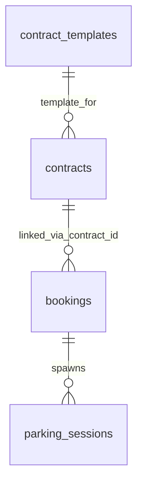

# ERD: домены `booking`, `session`, `contract`

**Контекст:** модель в `docs/architecture/database/erd/erd-normalized-er-model.md`; сводка сессии — `docs/architecture/database/erd/chat-context/chat-context-er-model-review-3-2026-03-31.md`.

## Table of Contents

- [Аудитные поля](#аудитные-поля)
- [Связь между ключевыми таблицами](#связь-между-ключевыми-таблицами)
- [Диаграмма связей (Mermaid)](#диаграмма-связей-mermaid)
- [Таблица `contract_templates`](#таблица-contract_templates)
- [Таблица `contracts`](#таблица-contracts)
- [Таблица `bookings`](#таблица-bookings)
- [Таблица `parking_sessions`](#таблица-parking_sessions)
- [Кросс-контекстные логические ссылки (без REFERENCES)](#кросс-контекстные-логические-ссылки-без-references)
- [Table Notes (DrawSQL)](#table-notes-drawsql)
- [Связанные документы](#связанные-документы)

---

## Аудитные поля

У **каждой** таблицы этого файла в целевой БД есть **`created_at`** и **`updated_at`**: `TIMESTAMPTZ NOT NULL DEFAULT now()`; обновление **`updated_at`** — триггером `moddatetime` (см. `erd-normalized-er-model.md`).

---

## Связь между ключевыми таблицами

| Сторона A | Кардинальность | Сторона B | Условие |
|-----------|------------------|-----------|---------|
| `contract_templates` | **1** | **0..N** | `contracts` |
| `contracts` | **1** | **0..N** | `bookings` *(логическая ссылка `bookings.contract_id`)* |
| `bookings` | **1** | **0..N** | `parking_sessions` *(ADR-002: `parking_sessions.booking_id NOT NULL`)* |

---

## Диаграмма связей (Mermaid)

---

## Таблица `contract_templates`

Схема: `contract`.

| Поле | Тип PostgreSQL | Null | Ограничения / примечания |
|------|----------------|------|---------------------------|
| `id` | `BIGINT GENERATED BY DEFAULT AS IDENTITY` | NOT NULL | `PRIMARY KEY` |
| `code` | `VARCHAR(64)` | NOT NULL | `UNIQUE` |
| `name` | `VARCHAR(200)` | NOT NULL | — |
| `version` | `VARCHAR(32)` | NOT NULL | — |
| `type` | `VARCHAR(32)` | NOT NULL | `CHECK (type IN ('INDIVIDUAL','CORPORATE'))` |
| `body` | `TEXT` | NOT NULL | — |
| `effective_from` | `DATE` | NOT NULL | — |
| `effective_to` | `DATE` | NULL | — |
| `created_at` | `TIMESTAMPTZ` | NOT NULL | `DEFAULT now()` |
| `updated_at` | `TIMESTAMPTZ` | NOT NULL | `DEFAULT now()`; обновление триггером `moddatetime` |

---

## Таблица `contracts`

Схема: `contract`.

| Поле | Тип PostgreSQL | Null | Ограничения / примечания |
|------|----------------|------|---------------------------|
| `id` | `BIGINT GENERATED BY DEFAULT AS IDENTITY` | NOT NULL | `PRIMARY KEY` |
| `client_id` | `BIGINT` | NOT NULL | `REFERENCES clients(id)` *(в пределах `client` схемы; на практике может быть логической, если схемы изолированы физически)* |
| `contract_template_id` | `BIGINT` | NULL | `REFERENCES contract_templates(id)` |
| `contract_number` | `VARCHAR(64)` | NOT NULL | `UNIQUE` |
| `start_date` | `DATE` | NOT NULL | — |
| `end_date` | `DATE` | NULL | — |
| `status` | `VARCHAR(32)` | NOT NULL | `CHECK (status IN ('DRAFT','ACTIVE','EXPIRED','TERMINATED'))` |
| `document_file_ref` | `VARCHAR(512)` | NULL | — |
| `created_at` | `TIMESTAMPTZ` | NOT NULL | `DEFAULT now()` |
| `updated_at` | `TIMESTAMPTZ` | NOT NULL | `DEFAULT now()`; обновление триггером `moddatetime` |

---

## Таблица `bookings`

Схема: `booking`.

| Поле | Тип PostgreSQL | Null | Ограничения / примечания |
|------|----------------|------|---------------------------|
| `id` | `BIGINT GENERATED BY DEFAULT AS IDENTITY` | NOT NULL | `PRIMARY KEY` |
| `booking_number` | `VARCHAR(64)` | NOT NULL | `UNIQUE` |
| `vehicle_id` | `BIGINT` | NOT NULL | логическая ссылка на `client.vehicles(id)` (ADR-003) |
| `parking_place_id` | `BIGINT` | NULL | логическая ссылка на `facility.parking_places(id)` (ADR-003) |
| `contract_id` | `BIGINT` | NULL | логическая ссылка на `contract.contracts(id)` (ADR-003) |
| `tariff_id` | `BIGINT` | NOT NULL | логическая ссылка на `tariff.tariffs(id)` (ADR-003) |
| `start_at` | `TIMESTAMPTZ` | NOT NULL | — |
| `end_at` | `TIMESTAMPTZ` | NULL | — |
| `duration_minutes` | `INTEGER` | NULL | NULL при `end_at IS NULL`; заполняется при завершении |
| `license_plate_snapshot` | `VARCHAR(32)` | NOT NULL | иммутабельный снимок ГРЗ |
| `type` | `VARCHAR(32)` | NOT NULL | `CHECK (type IN ('AUTO', 'SHORT_TERM', 'CONTRACT'))` |
| `status` | `VARCHAR(32)` | NOT NULL | `CHECK (status IN ('PENDING','CONFIRMED','ACTIVE','COMPLETED','CANCELLED','NO_SHOW'))` |
| `amount_due_minor` | `BIGINT` | NULL | Для `type='AUTO'` сумма рассчитывается в реальном времени и фиксируется при завершении (при выезде/закрытии), поэтому до завершения может быть `NULL`. Для `SHORT_TERM` и `CONTRACT` — `NOT NULL` (инвариант — Application Service). |
| `created_at` | `TIMESTAMPTZ` | NOT NULL | `DEFAULT now()` |
| `updated_at` | `TIMESTAMPTZ` | NOT NULL | `DEFAULT now()`; обновление триггером `moddatetime` |

---

## Таблица `parking_sessions`

Схема: `session`.

| Поле | Тип PostgreSQL | Null | Ограничения / примечания |
|------|----------------|------|---------------------------|
| `id` | `BIGINT GENERATED BY DEFAULT AS IDENTITY` | NOT NULL | `PRIMARY KEY` |
| `booking_id` | `BIGINT` | NOT NULL | логическая ссылка на `booking.bookings(id)` (ADR-002, ADR-003) |
| `entry_ap_id` | `BIGINT` | NULL | логическая ссылка на `facility.aps(id)` (ADR-003) |
| `exit_ap_id` | `BIGINT` | NULL | логическая ссылка на `facility.aps(id)` (ADR-003) |
| `employee_id` | `BIGINT` | NULL | логическая ссылка на `employee.employees(id)` (ADR-003) |
| `entry_time` | `TIMESTAMPTZ` | NOT NULL | — |
| `exit_time` | `TIMESTAMPTZ` | NULL | — |
| `duration_minutes` | `INTEGER` | NULL | вычислимое поле (см. Table Notes) |
| `license_plate_snapshot` | `VARCHAR(32)` | NOT NULL | иммутабельный снимок ГРЗ |
| `access_method` | `VARCHAR(32)` | NOT NULL | `CHECK (access_method IN ('PLATE_RECOGNITION','QR','RFID','MANUAL'))`; `MANUAL` — ручной доступ (сотрудник), остальные — автоматический |
| `access_comment` | `TEXT` | NULL | — |
| `status` | `VARCHAR(32)` | NOT NULL | `CHECK (status IN ('ACTIVE','COMPLETED'))`; `INTERRUPTED` — устаревающее значение (см. Table Notes) |
| `created_at` | `TIMESTAMPTZ` | NOT NULL | `DEFAULT now()` |
| `updated_at` | `TIMESTAMPTZ` | NOT NULL | `DEFAULT now()`; обновление триггером `moddatetime` |

---

## Кросс-контекстные логические ссылки (без REFERENCES)

- `booking.bookings.vehicle_id -> client.vehicles.id`
- `booking.bookings.parking_place_id -> facility.parking_places.id`
- `booking.bookings.contract_id -> contract.contracts.id`
- `booking.bookings.tariff_id -> tariff.tariffs.id`

- `session.parking_sessions.booking_id -> booking.bookings.id`
- `session.parking_sessions.entry_ap_id -> facility.aps.id`
- `session.parking_sessions.exit_ap_id -> facility.aps.id`
- `session.parking_sessions.employee_id -> employee.employees.id`

---

## Table Notes (DrawSQL)

- `parking_sessions.duration_minutes`:
  - `GENERATED ALWAYS AS (EXTRACT(EPOCH FROM (exit_time - entry_time)) / 60)::INTEGER STORED`
- `parking_sessions.status`:
  - раньше допускалось значение `INTERRUPTED`; теперь заменено на `COMPLETED` (причина завершения фиксируется отдельно на уровне домена/сервиса, не в этом поле)

---

## Связанные документы

- [ERD (erd-normalized-er-model)](erd-normalized-er-model.md)
- [Контекст ревью ERD, сессия 9+](chat-context/chat-context-er-model-review-3-2026-03-31.md)
- [ADR-002: бронирование и парковочная сессия](../../adr/adr-002-booking-vs-session.md)
- [ADR-003: модульный монолит и схемная изоляция](../../adr/adr-003-modular-monolith.md)
