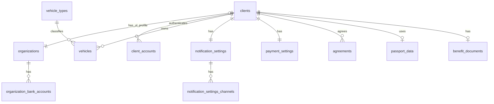

# ERD: домен `client` (ФЛ/ЮЛ) и связанные таблицы

**Контекст:** модель в `docs/architecture/database/erd/erd-normalized-er-model.md`; отдельные review-сводки в текущем состоянии репозитория не опубликованы.

## Table of Contents

- [Аудитные поля](#аудитные-поля)
- [Связь между ключевыми таблицами](#связь-между-ключевыми-таблицами)
- [Диаграмма связей (Mermaid)](#диаграмма-связей-mermaid)
- [Таблица `clients`](#таблица-clients)
- [Таблица `client_accounts`](#таблица-client_accounts)
- [Таблица `organizations`](#таблица-organizations)
- [Таблица `vehicles`](#таблица-vehicles)
- [Таблица `vehicle_types`](#таблица-vehicle_types)
- [Таблица `notification_settings`](#таблица-notification_settings)
- [Таблица `notification_settings_channels`](#таблица-notification_settings_channels)
- [Таблица `payment_settings`](#таблица-payment_settings)
- [Таблица `agreements`](#таблица-agreements)
- [Таблица `organization_bank_accounts`](#таблица-organization_bank_accounts)
- [Таблица `passport_data`](#таблица-passport_data)
- [Таблица `benefit_documents`](#таблица-benefit_documents)
- [Связанные таблицы](#связанные-таблицы)
- [Схема БД и ограничения FK](#схема-бд-и-ограничения-fk)
- [Инварианты FL и UL](#инварианты-fl-и-ul)
- [Связанные документы](#связанные-документы)

---

## Аудитные поля

У **каждой** таблицы этого файла в целевой БД есть **`created_at`** и **`updated_at`**: `TIMESTAMPTZ NOT NULL DEFAULT now()`; обновление **`updated_at`** — триггером `moddatetime` (общая конвенция — `erd-normalized-er-model.md`). Ниже поля перечислены в таблицах для наглядности и переноса в DrawSQL.

---

## Связь между ключевыми таблицами

| Сторона A | Кардинальность | Сторона B | Условие |
|-----------|------------------|-----------|---------|
| `clients` | **1** | **0..1** | `organizations` *(только для ЮЛ; профиль организации)* |
| `organizations` | **1** | **1** | `clients` *(только для ЮЛ; строго 1:1)* |

Смысл (упрощенная модель): профиль ФЛ хранится **в таблице `clients`** (ФИО). Паспортные данные и льготные документы хранятся в схеме `pii` и связываются с `clients` через `pii.*.client_id` (логические ссылки). Для ЮЛ реквизиты вынесены в `organizations` и связаны 1:1 с `clients.type='UL'`.

---

## Диаграмма связей (Mermaid)

Диаграмма связей между `clients`, `client_accounts`, `organizations` (и банковскими реквизитами организации).

---

## Таблица `clients`

Схема: `client`.

| Поле | Тип PostgreSQL | Null | Ограничения / примечания |
|------|----------------|------|---------------------------|
| `id` | `BIGINT GENERATED BY DEFAULT AS IDENTITY` | NOT NULL | `PRIMARY KEY` |
| `type` | `VARCHAR(32)` | NOT NULL | `CHECK (type IN ('FL','UL'))` |
| `phone` | `VARCHAR(32)` | NULL | — |
| `email` | `VARCHAR(320)` | NULL | — |
| `status` | `VARCHAR(32)` | NOT NULL | `CHECK (status IN ('ACTIVE','BLOCKED','PENDING'))` |
| `status_reason` | `TEXT` | NULL | — |
| `last_name` | `VARCHAR(100)` | NULL/NOT NULL* | профиль ФЛ: NOT NULL при `type='FL'`, NULL при `type='UL'` |
| `first_name` | `VARCHAR(100)` | NULL/NOT NULL* | профиль ФЛ: NOT NULL при `type='FL'`, NULL при `type='UL'` |
| `middle_name` | `VARCHAR(100)` | NULL | профиль ФЛ: nullable |
| `created_at` | `TIMESTAMPTZ` | NOT NULL | `DEFAULT now()` |
| `updated_at` | `TIMESTAMPTZ` | NOT NULL | `DEFAULT now()`; обновление триггером `moddatetime` |

\* Инвариант про (не)NULL обеспечивается триггером или Application Service (см. ниже).

Терминологический контракт (для однозначности модели):

- при `type='FL'` `clients` — физическое лицо;
- при `type='UL'` `clients` — клиент-ЮЛ как единый субъект (одна организация = один клиент-ЮЛ); реквизиты и банковские счета хранятся в `organizations` и `organization_bank_accounts`.

---

## Таблица `client_accounts`

Схема: `auth` (инфраструктурный слой).

| Поле | Тип PostgreSQL | Null | Ограничения / примечания |
|------|----------------|------|---------------------------|
| `id` | `BIGINT GENERATED BY DEFAULT AS IDENTITY` | NOT NULL | `PRIMARY KEY` |
| `client_id` | `BIGINT` | NOT NULL | логическая ссылка на `client.clients.id` (кросс-схемно, без `REFERENCES`) |
| `auth_provider` | `VARCHAR(64)` | NOT NULL | открытый список (LOCAL, PHONE, GOOGLE, YANDEX и т.п.); без `CHECK` |
| `login` | `VARCHAR(255)` | NULL | опциональный логин (если используется) |
| `phone_e164` | `VARCHAR(32)` | NULL | телефон в международном формате **E.164** (только цифры после `+`, длина по ITU-T); имя поля задает формат хранения, **по аналогии с** `email_normalized` |
| `email_normalized` | `VARCHAR(320)` | NULL | email после нормализации (lower + trim), каноническое представление для поиска и уникальности |
| `password_hash` | `VARCHAR(255)` | NULL/NOT NULL* | NULL допустим для внешних IdP; NOT NULL только при `auth_provider = 'LOCAL'` (инвариант) |
| `provider_subject_id` | `VARCHAR(255)` | NULL | — |
| `account_status` | `VARCHAR(32)` | NOT NULL | `CHECK (account_status IN ('ACTIVE','BLOCKED','PENDING_VERIFICATION'))` |
| `created_at` | `TIMESTAMPTZ` | NOT NULL | `DEFAULT now()` |
| `updated_at` | `TIMESTAMPTZ` | NOT NULL | `DEFAULT now()`; обновление триггером `moddatetime` |
| `last_login_at` | `TIMESTAMPTZ` | NULL | — |

\* Инварианты обеспечиваются триггером или Application Service:

- при `auth_provider = 'LOCAL'`: `password_hash NOT NULL` и задан хотя бы один идентификатор входа: `phone_e164 IS NOT NULL OR email_normalized IS NOT NULL OR login IS NOT NULL`;
- при внешнем IdP: `provider_subject_id NOT NULL`, `password_hash` может быть NULL.

Уникальность идентификаторов входа (рекомендуемо фиксировать индексами; DrawSQL: в Table Notes):

- `UNIQUE(phone_e164) WHERE phone_e164 IS NOT NULL`;
- `UNIQUE(email_normalized) WHERE email_normalized IS NOT NULL`;
- `UNIQUE(auth_provider, provider_subject_id) WHERE provider_subject_id IS NOT NULL`.

---

## Таблица `organizations`

Схема: `client`.

| Поле | Тип PostgreSQL | Null | Ограничения / примечания |
|------|----------------|------|---------------------------|
| `id` | `BIGINT GENERATED BY DEFAULT AS IDENTITY` | NOT NULL | `PRIMARY KEY` |
| `client_id` | `BIGINT` | NOT NULL | `UNIQUE`; `REFERENCES clients(id)` — связь 1:1 с `clients` при `clients.type='UL'` |
| `name` | `VARCHAR(500)` | NOT NULL | — |
| `legal_form` | `VARCHAR(64)` | NULL | без `CHECK` (значение приходит из DADATA; ADR-004) |
| `legal_address` | `TEXT` | NULL | — |
| `actual_address` | `TEXT` | NULL | — |
| `inn` | `VARCHAR(12)` | NOT NULL | `UNIQUE` |
| `kpp` | `VARCHAR(9)` | NULL | — |
| `ogrn` | `VARCHAR(13)` | NULL | `UNIQUE` (NULL допустим) |
| `email` | `VARCHAR(320)` | NULL | — |
| `phone` | `VARCHAR(32)` | NULL | — |
| `status` | `VARCHAR(32)` | NOT NULL | `CHECK (status IN ('ACTIVE','BLOCKED','PENDING'))` |
| `created_at` | `TIMESTAMPTZ` | NOT NULL | `DEFAULT now()` |
| `updated_at` | `TIMESTAMPTZ` | NOT NULL | `DEFAULT now()`; обновление триггером `moddatetime` |

---

## Таблица `vehicles`

Схема: `client`.

| Поле | Тип PostgreSQL | Null | Ограничения / примечания |
|------|----------------|------|---------------------------|
| `id` | `BIGINT GENERATED BY DEFAULT AS IDENTITY` | NOT NULL | `PRIMARY KEY` |
| `client_id` | `BIGINT` | NOT NULL | `REFERENCES clients(id)` |
| `vehicle_type_id` | `BIGINT` | NOT NULL | логическая ссылка на `facility.vehicle_types(id)` (кросс-схемно, без `REFERENCES`, ADR-003) |
| `license_plate` | `VARCHAR(32)` | NOT NULL | `UNIQUE` |
| `brand` | `VARCHAR(100)` | NULL | — |
| `model` | `VARCHAR(100)` | NULL | — |
| `color` | `VARCHAR(64)` | NULL | — |
| `created_at` | `TIMESTAMPTZ` | NOT NULL | `DEFAULT now()` |
| `updated_at` | `TIMESTAMPTZ` | NOT NULL | `DEFAULT now()`; обновление триггером `moddatetime` |

Нормализация `license_plate`: хранится в нормализованном виде (UPPER + TRIM); нормализация применяется на уровне приложения или триггером `BEFORE INSERT/UPDATE`.

Нормализация `brand`/`model`/`color`: выполняется **перед записью в БД** на уровне приложения (например, через Dadata: подсказки по маркам + стандартизация строки ТС). В БД хранятся уже канонические строковые значения; справочники для `brand`/`model`/`color` не вводятся.

---

## Таблица `vehicle_types`

Схема: `facility` (связанный справочник в контексте клиента).

| Поле | Тип PostgreSQL | Null | Ограничения / примечания |
|------|----------------|------|---------------------------|
| `id` | `BIGINT GENERATED BY DEFAULT AS IDENTITY` | NOT NULL | `PRIMARY KEY`; стабильный суррогатный идентификатор типа ТС (отдельный бизнес-код не вводится) |
| `name` | `VARCHAR(200)` | NOT NULL | — |
| `description` | `TEXT` | NULL | — |
| `created_at` | `TIMESTAMPTZ` | NOT NULL | `DEFAULT now()` |
| `updated_at` | `TIMESTAMPTZ` | NOT NULL | `DEFAULT now()`; обновление триггером `moddatetime` |

Связи (логические, кросс-схемные):

- `client.vehicles.vehicle_type_id -> facility.vehicle_types.id` (без `REFERENCES`, ADR-003)
- `facility.zone_type_vehicle_types.vehicle_type_id -> facility.vehicle_types.id` (в контексте facility, но справочник описан здесь для единого языка “Тип ТС”)

---

## Таблица `notification_settings`

Схема: `client`.

| Поле | Тип PostgreSQL | Null | Ограничения / примечания |
|------|----------------|------|---------------------------|
| `id` | `BIGINT GENERATED BY DEFAULT AS IDENTITY` | NOT NULL | `PRIMARY KEY` |
| `client_id` | `BIGINT` | NOT NULL | `UNIQUE`; `REFERENCES clients(id)` |
| `parking_session_enabled` | `BOOLEAN` | NOT NULL | `DEFAULT false` |
| `booking_enabled` | `BOOLEAN` | NOT NULL | `DEFAULT false` |
| `contract_enabled` | `BOOLEAN` | NOT NULL | `DEFAULT false` |
| `payment_enabled` | `BOOLEAN` | NOT NULL | `DEFAULT false` |
| `marketing_enabled` | `BOOLEAN` | NOT NULL | `DEFAULT false` |
| `created_at` | `TIMESTAMPTZ` | NOT NULL | `DEFAULT now()` |
| `updated_at` | `TIMESTAMPTZ` | NOT NULL | `DEFAULT now()`; обновление триггером `moddatetime` |

Каналы доставки хранятся в отдельной таблице `notification_settings_channels`.

---

## Таблица `notification_settings_channels`

Схема: `client`.

| Поле | Тип PostgreSQL | Null | Ограничения / примечания |
|------|----------------|------|---------------------------|
| `settings_id` | `BIGINT` | NOT NULL | `REFERENCES notification_settings(id)`; входит в состав `PRIMARY KEY` |
| `channel` | `VARCHAR(32)` | NOT NULL | код канала доставки: `SMS`, `EMAIL`, `PUSH` (строковый литерал, не id); `CHECK (channel IN ('SMS','EMAIL','PUSH'))`; входит в состав `PRIMARY KEY` |
| `created_at` | `TIMESTAMPTZ` | NOT NULL | `DEFAULT now()` |
| `updated_at` | `TIMESTAMPTZ` | NOT NULL | `DEFAULT now()`; обновление триггером `moddatetime` |

Первичный ключ: `PRIMARY KEY (settings_id, channel)`.

---

## Таблица `payment_settings`

Схема: `client`.

| Поле | Тип PostgreSQL | Null | Ограничения / примечания |
|------|----------------|------|---------------------------|
| `id` | `BIGINT GENERATED BY DEFAULT AS IDENTITY` | NOT NULL | `PRIMARY KEY` |
| `client_id` | `BIGINT` | NOT NULL | `UNIQUE`; `REFERENCES clients(id)` |
| `external_payer_id` | `VARCHAR(100)` | NULL | — |
| `auto_debit_contract` | `BOOLEAN` | NOT NULL | `DEFAULT false` |
| `auto_debit_parking_session` | `BOOLEAN` | NOT NULL | `DEFAULT false` |
| `monthly_limit_minor` | `BIGINT` | NULL | сумма в минорных единицах валюты (для `RUB` — копейки) |
| `created_at` | `TIMESTAMPTZ` | NOT NULL | `DEFAULT now()` |
| `updated_at` | `TIMESTAMPTZ` | NOT NULL | `DEFAULT now()`; обновление триггером `moddatetime` |

---

## Таблица `agreements`

Схема: `client`.

Фиксация согласий клиента (ПДн, маркетинг, ЭДО и т.д.). Имя таблицы **`agreements`** (альтернатива историческому `CONSENT`); смысл — запись о договоренности/согласии с условиями.

| Поле | Тип PostgreSQL | Null | Ограничения / примечания |
|------|----------------|------|---------------------------|
| `id` | `BIGINT GENERATED BY DEFAULT AS IDENTITY` | NOT NULL | `PRIMARY KEY` |
| `client_id` | `BIGINT` | NOT NULL | `REFERENCES clients(id)` |
| `agreement_type` | `VARCHAR(64)` | NOT NULL | `CHECK (agreement_type IN ('PERSONAL_DATA','MARKETING','ELECTRONIC_DOCS'))` |
| `accepted` | `BOOLEAN` | NOT NULL | признак: согласие выдано (true) или нет |
| `accepted_at` | `TIMESTAMPTZ` | NOT NULL | момент фиксации |
| `revoked_at` | `TIMESTAMPTZ` | NULL | момент отзыва, если применимо |
| `created_at` | `TIMESTAMPTZ` | NOT NULL | `DEFAULT now()` |
| `updated_at` | `TIMESTAMPTZ` | NOT NULL | `DEFAULT now()`; обновление триггером `moddatetime` |

---

## Таблица `organization_bank_accounts`

Схема: `client`.

| Поле | Тип PostgreSQL | Null | Ограничения / примечания |
|------|----------------|------|---------------------------|
| `id` | `BIGINT GENERATED BY DEFAULT AS IDENTITY` | NOT NULL | `PRIMARY KEY` |
| `organization_id` | `BIGINT` | NOT NULL | `REFERENCES organizations(id)` |
| `bank_name` | `VARCHAR(255)` | NOT NULL | — |
| `bik` | `VARCHAR(9)` | NOT NULL | — |
| `account_number` | `VARCHAR(32)` | NOT NULL | — |
| `correspondent_account` | `VARCHAR(32)` | NULL | — |
| `is_primary` | `BOOLEAN` | NOT NULL | единственность “основного” обеспечивается partial unique index (см. ниже) |
| `created_at` | `TIMESTAMPTZ` | NOT NULL | `DEFAULT now()` |
| `updated_at` | `TIMESTAMPTZ` | NOT NULL | `DEFAULT now()`; обновление триггером `moddatetime` |

Инвариант “не более одного основного счета”: `CREATE UNIQUE INDEX ON organization_bank_accounts(organization_id) WHERE is_primary = true`.

---

## Таблица `passport_data`

Схема: `pii` (152-ФЗ).

| Поле | Тип PostgreSQL | Null | Ограничения / примечания |
|------|----------------|------|---------------------------|
| `id` | `BIGINT GENERATED BY DEFAULT AS IDENTITY` | NOT NULL | `PRIMARY KEY` |
| `document_type` | `VARCHAR(32)` | NOT NULL | `CHECK (document_type IN ('RF_PASSPORT','FOREIGN_PASSPORT','TEMP_ID'))` |
| `series` | `BYTEA` | NOT NULL | серия документа; рекомендуется хранить в зашифрованном виде |
| `number` | `BYTEA` | NOT NULL | номер документа; рекомендуется хранить в зашифрованном виде |
| `issue_date` | `DATE` | NOT NULL | — |
| `issued_by` | `VARCHAR(500)` | NULL | — |
| `department_code` | `VARCHAR(32)` | NULL | — |
| `client_id` | `BIGINT` | NOT NULL | логическая ссылка на `client.clients.id` (кросс-схемно, без `REFERENCES`); `UNIQUE` для 0..1 паспорта на клиента |
| `created_at` | `TIMESTAMPTZ` | NOT NULL | `DEFAULT now()` |
| `updated_at` | `TIMESTAMPTZ` | NOT NULL | `DEFAULT now()`; обновление триггером `moddatetime` |

Связь с клиентом: `pii.passport_data.client_id → client.clients.id` **логически** (без `REFERENCES`, ADR-003).

---

## Таблица `benefit_documents`

Схема: `pii` (152-ФЗ).

| Поле | Тип PostgreSQL | Null | Ограничения / примечания |
|------|----------------|------|---------------------------|
| `id` | `BIGINT GENERATED BY DEFAULT AS IDENTITY` | NOT NULL | `PRIMARY KEY` |
| `benefit_category` | `VARCHAR(64)` | NOT NULL | `CHECK (benefit_category IN ('DISABLED_1','DISABLED_2','DISABLED_3','VETERAN','LARGE_FAMILY','OTHER'))` |
| `document_type` | `VARCHAR(32)` | NOT NULL | `CHECK (document_type IN ('CERTIFICATE','ID_CARD','BOOKLET','OTHER'))` |
| `document_number` | `VARCHAR(64)` | NOT NULL | — |
| `issue_date` | `DATE` | NOT NULL | — |
| `expiry_date` | `DATE` | NULL | — |
| `document_image_ref` | `VARCHAR(512)` | NULL | — |
| `verification_status` | `VARCHAR(32)` | NOT NULL | `CHECK (verification_status IN ('PENDING','VERIFIED','REJECTED'))` |
| `client_id` | `BIGINT` | NOT NULL | логическая ссылка на `client.clients.id` (кросс-схемно, без `REFERENCES`); `UNIQUE` для 0..1 льготного документа на клиента* |
| `created_at` | `TIMESTAMPTZ` | NOT NULL | `DEFAULT now()` |
| `updated_at` | `TIMESTAMPTZ` | NOT NULL | `DEFAULT now()`; обновление триггером `moddatetime` |

Связь с клиентом: `pii.benefit_documents.client_id → client.clients.id` **логически** (без `REFERENCES`, ADR-003).

\* Если требуется хранить несколько льготных документов, `UNIQUE(client_id)` убирается, добавляется политика “активный/основной документ” (например, `is_primary` или временные интервалы).

---

## Связанные таблицы

### Связанные с `clients`

- **`organizations`**: `clients |o--|| organizations` (только для UL; строго 1:1); FK: `client.organizations.client_id UNIQUE REFERENCES client.clients(id)`.
- **`notification_settings`**: `clients ||--|| notification_settings`; FK: `client.notification_settings.client_id UNIQUE REFERENCES client.clients(id)`.
- **`payment_settings`**: `clients ||--|| payment_settings`; FK: `client.payment_settings.client_id UNIQUE REFERENCES client.clients(id)`.
- **`client_accounts`** (схема `auth`): `clients ||--o{ client_accounts`; логическая ссылка `auth.client_accounts.client_id` (кросс-схемно, без `REFERENCES`).
- **`vehicles`**: `clients ||--o{ vehicles`; FK в схеме `client` (интра-схемно).
- **`agreements`**: `clients ||--o{ agreements`; FK в схеме `client` (интра-схемно).
- **`notifications`** (схема `notification`): `clients ||--o{ notifications`; логическая ссылка (кросс-схемно, без `REFERENCES`).
- **`appeals`** (схема `support`): `clients ||--o{ appeals`; логическая ссылка (кросс-схемно, без `REFERENCES`).
- **`contracts`** (схема `contract`): `clients ||--o{ contracts`; логическая ссылка (кросс-схемно, без `REFERENCES`).

### Связанные с профилем ФЛ внутри `clients`

- **`passport_data`** (схема `pii`): `clients` 0..1:1 `passport_data` через логическую ссылку `pii.passport_data.client_id → client.clients.id` (без `REFERENCES`).
- **`benefit_documents`** (схема `pii`): `clients` 0..1:1 `benefit_documents` через логическую ссылку `pii.benefit_documents.client_id → client.clients.id` (без `REFERENCES`).

### Связанные с `organizations`

- **`clients`**: `clients |o--|| organizations`; FK: `client.organizations.client_id UNIQUE REFERENCES client.clients(id)` (только для UL).
- **`organization_bank_accounts`**: `organizations ||--o{ organization_bank_accounts`; FK: `client.organization_bank_accounts.organization_id REFERENCES client.organizations(id)`.

### Связанные с `client_accounts`

- **`clients`**: `clients ||--o{ client_accounts`; логическая ссылка `auth.client_accounts.client_id → client.clients.id` (кросс-схемно, без `REFERENCES`).

### Связанные с `vehicles`

- **`clients`**: `clients ||--o{ vehicles`; FK: `client.vehicles.client_id REFERENCES client.clients(id)`.
- **`vehicle_types`** (схема `facility`): логическая ссылка `client.vehicles.vehicle_type_id → facility.vehicle_types.id` (без `REFERENCES`, ADR-003).
- **`bookings`** (схема `booking`): в модели указана связь `vehicles` 1:N `bookings` как логическая (кросс-схемно, без `REFERENCES`).

### Связанные с `notification_settings`

- **`clients`**: `clients ||--|| notification_settings`; FK: `client.notification_settings.client_id UNIQUE REFERENCES client.clients(id)`.
- **`notification_settings_channels`**: `notification_settings ||--o{ notification_settings_channels`; FK: `client.notification_settings_channels.settings_id REFERENCES client.notification_settings(id)`.

### Связанные с `payment_settings`

- **`clients`**: `clients ||--|| payment_settings`; FK: `client.payment_settings.client_id UNIQUE REFERENCES client.clients(id)`.

### Связанные с `agreements`

- **`clients`**: `clients ||--o{ agreements`; FK: `client.agreements.client_id REFERENCES client.clients(id)`.

### Связанные с `organization_bank_accounts`

- **`organizations`**: `ORGANIZATION ||--o{ ORGANIZATION_BANK_ACCOUNT`; FK: `client.organization_bank_accounts.organization_id REFERENCES client.organizations(id)`.

---

## Схема БД и ограничения FK

- У всех таблиц этого артефакта в целевой БД предусмотрены **`created_at`** и **`updated_at`** (см. раздел [Аудитные поля](#аудитные-поля)).
- Таблицы домена клиента находятся в схеме **`client`** (ADR-003: схемная изоляция bounded context).
- Профиль ФЛ (ФИО) хранится **в `clients`** и включается условно (см. инварианты по `clients.type`).
- `client_accounts` находится в схеме `auth` и ссылается на `clients` логически (без `REFERENCES`).
- Чувствительные данные (`passport_data`, `benefit_documents`) находятся в схеме `pii` и связаны с `clients` через поля `pii.*.client_id` (логические ссылки, без `REFERENCES`).

---

## Инварианты FL и UL

Согласно модели и контексту ревью:

- `clients.type` — `CHECK (type IN ('FL','UL'))`.
- При **`type = 'FL'`**: `organizations` отсутствует; поля профиля ФЛ в `clients` заполняются: `last_name`/`first_name` NOT NULL.
- При **`type = 'UL'`**: `organizations` существует (строго 1:1); поля профиля ФЛ в `clients` (`last_name`/`first_name`/`middle_name`) должны быть NULL.

Обеспечение: `BEFORE INSERT/UPDATE` триггер или Application Service (в сводке модели также указан такой триггер для смены FL/UL).

Архитектурное решение: профиль ФЛ включен в `clients`; ЮЛ профиль вынесен в `organizations` (1:1 с `clients.type='UL'`).

---

## Связанные документы

- [ERD (erd-normalized-er-model)](erd-normalized-er-model.md)
- [ADR-003: модульный монолит и схемная изоляция](../../adr/adr-003-modular-monolith.md)
