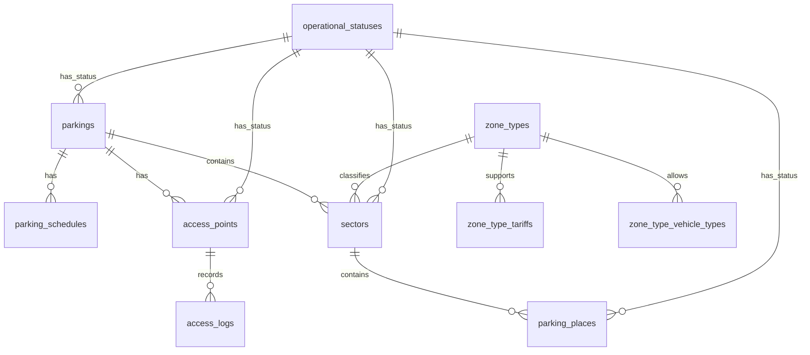

# ERD: домен `facility` (инфраструктура) и таблица `access_logs`

**Контекст:** модель в `docs/architecture/database/erd/erd-normalized-er-model.md`; рабочие review-заметки в текущем состоянии репозитория не опубликованы отдельным файлом.

## Table of Contents

- [Аудитные поля](#аудитные-поля)
- [Связь между ключевыми таблицами](#связь-между-ключевыми-таблицами)
- [Диаграмма связей (Mermaid)](#диаграмма-связей-mermaid)
- [Таблица `parkings`](#таблица-parkings)
- [Таблица `parking_schedules`](#таблица-parking_schedules)
- [Таблица `sectors`](#таблица-sectors)
- [Таблица `zone_types`](#таблица-zone_types)
- [Таблица `operational_statuses`](#таблица-operational_statuses)
- [Таблица `access_points`](#таблица-access_points)
- [Таблица `parking_places`](#таблица-parking_places)
- [Таблица `zone_types_vehicle_types`](#таблица-zone_types_vehicle_types)
- [Таблица `zone_types_tariffs`](#таблица-zone_types_tariffs)
- [Таблица `access_logs`](#таблица-access_logs)
- [Кросс-контекстные логические ссылки (без REFERENCES)](#кросс-контекстные-логические-ссылки-без-references)
- [Связанные документы](#связанные-документы)

---

## Аудитные поля

У таблиц этого файла в целевой БД обычно есть **`created_at`** и **`updated_at`**: `TIMESTAMPTZ NOT NULL DEFAULT now()`; обновление **`updated_at`** — триггером `moddatetime` (см. `erd-normalized-er-model.md`). Исключение: append-only журнал `access_logs`, где достаточно `created_at`.

---

## Связь между ключевыми таблицами

| Сторона A | Кардинальность | Сторона B | Условие |
|-----------|------------------|-----------|---------|
| `parkings` | **1** | **0..N** | `parking_schedules` |
| `parkings` | **1** | **0..N** | `sectors` |
| `parkings` | **1** | **0..N** | `access_points` |
| `sectors` | **1** | **0..N** | `parking_places` |
| `zone_types` | **1** | **0..N** | `sectors` |
| `zone_types` | **1** | **0..N** | `zone_type_vehicle_types` |
| `zone_types` | **1** | **0..N** | `zone_type_tariffs` |
| `operational_statuses` | **1** | **0..N** | `{parkings, sectors, parking_places, access_points}` |
| `access_points` | **1** | **0..N** | `access_logs` *(кросс-схемно; логическая ссылка)* |

---

## Диаграмма связей (Mermaid)

---

## Таблица `parkings`

Схема: `facility`.

| Поле | Тип PostgreSQL | Null | Ограничения / примечания |
|------|----------------|------|---------------------------|
| `id` | `BIGINT GENERATED BY DEFAULT AS IDENTITY` | NOT NULL | `PRIMARY KEY` |
| `name` | `VARCHAR(200)` | NOT NULL | — |
| `address` | `TEXT` | NOT NULL | — |
| `parking_type` | `VARCHAR(64)` | NOT NULL | `CHECK (parking_type IN ('SURFACE','MULTILEVEL','UNDERGROUND','ROOFTOP'))` |
| `description` | `TEXT` | NULL | — |
| `operational_status_id` | `BIGINT` | NOT NULL | `REFERENCES operational_statuses(id)` |
| `created_at` | `TIMESTAMPTZ` | NOT NULL | `DEFAULT now()` |
| `updated_at` | `TIMESTAMPTZ` | NOT NULL | `DEFAULT now()`; обновление триггером `moddatetime` |

---

## Таблица `parking_schedules`

Схема: `facility`.

| Поле | Тип PostgreSQL | Null | Ограничения / примечания |
|------|----------------|------|---------------------------|
| `id` | `BIGINT GENERATED BY DEFAULT AS IDENTITY` | NOT NULL | `PRIMARY KEY` |
| `parking_id` | `BIGINT` | NOT NULL | `REFERENCES parkings(id)` |
| `day_of_week` | `SMALLINT` | NOT NULL | `CHECK (day_of_week BETWEEN 1 AND 7)` |
| `open_time` | `TIME` | NULL | — |
| `close_time` | `TIME` | NULL | — |
| `is_closed` | `BOOLEAN` | NOT NULL | `DEFAULT false` |
| `effective_from` | `DATE` | NOT NULL | — |
| `effective_to` | `DATE` | NULL | — |
| `created_at` | `TIMESTAMPTZ` | NOT NULL | `DEFAULT now()` |
| `updated_at` | `TIMESTAMPTZ` | NOT NULL | `DEFAULT now()`; обновление триггером `moddatetime` |

Table Notes (DrawSQL):

- `UNIQUE (parking_id, day_of_week, effective_from)`

---

## Таблица `sectors`

Схема: `facility`.

| Поле | Тип PostgreSQL | Null | Ограничения / примечания |
|------|----------------|------|---------------------------|
| `id` | `BIGINT GENERATED BY DEFAULT AS IDENTITY` | NOT NULL | `PRIMARY KEY` |
| `parking_id` | `BIGINT` | NOT NULL | `REFERENCES parkings(id)` |
| `zone_type_id` | `BIGINT` | NOT NULL | `REFERENCES zone_types(id)` |
| `name` | `VARCHAR(200)` | NOT NULL | — |
| `operational_status_id` | `BIGINT` | NOT NULL | `REFERENCES operational_statuses(id)` |
| `created_at` | `TIMESTAMPTZ` | NOT NULL | `DEFAULT now()` |
| `updated_at` | `TIMESTAMPTZ` | NOT NULL | `DEFAULT now()`; обновление триггером `moddatetime` |

---

## Таблица `zone_types`

Схема: `facility`.

| Поле | Тип PostgreSQL | Null | Ограничения / примечания |
|------|----------------|------|---------------------------|
| `id` | `BIGINT GENERATED BY DEFAULT AS IDENTITY` | NOT NULL | `PRIMARY KEY` |
| `name` | `VARCHAR(200)` | NOT NULL | — |
| `description` | `TEXT` | NULL | — |
| `created_at` | `TIMESTAMPTZ` | NOT NULL | `DEFAULT now()` |
| `updated_at` | `TIMESTAMPTZ` | NOT NULL | `DEFAULT now()`; обновление триггером `moddatetime` |

---

## Таблица `operational_statuses`

Схема: `facility` (словарная).

| Поле | Тип PostgreSQL | Null | Ограничения / примечания |
|------|----------------|------|---------------------------|
| `id` | `BIGINT GENERATED BY DEFAULT AS IDENTITY` | NOT NULL | `PRIMARY KEY` |
| `name` | `VARCHAR(200)` | NOT NULL | — |
| `description` | `TEXT` | NULL | — |
| `created_at` | `TIMESTAMPTZ` | NOT NULL | `DEFAULT now()` |
| `updated_at` | `TIMESTAMPTZ` | NOT NULL | `DEFAULT now()`; обновление триггером `moddatetime` |

---

## Таблица `access_points`

Схема: `facility`.

| Поле | Тип PostgreSQL | Null | Ограничения / примечания |
|------|----------------|------|---------------------------|
| `id` | `BIGINT GENERATED BY DEFAULT AS IDENTITY` | NOT NULL | `PRIMARY KEY` |
| `parking_id` | `BIGINT` | NOT NULL | `REFERENCES parkings(id)` |
| `name` | `VARCHAR(200)` | NOT NULL | — |
| `type` | `VARCHAR(32)` | NOT NULL | `CHECK (type IN ('MANUAL','AUTOMATIC','SEMI_AUTO'))` |
| `direction` | `VARCHAR(16)` | NOT NULL | `CHECK (direction IN ('ENTRY','EXIT','BIDIRECTIONAL'))` |
| `operational_status_id` | `BIGINT` | NOT NULL | `REFERENCES operational_statuses(id)` |
| `created_at` | `TIMESTAMPTZ` | NOT NULL | `DEFAULT now()` |
| `updated_at` | `TIMESTAMPTZ` | NOT NULL | `DEFAULT now()`; обновление триггером `moddatetime` |

---

## Таблица `parking_places`

Схема: `facility`.

| Поле | Тип PostgreSQL | Null | Ограничения / примечания |
|------|----------------|------|---------------------------|
| `id` | `BIGINT GENERATED BY DEFAULT AS IDENTITY` | NOT NULL | `PRIMARY KEY` |
| `sector_id` | `BIGINT` | NOT NULL | `REFERENCES sectors(id)` |
| `override_tariff_id` | `BIGINT` | NULL | кросс-схемная логическая ссылка на `tariff.tariffs(id)` (ADR-003) |
| `place_number` | `VARCHAR(32)` | NOT NULL | — |
| `is_occupied` | `BOOLEAN` | NOT NULL | `DEFAULT false`; фактически занято |
| `operational_status_id` | `BIGINT` | NOT NULL | `REFERENCES operational_statuses(id)` |
| `created_at` | `TIMESTAMPTZ` | NOT NULL | `DEFAULT now()` |
| `updated_at` | `TIMESTAMPTZ` | NOT NULL | `DEFAULT now()`; обновление триггером `moddatetime` |

Текущее резервирование места не хранится в этой таблице: оно определяется по связанным `booking.bookings` и временному интервалу запроса.

---

## Таблица `zone_types_vehicle_types`

Схема: `facility` (таблица связи M:N).

| Поле | Тип PostgreSQL | Null | Ограничения / примечания |
|------|----------------|------|---------------------------|
| `zone_type_id` | `BIGINT` | NOT NULL | `REFERENCES zone_types(id)` |
| `vehicle_type_id` | `BIGINT` | NOT NULL | логическая ссылка на `facility.vehicle_types(id)` (описана в клиентском артефакте) |
| `created_at` | `TIMESTAMPTZ` | NOT NULL | `DEFAULT now()` |
| `updated_at` | `TIMESTAMPTZ` | NOT NULL | `DEFAULT now()`; обновление триггером `moddatetime` |

Первичный ключ: `PRIMARY KEY (zone_type_id, vehicle_type_id)`.

---

## Таблица `zone_types_tariffs`

Схема: `facility` (таблица связи M:N).

| Поле | Тип PostgreSQL | Null | Ограничения / примечания |
|------|----------------|------|---------------------------|
| `zone_type_id` | `BIGINT` | NOT NULL | `REFERENCES zone_types(id)` |
| `tariff_id` | `BIGINT` | NOT NULL | кросс-схемная логическая ссылка на `tariff.tariffs(id)` (ADR-003) |
| `created_at` | `TIMESTAMPTZ` | NOT NULL | `DEFAULT now()` |
| `updated_at` | `TIMESTAMPTZ` | NOT NULL | `DEFAULT now()`; обновление триггером `moddatetime` |

Первичный ключ: `PRIMARY KEY (zone_type_id, tariff_id)`.

---

## Таблица `access_logs`

Схема: `report` (append-only журнал).

| Поле | Тип PostgreSQL | Null | Ограничения / примечания |
|------|----------------|------|---------------------------|
| `id` | `BIGINT GENERATED BY DEFAULT AS IDENTITY` | NOT NULL | `PRIMARY KEY` |
| `access_point_id` | `BIGINT` | NOT NULL | логическая ссылка на `facility.access_points(id)` (без `REFERENCES`, ADR-003) |
| `parking_session_id` | `BIGINT` | NULL | логическая ссылка на `session.parking_sessions(id)` (без `REFERENCES`, ADR-003); заполняется только для событий, вошедших в сессию |
| `vehicle_id` | `BIGINT` | NULL | логическая ссылка на `client.vehicles(id)` |
| `direction` | `VARCHAR(8)` | NOT NULL | `CHECK (direction IN ('IN', 'OUT'))` |
| `decision` | `VARCHAR(16)` | NOT NULL | `CHECK (decision IN ('ALLOW', 'DENY', 'MANUAL'))` |
| `reason` | `TEXT` | NULL | — |
| `decided_at` | `TIMESTAMPTZ` | NOT NULL | — |
| `created_at` | `TIMESTAMPTZ` | NOT NULL | `DEFAULT now()` |

Table Notes (DrawSQL):

- append-only (INSERT only)

---

## Кросс-контекстные логические ссылки (без REFERENCES)

- `facility.parking_places.override_tariff_id -> tariff.tariffs.id`
- `facility.zone_type_tariffs.tariff_id -> tariff.tariffs.id`
- `facility.zone_type_vehicle_types.vehicle_type_id -> facility.vehicle_types.id` *(описано в `erd-relationships-client-client-profile.md`)*
- `report.access_logs.access_point_id -> facility.access_points.id`
- `report.access_logs.parking_session_id -> session.parking_sessions.id`
- `report.access_logs.vehicle_id -> client.vehicles.id`

---

## Связанные документы

- [ERD (erd-normalized-er-model)](erd-normalized-er-model.md)
- [ADR-003: модульный монолит и схемная изоляция](../../adr/adr-003-modular-monolith.md)
