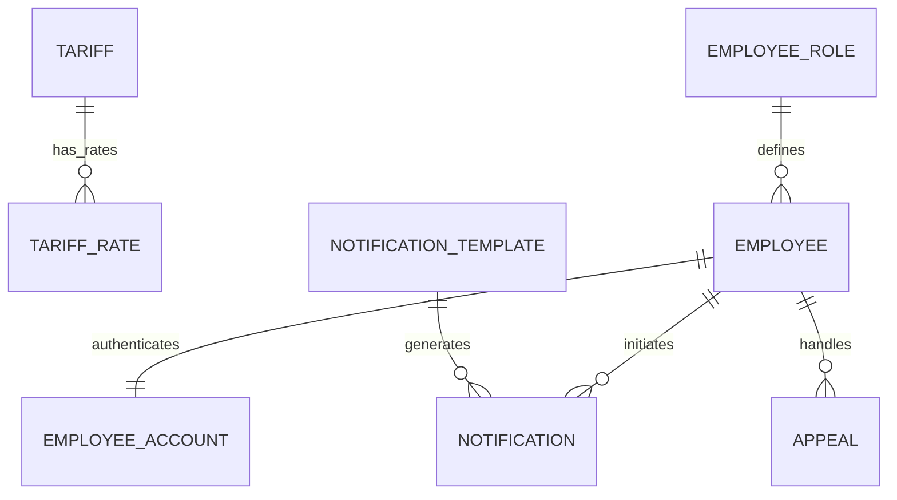

# ERD: домены `TARIFF`, `EMPLOYEE`, `NOTIFICATION`, `APPEAL`

**Контекст:** модель в `docs/architecture/database/erd/erd-normalized-er-model.md`; сводка сессии — `docs/architecture/database/erd/chat-context/chat-context-er-model-review-3-2026-03-31.md`.

## Table of Contents

- [Аудитные поля](#аудитные-поля)
- [Связь между ключевыми таблицами](#связь-между-ключевыми-таблицами)
- [Таблица `TARIFF`](#таблица-tariff)
- [Таблица `TARIFF_RATE`](#таблица-tariff_rate)
- [Таблица `EMPLOYEE`](#таблица-employee)
- [Таблица `EMPLOYEE_ACCOUNT`](#таблица-employee_account)
- [Таблица `EMPLOYEE_ROLE`](#таблица-employee_role)
- [Таблица `NOTIFICATION_TEMPLATE`](#таблица-notification_template)
- [Таблица `NOTIFICATION`](#таблица-notification)
- [Таблица `APPEAL`](#таблица-appeal)
- [Кросс-контекстные логические ссылки (без REFERENCES)](#кросс-контекстные-логические-ссылки-без-references)
- [Table Notes (DrawSQL)](#table-notes-drawsql)
- [Диаграмма связей (Mermaid)](#диаграмма-связей-mermaid)
- [Связанные документы](#связанные-документы)

---

## Аудитные поля

У **каждой** таблицы этого файла в целевой БД есть **`created_at`** и **`updated_at`**: `TIMESTAMPTZ NOT NULL DEFAULT now()`; обновление **`updated_at`** — триггером `moddatetime` (см. `erd-normalized-er-model.md`).

---

## Связь между ключевыми таблицами

| Сторона A | Кардинальность | Сторона B | Условие |
|-----------|------------------|-----------|---------|
| `TARIFF` | **1** | **0..N** | `TARIFF_RATE` |
| `EMPLOYEE_ROLE` | **1** | **0..N** | `EMPLOYEE` |
| `EMPLOYEE` | **1** | **0..1** | `EMPLOYEE_ACCOUNT` *(учетные данные; кросс-схемно, логическая ссылка `auth`, ADR-003)* |
| `NOTIFICATION_TEMPLATE` | **1** | **0..N** | `NOTIFICATION` *(в пределах схемы `notification` это может быть физический FK; к `client`/`employee` — только логические ссылки)* |
| `EMPLOYEE` | **1** | **0..N** | `NOTIFICATION` *(инициатор; кросс-схемно, логическая ссылка)* |
| `EMPLOYEE` | **1** | **0..N** | `APPEAL` *(обработчик; кросс-схемно, логическая ссылка)* |

---

## Таблица `TARIFF`

Схема: `tariff`.

| Поле | Тип PostgreSQL | Null | Ограничения / примечания |
|------|----------------|------|---------------------------|
| `id` | `BIGINT GENERATED BY DEFAULT AS IDENTITY` | NOT NULL | `PRIMARY KEY` |
| `name` | `VARCHAR(200)` | NOT NULL | — |
| `type` | `VARCHAR(32)` | NOT NULL | `CHECK (type IN ('STANDARD','BENEFIT','SUBSCRIPTION'))` |
| `benefit_category` | `VARCHAR(64)` | NULL | `CHECK (benefit_category IN ('DISABLED_1','DISABLED_2','DISABLED_3','VETERAN','LARGE_FAMILY','OTHER'))` |
| `billing_step_unit` | `VARCHAR(16)` | NOT NULL | `CHECK (billing_step_unit IN ('MINUTE','HOUR','DAY'))` |
| `billing_step_value` | `INTEGER` | NOT NULL | `DEFAULT 1` |
| `max_amount_minor` | `BIGINT` | NULL | сумма в минорных единицах валюты (для `RUB` — копейки) |
| `grace_period_minutes` | `INTEGER` | NOT NULL | `DEFAULT 0` |
| `effective_from` | `DATE` | NOT NULL | — |
| `effective_to` | `DATE` | NULL | — |
| `created_at` | `TIMESTAMPTZ` | NOT NULL | `DEFAULT now()` |
| `updated_at` | `TIMESTAMPTZ` | NOT NULL | `DEFAULT now()`; обновление триггером `moddatetime` |

---

## Таблица `TARIFF_RATE`

Схема: `tariff`.

| Поле | Тип PostgreSQL | Null | Ограничения / примечания |
|------|----------------|------|---------------------------|
| `id` | `BIGINT GENERATED BY DEFAULT AS IDENTITY` | NOT NULL | `PRIMARY KEY` |
| `tariff_id` | `BIGINT` | NOT NULL | `REFERENCES tariff(id)` |
| `rate_minor` | `BIGINT` | NOT NULL | `CHECK (rate_minor >= 0)` |
| `day_of_week` | `SMALLINT` | NULL | `CHECK (day_of_week BETWEEN 1 AND 7)` |
| `time_from` | `TIME` | NULL | — |
| `time_to` | `TIME` | NULL | — |
| `priority` | `INTEGER` | NOT NULL | `DEFAULT 0` |
| `created_at` | `TIMESTAMPTZ` | NOT NULL | `DEFAULT now()` |
| `updated_at` | `TIMESTAMPTZ` | NOT NULL | `DEFAULT now()`; обновление триггером `moddatetime` |

---

## Таблица `EMPLOYEE`

Схема: `employee`.

| Поле | Тип PostgreSQL | Null | Ограничения / примечания |
|------|----------------|------|---------------------------|
| `id` | `BIGINT GENERATED BY DEFAULT AS IDENTITY` | NOT NULL | `PRIMARY KEY` |
| `role_id` | `BIGINT` | NOT NULL | `REFERENCES employee_role(id)` |
| `last_name` | `VARCHAR(100)` | NOT NULL | — |
| `first_name` | `VARCHAR(100)` | NOT NULL | — |
| `middle_name` | `VARCHAR(100)` | NULL | — |
| `phone` | `VARCHAR(32)` | NULL | — |
| `email` | `VARCHAR(320)` | NULL | — |
| `status` | `VARCHAR(32)` | NOT NULL | `CHECK (status IN ('ACTIVE','DISMISSED'))` |
| `created_at` | `TIMESTAMPTZ` | NOT NULL | `DEFAULT now()` |
| `updated_at` | `TIMESTAMPTZ` | NOT NULL | `DEFAULT now()`; обновление триггером `moddatetime` |

---

## Таблица `EMPLOYEE_ACCOUNT`

Схема: `auth` (инфраструктурный слой).

| Поле | Тип PostgreSQL | Null | Ограничения / примечания |
|------|----------------|------|---------------------------|
| `employee_id` | `BIGINT` | NOT NULL | `PRIMARY KEY`; логическая ссылка на `employee.employee(id)` (без `REFERENCES`, ADR-003) |
| `login` | `VARCHAR(64)` | NOT NULL | `UNIQUE` |
| `password_hash` | `VARCHAR(255)` | NOT NULL | — |
| `totp_secret_encrypted` | `TEXT` | NULL | хранится в зашифрованном виде (алгоритм/ротация ключей фиксируются в политике ИБ) |
| `account_status` | `VARCHAR(32)` | NOT NULL | `CHECK (account_status IN ('ACTIVE','BLOCKED','SUSPENDED'))` |
| `created_at` | `TIMESTAMPTZ` | NOT NULL | `DEFAULT now()` |
| `updated_at` | `TIMESTAMPTZ` | NOT NULL | `DEFAULT now()`; обновление триггером `moddatetime` |
| `last_login_at` | `TIMESTAMPTZ` | NULL | — |

---

## Таблица `EMPLOYEE_ROLE`

Схема: `employee` (словарная).

| Поле | Тип PostgreSQL | Null | Ограничения / примечания |
|------|----------------|------|---------------------------|
| `id` | `BIGINT GENERATED BY DEFAULT AS IDENTITY` | NOT NULL | `PRIMARY KEY` |
| `code` | `VARCHAR(64)` | NOT NULL | `UNIQUE` |
| `name` | `VARCHAR(200)` | NOT NULL | — |
| `description` | `TEXT` | NULL | — |
| `created_at` | `TIMESTAMPTZ` | NOT NULL | `DEFAULT now()` |
| `updated_at` | `TIMESTAMPTZ` | NOT NULL | `DEFAULT now()`; обновление триггером `moddatetime` |

Table Notes (DrawSQL):

- примеры `code`: `OPERATOR`, `ADMIN`, `SECURITY`, `MANAGER`

---

## Таблица `NOTIFICATION_TEMPLATE`

Схема: `notification`.

| Поле | Тип PostgreSQL | Null | Ограничения / примечания |
|------|----------------|------|---------------------------|
| `id` | `BIGINT GENERATED BY DEFAULT AS IDENTITY` | NOT NULL | `PRIMARY KEY` |
| `code` | `VARCHAR(64)` | NOT NULL | `UNIQUE` |
| `name` | `VARCHAR(200)` | NOT NULL | — |
| `type` | `VARCHAR(32)` | NOT NULL | `CHECK (type IN ('SMS','EMAIL','PUSH'))` |
| `subject` | `VARCHAR(500)` | NULL | — |
| `body` | `TEXT` | NOT NULL | — |
| `created_at` | `TIMESTAMPTZ` | NOT NULL | `DEFAULT now()` |
| `updated_at` | `TIMESTAMPTZ` | NOT NULL | `DEFAULT now()`; обновление триггером `moddatetime` |

---

## Таблица `NOTIFICATION`

Схема: `notification`.

| Поле | Тип PostgreSQL | Null | Ограничения / примечания |
|------|----------------|------|---------------------------|
| `id` | `BIGINT GENERATED BY DEFAULT AS IDENTITY` | NOT NULL | `PRIMARY KEY` |
| `notification_template_id` | `BIGINT` | NULL | в пределах схемы `notification` может быть `REFERENCES notification_template(id)` |
| `client_id` | `BIGINT` | NOT NULL | логическая ссылка на `client.client(id)` (без `REFERENCES`, ADR-003) |
| `initiator_employee_id` | `BIGINT` | NULL | логическая ссылка на `employee.employee(id)` (без `REFERENCES`, ADR-003) |
| `subject_type` | `VARCHAR(32)` | NULL | `CHECK (subject_type IN ('BOOKING','SESSION','PAYMENT','RECEIPT','CONTRACT'))` |
| `subject_id` | `BIGINT` | NULL | логическая ссылка на предмет по `subject_type` |
| `channel` | `VARCHAR(32)` | NOT NULL | `CHECK (channel IN ('SMS','EMAIL','PUSH'))` |
| `delivery_address` | `VARCHAR(320)` | NOT NULL | “самодостаточный” адрес доставки без JOIN к `CLIENT` |
| `delivery_status` | `VARCHAR(32)` | NOT NULL | `CHECK (delivery_status IN ('PENDING','SENT','DELIVERED','FAILED'))` |
| `created_at` | `TIMESTAMPTZ` | NOT NULL | `DEFAULT now()` |
| `updated_at` | `TIMESTAMPTZ` | NOT NULL | `DEFAULT now()`; обновление триггером `moddatetime` |

---

## Таблица `APPEAL`

Схема: `support`.

| Поле | Тип PostgreSQL | Null | Ограничения / примечания |
|------|----------------|------|---------------------------|
| `id` | `BIGINT GENERATED BY DEFAULT AS IDENTITY` | NOT NULL | `PRIMARY KEY` |
| `client_id` | `BIGINT` | NOT NULL | логическая ссылка на `client.client(id)` (ADR-003) |
| `employee_id` | `BIGINT` | NULL | логическая ссылка на `employee.employee(id)` (ADR-003) |
| `subject_type` | `VARCHAR(32)` | NULL | `CHECK (subject_type IN ('BOOKING','SESSION','PAYMENT','RECEIPT','CONTRACT'))` |
| `subject_id` | `BIGINT` | NULL | логическая ссылка на предмет по `subject_type` |
| `type` | `VARCHAR(32)` | NOT NULL | `CHECK (type IN ('COMPLAINT','QUESTION','REQUEST','FEEDBACK'))` |
| `channel` | `VARCHAR(32)` | NOT NULL | `CHECK (channel IN ('APP','EMAIL','PHONE','CHAT'))` |
| `subject` | `VARCHAR(500)` | NOT NULL | — |
| `description` | `TEXT` | NULL | — |
| `status` | `VARCHAR(32)` | NOT NULL | `CHECK (status IN ('OPEN','IN_PROGRESS','RESOLVED','CLOSED'))` |
| `created_at` | `TIMESTAMPTZ` | NOT NULL | `DEFAULT now()` |
| `updated_at` | `TIMESTAMPTZ` | NOT NULL | `DEFAULT now()`; обновление триггером `moddatetime` |

---

## Кросс-контекстные логические ссылки (без REFERENCES)

- `facility.ZONE_TYPE_TARIFF.tariff_id -> tariff.TARIFF.id`
- `facility.PARKING_PLACE.override_tariff_id -> tariff.TARIFF.id`
- `booking.BOOKING.tariff_id -> tariff.TARIFF.id`
- `payment.PAYMENT.payment_method_id -> payment.PAYMENT_METHOD.id` *(физический FK в `payment`)* → метод оплаты по сути относится к “платежам”, но перечисляется здесь как integration point тарифа/оплаты

- `session.PARKING_SESSION.employee_id -> employee.EMPLOYEE.id`
- `support.APPEAL.employee_id -> employee.EMPLOYEE.id`
- `notification.NOTIFICATION.initiator_employee_id -> employee.EMPLOYEE.id`
- `auth.EMPLOYEE_ACCOUNT.employee_id -> employee.EMPLOYEE.id`

- `notification.NOTIFICATION.client_id -> client.CLIENT.id`
- `support.APPEAL.client_id -> client.CLIENT.id`
- `support.APPEAL.subject_type + subject_id -> {booking|session|payment|receipt|contract}` *(полиморфизм)*
- `notification.NOTIFICATION.subject_type + subject_id -> {booking|session|payment|receipt|contract}` *(полиморфизм)*

---

## Table Notes (DrawSQL)

- `TARIFF_RATE` уникальность применимой ставки (expression UNIQUE index):
  - `CREATE UNIQUE INDEX ON tariff_rate(tariff_id, COALESCE(day_of_week,0), COALESCE(time_from,'00:00'::TIME), COALESCE(time_to,'00:00'::TIME));`
- `APPEAL` инвариант предмета:
  - `CHECK ((subject_type IS NULL) = (subject_id IS NULL))`
  - индекс: `(subject_type, subject_id)`
- `NOTIFICATION` инвариант предмета:
  - `CHECK ((subject_type IS NULL) = (subject_id IS NULL))`
  - индекс: `(subject_type, subject_id)`

---

## Диаграмма связей (Mermaid)

---

## Связанные документы

- [ERD (erd-normalized-er-model)](erd-normalized-er-model.md)
- [Контекст ревью ERD, сессия 9+](chat-context/chat-context-er-model-review-3-2026-03-31.md)
- [ADR-003: модульный монолит и схемная изоляция](../../adr/adr-003-modular-monolith.md)
