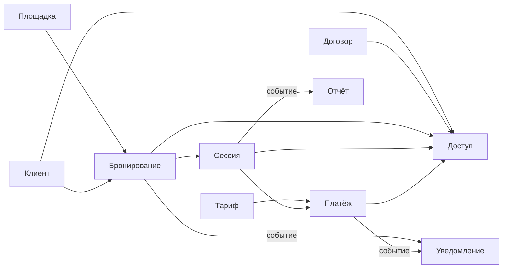

# DDD Bounded Contexts: учебная версия

## Оглавление

- [Что такое bounded context](#что-такое-bounded-context)
- [Зачем это нужно](#зачем-это-нужно)
- [Основные контексты проекта](#основные-контексты-проекта)
- [Какие контексты самые важные](#какие-контексты-самые-важные)
- [Как контексты работают вместе](#как-контексты-работают-вместе)
- [Три вида логики](#три-вида-логики)
- [Где здесь EDA](#где-здесь-eda)
- [Где лучше не использовать события](#где-лучше-не-использовать-события)
- [Самое важное правило проекта](#самое-важное-правило-проекта)
- [Итог](#итог)

## Что такое bounded context

В DDD **bounded context** — это часть системы со своей моделью и своими правилами.

Простой признак: если один и тот же термин в разных местах системы означает разное, это повод разделить модель.

Пример:

- `Бронирование` — это **план** использования парковки;
- `Сессия` — это **факт** использования парковки.

Это похожие вещи, но не одинаковые. Поэтому их лучше держать в разных контекстах.

## Зачем это нужно

Такое разделение помогает:

- не смешивать разные смыслы в одной сущности;
- проще описывать требования;
- заранее увидеть границы будущих модулей;
- легче развивать систему без хаоса.

## Основные контексты проекта

| Контекст | Простое объяснение |
| --- | --- |
| `Доступ` | Решает, пускать машину или нет, и содержит отдельные проверки для въезда и выезда |
| `Бронирование` | Хранит бронирования |
| `Сессия` | Хранит факт въезда, стоянки и выезда |
| `Тариф` | Считает стоимость |
| `Платёж` | Ведёт оплату, долг и чек |
| `Договор` | Хранит договоры и долгосрочные условия |
| `Клиент` | Хранит клиента, организацию и ТС |
| `Площадка` | Хранит парковку, сектора, места и КПП |
| `Уведомление` | Генерирует уведомления и ставит в очередь на доставку |
| `Обращение` | Ведёт обращения |
| `Сотрудник` | Хранит сотрудников и роли |
| `Отчёт` | Строит отчёты |

## Какие контексты самые важные

Ядро домена:

- `Доступ`;
- `Бронирование`;
- `Сессия`;
- `Тариф`.

Именно здесь находится главная логика парковочного бизнеса:

- можно ли пустить машину;
- есть ли право на место;
- был ли фактический въезд;
- сколько это стоит.

Остальные контексты поддерживают ядро.

## Как контексты работают вместе

Упрощённо основной поток выглядит так:

Как читать схему:

- `A --> B` означает: `B` использует данные или интерфейс `A`;
- `-- событие -->` означает: один контекст сообщает, что событие произошло, а другой реагирует на него асинхронно.

## Три вида логики

### 1. Доменная логика

Это бизнес-правила внутри bounded context.

Примеры:

- `Доступ` решает разрешить/запретить;
- `Тариф` считает сумму;
- `Сессия` меняет состояние сессии;
- `Бронирование` резервирует ресурс.

Важно: доменная логика не должна знать про камеры, UDP, терминалы и экранные сообщения.

### 2. Оркестрация

Когда один сценарий затрагивает несколько контекстов, их связывает **Сервис приложения**.

Примеры:

- въезд без предварительной брони: проверить доступ, при необходимости запросить авто-бронь в `Бронирование`, открыть `Сессия`;
- выезд: показать текущую сумму, зафиксировать её в `Платёж`, принять оплату, завершить `Сессия`, закрыть `Бронирование`.

Сервис приложения не придумывает бизнес-правила. Он только вызывает нужные контексты в правильном порядке.

### 3. Инфраструктурные адаптеры

Это переводчики между системой и внешним миром.

Примеры:

- `Адаптер ЛПР/СКУД` принимает данные от камеры и отправляет команду шлагбауму;
- платёжный терминал передаёт результат оплаты в систему;
- `Агент доставки уведомлений` отправляет сообщения во внешние шлюзы.

Адаптер не должен решать, можно ли пускать машину, и не должен считать стоимость.

Полный список адаптеров с описанием оборудования — в [ADR-003](../adr/adr-003-modular-monolith.md#option-c-модульный-монолит-с-изолированными-адаптерами). Как каждый из трёх видов логики выглядит в псевдокоде — см. [DDD Bounded Contexts: псевдокод — учебная версия](ddd-pseudocode-study.md).

## Где здесь EDA

**EDA** полезна там, где не нужен мгновенный ответ.

Хорошие кандидаты для событий:

- `Бронирование` создано;
- `Сессия` завершена;
- `Платёж` выполнен.

На такие события удобно подписывать:

- `Уведомление`;
- `Отчёт`.

Так модули меньше зависят друг от друга.

## Где лучше не использовать события

На критическом пути КПП важна быстрая и понятная реакция.

Поэтому:

- решение разрешить/запретить лучше делать синхронно;
- запрос авто-брони из `Доступ` и открытие сессии лучше координировать синхронно через `Сервис приложения`;
- события лучше оставлять для уведомлений, отчётов и других фоновых действий.

## Самое важное правило проекта

В нашей модели:

- `Бронирование` = план;
- `Сессия` = факт;
- `Тариф` = цена;
- `Платёж` = деньги;
- `Доступ` = решение о допуске.

И ещё три важных правила:

1. `Сессия` не существует без `Бронирование`.
2. `Доступ` не владеет бронированием, но на въезде может через публичный интерфейс `Бронирование` запросить авто-бронь.
3. `Тариф` считает текущую сумму в реальном времени, а `Платёж` фиксирует сумму конкретного платежа.

## Итог

DDD помогает ответить на вопрос: **на какие смысловые части разделить систему**.

EDA помогает ответить на вопрос: **как эти части могут обмениваться событиями без лишней связанности**.

Если начинающий аналитик удерживает различие между `Бронирование`, `Сессия`, `Тариф`, `Платёж` и `Доступ`, значит основная идея DDD в этом проекте уже понята правильно.

`Доступ` пока не нужно делить на два bounded context: для MVP достаточно одного модуля с двумя внутренними проверками — на въезд и на выезд.

Почему для проекта выбран модульный монолит и как эти контексты в нём размещаются — см. [ADR-003](../adr/adr-003-modular-monolith.md#decision).

## Связанные документы

- [DDD Bounded Contexts (канон)](ddd-bounded-contexts.md) — полное описание контекстов, матрица, контекстная карта
- [DDD Bounded Contexts: псевдокод — учебная версия](ddd-pseudocode-study.md) — как это выглядит в псевдокоде
- [ADR-003 — Модульный монолит](../adr/adr-003-modular-monolith.md) — обоснование архитектурного стиля
- [Глоссарий проекта](../../artifacts/project-glossary.md)
