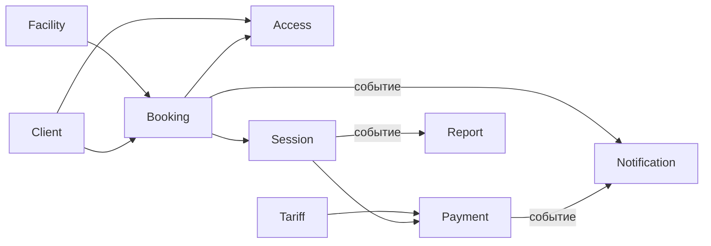

# DDD Bounded Contexts: учебная версия

## Оглавление

- [Что такое bounded context](#что-такое-bounded-context)
- [Зачем это нужно](#зачем-это-нужно)
- [Основные контексты проекта](#основные-контексты-проекта)
- [Какие контексты самые важные](#какие-контексты-самые-важные)
- [Как контексты работают вместе](#как-контексты-работают-вместе)
- [Три вида логики](#три-вида-логики)
- [Где здесь EDA](#где-здесь-eda)
- [Где лучше не использовать события](#где-лучше-не-использовать-события)
- [Самое важное правило проекта](#самое-важное-правило-проекта)
- [Итог](#итог)

## Что такое bounded context

В DDD **bounded context** — это часть системы со своей моделью и своими правилами.

Простой признак: если один и тот же термин в разных местах системы означает разное, это повод разделить модель.

Пример:

- `Booking` — это **план** использования парковки;
- `Session` — это **факт** использования парковки.

Это похожие вещи, но не одинаковые. Поэтому их лучше держать в разных контекстах.

## Зачем это нужно

Такое разделение помогает:

- не смешивать разные смыслы в одной сущности;
- проще описывать требования;
- заранее увидеть границы будущих модулей;
- легче развивать систему без хаоса.

## Основные контексты проекта

| Контекст | Простое объяснение |
| --- | --- |
| `Access` | Решает, пускать машину или нет |
| `Booking` | Хранит бронирования |
| `Session` | Хранит факт въезда, стоянки и выезда |
| `Tariff` | Считает стоимость |
| `Payment` | Ведёт оплату, долг и чек |
| `Contracts` | Хранит договоры и долгосрочные условия |
| `Client` | Хранит клиента, организацию и ТС |
| `Facility` | Хранит парковку, сектора, места и КПП |
| `Notification` | Отправляет сообщения |
| `Support` | Ведёт обращения |
| `Employee` | Хранит сотрудников и роли |
| `Report` | Строит отчёты |

## Какие контексты самые важные

Ядро домена:

- `Access`;
- `Booking`;
- `Session`;
- `Tariff`.

Именно здесь находится главная логика парковочного бизнеса:

- можно ли пустить машину;
- есть ли право на место;
- был ли фактический въезд;
- сколько это стоит.

Остальные контексты поддерживают ядро.

## Как контексты работают вместе

Упрощённо основной поток выглядит так:

Как читать схему:

- `A --> B` означает: `B` использует данные или интерфейс `A`;
- `-- событие -->` означает: один контекст сообщает, что событие произошло, а другой реагирует на него асинхронно.

## Три вида логики

### 1. Доменная логика

Это бизнес-правила внутри bounded context.

Примеры:

- `Access` решает `allow/deny`;
- `Tariff` считает сумму;
- `Session` меняет состояние сессии;
- `Booking` резервирует ресурс.

Важно: доменная логика не должна знать про камеры, UDP, терминалы и экранные сообщения.

### 2. Оркестрация

Когда один сценарий затрагивает несколько контекстов, их связывает **Application Service**.

Примеры:

- въезд без предварительной брони: проверить доступ, создать `Booking`, открыть `Session`;
- выезд: посчитать сумму, принять оплату, завершить `Session`, закрыть `Booking`.

Application Service не придумывает бизнес-правила. Он только вызывает нужные контексты в правильном порядке.

### 3. Инфраструктурные адаптеры

Это переводчики между системой и внешним миром.

Примеры:

- `LPR/СКУД Adapter` принимает данные от камеры и отправляет команду шлагбауму;
- платёжный терминал передаёт результат оплаты в систему;
- `Notification Worker` отправляет сообщения во внешние шлюзы.

Адаптер не должен решать, можно ли пускать машину, и не должен считать стоимость.

Полный список адаптеров с описанием оборудования — в [ADR-003](../adr/adr-003-modular-monolith.md#option-c-модульный-монолит-с-изолированными-адаптерами). Как каждый из трёх видов логики выглядит в псевдокоде — см. [DDD Bounded Contexts: псевдокод — учебная версия](ddd-pseudocode-study.md).

## Где здесь EDA

**EDA** полезна там, где не нужен мгновенный ответ.

Хорошие кандидаты для событий:

- `Booking` создано;
- `Session` завершена;
- `Payment` выполнен.

На такие события удобно подписывать:

- `Notification`;
- `Report`.

Так модули меньше зависят друг от друга.

## Где лучше не использовать события

На критическом пути КПП важна быстрая и понятная реакция.

Поэтому:

- решение `allow/deny` лучше делать синхронно;
- создание авто-брони и открытие сессии лучше координировать синхронно через `Application Service`;
- события лучше оставлять для уведомлений, отчётов и других фоновых действий.

## Самое важное правило проекта

В нашей модели:

- `Booking` = план;
- `Session` = факт;
- `Tariff` = цена;
- `Payment` = деньги;
- `Access` = решение о допуске.

И ещё два важных правила:

1. `Session` не существует без `Booking`.
2. `Access` не создаёт бронирование сам. Если нужна авто-бронь, её создаёт `Application Service`.

## Итог

DDD помогает ответить на вопрос: **на какие смысловые части разделить систему**.

EDA помогает ответить на вопрос: **как эти части могут обмениваться событиями без лишней связанности**.

Если начинающий аналитик удерживает различие между `Booking`, `Session`, `Tariff`, `Payment` и `Access`, значит основная идея DDD в этом проекте уже понята правильно.

Почему для проекта выбран модульный монолит и как эти контексты в нём размещаются — см. [ADR-003](../adr/adr-003-modular-monolith.md#decision).
