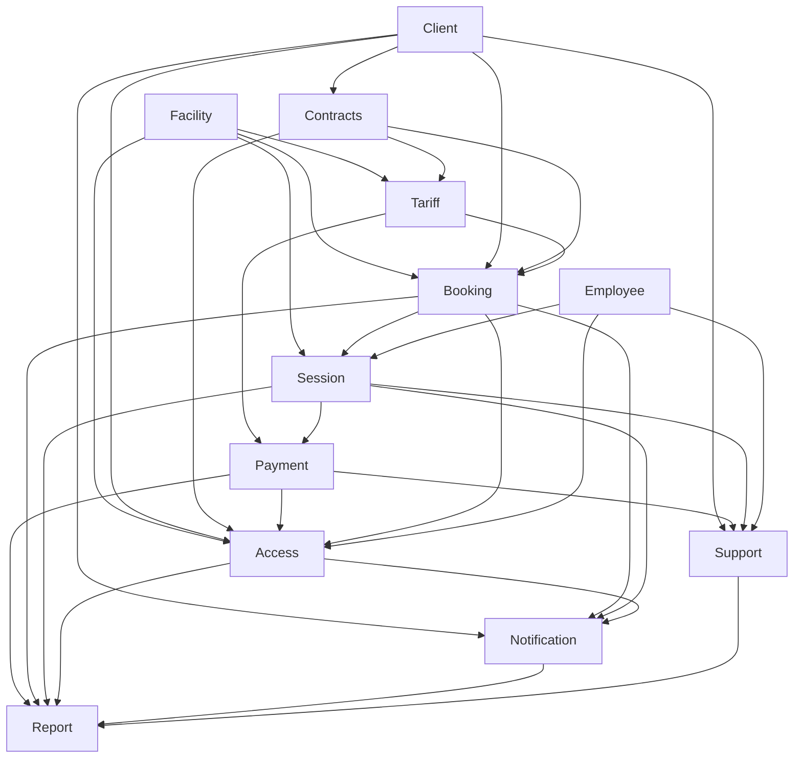

# DDD Bounded Contexts ИС парковки

## Оглавление

- [Назначение](#назначение)
- [Ключевые принципы декомпозиции](#ключевые-принципы-декомпозиции)
- [Правила согласования с ADR-003](#правила-согласования-с-adr-003)
- [Матрица bounded contexts](#матрица-bounded-contexts)
- [Контекстная карта](#контекстная-карта)
- [Bounded contexts](#bounded-contexts)
  - [1. Access](#1-access)
  - [2. Booking](#2-booking)
  - [3. Session](#3-session)
  - [4. Tariff](#4-tariff)
  - [5. Payment](#5-payment)
  - [6. Contracts](#6-contracts)
  - [7. Client](#7-client)
  - [8. Facility](#8-facility)
  - [9. Notification](#9-notification)
  - [10. Support](#10-support)
  - [11. Employee](#11-employee)
  - [12. Report](#12-report)
- [Что не является bounded context в текущей версии](#что-не-является-bounded-context-в-текущей-версии)
- [Границы владения терминами](#границы-владения-терминами)
- [Практические правила реализации](#практические-правила-реализации)
- [Связанные документы](#связанные-документы)

## Назначение

Документ уточняет модульную декомпозицию из [ADR-003](../adr/adr-003-modular-monolith.md) в терминах DDD (Domain-Driven Design) и фиксирует, какие **bounded contexts** (ограниченные контексты) считаются изолированными внутри целевого модульного монолита.

В актуальной версии проекта действует правило:

- на этапе MVP один доменный модуль из ADR-003 рассматривается как один bounded context;
- аутентификация и авторизация пока остаются **инфраструктурным слоем**, а не отдельным доменным модулем;
- `LPR/СКУД Adapter` и `Notification Worker` являются **изолированными адаптерами**, а не bounded contexts;
- сценарии, затрагивающие несколько контекстов, координируются через **Application Service** (слой оркестрации use case, не принадлежащий ни одному доменному контексту).

## Ключевые принципы декомпозиции

С учётом [ADR-003](../adr/adr-003-modular-monolith.md) ядро домена в DDD-терминах составляют `Access`, `Booking`, `Session` и `Tariff` — они содержат уникальную бизнес-логику парковочной платформы. Контексты `Payment`, `Notification`, `Report` и внешние адаптеры уже сейчас нужно держать максимально изолированными: именно они первыми станут кандидатами на вынос или отдельное масштабирование.

Главная архитектурная мысль: в ИС парковки **доступ**, **план**, **факт**, **цена** и **деньги** не должны сливаться в одну модель. Каждый из этих концептов живёт в своём bounded context с явными границами и публичными интерфейсами.

## Правила согласования с ADR-003

- Используем **те же имена**, что и в ADR-003: `Access`, `Booking`, `Session`, `Payment`, `Tariff`, `Notification`, `Contracts`, `Client`, `Facility`, `Support`, `Employee`, `Report`.
- Не вводим отдельный доменный bounded context `Identity` на этапе MVP: SSO, пароли, TOTP 2FA и проверка JWT относятся к инфраструктурному слою основного процесса.
- Учитываем инвариант ADR-002: **Парковочная сессия (ПМ) не существует без Бронирования**.
- Учитываем правило ADR-003: операция `создать Booking + открыть Session` должна выполняться в рамках **одной ACID-транзакции** (атомарность, согласованность, изолированность, долговечность).
- Учитываем правило ADR-003: `Access` принимает решение `allow/deny`, обращаясь к `Booking`, `Contracts` и `Payment` через задокументированные интерфейсы.
- Учитываем правило ADR-003: последовательный вызов нескольких контекстов подряд допустим только в `Application Service`.

## Матрица bounded contexts

Типы контекстов:
- **Core** — уникальная бизнес-логика платформы, разрабатывается «в доме», не заменяется готовым решением.
- **Supporting** — поддерживает Core, содержит специфичную, но не уникальную логику.
- **Generic** — стандартная задача, может быть заменена готовым компонентом или внешним сервисом.

| Модуль ADR-003 | Bounded Context | Тип | Владеет | Не владеет |
| --- | --- | --- | --- | --- |
| `Access` | `Access` | Core | решение `allow/deny`, чёрный список, ограничения доступа, аудит решения | бронирование, договор, платёж как мастер-модели |
| `Booking` | `Booking` | Core | бронирование, автоматическое бронирование, резервирование ресурса | факт пребывания ТС, платёж, чек |
| `Session` | `Session` | Core | парковочная сессия, журнал въезда/выезда, корректировка факта | тариф, договор, чек |
| `Tariff` | `Tariff` | Core | тарифы, правила применимости, расчёт стоимости | факт оплаты, решение доступа |
| `Payment` | `Payment` | Supporting | платёж, возврат, задолженность, чек, интеграция с платёжным провайдером | правила тарифа, решение `allow/deny` |
| `Contracts` | `Contracts` | Supporting | договоры, шаблоны договоров, долгосрочные условия, квоты | парковочная сессия, платёж |
| `Client` | `Client` | Supporting | клиент, организация, ТС, согласия, профильные данные | логин, пароль, решение доступа |
| `Facility` | `Facility` | Supporting | парковка, сектор, ПМ, КПП, конфигурация и статусы инфраструктуры | бронь, сессия, задолженность |
| `Notification` | `Notification` | Generic | уведомление, шаблон уведомления, очередь на доставку | профиль клиента как мастер-данные, бизнес-решение по доступу |
| `Support` | `Support` | Supporting | обращение, жизненный цикл тикета, история переписки | договор, платёж, бронирование как мастер-модели |
| `Employee` | `Employee` | Supporting | сотрудник, роль сотрудника, RBAC и служебный профиль | клиентские учётные данные, клиентские профили |
| `Report` | `Report` | Generic | read-модели, отчёты, аналитические агрегаты | транзакционное изменение мастер-данных |

> `Notification` и `Report` отнесены к типу **Generic**: их задачи (доставка сообщений и аналитика) стандартны для отрасли и могут быть заменены готовым решением или внешним сервисом без потери конкурентного преимущества платформы.

## Контекстная карта

Стрелка `A --> B` означает, что контекст `B` потребляет данные, статус или публичный интерфейс контекста `A` (A — upstream, B — downstream).



Стрелки, добавленные по результатам ревью (отсутствовали в исходной версии):

| Рёбро | Обоснование |
| --- | --- |
| `CLI --> ACC` | Access разрешает ГРЗ → vehicleId → clientId через проекцию из Client |
| `FAC --> ACC` | Access использует конфигурацию КПП из Facility при принятии решения |
| `BOOK --> NOT` | Booking порождает уведомления: подтверждение брони, напоминание о въезде, отмена |
| `CON --> TAR` | Tariff получает договорные ставки и условия из Contracts при расчёте для ЮЛ |
| `ACC --> NOT` | Access порождает уведомления об отказе в доступе и предупреждения об ограничениях |
| `ACC --> REP` | Report получает аудитные события решений allow/deny из Access |

## Bounded contexts

### 1. `Access`

**Назначение:** принять решение о допуске ТС на КПП (контрольно-пропускном пункте).

**Что владеет:**

- `Решение доступа` (allow/deny);
- `Основание решения`;
- `Чёрный список`;
- `Ограничение доступа`;
- `Ручное override-решение`;
- `Аудит решения`.

**Ключевые правила:**

- Решение `allow/deny` принимается **онлайн платформой**, а не СКУД (системой контроля и управления доступом), согласно [ADR-001](../adr/adr-001-online-access-rights-evaluation.md).
- `Access` не владеет бронированиями, договорами и платежами, а только запрашивает их статусы через публичные интерфейсы соответствующих контекстов (`Booking`, `Contracts`, `Payment`).
- `Access` хранит локальную проекцию `ГРЗ → vehicleId → clientId` для обеспечения низкой задержки на критическом пути КПП; мастером ГРЗ является `Client`. Правила инвалидации проекции фиксируются отдельно.
- Чёрный список ведётся по `vehicleId` (блокировка конкретного ТС); для блокировки всех ТС клиента используется clientId. Конкретный ключ блокировки фиксируется в рамках детального проектирования.
- При оценке допуска, если активной брони нет, но въезд допустим по иным основаниям (договор, ручной override), `Access` возвращает решение `allow` с мотивом `AUTO_BOOKING_REQUIRED`. **Application Service**, получив этот мотив, атомарно создаёт `Booking` и `Session`. `Access` не вызывает `Booking` напрямую и не «инициирует» сценарии в других контекстах.

### 2. `Booking`

**Назначение:** планирование и резервирование парковочного ресурса.

**Что владеет:**

- `Бронирование`;
- `Автоматическое бронирование`;
- правила резервирования ресурса;
- ссылки на `ТС`, `Сектор`, `ПМ`, `Договор` в рамках модели бронирования.

**Ключевые правила:**

- `Booking` отвечает за **план использования** и право на ресурс, но не за факт пребывания.
- Бронирование является обязательной основой для `Session`, согласно [ADR-002](../adr/adr-002-booking-vs-session.md).
- Автоматическая бронь при въезде без предварительного бронирования создаётся **Application Service** в ответ на мотив `AUTO_BOOKING_REQUIRED` от `Access`; `Booking` предоставляет операцию `createAutoBooking()` — инициатором является Application Service, а не `Access`.
- Резервирование конкретного ПМ выполняется с оптимистичной блокировкой версии агрегата `Booking` (или `SELECT FOR UPDATE SKIP LOCKED` на уровне ПМ). Конкретный механизм фиксируется до начала реализации.

### 3. `Session`

**Назначение:** фиксация фактического использования парковки.

**Что владеет:**

- `Парковочная сессия`;
- факты начала и завершения сессии;
- журнал въезда/выезда;
- ручные корректировки факта со стороны охранника.

**Ключевые правила:**

- `Session` хранит **факт нахождения ТС**, а не право на использование.
- `Session` всегда связана с `Booking`.
- Открытие `Session` и создание `Booking` выполняются в **одной ACID-транзакции** через `Application Service`, а не через eventual consistency между контекстами.
- **Транзакционная граница при завершении сессии**: `Session.complete` закрывает сессию в ACID-транзакции локально. Инициирование платежа выполняется через Outbox-паттерн асинхронно — это гарантирует, что факт завершения сессии не теряется при сбое внешнего платёжного провайдера.
- При **ручном override-допуске** охранника Application Service создаёт `Booking` с типом `override` и открывает `Session` в одной транзакции — инвариант ADR-002 соблюдается и в этом сценарии.
- Для операционного экрана охранника `Session` предоставляет **operational read-view** активных сессий напрямую, без посредничества `Report`, чтобы исключить зависимость от eventually consistent агрегатов в критическом интерфейсе КПП.

### 4. `Tariff`

**Назначение:** определить стоимость использования парковки.

**Что владеет:**

- `Тариф`;
- правила применимости тарифа;
- доменные сервисы расчёта стоимости.

**Ключевые правила:**

- `Tariff` отвечает за логику расчёта, но не за проведение платежа.
- Стоимость зависит от зоны, типа ТС, льгот, длительности и сценария использования.
- `Tariff` не владеет финансовым состоянием и не выпускает чеки.
- Данные о льготах (`ClientTariffCategory`) и договорных ставках передаются в `Tariff` как **входные параметры** расчёта (Value Object), а не запрашиваются через прямые зависимости от `Client` или `Contracts`. Это изолирует `Tariff` от изменений в этих контекстах.

### 5. `Payment`

**Назначение:** провести оплату и зафиксировать финансовый результат.

**Что владеет:**

- `Платёж`;
- `Возврат`;
- `Задолженность`;
- `Чек`;
- `Счёт (invoice) для ЮЛ` — периодический финансовый документ по договору, отличный от разового чека;
- интеграция с платёжной системой и фискализацией.

**Ключевые правила:**

- `Payment` не принимает решение `allow/deny`, а только предоставляет финансовый статус другим контекстам.
- Чек и фискализация следуют за успешным финансовым сценарием.
- Правила расчёта суммы приходят из `Tariff`, а не определяются внутри `Payment`.
- Счёт (invoice) для ЮЛ создаётся `Payment` по команде из `Contracts` (периодически или по завершении расчётного периода); `Contracts` определяет период и условия, `Payment` — финансовый документ и фискализацию.
- Инициация возврата принимается из `Support` через публичный интерфейс `Payment`; `Support` не владеет логикой возврата.

### 6. `Contracts`

**Назначение:** вести долгосрочные отношения с клиентом.

**Что владеет:**

- `Договор`;
- `Шаблон договора`;
- долгосрочные условия, квоты, абонементные правила.

**Ключевые правила:**

- Договор не заменяет ни `Booking`, ни `Session`.
- Делегация мест и квот происходит через связанные бронирования, а не через прямое управление парковочными сессиями.
- `Contracts` поставляет условия в `Access` и `Booking`, но не владеет фактом допуска через КПП.
- Специальные договорные ставки передаются в `Tariff` через публичный интерфейс при расчёте стоимости сессии ЮЛ; `Contracts` инициирует этот вызов через Application Service.
- Квоты мест «потребляются» при создании `Booking`; остаток квот проверяется `Contracts` до подтверждения бронирования.

### 7. `Client`

**Назначение:** хранить мастер-данные клиента.

**Что владеет:**

- `Клиент`;
- `Организация`;
- `ТС` (транспортное средство) с атрибутом `ГРЗ` (государственный регистрационный знак);
- `Паспортные данные`;
- `Льготный документ`;
- `Согласие на ПДн` (персональные данные);
- профильные настройки клиента.

**Ключевые правила:**

- `Client` не владеет аутентификацией пользователя.
- Профиль клиента не должен содержать логику принятия решения о допуске.
- Идентификаторы клиентов и ТС используются в других контекстах как ссылки или immutable snapshots; `Session` и `Access` хранят ГРЗ как строковый snapshot на момент события, а не как FK на ТС.
- `Паспортные данные` и `Согласие на ПДн` хранятся в режиме, соответствующем требованиям 152-ФЗ (отдельная схема БД с ограниченными правами доступа).

### 8. `Facility`

**Назначение:** описывать физическую и логическую структуру парковки.

**Что владеет:**

- `Парковка`;
- `Сектор`;
- `ПМ` (парковочное место);
- `КПП` — конфигурация полос, направление движения, технический статус оборудования;
- конфигурация и эксплуатационные статусы инфраструктуры;
- допустимые типы зон и физические ограничения ресурса.

**Ключевые правила:**

- `Facility` владеет инфраструктурой, но не её временным использованием.
- Признаки `зарезервировано` и `занято` рассматриваются как **операционные проекции**, а не как мастер-истина контекста. Источниками истины являются: `Booking` (план — зарезервировано), `Session` (факт — занято), `Facility` (конфигурация — недоступно по техническим причинам).
- **Агрегированный статус доступности ПМ** (карта парковки для клиента) формируется как операционная read-модель в `Facility`, обновляемая через доменные события от `Booking` и `Session` (`BookingCreated`, `SessionOpened`, `SessionClosed`). Facility не является источником истины об активных бронях или сессиях, но агрегирует их проекции для быстрого отображения клиенту.
- `Facility` не выполняет ни тарификацию, ни доступ, ни бронирование.

### 9. `Notification`

**Назначение:** генерировать и ставить уведомления в доставку.

**Что владеет:**

- `Уведомление`;
- `Шаблон уведомления`;
- очередь/задача на доставку;
- история доставки.

**Ключевые правила:**

- Контекст не решает, когда бизнесу нужно отправить сообщение; он исполняет команду или доменное событие.
- Отправка сообщений вынесена в отдельный `Notification Worker`, но модель уведомлений остаётся в `Notification`.
- Клиентские настройки уведомлений приходят из `Client`.

### 10. `Support`

**Назначение:** обрабатывать обращения и спорные случаи.

**Что владеет:**

- `Обращение`;
- статус обработки;
- история переписки;
- привязка кейса к связанному объекту.

**Ключевые правила:**

- `Support` не владеет жизненным циклом платежа, договора, бронирования или сессии.
- Кейс может ссылаться на объект из другого контекста, но не должен менять его внутреннее состояние в обход публичного API.
- Инициация возврата выполняется через публичный интерфейс `Payment`; `Support` запрашивает возврат, но не владеет его логикой.
- Ответы клиенту и внутренняя история разбора остаются в `Support`.

### 11. `Employee`

**Назначение:** управлять сотрудниками и служебными правами.

**Что владеет:**

- `Сотрудник`;
- роль сотрудника;
- RBAC (Role-Based Access Control — управление доступом на основе ролей) для внутренних интерфейсов;
- служебный профиль оператора, охранника, управляющего, владельца.

**Ключевые правила:**

- `Employee` не владеет клиентскими профилями.
- `Employee` не заменяет инфраструктурный слой аутентификации, а использует его.
- В других контекстах сотрудник фигурирует как actor reference (`employeeId` и служебный snapshot).

### 12. `Report`

**Назначение:** собирать аналитические представления и отчёты.

**Что владеет:**

- read-модели (CQRS read side);
- агрегаты загрузки парковки;
- финансовые и операционные отчёты;
- аналитические витрины.

**Ключевые правила:**

- `Report` не является источником истины для транзакционных данных.
- Данные поступают через проекции событий или ETL-подобные механизмы; источники — доменные события от `Booking`, `Session`, `Payment`, `Access` и др.
- Тяжёлые аналитические запросы не должны нагружать транзакционный путь (OLTP-ядро). Митигация: read replica или materialized views (ADR-003, Trade-offs).

## Что не является bounded context в текущей версии

### Аутентификация и авторизация

Согласно ADR-003, это **сквозная инфраструктурная ответственность** основного процесса:

- OAuth2/OIDC для клиентов ФЛ;
- логин/пароль для ЮЛ;
- TOTP 2FA для сотрудников;
- проверка JWT и инфраструктурные политики доступа.

`Client` и `Employee` остаются доменными контекстами, но не владеют credential-моделью.

### `LPR/СКУД Adapter`

Изолированный адаптер для UDP/LPR и взаимодействия со СКУД. Не является bounded context, поскольку не владеет самостоятельной предметной моделью парковки, а только переводит внешний транспорт в интерфейсы основного процесса. Паттерн интеграции: **Anti-Corruption Layer (ACL)** — адаптер транслирует чужой UDP-протокол в доменный запрос `AccessRequest`.

### `Notification Worker`

Изолированный процесс доставки уведомлений. Модель уведомлений принадлежит `Notification`; Worker — только механизм доставки через внешние шлюзы.

### `Application Service`

Слой оркестрации, в котором разрешены сквозные сценарии. Зафиксированные flows:

```
// Въезд без предварительной брони:
LPR Adapter → Application Service
  → Access.evaluate() → {allow, motive: AUTO_BOOKING_REQUIRED}
  → Booking.createAutoBooking() + Session.open()  [ACID-транзакция]
  → LPR Adapter → СКУД (открыть шлагбаум)

// Ручной override-допуск охранника:
Employee UI → Application Service
  → Access.manualOverride(employeeId)
  → Booking.createOverride(type=override, employeeId) + Session.open()  [ACID-транзакция]

// Завершение сессии и оплата:
Session.complete()  [ACID: закрыть сессию]
  → Outbox → Payment.initiateCharge(tariffResult)  [асинхронно]
  → Payment → Notification.enqueue(receipt)

// Инициация возврата через поддержку:
Support.requestRefund() → Payment.initiateRefund() → Notification.send()
```

## Границы владения терминами

| Термин | Контекст-владелец | Комментарий |
| --- | --- | --- |
| `Клиент`, `Организация` | `Client` | В других контекстах — только ссылки (clientId) и snapshots |
| `ТС` (транспортное средство) | `Client` | ГРЗ — атрибут ТС; в `Session` и `Access` хранится как immutable snapshot |
| `ГРЗ` как идентификатор | `Client` (master), `Access` (snapshot/projection) | `Access` держит локальную проекцию `ГРЗ → vehicleId → clientId` для критического пути; master — `Client` |
| `Паспортные данные` | `Client` | Чувствительные ПДн; особый режим хранения по 152-ФЗ |
| `Льготный документ` | `Client` | Документ, подтверждающий льготную категорию; передаётся в `Tariff` как входной параметр |
| `Согласие на ПДн` | `Client` | Фиксирует согласие субъекта ПДн на обработку данных |
| `Сотрудник`, `Роль сотрудника` | `Employee` | Используются для аудита и внутренних прав; в других контекстах — employeeId |
| `Парковка`, `Сектор`, `ПМ` | `Facility` | Мастер-данные инфраструктуры |
| `КПП` | `Facility` | Физическая инфраструктура: конфигурация полос, направление, статус оборудования |
| `Договор`, `Шаблон договора` | `Contracts` | Договор не подменяет бронирование и сессию |
| `Бронирование` | `Booking` | План и право использования парковочного ресурса |
| `Парковочная сессия` | `Session` | Факт использования парковки |
| `Тариф` | `Tariff` | Правила расчёта стоимости; льготы и договорные ставки — входные параметры |
| `Платёж`, `Задолженность`, `Чек`, `Счёт (invoice) ЮЛ` | `Payment` | Финансовая модель |
| `Решение доступа`, `allow/deny`, `Чёрный список` | `Access` | Производная модель допуска; аудит решений |
| `Ручное override-решение` | `Access` | Ручной допуск охранника с сохранением employeeId и основания |
| `Уведомление`, `Шаблон уведомления` | `Notification` | Коммуникационная модель |
| `Обращение` | `Support` | Кейс и история разбора |
| `Отчёт`, `Агрегат`, `Витрина` | `Report` | Аналитические read-модели |

## Практические правила реализации

### Структура и изоляция

- Один bounded context = один модуль верхнего уровня в основном процессе.
- Схемная изоляция per module в БД: каждый контекст работает в своей PostgreSQL-схеме с ограниченными правами доступа приложения (по ADR-003, инвариант 5).

### Межмодульное взаимодействие

- Прямой доступ к таблицам, репозиториям и внутренним объектам другого контекста запрещён.
- Межконтекстное взаимодействие выполняется через публичные интерфейсы модулей.
- Сквозные сценарии координируются только через `Application Service`.
- Для `Report` и `Notification` предпочтительны событийные интеграции и read-модели (published language через доменные события).

### Внешние системы

- Для внешних систем (СКУД/LPR, платёжный провайдер, ОФД, IdP, ЭДО, SMS/e-mail) применяются **Anti-Corruption Layers (ACL)** — адаптеры, транслирующие чужую модель в доменный язык платформы.
- Внешние платёжные операции инициируются через Outbox-паттерн, чтобы отделить транзакционную границу платформы от доступности внешнего провайдера.

## Связанные документы

- [ADR-001](../adr/adr-001-online-access-rights-evaluation.md) — оценка прав доступа онлайн на каждый запрос КПП
- [ADR-002](../adr/adr-002-booking-vs-session.md) — Бронирование vs Парковочная сессия как мастер-сущности
- [ADR-003](../adr/adr-003-modular-monolith.md) — выбор архитектурного стиля: модульный монолит
- [Контекстная диаграмма](../../artifacts/context-diagram.md)
- [Концептуальная модель](../../artifacts/conceptual-model-with-attributes.md)
- [Глоссарий проекта](../../artifacts/project-glossary.md)
