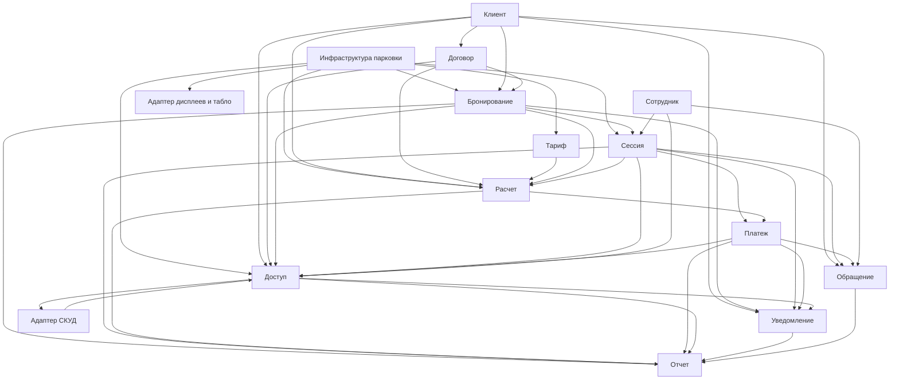

# DDD Bounded Contexts ИС парковки

## Оглавление

- [Назначение](#назначение)
- [Ключевые принципы декомпозиции](#ключевые-принципы-декомпозиции)
- [Правила согласования с ADR-003](#правила-согласования-с-adr-003)
- [Матрица bounded contexts](#матрица-bounded-contexts)
- [Контекстная карта](#контекстная-карта)
- [Bounded contexts](#bounded-contexts)
  - [1. Доступ](#1-доступ)
  - [2. Бронирование](#2-бронирование)
  - [3. Сессия](#3-сессия)
  - [4. Тариф](#4-тариф)
  - [5. Расчет](#5-расчет)
  - [6. Платеж](#6-платеж)
  - [7. Договор](#7-договор)
  - [8. Клиент](#8-клиент)
  - [9. Инфраструктура парковки](#9-инфраструктура-парковки)
  - [10. Уведомление](#10-уведомление)
  - [11. Обращение](#11-обращение)
  - [12. Сотрудник](#12-сотрудник)
  - [13. Отчет](#13-отчет)
  - [14. Адаптер СКУД](#14-адаптер-скуд)
  - [15. Адаптер дисплеев и табло](#15-адаптер-дисплеев-и-табло)
- [Что не является bounded context в текущей версии](#что-не-является-bounded-context-в-текущей-версии)
- [Границы владения терминами](#границы-владения-терминами)
- [Практические правила реализации](#практические-правила-реализации)
- [Связанные документы](#связанные-документы)

## Назначение

Документ уточняет модульную декомпозицию из [ADR-003](../adr/adr-003-modular-monolith.md) в терминах DDD (Domain-Driven Design) и фиксирует, какие bounded contexts считаются изолированными внутри целевого модульного монолита.

В актуальной версии проекта действует правило:

- на этапе MVP один доменный или интеграционный модуль из архитектурной декомпозиции рассматривается как один bounded context;
- аутентификация и авторизация остаются инфраструктурным слоем, а не отдельным доменным модулем;
- `Адаптер СКУД` и `Адаптер дисплеев и табло` в актуальной модели фиксируются как supporting integration contexts: они не владеют бизнес-истиной по бронированиям, сессиям или оплате, но владеют переводом внешних протоколов в язык платформы;
- `Агент доставки уведомлений` остается изолированным worker-процессом, а не bounded context;
- сценарии, затрагивающие несколько контекстов, координируются через `Сервис приложения`, слой оркестрации use case, не принадлежащий ни одному доменному контексту.

## Ключевые принципы декомпозиции

С учетом [ADR-003](../adr/adr-003-modular-monolith.md) ядро домена в DDD-терминах составляют `Доступ`, `Бронирование`, `Сессия`, `Тариф` и `Расчет`. В актуализированной модели мы отдельно держим:

- `Тариф` как источник тарифных правил и версий;
- `Расчет` как контекст исполнения этих правил на конкретных входных данных;
- `Платеж` как контекст финансового результата;
- `Инфраструктура парковки` как владельца мастер-данных парковки;
- `Адаптер СКУД` и `Адаптер дисплеев и табло` как изолированные supporting-контексты интеграции с оборудованием.

Главная архитектурная мысль: в ИС парковки допуск, план, факт, тарифный каталог, расчет и деньги не должны сливаться в одну модель. Каждый из этих концептов живет в своем bounded context с явными границами и публичными интерфейсами.

## Правила согласования с ADR-003

Имена контекстов в DDD-документах русскоязычные, что соответствует ubiquitous language проекта. ADR-003 пока отражает более раннюю 12-модульную декомпозицию, поэтому этот документ фиксирует актуализированное уточнение границ. Базовое отображение имен сохраняем таким:

- `Access` -> `Доступ`
- `Booking` -> `Бронирование`
- `Session` -> `Сессия`
- `Tariff` -> `Тариф`
- `Payment` -> `Платеж`
- `Contracts` -> `Договор`
- `Client` -> `Клиент`
- `Facility` -> `Инфраструктура парковки` (прежнее имя в документах: `Площадка`)
- `Support` -> `Обращение`
- `Employee` -> `Сотрудник`
- `Notification` -> `Уведомление`
- `Report` -> `Отчет`

Для новых контекстов, появившихся после детализации модели, используем рабочие технические идентификаторы:

- `Calculation` -> `Расчет`
- `SkudAdapter` -> `Адаптер СКУД`
- `DisplayAdapter` -> `Адаптер дисплеев и табло`

- Не вводим отдельный доменный bounded context `Идентификация` на этапе MVP: SSO, пароли, TOTP 2FA и проверка JWT относятся к инфраструктурному слою основного процесса.
- Учитываем инвариант ADR-002: парковочная сессия не существует без бронирования.
- Учитываем правило ADR-003: операция `создать Бронирование + открыть Сессию` должна выполняться в рамках одной ACID-транзакции.
- Учитываем правило ADR-003: `Доступ` принимает решение разрешить или запретить, обращаясь к `Бронированию`, `Договору`, `Сессии`, `Платежу` и, при необходимости, к `Расчету` через задокументированные интерфейсы и `Сервис приложения`.
- Учитываем правило ADR-003: широкая оркестрация use case выполняется только в `Сервисе приложения`; межконтекстные вызовы допускаются только там, где это явно зафиксировано публичным контрактом.

## Матрица bounded contexts

Типы контекстов:

- **Core**: уникальная бизнес-логика платформы, разрабатывается внутри продукта, не заменяется готовым решением.
- **Supporting**: поддерживает Core, содержит специфичную, но не уникальную логику.
- **Generic**: стандартная задача, может быть заменена готовым компонентом или внешним сервисом.

Для краткой коммуникации и согласования границ используем следующий актуальный перечень контекстов:

1. `Управление бронированием` (`Бронирование`) - Core
2. `Управление допуском` (`Доступ`) - Core
3. `Управление парковочной сессией` (`Сессия`) - Core
4. `Управление тарифами` (`Тариф`) - Core
5. `Расчет` - Core
6. `Управление договорами` (`Договор`) - Supporting
7. `Управление профилем клиента` (`Клиент` + `ТС` + `Организация`) - Supporting
8. `Управление профилем сотрудника` (`Сотрудник`) - Supporting
9. `Оплата` (`Платеж` + `Чек`) - Supporting
10. `Управление инфраструктурой парковки` (`Парковка` + `Сектор` + `ПМ` + `КПП`) - Supporting
11. `Управление обращениями` (`Обращение`) - Supporting
12. `Управление уведомлениями` (`Уведомление`) - Generic
13. `Аналитика` (`Отчет`) - Generic
14. `Адаптер СКУД` - Supporting
15. `Адаптер дисплеев и табло` - Supporting

В документации и коде предпочтительно использовать короткие предметные имена контекстов, `Бронирование`, `Доступ`, `Сессия`, `Тариф`, `Расчет` и т. д., а управленческие заголовки использовать там, где нужно связать архитектурную модель с исходной декомпозицией контекстов.

Отдельное правило: `Аутентификация` и `Авторизация` не являются bounded contexts на этапе MVP и относятся к инфраструктурному слою.

| Контекст | Тип | Владеет | Не владеет |
| --- | --- | --- | --- |
| `Доступ` | Core | решение разрешить или запретить, ограничения допуска, черный список, аудит решения | бронирование, договор, платеж как мастер-модели |
| `Бронирование` | Core | бронирование, автоматическое бронирование, резервирование ресурса | факт пребывания ТС, платеж, чек |
| `Сессия` | Core | парковочная сессия, журнал въезда и выезда, факт использования ПМ как snapshot в рамках сессии | тарифный каталог, расчет, чек |
| `Тариф` | Core | тарифы, версии тарифов, правила применимости, тарифные сетки | preview суммы, проведение оплаты |
| `Расчет` | Core | расчет стоимости, preview суммы, расчетный снимок для передачи в `Платеж` | каталог тарифов, проведение оплаты |
| `Платеж` | Supporting | платеж, возврат, задолженность, чек, интеграция с платежным провайдером, ОФД и терминалами | правила тарифа, расчет preview суммы, решение разрешить или запретить |
| `Договор` | Supporting | договоры, шаблоны договоров, долгосрочные условия, квоты | парковочная сессия, платеж |
| `Клиент` | Supporting | клиент, организация, ТС, согласия, профильные данные | логин, пароль, решение допуска |
| `Инфраструктура парковки` | Supporting | парковка, сектор, ПМ, КПП, конфигурация и статусы инфраструктуры | бронь, сессия, задолженность |
| `Уведомление` | Generic | уведомление, шаблон уведомления, очередь на доставку | профиль клиента как мастер-данные, бизнес-решение по доступу |
| `Обращение` | Supporting | обращение, жизненный цикл тикета, история переписки | договор, платеж, бронирование как мастер-модели |
| `Сотрудник` | Supporting | сотрудник, роль сотрудника, RBAC и служебный профиль | клиентские учетные данные, клиентские профили |
| `Отчет` | Generic | read-модели, отчеты, аналитические агрегаты | транзакционное изменение мастер-данных |
| `Адаптер СКУД` | Supporting | нормализация событий СКУД/LPR, трансляция `allow/deny`, корреляция с внешним оборудованием | решение доступа, правила бронирования, сессионные и финансовые инварианты |
| `Адаптер дисплеев и табло` | Supporting | интеграционные контракты с дисплеями и табло, трансляция статусов и навигационных сообщений | мастер-данные парковки, расчет заполненности, правила бронирования и сессии |

> `Уведомление` и `Отчет` остаются Generic-контекстами, а `Адаптер СКУД` и `Адаптер дисплеев и табло` остаются Supporting: они важны для продукта, но не являются носителями уникального бизнес-преимущества платформы.

## Контекстная карта

Стрелка `A --> B` означает, что контекст `B` потребляет данные, статус или публичный интерфейс контекста `A`, где `A` является upstream, а `B` downstream.



Ключевые ребра актуальной версии:

| Ребро | Обоснование |
| --- | --- |
| `Инфраструктура парковки --> Расчет` | Расчет использует зону, тип ПМ, ограничения и конфигурацию КПП как входные параметры |
| `Тариф --> Расчет` | Тариф поставляет версии правил и тарифные сетки, а Расчет исполняет их на конкретных данных |
| `Договор --> Расчет` | Расчет применяет договорные условия и квоты как входные ограничения или надбавки |
| `Расчет --> Платеж` | В Платеж передается расчетный снимок и сумма, зафиксированная на момент инициации оплаты |
| `Доступ --> Адаптер СКУД` | Адаптер СКУД транслирует решение `allow/deny` во внешний протокол оборудования |
| `Адаптер СКУД --> Доступ` | Адаптер СКУД нормализует внешние события въезда и выезда в язык платформы |
| `Инфраструктура парковки --> Адаптер дисплеев и табло` | Статусы мест и навигационные сообщения формируются из операционной модели инфраструктуры и отдаются во внешний формат устройств |

> `Тариф -> Платеж` по-прежнему отсутствует. `Платеж` не должен напрямую вычислять сумму по правилам тарифа. Сначала сумма и расчетный снимок формируются в `Расчете`, затем `Платеж` фиксирует финансовый результат.

## Bounded contexts

### 1. `Доступ`

**Назначение:** принять решение о допуске ТС на въезд или выезд через КПП.

**Что владеет:**

- `Решение доступа`, разрешить или запретить;
- `Основание решения`;
- `Черный список`;
- `Ограничение доступа`;
- `Ручное решение охранника`;
- `Аудит решения`.

**Ключевые правила:**

- Решение разрешить или запретить принимается онлайн платформой, а не СКУД, согласно [ADR-001](../adr/adr-001-online-access-rights-evaluation.md).
- На этапе MVP `Доступ` остается одним bounded context, но внутри делится на два policy-сервиса: `ПолитикаДопускаНаВъезд` и `ПолитикаДопускаНаВыезд`.
- `Доступ` не владеет бронированиями, договорами, сессиями, расчетами и платежами, а только запрашивает их статусы и команды через публичные интерфейсы соответствующих контекстов.
- `Доступ` хранит локальную проекцию `ГРЗ -> vehicleId -> clientId` для обеспечения низкой задержки на критическом пути КПП; мастером ГРЗ является `Клиент`.
- При оценке допуска на въезд, если активной брони нет, но въезд допустим по иным основаниям, `Доступ` через публичный интерфейс `Бронирования` запрашивает авто-бронирование и получает `бронированиеИд` для продолжения сценария.
- При оценке допуска на выезд `ПолитикаДопускаНаВыезд` проверяет наличие активной `Сессии`, необходимость оплаты и факт успешного расчета или проведения платежа перед открытием шлагбаума.

### 2. `Бронирование`

**Назначение:** планировать и резервировать парковочный ресурс.

**Что владеет:**

- `Бронирование`;
- `Автоматическое бронирование`;
- правила резервирования ресурса;
- ссылки на `ТС`, `Сектор`, `ПМ`, `Договор` в рамках модели бронирования.

**Ключевые правила:**

- `Бронирование` отвечает за план использования и право на ресурс, но не за факт пребывания.
- Бронирование является обязательной основой для `Сессии`, согласно [ADR-002](../adr/adr-002-booking-vs-session.md).
- Автоматическая бронь при въезде без предварительного бронирования создается `Бронированием` по запросу `Доступа` через публичный интерфейс.
- Резервирование конкретного ПМ выполняется на стороне `Бронирования`, а не в контексте `Инфраструктуры парковки`.

### 3. `Сессия`

**Назначение:** фиксировать фактическое использование парковки.

**Что владеет:**

- `Парковочная сессия`;
- факты начала и завершения сессии;
- журнал въезда и выезда;
- ручные корректировки факта со стороны охранника;
- snapshot фактического ПМ в рамках сессии.

**Ключевые правила:**

- `Сессия` хранит факт нахождения ТС, а не право на использование.
- `Сессия` всегда связана с `Бронированием`.
- Открытие `Сессии` и создание `Бронирования` выполняются в одной ACID-транзакции через `Сервис приложения`.
- `Сессия.завершить` не инициирует платеж. Сначала сумма рассчитывается в `Расчете`, затем при необходимости создается `Платеж`.
- Завершение `Сессии` и связанного `Бронирования` выполняется только после успешной проверки `ПолитикиДопускаНаВыезд` и, если требуется оплата, после подтвержденного финансового результата в `Платеже`.
- Для операционного экрана охранника `Сессия` предоставляет operational read-view активных сессий напрямую, без посредничества `Отчета`.

### 4. `Тариф`

**Назначение:** управлять тарифным каталогом и правилами применимости.

**Что владеет:**

- `Тариф`;
- версии тарифов;
- правила применимости тарифа;
- тарифные сетки и параметры округления;
- льготные и договорные признаки, используемые в расчете.

**Ключевые правила:**

- `Тариф` отвечает за описание и версионирование правил тарифа, но не за исполнение расчета на конкретной сессии.
- `Тариф` не владеет финансовым состоянием и не выпускает чеки.
- `Тариф` не хранит текущую сумму к оплате и не фиксирует за собой preview. Эти функции принадлежат `Расчету`.
- `Расчет` использует правила из `Тарифа` как входные данные, а не изменяет тарифный каталог.

### 5. `Расчет`

**Назначение:** вычислять сумму парковки для preview и для передачи зафиксированной суммы в `Платеж`.

**Что владеет:**

- `Расчет стоимости`;
- `Расчетная позиция`;
- `Расчетный снимок` с примененными правилами и входными параметрами;
- правила агрегации цены по бронированию и сессии.

**Ключевые правила:**

- `Расчет` использует тарифные правила из `Тарифа`, но не владеет самим каталогом тарифов.
- `Расчет` получает параметры из `Бронирования`, `Сессии`, `Инфраструктуры парковки`, `Клиента` и `Договора` как входные данные или immutable snapshots.
- `Расчет` формирует текущую сумму к оплате, preview, и расчетный снимок, который передается в `Платеж` при инициации оплаты.
- После создания `Платежа` владельцем конкретной зафиксированной суммы становится `Платеж`; `Расчет` не изменяет проведенный финансовый результат задним числом.
- Для спорных случаев `Расчет` должен быть воспроизводимым: по сохраненному расчетному снимку система может объяснить, из каких правил и параметров получилась сумма.

### 6. `Платеж`

**Назначение:** провести оплату и зафиксировать финансовый результат.

**Что владеет:**

- `Платеж`;
- `Возврат`;
- `Задолженность`;
- `Чек`;
- `Счет (invoice) для ЮЛ`;
- интеграция с платежной системой и фискализацией.

**Ключевые правила:**

- `Платеж` не принимает решение разрешить или запретить, а только предоставляет финансовый статус другим контекстам.
- Чек и фискализация следуют за успешным финансовым сценарием.
- Правила расчета суммы приходят из `Расчета`, а не определяются внутри `Платежа`.
- `Платеж` владеет зафиксированной суммой платежа. Она создается в момент нажатия клиентом кнопки оплаты в ЛК или в момент подъезда к выездному шлагбауму, если оплата еще не была инициирована.
- Счет для ЮЛ создается `Платежом` по команде из `Договора`; `Договор` определяет период и условия, `Платеж` создает финансовый документ и проводит фискализацию.
- Инициация возврата принимается из `Обращения` через публичный интерфейс `Платежа`.
- `Платеж` владеет ACL-адаптерами для трех внешних систем: платежный провайдер, платежные терминалы объекта и ОФД.

### 7. `Договор`

**Назначение:** вести долгосрочные отношения с клиентом.

**Что владеет:**

- `Договор`;
- `Шаблон договора`;
- долгосрочные условия, квоты, абонементные правила.

**Ключевые правила:**

- `Договор` не заменяет ни `Бронирование`, ни `Сессию`.
- Делегация мест и квот происходит через связанные бронирования, а не через прямое управление парковочными сессиями.
- `Договор` поставляет условия в `Доступ`, `Бронирование` и `Расчет`, но не владеет фактом допуска через КПП.
- Договорные ставки и скидки передаются в `Расчет` через публичный интерфейс и `Сервис приложения`; `Тариф` при этом остается владельцем тарифного каталога.
- Квоты мест потребляются при создании `Бронирования`; остаток квот проверяется `Договором` до подтверждения бронирования.
- `Договор` владеет ACL-адаптером для интеграции с ЭДО.

### 8. `Клиент`

**Назначение:** хранить мастер-данные клиента.

**Что владеет:**

- `Клиент`;
- `Организация`;
- `ТС` с атрибутом `ГРЗ`;
- `Паспортные данные`;
- `Льготный документ`;
- `Согласие на ПДн`;
- профильные настройки клиента.

**Ключевые правила:**

- `Клиент` не владеет аутентификацией пользователя.
- Профиль клиента не должен содержать логику принятия решения о допуске.
- Идентификаторы клиентов и ТС используются в других контекстах как ссылки или immutable snapshots; `Сессия`, `Доступ` и `Расчет` хранят ГРЗ и профильные признаки как snapshot на момент сценария, а не как прямой FK на мастер-модель.
- `Паспортные данные` и `Согласие на ПДн` хранятся в режиме, соответствующем требованиям 152-ФЗ.

### 9. `Инфраструктура парковки`

**Назначение:** описывать физическую и логическую структуру парковки.

**Что владеет:**

- `Парковка`;
- `Сектор`;
- `ПМ`;
- `КПП`, конфигурация полос, направление движения, технический статус оборудования;
- конфигурация и эксплуатационные статусы инфраструктуры;
- допустимые типы зон и физические ограничения ресурса;
- операционные проекции доступности мест для карты парковки и табло.

**Ключевые правила:**

- `Инфраструктура парковки` владеет инфраструктурой, но не ее временным использованием.
- Признаки `зарезервировано` и `занято` рассматриваются как операционные проекции, а не как мастер-истина контекста. Источники истины: `Бронирование`, `Сессия` и техническая доступность в самой `Инфраструктуре парковки`.
- Агрегированный статус доступности ПМ формируется как операционная read-модель в `Инфраструктуре парковки`, обновляемая через доменные события от `Бронирования` и `Сессии`.
- `Инфраструктура парковки` не выполняет тарификацию, расчет, доступ или бронирование.
- `Адаптер дисплеев и табло` потребляет уже подготовленную операционную модель из `Инфраструктуры парковки`, а не вычисляет ее самостоятельно.

### 10. `Уведомление`

**Назначение:** генерировать и ставить уведомления в доставку.

**Что владеет:**

- `Уведомление`;
- `Шаблон уведомления`;
- очередь на доставку;
- история доставки.

**Ключевые правила:**

- Контекст не решает, когда бизнесу нужно отправить сообщение; он исполняет команду или доменное событие.
- Отправка сообщений вынесена в отдельный `Агент доставки уведомлений`, но модель уведомлений остается в `Уведомлении`.
- Клиентские настройки уведомлений приходят из `Клиента`.

### 11. `Обращение`

**Назначение:** обрабатывать обращения и спорные случаи.

**Что владеет:**

- `Обращение`;
- статус обработки;
- история переписки;
- привязка кейса к связанному объекту.

**Ключевые правила:**

- `Обращение` не владеет жизненным циклом платежа, договора, бронирования или сессии.
- Кейс может ссылаться на объект из другого контекста, но не должен менять его внутреннее состояние в обход публичного API.
- Инициация возврата выполняется через публичный интерфейс `Платежа`; `Обращение` запрашивает возврат, но не владеет его логикой.
- Ответы клиенту и внутренняя история разбора остаются в `Обращении`.

### 12. `Сотрудник`

**Назначение:** управлять сотрудниками и служебными правами.

**Что владеет:**

- `Сотрудник`;
- роль сотрудника;
- RBAC для внутренних интерфейсов;
- служебный профиль оператора, охранника, управляющего, владельца.

**Ключевые правила:**

- `Сотрудник` не владеет клиентскими профилями.
- `Сотрудник` не заменяет инфраструктурный слой аутентификации, а использует его.
- В других контекстах сотрудник фигурирует как actor reference, `сотрудникИд` и служебный snapshot.

### 13. `Отчет`

**Назначение:** собирать аналитические представления и отчеты.

**Что владеет:**

- read-модели, CQRS read side;
- агрегаты загрузки парковки;
- финансовые и операционные отчеты;
- аналитические витрины.

**Ключевые правила:**

- `Отчет` не является источником истины для транзакционных данных.
- Данные поступают через проекции событий или ETL-подобные механизмы; основные источники: `Бронирование`, `Сессия`, `Расчет`, `Платеж`, `Доступ` и другие контексты.
- Тяжелые аналитические запросы не должны нагружать транзакционный путь.

### 14. `Адаптер СКУД`

**Назначение:** изолировать внешний контур СКУД/LPR и перевести его события и команды в язык платформы.

**Что владеет:**

- транспортными контрактами СКУД и LPR;
- нормализацией входящих событий въезда и выезда;
- корреляцией внешних команд `allow/deny` и технических ответов;
- буферизацией, retry-политикой и vendor-specific преобразованиями.

**Ключевые правила:**

- `Адаптер СКУД` не принимает решения о допуске. Решение приходит из `Доступа` через `Сервис приложения`.
- `Адаптер СКУД` не владеет бронированиями, сессиями, расчетами и платежами; он только переводит внешний транспорт в публичные интерфейсы платформы.
- В текущей архитектуре этот контекст может быть вынесен в отдельный процесс, потому что работает с отдельным транспортом, UDP, и изолирует vendor-specific детали.

### 15. `Адаптер дисплеев и табло`

**Назначение:** транслировать операционный статус парковки и навигационные сообщения на внешние дисплеи и табло.

**Что владеет:**

- контрактами интеграции с дисплеями и табло;
- маппингом внутренней read-модели в формат конкретного устройства;
- политикой публикации и повторной доставки обновлений;
- vendor-specific правилами адресации и маршрутизации сообщений на устройства.

**Ключевые правила:**

- `Адаптер дисплеев и табло` не владеет мастер-данными парковки и не вычисляет заполненность сам по себе.
- Источником данных для него остается `Инфраструктура парковки`, которая уже агрегирует операционную картину по ПМ.
- Контекст может оставаться внутренним модулем основного процесса или быть выделен отдельно позже, если появятся несовместимые протоколы или требования к изоляции.

## Что не является bounded context в текущей версии

### Аутентификация и авторизация

Согласно ADR-003, это сквозная инфраструктурная ответственность основного процесса:

- OAuth2/OIDC для клиентов ФЛ;
- логин и пароль для ЮЛ;
- TOTP 2FA для сотрудников;
- проверка JWT и инфраструктурные политики доступа.

`Клиент` и `Сотрудник` остаются доменными контекстами, но не владеют credential-моделью.

### Внешняя СКУД и LPR-видеосистема

Внешнее оборудование не является bounded context платформы. Контекстом внутри платформы считается только `Адаптер СКУД`, который изолирует протокол и транслирует его в язык продукта.

### `Агент доставки уведомлений`

Изолированный процесс доставки уведомлений. Модель уведомлений принадлежит `Уведомлению`; агент является только механизмом доставки через внешние шлюзы.

### Платежные терминалы объекта

Физические терминалы оплаты на КПП и выезде не являются bounded context. Контекстом внутри платформы остается `Платеж`, а терминалы обслуживаются через его ACL-адаптеры.

### Внешние дисплеи и табло

Экраны въезда, выезда и навигации не являются bounded context платформы. Внутри платформы bounded context за интеграцию с ними, `Адаптер дисплеев и табло`.

### `Сервис приложения`

Слой оркестрации, в котором разрешены сквозные сценарии. Зафиксированные flows:

```
// Въезд без предварительной брони:
Адаптер СКУД -> Сервис приложения
  -> [ACID-транзакция]
      Доступ.проверитьВъезд()
      -> Бронирование.обеспечитьАвтоБронированиеЕслиНужно()
      -> Сессия.открыть(бронированиеИд)
  -> Адаптер СКУД -> СКУД (открыть шлагбаум)

// Ручной допуск охранника:
Интерфейс сотрудника -> Сервис приложения
  -> Доступ.ручноеРазрешение(сотрудникИд)
  -> Бронирование.создатьСРучнымДопуском(тип=РУЧНОЙ_ДОПУСК, сотрудникИд) + Сессия.открыть()  [ACID-транзакция]

// Оплата из ЛК клиента:
Интерфейс клиента -> Сервис приложения
  -> Расчет.рассчитатьТекущуюСумму()  [preview]
  -> Платеж.создать(фиксированнаяСумма, источник=ЛК_КЛИЕНТА)
  -> Платеж.провести() -> Уведомление.добавитьВОчередь(чек)

// Выезд через КПП:
Адаптер СКУД -> Сервис приложения
  -> Расчет.рассчитатьТекущуюСумму()  [если нет уже успешной оплаты]
  -> Платеж.создать(фиксированнаяСумма, источник=ВЫЕЗДНЫЕ_ВОРОТА) / Платеж.провести()
  -> Доступ.проверитьВыезд()
  -> Бронирование.завершить() + Сессия.завершить()  [ACID-транзакция]
  -> Инфраструктура парковки.обновитьОперационнуюПроекцию()
  -> Адаптер дисплеев и табло.опубликоватьСтатус()
  -> Уведомление.добавитьВОчередь(чек)

// Инициация возврата через поддержку:
Обращение.запроситьВозврат() -> Платеж.инициироватьВозврат() -> Уведомление.отправить()
```

## Границы владения терминами

| Термин | Контекст-владелец | Комментарий |
| --- | --- | --- |
| `Клиент`, `Организация` | `Клиент` | В других контекстах только ссылки, `клиентИд`, и snapshots |
| `ТС` | `Клиент` | ГРЗ является атрибутом ТС; в `Сессии`, `Доступе` и `Расчете` хранится как snapshot |
| `ГРЗ` как идентификатор | `Клиент` (master), `Доступ` (projection) | `Доступ` держит локальную проекцию `ГРЗ -> vehicleId -> clientId` для критического пути |
| `Паспортные данные` | `Клиент` | Чувствительные ПДн; особый режим хранения по 152-ФЗ |
| `Льготный документ` | `Клиент` | Передается в `Расчет` как входной параметр |
| `Согласие на ПДн` | `Клиент` | Фиксирует согласие субъекта ПДн на обработку данных |
| `Сотрудник`, `Роль сотрудника` | `Сотрудник` | Используются для аудита и внутренних прав |
| `Парковка`, `Сектор`, `ПМ` | `Инфраструктура парковки` | Мастер-данные инфраструктуры |
| `КПП` | `Инфраструктура парковки` | Физическая инфраструктура, конфигурация полос, направление и статус оборудования |
| `Договор`, `Шаблон договора` | `Договор` | Договор не подменяет бронирование и сессию |
| `Бронирование` | `Бронирование` | План и право использования парковочного ресурса |
| `Парковочная сессия` | `Сессия` | Факт использования парковки |
| `Тариф` | `Тариф` | Правила тарифа, версии и применимость |
| `Расчет стоимости`, `Сумма к оплате (preview)` | `Расчет` | Динамический расчет в реальном времени до момента инициации платежа |
| `Расчетный снимок` | `Расчет` | Позволяет воспроизвести и объяснить, как сформировалась сумма |
| `Зафиксированная сумма платежа` | `Платеж` | Неизменяемая сумма конкретного платежа после нажатия `Оплатить` или подъезда к выездному шлагбауму |
| `Платеж`, `Задолженность`, `Чек`, `Счет (invoice) ЮЛ` | `Платеж` | Финансовая модель |
| `Решение доступа`, разрешить или запретить, `Черный список` | `Доступ` | Производная модель допуска и аудит решений |
| `Ручное решение охранника` | `Доступ` | Ручной допуск охранника с сохранением `сотрудникИд` и основания |
| `Уведомление`, `Шаблон уведомления` | `Уведомление` | Коммуникационная модель |
| `Обращение` | `Обращение` | Кейс и история разбора |
| `Отчет`, `Агрегат`, `Витрина` | `Отчет` | Аналитические read-модели |
| `Нормализованное событие СКУД` | `Адаптер СКУД` | Промежуточное представление между внешним протоколом и языком платформы |
| `Пакет обновления табло` | `Адаптер дисплеев и табло` | Формат публикации операционного статуса на внешние устройства |

## Практические правила реализации

### Структура и изоляция

- Один bounded context равен одному модулю верхнего уровня в основном процессе или одному изолированному интеграционному модулю.
- Схемная изоляция per module в БД сохраняется и для Core, и для Supporting-контекстов, где хранится их собственная модель.

### Межмодульное взаимодействие

- Прямой доступ к таблицам, репозиториям и внутренним объектам другого контекста запрещен.
- Межконтекстное взаимодействие выполняется через публичные интерфейсы модулей.
- Сквозные сценарии координируются только через `Сервис приложения`.
- Для `Отчета` и `Уведомления` предпочтительны событийные интеграции и read-модели.
- Для `Адаптера СКУД` и `Адаптера дисплеев и табло` запрещено вытягивать бизнес-решения внутрь адаптера; адаптер переводит протокол, но не подменяет доменную логику.

### Внешние системы

- Для внешних систем, СКУД/LPR, платежный провайдер, ОФД, IdP, ЭДО, SMS/e-mail, дисплеи и табло, применяются Anti-Corruption Layers.
- Внешние платежные операции выполняются синхронно в сценариях оплаты из ЛК и выезда через КПП; Outbox используется для вторичных реакций, `Уведомление`, `Отчет` и публикация на дисплеи, а не для создания самого платежа.

## Связанные документы

- [ADR-001](../adr/adr-001-online-access-rights-evaluation.md) - оценка прав доступа онлайн на каждый запрос КПП
- [ADR-002](../adr/adr-002-booking-vs-session.md) - Бронирование vs Парковочная сессия как мастер-сущности
- [ADR-003](../adr/adr-003-modular-monolith.md) - выбор архитектурного стиля, модульный монолит
- [Контекстная диаграмма](../../artifacts/context-diagram.md)
- [Концептуальная модель](../../artifacts/conceptual-model-with-attributes.md)
- [Глоссарий проекта](../../artifacts/project-glossary.md)
