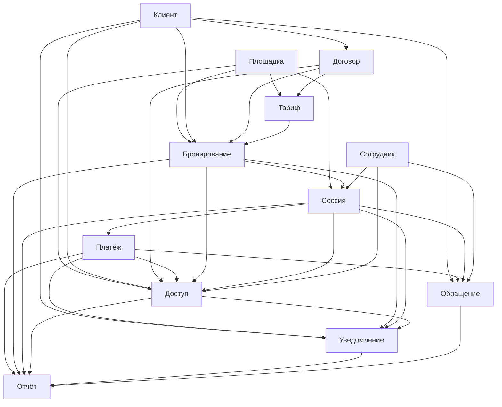

# DDD Bounded Contexts ИС парковки

## Оглавление

- [Назначение](#назначение)
- [Ключевые принципы декомпозиции](#ключевые-принципы-декомпозиции)
- [Правила согласования с ADR-003](#правила-согласования-с-adr-003)
- [Матрица bounded contexts](#матрица-bounded-contexts)
- [Контекстная карта](#контекстная-карта)
- [Bounded contexts](#bounded-contexts)
  - [1. Доступ](#1-доступ)
  - [2. Бронирование](#2-бронирование)
  - [3. Сессия](#3-сессия)
  - [4. Тариф](#4-тариф)
  - [5. Платёж](#5-платёж)
  - [6. Договор](#6-договор)
  - [7. Клиент](#7-клиент)
  - [8. Площадка](#8-площадка)
  - [9. Уведомление](#9-уведомление)
  - [10. Обращение](#10-обращение)
  - [11. Сотрудник](#11-сотрудник)
  - [12. Отчёт](#12-отчёт)
- [Что не является bounded context в текущей версии](#что-не-является-bounded-context-в-текущей-версии)
- [Границы владения терминами](#границы-владения-терминами)
- [Практические правила реализации](#практические-правила-реализации)
- [Связанные документы](#связанные-документы)

## Назначение

Документ уточняет модульную декомпозицию из [ADR-003](../adr/adr-003-modular-monolith.md) в терминах DDD (Domain-Driven Design) и фиксирует, какие **bounded contexts** (ограниченные контексты) считаются изолированными внутри целевого модульного монолита.

В актуальной версии проекта действует правило:

- на этапе MVP один доменный модуль из ADR-003 рассматривается как один bounded context;
- аутентификация и авторизация пока остаются **инфраструктурным слоем**, а не отдельным доменным модулем;
- `Адаптер ЛПР/СКУД` и `Агент доставки уведомлений` являются **изолированными адаптерами**, а не bounded contexts;
- сценарии, затрагивающие несколько контекстов, координируются через **Сервис приложения** (слой оркестрации use case, не принадлежащий ни одному доменному контексту).

## Ключевые принципы декомпозиции

С учётом [ADR-003](../adr/adr-003-modular-monolith.md) ядро домена в DDD-терминах составляют `Доступ`, `Бронирование`, `Сессия` и `Тариф` — они содержат уникальную бизнес-логику парковочной платформы. Контексты `Платёж`, `Уведомление`, `Отчёт` и внешние адаптеры уже сейчас нужно держать максимально изолированными: именно они первыми станут кандидатами на вынос или отдельное масштабирование.

Главная архитектурная мысль: в ИС парковки **доступ**, **план**, **факт**, **цена** и **деньги** не должны сливаться в одну модель. Каждый из этих концептов живёт в своём bounded context с явными границами и публичными интерфейсами.

## Правила согласования с ADR-003

Имена контекстов в DDD-документах — русскоязычные, что соответствует ubiquitous language проекта. ADR-003 использует прежние технические идентификаторы на английском; отображение: `Access` → `Доступ`, `Booking` → `Бронирование`, `Session` → `Сессия`, `Payment` → `Платёж`, `Tariff` → `Тариф`, `Notification` → `Уведомление`, `Contracts` → `Договор`, `Client` → `Клиент`, `Facility` → `Площадка`, `Support` → `Обращение`, `Employee` → `Сотрудник`, `Report` → `Отчёт`.

- Не вводим отдельный доменный bounded context `Идентификация` на этапе MVP: SSO, пароли, TOTP 2FA и проверка JWT относятся к инфраструктурному слою основного процесса.
- Учитываем инвариант ADR-002: **Парковочная сессия не существует без Бронирования**.
- Учитываем правило ADR-003: операция `создать Бронирование + открыть Сессия` должна выполняться в рамках **одной ACID-транзакции** (атомарность, согласованность, изолированность, долговечность).
- Учитываем правило ADR-003: `Доступ` принимает решение разрешить/запретить, обращаясь к `Бронирование`, `Договор`, `Сессия` и `Платёж` через задокументированные интерфейсы.
- Учитываем правило ADR-003: широкая оркестрация use case выполняется только в `Сервис приложения`; исключение — `Доступ` может обращаться к публичным интерфейсам `Бронирование`, `Договор`, `Сессия` и `Платёж` как к поставщикам статусов/команд для онлайн-решения на КПП.

## Матрица bounded contexts

Типы контекстов:
- **Core** — уникальная бизнес-логика платформы, разрабатывается «в доме», не заменяется готовым решением.
- **Supporting** — поддерживает Core, содержит специфичную, но не уникальную логику.
- **Generic** — стандартная задача, может быть заменена готовым компонентом или внешним сервисом.

Для краткой коммуникации и согласования границ используем следующий перечень bounded contexts:

1. `Бронирование` — Core
2. `Доступ` — Core
3. `Сессия` — Core
4. `Тариф` — Core
5. `Договор` — Supporting
6. `Клиент` (`Клиент` + `ТС` + `Организация`) — Supporting
7. `Сотрудник` — Supporting
8. `Платёж` (`Платёж` + `Чек`) — Supporting
9. `Площадка` (`Парковка` + `Сектор` + `ПМ` + `КПП`) — Supporting
10. `Обращение` — Supporting
11. `Уведомление` — Generic
12. `Отчёт` — Generic

В документации и коде предпочтительно использовать короткие предметные имена контекстов (`Бронирование`, `Доступ`, `Сессия`, `Тариф` и т. д.), а не управленческие заголовки вида «Управление ...».

Отдельное правило: `Аутентификация` и `Авторизация` не являются bounded contexts на этапе MVP и относятся к инфраструктурному слою.

| Контекст | Тип | Владеет | Не владеет |
| --- | --- | --- | --- |
| `Доступ` | Core | решение разрешить/запретить, чёрный список, ограничения доступа, аудит решения | бронирование, договор, платёж как мастер-модели |
| `Бронирование` | Core | бронирование, автоматическое бронирование, резервирование ресурса | факт пребывания ТС, платёж, чек |
| `Сессия` | Core | парковочная сессия, журнал въезда/выезда, корректировка факта | тариф, договор, чек |
| `Тариф` | Core | тарифы, правила применимости, расчёт стоимости и preview суммы к оплате | факт оплаты, решение доступа |
| `Платёж` | Supporting | платёж, возврат, задолженность, чек, интеграция с платёжным провайдером | правила тарифа, решение разрешить/запретить |
| `Договор` | Supporting | договоры, шаблоны договоров, долгосрочные условия, квоты | парковочная сессия, платёж |
| `Клиент` | Supporting | клиент, организация, ТС, согласия, профильные данные | логин, пароль, решение доступа |
| `Площадка` | Supporting | парковка, сектор, ПМ, КПП, конфигурация и статусы инфраструктуры | бронь, сессия, задолженность |
| `Уведомление` | Generic | уведомление, шаблон уведомления, очередь на доставку | профиль клиента как мастер-данные, бизнес-решение по доступу |
| `Обращение` | Supporting | обращение, жизненный цикл тикета, история переписки | договор, платёж, бронирование как мастер-модели |
| `Сотрудник` | Supporting | сотрудник, роль сотрудника, RBAC и служебный профиль | клиентские учётные данные, клиентские профили |
| `Отчёт` | Generic | read-модели, отчёты, аналитические агрегаты | транзакционное изменение мастер-данных |

> `Уведомление` и `Отчёт` отнесены к типу **Generic**: их задачи (доставка сообщений и аналитика) стандартны для отрасли и могут быть заменены готовым решением или внешним сервисом без потери конкурентного преимущества платформы.

## Контекстная карта

Стрелка `A --> B` означает, что контекст `B` потребляет данные, статус или публичный интерфейс контекста `A` (A — upstream, B — downstream).



Стрелки, добавленные по результатам ревью (отсутствовали в исходной версии):

| Рёбро | Обоснование |
| --- | --- |
| `Клиент --> Доступ` | Доступ разрешает ГРЗ → vehicleId → clientId через проекцию из Клиент |
| `Площадка --> Доступ` | Доступ использует конфигурацию КПП из Площадка при принятии решения |
| `Сессия --> Доступ` | Доступ использует статус активной сессии при проверках на выезд |
| `Бронирование --> Доступ` | Доступ использует Бронирование и для проверки активной брони, и для запроса авто-брони через публичный интерфейс |
| `Бронирование --> Уведомление` | Бронирование порождает уведомления: подтверждение брони, напоминание о въезде, отмена |
| `Договор --> Тариф` | Тариф получает договорные ставки и условия из Договор при расчёте для ЮЛ |
| `Доступ --> Уведомление` | Доступ порождает уведомления об отказе в доступе и предупреждения об ограничениях |
| `Доступ --> Отчёт` | Отчёт получает аудитные события решений разрешить/запретить из Доступ |
| `Платёж --> Уведомление` | Платёж публикует событие ОплатаПроведена → Уведомление отправляет чек клиенту и уведомление о возврате |

> `Тариф → Платёж`: ребро **намеренно отсутствует**. Расчётная сумма передаётся в `Платёж` как числовое Value Object через `Сервис приложения`, а не через прямой вызов интерфейса `Тариф` из модуля `Платёж`. Реализация прямой зависимости `Платёж → Тариф` нарушает ADR-003 инвариант 2 (доменные модули общаются только через Сервис приложения для сквозных сценариев).

## Bounded contexts

### 1. `Доступ`

**Назначение:** принять решение о допуске ТС на въезд/выезд через КПП (контрольно-пропускной пункт).

**Что владеет:**

- `Решение доступа` (разрешить/запретить);
- `Основание решения`;
- `Чёрный список`;
- `Ограничение доступа`;
- `Ручное решение охранника`;
- `Аудит решения`.

**Ключевые правила:**

- Решение разрешить/запретить принимается **онлайн платформой**, а не СКУД (системой контроля и управления доступом), согласно [ADR-001](../adr/adr-001-online-access-rights-evaluation.md).
- На этапе MVP `Доступ` остаётся **одним bounded context**, но внутри делится на два policy-сервиса: `ПолитикаДопускаНаВъезд` и `ПолитикаДопускаНаВыезд`.
- `Доступ` не владеет бронированиями, договорами, сессиями и платежами, а только запрашивает их статусы и команды через публичные интерфейсы соответствующих контекстов (`Бронирование`, `Договор`, `Сессия`, `Платёж`).
- `Доступ` хранит локальную проекцию `ГРЗ → vehicleId → clientId` для обеспечения низкой задержки на критическом пути КПП; мастером ГРЗ является `Клиент`. Правила инвалидации проекции фиксируются отдельно.
- Чёрный список ведётся по `vehicleId` (блокировка конкретного ТС); для блокировки всех ТС клиента используется clientId. Конкретный ключ блокировки фиксируется в рамках детального проектирования.
- При оценке допуска на **въезд**, если активной брони нет, но въезд допустим по иным основаниям (договор, ручное разрешение охранника, разрешённое авто-бронирование), `Доступ` через публичный интерфейс `Бронирование` запрашивает авто-бронирование и получает `бронированиеИд` для продолжения сценария. `Бронирование` остаётся владельцем правил создания брони, а `Сервис приложения` — владельцем use case и транзакционной рамки, в которой фиксируются `Бронирование` и `Сессия`.
- При оценке допуска на **выезд** `ПолитикаДопускаНаВыезд` проверяет наличие активной `Сессия`, необходимость оплаты и факт успешного расчёта/проведения платежа перед открытием шлагбаума.

### 2. `Бронирование`

**Назначение:** планирование и резервирование парковочного ресурса.

**Что владеет:**

- `Бронирование`;
- `Автоматическое бронирование`;
- правила резервирования ресурса;
- ссылки на `ТС`, `Сектор`, `ПМ`, `Договор` в рамках модели бронирования.

**Ключевые правила:**

- `Бронирование` отвечает за **план использования** и право на ресурс, но не за факт пребывания.
- Бронирование является обязательной основой для `Сессия`, согласно [ADR-002](../adr/adr-002-booking-vs-session.md).
- Автоматическая бронь при въезде без предварительного бронирования создаётся `Бронирование` по запросу `Доступ` через публичный интерфейс. `Бронирование` владеет правилами создания авто-брони, а `Сервис приложения` обеспечивает общую ACID-транзакцию вместе с `Сессия.открыть()`.
- Резервирование конкретного ПМ выполняется с оптимистичной блокировкой версии агрегата `Бронирование` (или `SELECT FOR UPDATE SKIP LOCKED` на уровне ПМ). Конкретный механизм фиксируется до начала реализации.

### 3. `Сессия`

**Назначение:** фиксация фактического использования парковки.

**Что владеет:**

- `Парковочная сессия`;
- факты начала и завершения сессии;
- журнал въезда/выезда;
- ручные корректировки факта со стороны охранника.

**Ключевые правила:**

- `Сессия` хранит **факт нахождения ТС**, а не право на использование.
- `Сессия` всегда связана с `Бронирование`.
- Открытие `Сессия` и создание `Бронирование` выполняются в **одной ACID-транзакции** через `Сервис приложения`, а не через eventual consistency между контекстами.
- `Сессия.завершить` не инициирует платёж. Платёж создаётся раньше: либо по команде клиента из ЛК, либо при подъезде к выездному шлагбауму, когда фиксируется `фиксированная сумма`.
- Завершение `Сессия` и связанного `Бронирование` выполняется только после успешной проверки `ПолитикаДопускаНаВыезд` и, если требуется оплата, после подтверждённого финансового результата в `Платёж`.
- При **ручном разрешении охранника** Сервис приложения создаёт `Бронирование` с типом `РУЧНОЙ_ДОПУСК` и открывает `Сессия` в одной транзакции — инвариант ADR-002 соблюдается и в этом сценарии.
- Для операционного экрана охранника `Сессия` предоставляет **operational read-view** активных сессий напрямую, без посредничества `Отчёт`, чтобы исключить зависимость от eventually consistent агрегатов в критическом интерфейсе КПП.

### 4. `Тариф`

**Назначение:** определить стоимость использования парковки.

**Что владеет:**

- `Тариф`;
- правила применимости тарифа;
- доменные сервисы расчёта стоимости.

**Ключевые правила:**

- `Тариф` отвечает за логику расчёта, но не за проведение платежа.
- Стоимость зависит от зоны, типа ТС, льгот, длительности и сценария использования.
- `Тариф` не владеет финансовым состоянием и не выпускает чеки.
- До создания платежа `Тариф` вычисляет **текущую сумму к оплате** в реальном времени по параметрам `Бронирование`/`Сессия` и применимому тарифу. Эта сумма является preview и может отображаться в ЛК клиента или в операторском интерфейсе на выезде.
- Данные о льготах (`КатегорияТарифаКлиента`) и договорных ставках передаются в `Тариф` как **входные параметры** расчёта (Value Object), а не запрашиваются через прямые зависимости от `Клиент` или `Договор`. Это изолирует `Тариф` от изменений в этих контекстах.

### 5. `Платёж`

**Назначение:** провести оплату и зафиксировать финансовый результат.

**Что владеет:**

- `Платёж`;
- `Возврат`;
- `Задолженность`;
- `Чек`;
- `Счёт (invoice) для ЮЛ` — периодический финансовый документ по договору, отличный от разового чека;
- интеграция с платёжной системой и фискализацией.

**Ключевые правила:**

- `Платёж` не принимает решение разрешить/запретить, а только предоставляет финансовый статус другим контекстам.
- Чек и фискализация следуют за успешным финансовым сценарием.
- Правила расчёта суммы приходят из `Тариф`, а не определяются внутри `Платёж`.
- `Платёж` владеет **зафиксированной суммой платежа** (`фиксированная сумма`). Она создаётся в момент нажатия клиентом кнопки оплаты в ЛК или в момент подъезда к выездному шлагбауму, если оплата ещё не была инициирована.
- Счёт (invoice) для ЮЛ создаётся `Платёж` по команде из `Договор` (периодически или по завершении расчётного периода); `Договор` определяет период и условия, `Платёж` — финансовый документ и фискализацию.
- Инициация возврата принимается из `Обращение` через публичный интерфейс `Платёж`; `Обращение` не владеет логикой возврата.
- `Платёж` владеет ACL-адаптерами для трёх внешних систем: **платёжный провайдер** (онлайн-эквайринг), **платёжные терминалы объекта** (оплата на КПП/выезде) и **ОФД** (фискализация чеков). Все три адаптера транслируют ответы внешних протоколов в доменные события (`ОплатаПроведена`, `ЧекЗарегистрирован`) и изолируют остальные контексты от деталей внешних API.

### 6. `Договор`

**Назначение:** вести долгосрочные отношения с клиентом.

**Что владеет:**

- `Договор`;
- `Шаблон договора`;
- долгосрочные условия, квоты, абонементные правила.

**Ключевые правила:**

- Договор не заменяет ни `Бронирование`, ни `Сессия`.
- Делегация мест и квот происходит через связанные бронирования, а не через прямое управление парковочными сессиями.
- `Договор` поставляет условия в `Доступ` и `Бронирование`, но не владеет фактом допуска через КПП.
- Специальные договорные ставки передаются в `Тариф` через публичный интерфейс при расчёте стоимости сессии ЮЛ; `Договор` инициирует этот вызов через `Сервис приложения`. Ребро `Договор → Тариф` в контекстной карте отражает эту логическую зависимость, но реализуется через медиацию `Сервис приложения` — прямой межмодульный вызов `Договор → Тариф` запрещён.
- Квоты мест «потребляются» при создании `Бронирование`; остаток квот проверяется `Договор` до подтверждения бронирования.
- `Договор` владеет ACL-адаптером для интеграции с **ЭДО** (электронный документооборот): подписание и хранение договорных документов с ЮЛ выполняются через ACL, транслирующий внешний протокол ЭДО в доменные команды контекста. Взаимодействие инициируется `Сервис приложения` по событиям жизненного цикла договора.

### 7. `Клиент`

**Назначение:** хранить мастер-данные клиента.

**Что владеет:**

- `Клиент`;
- `Организация`;
- `ТС` (транспортное средство) с атрибутом `ГРЗ` (государственный регистрационный знак);
- `Паспортные данные`;
- `Льготный документ`;
- `Согласие на ПДн` (персональные данные);
- профильные настройки клиента.

**Ключевые правила:**

- `Клиент` не владеет аутентификацией пользователя.
- Профиль клиента не должен содержать логику принятия решения о допуске.
- Идентификаторы клиентов и ТС используются в других контекстах как ссылки или immutable snapshots; `Сессия` и `Доступ` хранят ГРЗ как строковый snapshot на момент события, а не как FK на ТС.
- `Паспортные данные` и `Согласие на ПДн` хранятся в режиме, соответствующем требованиям 152-ФЗ (отдельная схема БД с ограниченными правами доступа).

### 8. `Площадка`

**Назначение:** описывать физическую и логическую структуру парковки.

**Что владеет:**

- `Парковка`;
- `Сектор`;
- `ПМ` (парковочное место);
- `КПП` — конфигурация полос, направление движения, технический статус оборудования;
- конфигурация и эксплуатационные статусы инфраструктуры;
- допустимые типы зон и физические ограничения ресурса.

**Ключевые правила:**

- `Площадка` владеет инфраструктурой, но не её временным использованием.
- Признаки `зарезервировано` и `занято` рассматриваются как **операционные проекции**, а не как мастер-истина контекста. Источниками истины являются: `Бронирование` (план — зарезервировано), `Сессия` (факт — занято), `Площадка` (конфигурация — недоступно по техническим причинам).
- **Агрегированный статус доступности ПМ** (карта парковки для клиента) формируется как операционная read-модель в `Площадка`, обновляемая через доменные события от `Бронирование` и `Сессия` (`БронированиеСоздано`, `СессияОткрыта`, `СессияЗавершена`). Площадка не является источником истины об активных бронях или сессиях, но агрегирует их проекции для быстрого отображения клиенту.
- `Площадка` не выполняет ни тарификацию, ни доступ, ни бронирование.

### 9. `Уведомление`

**Назначение:** генерировать и ставить уведомления в доставку.

**Что владеет:**

- `Уведомление`;
- `Шаблон уведомления`;
- очередь/задача на доставку;
- история доставки.

**Ключевые правила:**

- Контекст не решает, когда бизнесу нужно отправить сообщение; он исполняет команду или доменное событие.
- Отправка сообщений вынесена в отдельный `Агент доставки уведомлений`, но модель уведомлений остаётся в `Уведомление`.
- Клиентские настройки уведомлений приходят из `Клиент`.

### 10. `Обращение`

**Назначение:** обрабатывать обращения и спорные случаи.

**Что владеет:**

- `Обращение`;
- статус обработки;
- история переписки;
- привязка кейса к связанному объекту.

**Ключевые правила:**

- `Обращение` не владеет жизненным циклом платежа, договора, бронирования или сессии.
- Кейс может ссылаться на объект из другого контекста, но не должен менять его внутреннее состояние в обход публичного API.
- Инициация возврата выполняется через публичный интерфейс `Платёж`; `Обращение` запрашивает возврат, но не владеет его логикой.
- Ответы клиенту и внутренняя история разбора остаются в `Обращение`.

### 11. `Сотрудник`

**Назначение:** управлять сотрудниками и служебными правами.

**Что владеет:**

- `Сотрудник`;
- роль сотрудника;
- RBAC (Role-Based Access Control — управление доступом на основе ролей) для внутренних интерфейсов;
- служебный профиль оператора, охранника, управляющего, владельца.

**Ключевые правила:**

- `Сотрудник` не владеет клиентскими профилями.
- `Сотрудник` не заменяет инфраструктурный слой аутентификации, а использует его.
- В других контекстах сотрудник фигурирует как actor reference (`сотрудникИд` и служебный snapshot).

### 12. `Отчёт`

**Назначение:** собирать аналитические представления и отчёты.

**Что владеет:**

- read-модели (CQRS read side);
- агрегаты загрузки парковки;
- финансовые и операционные отчёты;
- аналитические витрины.

**Ключевые правила:**

- `Отчёт` не является источником истины для транзакционных данных.
- Данные поступают через проекции событий или ETL-подобные механизмы; источники — доменные события от `Бронирование`, `Сессия`, `Платёж`, `Доступ` и др.
- Тяжёлые аналитические запросы не должны нагружать транзакционный путь (OLTP-ядро). Митигация: read replica или materialized views (ADR-003, Trade-offs).

## Что не является bounded context в текущей версии

### Аутентификация и авторизация

Согласно ADR-003, это **сквозная инфраструктурная ответственность** основного процесса:

- OAuth2/OIDC для клиентов ФЛ;
- логин/пароль для ЮЛ;
- TOTP 2FA для сотрудников;
- проверка JWT и инфраструктурные политики доступа.

`Клиент` и `Сотрудник` остаются доменными контекстами, но не владеют credential-моделью.

### `Адаптер ЛПР/СКУД`

Изолированный адаптер для UDP/LPR и взаимодействия со СКУД. Не является bounded context, поскольку не владеет самостоятельной предметной моделью парковки, а только переводит внешний транспорт в интерфейсы основного процесса. Паттерн интеграции: **Anti-Corruption Layer (ACL)** — адаптер транслирует чужой UDP-протокол в доменный запрос `ЗапросДоступа`.

### `Агент доставки уведомлений`

Изолированный процесс доставки уведомлений. Модель уведомлений принадлежит `Уведомление`; Агент — только механизм доставки через внешние шлюзы.

### Платёжные терминалы объекта

Физические терминалы для оплаты на КПП/выезде (см. C4 L2). Не являются bounded context: у них нет собственной доменной модели платформы. ACL-адаптер для взаимодействия с терминалами принадлежит контексту **`Платёж`** — терминал инициирует оплату через тот же публичный интерфейс `Платёж`, что и онлайн-провайдер.

### Информационные табло и дисплеи

Экраны въезда/выезда и навигации (см. C4 L2). Не являются bounded context. ACL-адаптер для передачи данных на дисплеи принадлежит контексту **`Площадка`**: табло отражают операционный статус мест и направлений — проекцию из `Площадка`. Доменные события о заполненности (`БронированиеСоздано`, `СессияОткрыта`, `СессияЗавершена`) поступают в `Площадка`, которая агрегирует read-модель и публикует обновлённые данные для табло.

### `Сервис приложения`

Слой оркестрации, в котором разрешены сквозные сценарии. Зафиксированные flows:

```
// Въезд без предварительной брони:
Адаптер ЛПР/СКУД → Сервис приложения
  → [ACID-транзакция]
      Доступ.проверитьВъезд()
      → Бронирование.обеспечитьАвтоБронированиеЕслиНужно()
      → Сессия.открыть(бронированиеИд)
  → Адаптер ЛПР/СКУД → СКУД (открыть шлагбаум)

// Ручной допуск охранника:
Интерфейс сотрудника → Сервис приложения
  → Доступ.ручноеРазрешение(сотрудникИд)
  → Бронирование.создатьСРучнымДопуском(тип=РУЧНОЙ_ДОПУСК, сотрудникИд) + Сессия.открыть()  [ACID-транзакция]

// Оплата из ЛК клиента:
Интерфейс клиента → Сервис приложения
  → Тариф.рассчитатьТекущуюСумму()  [preview]
  → Платёж.создать(фиксированнаяСумма, источник=ЛК_КЛИЕНТА)
  → Платёж.провести() → Уведомление.добавитьВОчередь(чек)

// Выезд через КПП:
Адаптер ЛПР/СКУД → Сервис приложения
  → Тариф.рассчитатьТекущуюСумму()  [если нет уже успешной оплаты]
  → Платёж.создать(фиксированнаяСумма, источник=ВЫЕЗДНЫЕ_ВОРОТА) / Платёж.провести()
  → Доступ.проверитьВыезд()
  → Бронирование.завершить() + Сессия.завершить()  [ACID-транзакция]
  → Уведомление.добавитьВОчередь(чек)

// Инициация возврата через поддержку:
Обращение.запроситьВозврат() → Платёж.инициироватьВозврат() → Уведомление.отправить()
```

## Границы владения терминами

| Термин | Контекст-владелец | Комментарий |
| --- | --- | --- |
| `Клиент`, `Организация` | `Клиент` | В других контекстах — только ссылки (клиентИд) и snapshots |
| `ТС` (транспортное средство) | `Клиент` | ГРЗ — атрибут ТС; в `Сессия` и `Доступ` хранится как immutable snapshot |
| `ГРЗ` как идентификатор | `Клиент` (master), `Доступ` (snapshot/projection) | `Доступ` держит локальную проекцию `ГРЗ → vehicleId → clientId` для критического пути; master — `Клиент` |
| `Паспортные данные` | `Клиент` | Чувствительные ПДн; особый режим хранения по 152-ФЗ |
| `Льготный документ` | `Клиент` | Документ, подтверждающий льготную категорию; передаётся в `Тариф` как входной параметр |
| `Согласие на ПДн` | `Клиент` | Фиксирует согласие субъекта ПДн на обработку данных |
| `Сотрудник`, `Роль сотрудника` | `Сотрудник` | Используются для аудита и внутренних прав; в других контекстах — сотрудникИд |
| `Парковка`, `Сектор`, `ПМ` | `Площадка` | Мастер-данные инфраструктуры |
| `КПП` | `Площадка` | Физическая инфраструктура: конфигурация полос, направление, статус оборудования |
| `Договор`, `Шаблон договора` | `Договор` | Договор не подменяет бронирование и сессию |
| `Бронирование` | `Бронирование` | План и право использования парковочного ресурса |
| `Парковочная сессия` | `Сессия` | Факт использования парковки |
| `Тариф` | `Тариф` | Правила расчёта стоимости; льготы и договорные ставки — входные параметры |
| `Сумма к оплате (preview)` | `Тариф` | Динамический расчёт в реальном времени до момента инициации платежа |
| `Зафиксированная сумма платежа` | `Платёж` | Неизменяемая сумма конкретного платежа после нажатия «Оплатить» или подъезда к выездному шлагбауму |
| `Платёж`, `Задолженность`, `Чек`, `Счёт (invoice) ЮЛ` | `Платёж` | Финансовая модель |
| `Решение доступа`, разрешить/запретить, `Чёрный список` | `Доступ` | Производная модель допуска; аудит решений |
| `Ручное решение охранника` | `Доступ` | Ручной допуск охранника с сохранением сотрудникИд и основания |
| `Уведомление`, `Шаблон уведомления` | `Уведомление` | Коммуникационная модель |
| `Обращение` | `Обращение` | Кейс и история разбора |
| `Отчёт`, `Агрегат`, `Витрина` | `Отчёт` | Аналитические read-модели |

## Практические правила реализации

### Структура и изоляция

- Один bounded context = один модуль верхнего уровня в основном процессе.
- Схемная изоляция per module в БД: каждый контекст работает в своей PostgreSQL-схеме с ограниченными правами доступа приложения (по ADR-003, инвариант 5).

### Межмодульное взаимодействие

- Прямой доступ к таблицам, репозиториям и внутренним объектам другого контекста запрещён.
- Межконтекстное взаимодействие выполняется через публичные интерфейсы модулей.
- Сквозные сценарии координируются только через `Сервис приложения`.
- Для `Отчёт` и `Уведомление` предпочтительны событийные интеграции и read-модели (published language через доменные события).

### Внешние системы

- Для внешних систем (СКУД/LPR, платёжный провайдер, ОФД, IdP, ЭДО, SMS/e-mail) применяются **Anti-Corruption Layers (ACL)** — адаптеры, транслирующие чужую модель в доменный язык платформы.
- Внешние платёжные операции выполняются **синхронно** в сценариях оплаты из ЛК и выезда через КПП; Outbox используется для вторичных реакций (`Уведомление`, `Отчёт`), а не для создания самого платежа.

## Связанные документы

- [ADR-001](../adr/adr-001-online-access-rights-evaluation.md) — оценка прав доступа онлайн на каждый запрос КПП
- [ADR-002](../adr/adr-002-booking-vs-session.md) — Бронирование vs Парковочная сессия как мастер-сущности
- [ADR-003](../adr/adr-003-modular-monolith.md) — выбор архитектурного стиля: модульный монолит
- [Контекстная диаграмма](../../artifacts/context-diagram.md)
- [Концептуальная модель](../../artifacts/conceptual-model-with-attributes.md)
- [Глоссарий проекта](../../artifacts/project-glossary.md)
