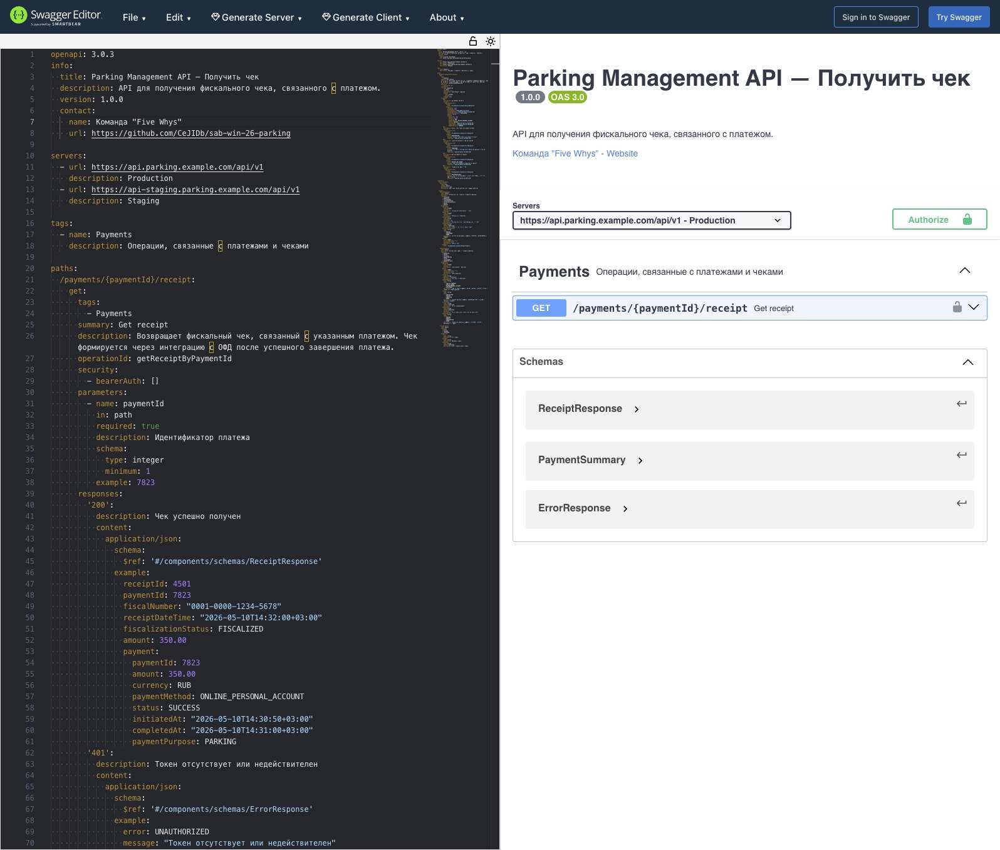
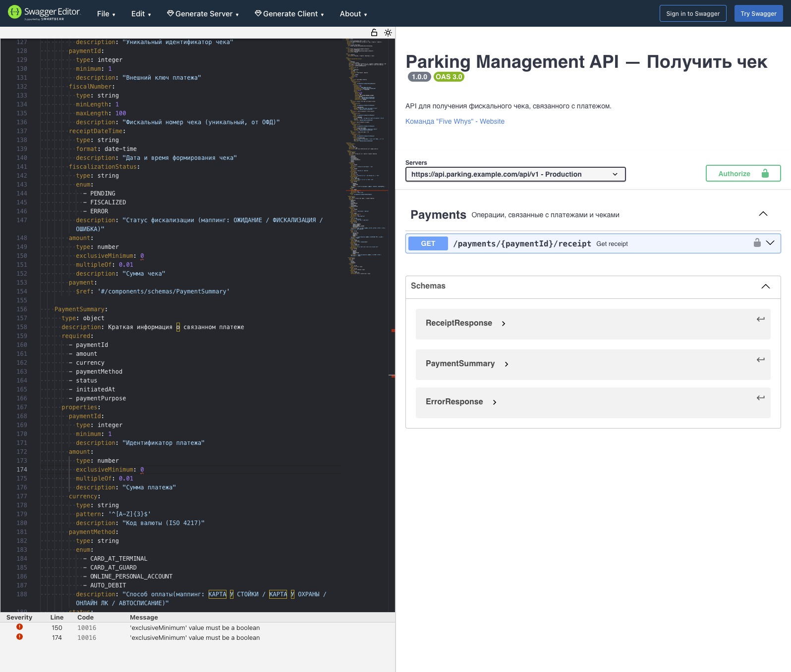

# OpenAPI-контракт REST-метода — UC-10.6 Получение платежного чека

Документ фиксирует формальный контракт REST-метода `GET /payments/{paymentId}/receipt` в сценарии получения платежного чека по завершенному платежу (UC-10.6).

Контракт описан в нотации OpenAPI 3.0.3 и задает: путь и параметры запроса, схему авторизации, успешный ответ `200`, ветки ошибок (`401`, `403`, `404`, `502`) и общие схемы данных. Используется как опора для реализации клиентской части (ЛК / PWA), серверной части сервиса фискализации и автоматических контрактных проверок.

## Оглавление

- [Назначение](#назначение)
- [Контекст применения](#контекст-применения)
- [OpenAPI 3.0.3 — YAML](#openapi-303--yaml)
- [Параметры и ответы](#параметры-и-ответы)
- [Превью в Swagger Editor](#превью-в-swagger-editor)
- [Связь с интеграционными требованиями](#связь-с-интеграционными-требованиями)
- [Связанные документы](#связанные-документы)

## Назначение

Документ нужен, чтобы:

- задать единый REST-контракт метода `GET /payments/{paymentId}/receipt` для процесса UC-10.6;
- зафиксировать схему авторизации (Bearer JWT) и набор кодов ответа с типовыми примерами полезной нагрузки;
- служить опорой для генерации клиентов, моков и контрактных тестов;
- собрать в одном артефакте ссылки на каноничный пример ответа и JSON Schema, которые уже описаны отдельными артефактами.

## Контекст применения

Метод вызывается клиентским приложением (ЛК / PWA) после завершения платежа и используется сервисом фискализации для возврата данных платежного чека с краткой выжимкой по связанному платежу.

- Базовые URL: `https://api.parking.example.com/api/v1` (production), `https://api-staging.parking.example.com/api/v1` (staging).
- Авторизация: HTTP Bearer JWT (`bearerAuth`), токен получается на этапе аутентификации.
- Тег OpenAPI: `Payments`.
- Часовой пояс ответа: `+03:00` (Europe/Moscow).

Семантика полей и инварианты повторно не дублируются — см. [JSON-пример ответа — UC-10.6](payload-uc-10-6-receipt.md) и [JSON-схему ответа — UC-10.6](schema-uc-10-6-receipt.md). Этот документ описывает HTTP-обертку и набор кодов ответа.

## OpenAPI 3.0.3 — YAML

```yaml
openapi: 3.0.3
info:
  title: Parking Management API — Получить чек
  description: API для получения фискального чека, связанного с платежом.
  version: 1.0.0
  contact:
    name: Команда "Five Whys"
    url: https://github.com/CeJIDb/sab-win-26-parking

servers:
  - url: https://api.parking.example.com/api/v1
    description: Production
  - url: https://api-staging.parking.example.com/api/v1
    description: Staging

tags:
  - name: Payments
    description: Операции, связанные с платежами и чеками

paths:
  /payments/{paymentId}/receipt:
    get:
      tags:
        - Payments
      summary: Get receipt
      description: Возвращает фискальный чек, связанный с указанным платежом. Чек формируется через интеграцию с ОФД после успешного завершения платежа.
      operationId: getReceiptByPaymentId
      security:
        - bearerAuth: []
      parameters:
        - name: paymentId
          in: path
          required: true
          description: Идентификатор платежа
          schema:
            type: integer
            minimum: 1
          example: 7823
      responses:
        "200":
          description: Чек успешно получен
          content:
            application/json:
              schema:
                $ref: "#/components/schemas/ReceiptResponse"
              example:
                receiptId: 4501
                paymentId: 7823
                fiscalNumber: "0001-0000-1234-5678"
                receiptDateTime: "2026-05-10T14:32:00+03:00"
                fiscalizationStatus: FISCALIZED
                amount: 350.00
                payment:
                  paymentId: 7823
                  amount: 350.00
                  currency: RUB
                  paymentMethod: ONLINE_PERSONAL_ACCOUNT
                  status: SUCCESS
                  initiatedAt: "2026-05-10T14:30:50+03:00"
                  completedAt: "2026-05-10T14:31:00+03:00"
                  paymentPurpose: PARKING
        "401":
          description: Токен отсутствует или недействителен
          content:
            application/json:
              schema:
                $ref: "#/components/schemas/ErrorResponse"
              example:
                error: UNAUTHORIZED
                message: "Токен отсутствует или недействителен"
                timestamp: "2026-05-10T14:35:00+03:00"
        "403":
          description: Платеж принадлежит другому клиенту
          content:
            application/json:
              schema:
                $ref: "#/components/schemas/ErrorResponse"
              example:
                error: FORBIDDEN
                message: "Доступ к чеку запрещен: платеж принадлежит другому клиенту"
                timestamp: "2026-05-10T14:35:00+03:00"
        "404":
          description: Чек или платеж не найден
          content:
            application/json:
              schema:
                $ref: "#/components/schemas/ErrorResponse"
              example:
                error: RECEIPT_NOT_FOUND
                message: "Чек для указанного платежа не найден"
                timestamp: "2026-05-10T14:35:00+03:00"
        "502":
          description: Ошибка соединения с ОФД
          content:
            application/json:
              schema:
                $ref: "#/components/schemas/ErrorResponse"
              example:
                error: OFD_UNAVAILABLE
                message: "Сервис фискализации временно недоступен. Повторите запрос позже."
                timestamp: "2026-05-10T14:35:00+03:00"

components:
  securitySchemes:
    bearerAuth:
      type: http
      scheme: bearer
      bearerFormat: JWT
      description: JWT-токен, полученный при авторизации

  schemas:
    ReceiptResponse:
      type: object
      description: Фискальный чек с данными связанного платежа
      required:
        - receiptId
        - paymentId
        - fiscalNumber
        - receiptDateTime
        - fiscalizationStatus
        - amount
        - payment
      properties:
        receiptId:
          type: integer
          minimum: 1
          description: "Уникальный идентификатор чека"
        paymentId:
          type: integer
          minimum: 1
          description: "Внешний ключ платежа"
        fiscalNumber:
          type: string
          minLength: 1
          maxLength: 100
          description: "Фискальный номер чека (уникальный, от ОФД)"
        receiptDateTime:
          type: string
          format: date-time
          description: "Дата и время формирования чека"
        fiscalizationStatus:
          type: string
          enum:
            - PENDING
            - FISCALIZED
            - ERROR
          description: "Статус фискализации (маппинг: ОЖИДАНИЕ / ФИСКАЛИЗАЦИЯ / ОШИБКА)"
        amount:
          type: number
          exclusiveMinimum: 0
          multipleOf: 0.01
          description: "Сумма чека"
        payment:
          $ref: "#/components/schemas/PaymentSummary"

    PaymentSummary:
      type: object
      description: Краткая информация о связанном платеже
      required:
        - paymentId
        - amount
        - currency
        - paymentMethod
        - status
        - initiatedAt
        - paymentPurpose
      properties:
        paymentId:
          type: integer
          minimum: 1
          description: "Идентификатор платежа"
        amount:
          type: number
          exclusiveMinimum: 0
          multipleOf: 0.01
          description: "Сумма платежа"
        currency:
          type: string
          pattern: "^[A-Z]{3}$"
          description: "Код валюты (ISO 4217)"
        paymentMethod:
          type: string
          enum:
            - CARD_AT_TERMINAL
            - CARD_AT_GUARD
            - ONLINE_PERSONAL_ACCOUNT
            - AUTO_DEBIT
          description: "Способ оплаты (маппинг: КАРТА У СТОЙКИ / КАРТА У ОХРАНЫ / ОНЛАЙН ЛК / АВТОСПИСАНИЕ)"
        status:
          type: string
          enum:
            - INITIALIZED
            - SUCCESS
            - CANCELLED
            - ERROR
          description: "Статус платежа (маппинг: ИНИЦИАЛИЗИРОВАН / УСПЕШЕН / ОТМЕНЕН / ОШИБКА)"
        initiatedAt:
          type: string
          format: date-time
          description: "Время инициализации"
        completedAt:
          type: string
          format: date-time
          nullable: true
          description: "Время завершения (null если не завершен)"
        paymentPurpose:
          type: string
          enum:
            - PARKING
            - PENALTY
            - SUBSCRIPTION
            - OTHER
          description: "Назначение платежа (маппинг: ПАРКОВКА / ШТРАФ / АБОНЕМЕНТ / ПРОЧЕЕ)"

    ErrorResponse:
      type: object
      required:
        - error
        - message
        - timestamp
      properties:
        error:
          type: string
          description: Код ошибки
        message:
          type: string
          description: Описание ошибки
        timestamp:
          type: string
          format: date-time
          description: Время возникновения ошибки
```

## Параметры и ответы

Параметры запроса:

| Параметр                      | Где    | Обязателен | Тип     | Ограничения | Назначение            |
| ----------------------------- | ------ | ---------- | ------- | ----------- | --------------------- |
| `paymentId`                   | path   | да         | integer | `>= 1`      | Идентификатор платежа |
| `Authorization: Bearer <JWT>` | header | да         | string  | JWT         | Авторизация по токену |

Коды ответа:

| Код   | Когда возвращается                                       | Тело ответа       | Код ошибки в теле   |
| ----- | -------------------------------------------------------- | ----------------- | ------------------- |
| `200` | Чек найден и возвращен                                   | `ReceiptResponse` | —                   |
| `401` | Токен отсутствует или недействителен                     | `ErrorResponse`   | `UNAUTHORIZED`      |
| `403` | Платеж принадлежит другому клиенту                       | `ErrorResponse`   | `FORBIDDEN`         |
| `404` | Чек или платеж не найден                                 | `ErrorResponse`   | `RECEIPT_NOT_FOUND` |
| `502` | Ошибка соединения с ОФД (сервис фискализации недоступен) | `ErrorResponse`   | `OFD_UNAVAILABLE`   |

## Превью в Swagger Editor

Контракт проверен в Swagger Editor — оба сценария (валидный успешный ответ и контракт ошибки) рендерятся без замечаний.

Успешный сценарий (`200 OK`):



Сценарий ошибки (`502 OFD_UNAVAILABLE`):



## Связь с интеграционными требованиями

| Требование | Что закрывает контракт                                                                                                                                                      |
| ---------- | --------------------------------------------------------------------------------------------------------------------------------------------------------------------------- |
| `INT-006`  | Возвращает `fiscalNumber`, `fiscalizationStatus`, `receiptDateTime` — атрибуты результата фискализации, полученные модулем Платеж от ОФД                                    |
| `INT-007`  | Состав ответа покрывает минимально необходимый набор данных чека для представления клиенту: `fiscalNumber`, `receiptDateTime`, `fiscalizationStatus`, `amount`, `paymentId` |

## Связанные документы

- [JSON-пример ответа — UC-10.6](payload-uc-10-6-receipt.md) — каноничный пример полезной нагрузки `200 OK`.
- [JSON-схема ответа — UC-10.6](schema-uc-10-6-receipt.md) — формальная JSON Schema успешного ответа.
- [Регламент взаимодействия ИС](is-interaction-regulation.md) — направления обмена, в которых участвует данный контракт (Блок 2, фискализация чека).
- [UML Sequence — UC-10.2 Онлайн-оплата краткосрочной аренды](sequence-uc-10-2-pay-online-short-term-rental.md) — последовательность вызовов, в которой создается чек, возвращаемый этим методом.
- [Маппинг обмена данными с ЮKassa](yookassa-data-mapping.md) — соответствие полей ответа внутренней модели `payment.*`.
- [Интеграционные требования](../../specs/integration/integration-requirements.md) — требования класса `INT-*`, закрываемые контрактом (`INT-006`, `INT-007`).
- [Реестр use case](../../artifacts/use-case/use-case-registry.md) — каноничная позиция UC-10.6 «Получить чек».
- [Индекс интеграционной архитектуры](readme.md) — общий каталог раздела.
