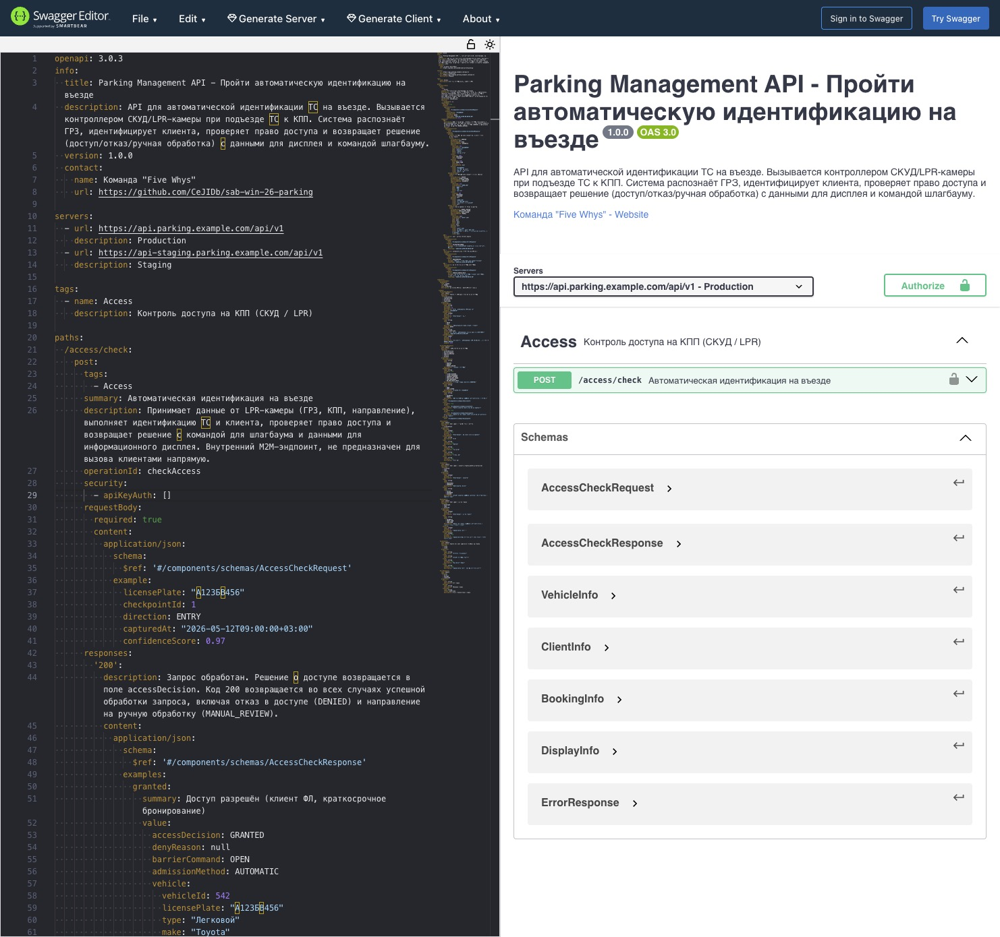
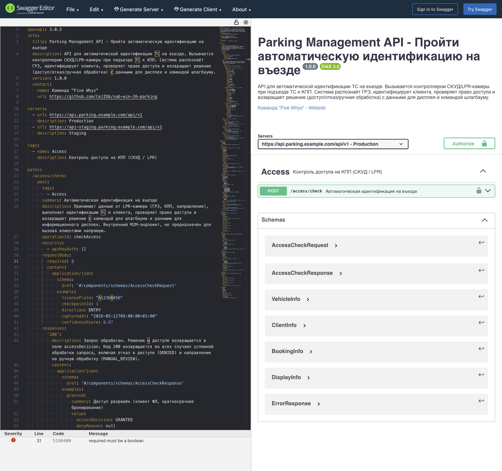

# OpenAPI-контракт REST-метода — UC-12.1 Автоматическая идентификация на въезде

Документ фиксирует формальный контракт REST-метода `POST /access/check` в сценарии автоматической идентификации ТС на въезде (UC-12.1).

Контракт описан в нотации OpenAPI 3.0.3 и задает: путь и параметры запроса, схему авторизации, успешный ответ `200` (со встроенным решением о доступе `GRANTED` / `DENIED` / `MANUAL_REVIEW`), ветки ошибок (`400`, `401`, `503`) и общие схемы данных. Используется как опора для реализации СКУД/LPR-контроллера, серверной части сервиса контроля доступа и автоматических контрактных проверок.

## Оглавление

- [Назначение](#назначение)
- [Контекст применения](#контекст-применения)
- [OpenAPI 3.0.3 — YAML](#openapi-303--yaml)
- [Параметры и ответы](#параметры-и-ответы)
- [Сценарии ответа 200](#сценарии-ответа-200)
- [Превью в Swagger Editor](#превью-в-swagger-editor)
- [Связь с интеграционными требованиями](#связь-с-интеграционными-требованиями)
- [Связанные документы](#связанные-документы)

## Назначение

Документ нужен, чтобы:

- задать единый REST-контракт метода `POST /access/check` для процесса UC-12.1;
- зафиксировать схему авторизации (`X-API-Key` сервисного контроллера) и набор кодов ответа с типовыми примерами полезной нагрузки;
- зафиксировать решение по доступу как поле ответа (а не отдельный HTTP-код): `GRANTED`, `DENIED`, `MANUAL_REVIEW`;
- служить опорой для генерации клиентов, моков и контрактных тестов на стороне LPR-контроллера и сервиса контроля доступа.

## Контекст применения

Метод вызывается контроллером СКУД / LPR-камерой при подъезде ТС к КПП. Система распознает ГРЗ, идентифицирует клиента, проверяет право доступа и возвращает решение с командой шлагбауму и данными для информационного дисплея.

- Базовые URL: `https://api.parking.example.com/api/v1` (production), `https://api-staging.parking.example.com/api/v1` (staging).
- Авторизация: HTTP API-Key (`apiKeyAuth`), заголовок `X-API-Key`, сервисный ключ СКУД/LPR-контроллера. Внутренний M2M-эндпоинт — не предназначен для прямого вызова из ЛК клиентов.
- Тег OpenAPI: `Access`.
- Часовой пояс: `+03:00` (Europe/Moscow).
- Связанный сценарий: [UC-12.1 Пройти автоматическую идентификацию на въезде](../../artifacts/use-case/uc-12-1-pass-auto-identification-entry.md). Последовательность вызовов описана в [Sequence Diagram — UC-12.1](sequence-uc-12-1-pass-auto-identification-entry.md). Ранее в sequence фигурировал черновой путь `POST /v1/verify-access` — каноничным считается путь из этого контракта (`POST /access/check`).

## OpenAPI 3.0.3 — YAML

```yaml
openapi: 3.0.3
info:
  title: Parking Management API — Пройти автоматическую идентификацию на въезде
  description: API для автоматической идентификации ТС на въезде. Вызывается контроллером СКУД/LPR-камеры при подъезде ТС к КПП. Система распознает ГРЗ, идентифицирует клиента, проверяет право доступа и возвращает решение (доступ/отказ/ручная обработка) с данными для дисплея и командой шлагбауму.
  version: 1.0.0
  contact:
    name: Команда "Five Whys"
    url: https://github.com/CeJIDb/sab-win-26-parking

servers:
  - url: https://api.parking.example.com/api/v1
    description: Production
  - url: https://api-staging.parking.example.com/api/v1
    description: Staging

tags:
  - name: Access
    description: Контроль доступа на КПП (СКУД / LPR)

paths:
  /access/check:
    post:
      tags:
        - Access
      summary: Автоматическая идентификация на въезде
      description: Принимает данные от LPR-камеры (ГРЗ, КПП, направление), выполняет идентификацию ТС и клиента, проверяет право доступа и возвращает решение с командой для шлагбаума и данными для информационного дисплея. Внутренний M2M-эндпоинт, не предназначен для вызова клиентами напрямую.
      operationId: checkAccess
      security:
        - apiKeyAuth: []
      requestBody:
        required: true
        content:
          application/json:
            schema:
              $ref: "#/components/schemas/AccessCheckRequest"
            example:
              licensePlate: "А123БВ456"
              checkpointId: 1
              direction: ENTRY
              capturedAt: "2026-05-12T09:00:00+03:00"
              confidenceScore: 0.97
      responses:
        "200":
          description: Запрос обработан. Решение о доступе возвращается в поле accessDecision. Код 200 возвращается во всех случаях успешной обработки запроса, включая отказ в доступе (DENIED) и направление на ручную обработку (MANUAL_REVIEW).
          content:
            application/json:
              schema:
                $ref: "#/components/schemas/AccessCheckResponse"
              examples:
                granted:
                  summary: Доступ разрешен (клиент ФЛ, краткосрочное бронирование)
                  value:
                    accessDecision: GRANTED
                    denyReason: null
                    barrierCommand: OPEN
                    admissionMethod: AUTOMATIC
                    vehicle:
                      vehicleId: 542
                      licensePlate: "А123БВ456"
                      type: "Легковой"
                      make: "Toyota"
                      model: "Camry"
                      color: "Серебристый"
                    client:
                      clientId: 1087
                      type: INDIVIDUAL
                      status: ACTIVE
                    booking:
                      bookingId: 3291
                      type: SHORT_TERM
                      sectorId: 2
                      parkingSpotId: null
                    display:
                      line1: "А123БВ456"
                      line2: "Доступ разрешен"
                      line3: "Тариф: Почасовой"
                      line4: "Сектор: B"
                denied_blocked:
                  summary: Доступ запрещен (клиент в черном списке)
                  value:
                    accessDecision: DENIED
                    denyReason: CLIENT_BLOCKED
                    barrierCommand: KEEP_CLOSED
                    admissionMethod: AUTOMATIC
                    vehicle:
                      vehicleId: 118
                      licensePlate: "К999МН98"
                      type: "Легковой"
                      make: "BMW"
                      model: "X5"
                      color: "Черный"
                    client:
                      clientId: 305
                      type: INDIVIDUAL
                      status: BLOCKED
                    booking: null
                    display:
                      line1: "К999МН98"
                      line2: "Доступ запрещен"
                      line3: "Обратитесь к охраннику"
                      line4: null
                manual_review:
                  summary: ТС не найдено — ручная обработка
                  value:
                    accessDecision: MANUAL_REVIEW
                    denyReason: VEHICLE_NOT_FOUND
                    barrierCommand: KEEP_CLOSED
                    admissionMethod: MANUAL
                    vehicle:
                      vehicleId: null
                      licensePlate: "Е777ОР178"
                      type: null
                      make: null
                      model: null
                      color: null
                    client: null
                    booking: null
                    display:
                      line1: "Е777ОР178"
                      line2: "Требуется регистрация ТС"
                      line3: "Зарегистрируйтесь в системе или обратитесь к охраннику"
                      line4: null
        "400":
          description: Некорректные входные данные
          content:
            application/json:
              schema:
                $ref: "#/components/schemas/ErrorResponse"
              example:
                error: VALIDATION_ERROR
                message: "Поле licensePlate обязательно и не может быть пустым"
                timestamp: "2026-05-12T09:00:00+03:00"
        "401":
          description: Невалидный или отсутствующий API-ключ
          content:
            application/json:
              schema:
                $ref: "#/components/schemas/ErrorResponse"
              example:
                error: UNAUTHORIZED
                message: "API-ключ отсутствует или недействителен"
                timestamp: "2026-05-12T09:00:00+03:00"
        "503":
          description: Сервис проверки доступа недоступен
          content:
            application/json:
              schema:
                $ref: "#/components/schemas/ErrorResponse"
              example:
                error: SERVICE_UNAVAILABLE
                message: "Сервис проверки доступа временно недоступен. Переключитесь на ручной режим."
                timestamp: "2026-05-12T09:00:00+03:00"

components:
  securitySchemes:
    apiKeyAuth:
      type: apiKey
      in: header
      name: X-API-Key
      description: Сервисный API-ключ СКУД/LPR-контроллера

  schemas:
    AccessCheckRequest:
      type: object
      description: Данные от LPR-камеры для проверки доступа
      required:
        - licensePlate
        - checkpointId
        - direction
        - capturedAt
      properties:
        licensePlate:
          type: string
          minLength: 1
          maxLength: 15
          description: "ГРЗ, распознанный LPR-камерой"
          example: "А123БВ178"
        checkpointId:
          type: integer
          minimum: 1
          description: "Идентификатор КПП"
          example: 1
        direction:
          type: string
          enum:
            - ENTRY
            - EXIT
          description: "Направление проезда (въезд / выезд)"
          example: ENTRY
        capturedAt:
          type: string
          format: date-time
          description: "Время распознавания номера камерой (ISO 8601)"
          example: "2026-05-12T08:45:12+03:00"
        confidenceScore:
          type: number
          minimum: 0
          maximum: 1
          description: "Уверенность распознавания LPR (0.0–1.0). При < 0.7 — MANUAL_REVIEW"
          example: 0.97

    AccessCheckResponse:
      type: object
      description: Результат проверки доступа
      required:
        - accessDecision
        - barrierCommand
        - admissionMethod
        - vehicle
        - display
      properties:
        accessDecision:
          type: string
          enum:
            - GRANTED
            - DENIED
            - MANUAL_REVIEW
          description: "Решение о доступе"
        denyReason:
          type: string
          nullable: true
          enum:
            - CLIENT_BLOCKED
            - CLIENT_SUSPENDED
            - CONTRACT_EXPIRED
            - VEHICLE_NOT_FOUND
            - LOW_CONFIDENCE
            - NO_AVAILABLE_SPOTS
          description: "Причина отказа (null при GRANTED)"
        barrierCommand:
          type: string
          enum:
            - OPEN
            - KEEP_CLOSED
          description: "Команда для шлагбаума"
        admissionMethod:
          type: string
          enum:
            - AUTOMATIC
            - MANUAL
          description: "Способ допуска (маппинг: автоматически / вручную)"
        vehicle:
          $ref: "#/components/schemas/VehicleInfo"
        client:
          nullable: true
          allOf:
            - $ref: "#/components/schemas/ClientInfo"
          description: "Данные клиента (null если ТС не найдено)"
        booking:
          nullable: true
          allOf:
            - $ref: "#/components/schemas/BookingInfo"
          description: "Данные бронирования (null если у ТС нет активного бронирования)"
        display:
          $ref: "#/components/schemas/DisplayInfo"

    VehicleInfo:
      type: object
      description: Информация о транспортном средстве
      required:
        - licensePlate
      properties:
        vehicleId:
          type: integer
          nullable: true
          minimum: 1
          description: "Идентификатор ТС (null если не найден)"
        licensePlate:
          type: string
          description: "ГРЗ"
        type:
          type: string
          nullable: true
          description: "Тип ТС"
        make:
          type: string
          nullable: true
          description: "Марка ТС"
        model:
          type: string
          nullable: true
          description: "Модель ТС"
        color:
          type: string
          nullable: true
          description: "Цвет ТС"

    ClientInfo:
      type: object
      description: Информация о клиенте (владельце/пользователе ТС)
      required:
        - clientId
        - type
        - status
      properties:
        clientId:
          type: integer
          minimum: 1
          description: "Идентификатор клиента"
        type:
          type: string
          enum:
            - INDIVIDUAL
            - CORPORATE
          description: "Тип клиента: ФЛ/ЮЛ"
        status:
          type: string
          enum:
            - ACTIVE
            - SUSPENDED
            - BLOCKED
          description: "Статус клиента (маппинг: активен / приостановлен / заблокирован)"

    BookingInfo:
      type: object
      description: Информация о бронировании
      required:
        - bookingId
        - type
        - sectorId
      properties:
        bookingId:
          type: integer
          minimum: 1
          description: "Идентификатор бронирования"
        type:
          type: string
          enum:
            - AUTOMATIC
            - SHORT_TERM
            - LONG_TERM
          description: "Тип бронирования (маппинг: автоматическое / краткосрочное / долгосрочное)"
        sectorId:
          type: integer
          minimum: 1
          description: "Назначенный сектор"
        parkingSpotId:
          type: integer
          nullable: true
          minimum: 1
          description: "Назначенное парковочное место (для долгосрочных/договорных)"

    DisplayInfo:
      type: object
      description: Данные для информационного дисплея на въезде
      required:
        - line1
        - line2
      properties:
        line1:
          type: string
          description: "ГРЗ для отображения"
        line2:
          type: string
          description: "Статус доступа (текст)"
        line3:
          type: string
          nullable: true
          description: "Тариф/инструкция"
        line4:
          type: string
          nullable: true
          description: "Назначенный сектор или парковочное место"

    ErrorResponse:
      type: object
      required:
        - error
        - message
        - timestamp
      properties:
        error:
          type: string
          description: Код ошибки
        message:
          type: string
          description: Описание ошибки
        timestamp:
          type: string
          format: date-time
          description: Время возникновения ошибки
```

## Параметры и ответы

Параметры запроса:

| Параметр          | Где    | Обязателен | Тип       | Ограничения                | Назначение                                           |
| ----------------- | ------ | ---------- | --------- | -------------------------- | ---------------------------------------------------- |
| `X-API-Key`       | header | да         | string    | сервисный ключ контроллера | Авторизация LPR/СКУД-контроллера                     |
| `licensePlate`    | body   | да         | string    | 1–15 символов              | ГРЗ, распознанный LPR-камерой                        |
| `checkpointId`    | body   | да         | integer   | `>= 1`                     | Идентификатор КПП                                    |
| `direction`       | body   | да         | enum      | `ENTRY` / `EXIT`           | Направление проезда                                  |
| `capturedAt`      | body   | да         | date-time | ISO 8601                   | Время распознавания номера камерой                   |
| `confidenceScore` | body   | нет        | number    | `0.0` … `1.0`              | Уверенность распознавания; `< 0.7` → `MANUAL_REVIEW` |

Коды ответа:

| Код   | Когда возвращается                                                       | Тело ответа           | Код ошибки в теле     |
| ----- | ------------------------------------------------------------------------ | --------------------- | --------------------- |
| `200` | Запрос обработан (включая `DENIED` и `MANUAL_REVIEW` в `accessDecision`) | `AccessCheckResponse` | —                     |
| `400` | Некорректные входные данные                                              | `ErrorResponse`       | `VALIDATION_ERROR`    |
| `401` | Невалидный или отсутствующий API-ключ                                    | `ErrorResponse`       | `UNAUTHORIZED`        |
| `503` | Сервис проверки доступа недоступен                                       | `ErrorResponse`       | `SERVICE_UNAVAILABLE` |

## Сценарии ответа 200

В рамках одного HTTP-кода `200` метод покрывает три бизнес-сценария — решение возвращается в поле `accessDecision`.

| `accessDecision` | `denyReason` | `barrierCommand` | `admissionMethod` | Когда                                                                    |
| ---------------- | ------------ | ---------------- | ----------------- | ------------------------------------------------------------------------ |
| `GRANTED`        | `null`       | `OPEN`           | `AUTOMATIC`       | ТС/клиент найдены, статус `ACTIVE`, есть активное бронирование или ДП    |
| `DENIED`         | enum         | `KEEP_CLOSED`    | `AUTOMATIC`       | Клиент `BLOCKED` / `SUSPENDED`, договор истек, нет свободных мест и т.п. |
| `MANUAL_REVIEW`  | enum         | `KEEP_CLOSED`    | `MANUAL`          | ТС не найдено, низкая уверенность распознавания; передача охране         |

Поле `denyReason` допускает значения `CLIENT_BLOCKED`, `CLIENT_SUSPENDED`, `CONTRACT_EXPIRED`, `VEHICLE_NOT_FOUND`, `LOW_CONFIDENCE`, `NO_AVAILABLE_SPOTS` — заполняется при `DENIED` и `MANUAL_REVIEW`; при `GRANTED` всегда `null`.

## Превью в Swagger Editor

Контракт проверен в Swagger Editor — оба сценария (валидный успешный ответ и контракт ошибки) рендерятся без замечаний.

Успешный сценарий (`200 OK`):



Сценарий ошибки (`503 SERVICE_UNAVAILABLE`):



## Связь с интеграционными требованиями

| Требование | Что закрывает контракт                                                                                                                   |
| ---------- | ---------------------------------------------------------------------------------------------------------------------------------------- |
| `INT-001`  | Тело запроса (`licensePlate`, `checkpointId`, `direction`, `capturedAt`, `confidenceScore`) — событие от АдаптераСКУД на ПроверкуДоступа |
| `INT-002`  | Поля ответа `accessDecision` и `barrierCommand` — право доступа и команда шлагбауму, возвращаемые ПроверкойДоступа в АдаптерСКУД         |
| `INT-013`  | Объект `display` (`line1`–`line4`) — данные индикации, передаваемые Площадкой на информационное табло КПП                                |

Требование `INT-003` (`АдаптерСКУД.СобытиеСКУД.ПроверкаДоступа`) описывает внутренний обмен между СКУД и АдаптеромСКУД и в этом REST-контракте не закрывается напрямую.

## Связанные документы

- [Sequence Diagram — UC-12.1 Автоматическая идентификация на въезде](sequence-uc-12-1-pass-auto-identification-entry.md) — последовательность вызовов, в которой данный метод выступает основным M2M-обращением от LPR-адаптера к сервису контроля доступа.
- [UC-12.1 Пройти автоматическую идентификацию на въезде](../../artifacts/use-case/uc-12-1-pass-auto-identification-entry.md) — пользовательский сценарий, для которого построен контракт.
- [Регламент взаимодействия ИС](is-interaction-regulation.md) — направления обмена блока СКУД (Блок 1), которые конкретизирует этот контракт.
- [Интеграционные требования](../../specs/integration/integration-requirements.md) — требования класса `INT-*`, закрываемые контрактом (`INT-001`, `INT-002`, `INT-013`).
- [Реестр use case](../../artifacts/use-case/use-case-registry.md) — каноничная позиция UC-12.1 «Пройти автоматическую идентификацию на въезде».
- [Индекс интеграционной архитектуры](readme.md) — общий каталог раздела.
