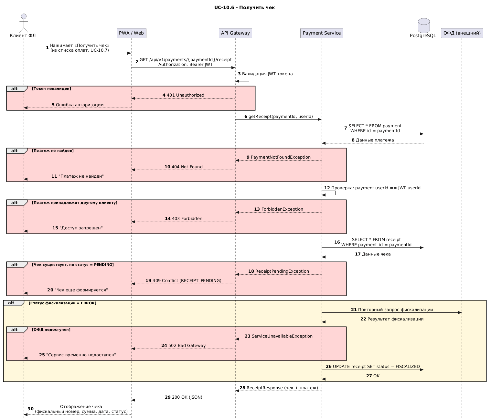

# UML Sequence Diagram — UC-10.6 Получить чек

Этот артефакт визуализирует интеграционную последовательность для сценария UC-10.6 «Получить чек» на основе [требований к интеграции](../../specs/integration/integration-requirements.md) (`INT-006`, `INT-007`) и [REST-контракта `GET /payments/{paymentId}/receipt`](openapi-uc-10-6-receipt.md).

Диаграмма показывает основной поток получения фискального чека клиентом ФЛ через PWA/Web — от нажатия кнопки «Получить чек» до отображения данных чека. Покрыто 5 веток ошибок: невалидный токен (`401`), платеж не найден (`404`), платеж принадлежит другому клиенту (`403`), чек еще формируется (`409`), ОФД недоступен при повторной фискализации (`502`). Отдельной веткой `alt` показана повторная фискализация при статусе `ERROR` — синхронный запрос в ОФД с обновлением записи `receipt` в БД.

В качестве участников выделены `Клиент ФЛ`, `PWA / Web` (фронтенд ЛК), `API Gateway`, `Payment Service` (модуль Платеж), `PostgreSQL` (БД платформы) и `ОФД (внешний)` — внешняя система фискализации. Сервис фискализации проверяет наличие платежа, права доступа клиента и статус существующего чека до обращения к ОФД; ОФД вызывается только при необходимости повторной фискализации.

## Диаграмма

Исходник в нотации PlantUML — [assets/sequence-uc-10-6-receipt.puml](assets/sequence-uc-10-6-receipt.puml). PNG отрендерен через [plantuml.com/plantuml](https://plantuml.com/plantuml). Для перегенерации после правок исходника — скопировать содержимое `.puml` в web-encoder PlantUML и сохранить новый PNG поверх существующего.

## Участники

| Participant     | Роль                                                                                                       |
| --------------- | ---------------------------------------------------------------------------------------------------------- |
| Клиент ФЛ       | Инициатор сценария — физическое лицо в ЛК                                                                  |
| PWA / Web       | Фронтенд личного кабинета клиента (PWA, мобильный браузер, веб-браузер)                                    |
| API Gateway     | Точка входа REST-вызовов: валидация JWT-токена, маршрутизация в `Payment Service`                          |
| Payment Service | Модуль `Платеж`: бизнес-логика выдачи чека, проверка прав и статусов, повторная фискализация при ошибке    |
| PostgreSQL      | База данных платформы: хранит таблицы `payment` и `receipt`                                                |
| ОФД (внешний)   | Внешняя система E11 — оператор фискальных данных. Регистрирует фискальный номер при повторной фискализации |

## Соответствие требованиям

- `INT-006` (Платеж ↔ ОФД) — ветка повторной фискализации `alt Статус фискализации = ERROR`: синхронный запрос `PS -> OFD: Повторный запрос фискализации`, ответ ОФД с результатом, обновление `receipt.status = FISCALIZED` в БД.
- `INT-007` (ОФД → Платеж, представление чека) — финальный шаг `PS --> API: ReceiptResponse (чек + платеж)` отдает агрегированный набор атрибутов чека и связанного платежа, достаточный для отображения клиенту (фискальный номер, сумма, дата, статус).

## Связанные документы

- [Требования к интеграции](../../specs/integration/integration-requirements.md) — фиксируют требования `INT-006` (Платеж ↔ ОФД) и `INT-007` (ОФД → Платеж, представление чека), которые покрыты диаграммой.
- [OpenAPI-контракт REST-метода — UC-10.6](openapi-uc-10-6-receipt.md) — REST-контракт `GET /payments/{paymentId}/receipt`, реализующий запрос-ответ диаграммы.
- [WSDL-контракт SOAP-сервиса — UC-10.6](wsdl-uc-10-6-receipt.md) — SOAP-аналог контракта операции `GetReceipt` с конвертами и XSD.
- [JSON-пример ответа — UC-10.6](payload-uc-10-6-receipt.md) — каноничный пример полезной нагрузки `ReceiptResponse` для REST.
- [JSON-схема ответа — UC-10.6](schema-uc-10-6-receipt.md) — формальная JSON Schema REST-ответа.
- [XML-пример ответа — UC-10.6](payload-uc-10-6-receipt-xml.md) — SOAP-аналог полезной нагрузки.
- [XSD-схема ответа — UC-10.6](schema-uc-10-6-receipt-xml.md) — SOAP-аналог схемы.
- [Регламент взаимодействия ИС](is-interaction-regulation.md) — направления обмена, в которых участвует данный сценарий.
- [Реестр ошибок «Оплата»](payment-errors-registry.md) — каталог ошибок, на которые опираются ветки `alt` диаграммы.
- [Индекс интеграционной архитектуры](readme.md) — общий каталог раздела.
