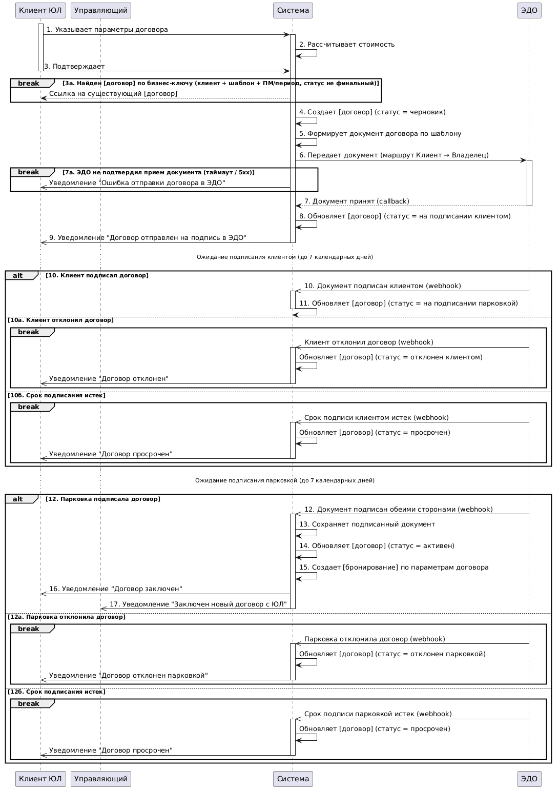

# Sequence Diagram — UC-8.2 Создать договор с ЮЛ через ЭДО

Этот артефакт визуализирует интеграционную последовательность для сценария [UC-8.2 Создать договор с ЮЛ через ЭДО](../../artifacts/use-case/uc-8-2-create-contract-legal-entity.md) на основе [требований к интеграции](../../specs/integration/integration-requirements.md) (`INT-014`, `INT-015`) и [Блока 3 регламента взаимодействия ИС](is-interaction-regulation.md).

Диаграмма показывает основной поток создания договора Клиентом ЮЛ — от ввода параметров до активации договора и создания бронирований, с явным разделением синхронной части (передача документа в ЭДО, прием подтверждения) и асинхронной (webhook-события подписи / отказа / просрочки от ЭДО, уведомления Клиенту и Управляющему). Покрыто 6 расширений основного потока: `3а` (договор по бизнес-ключу уже существует), `7а` (ЭДО не подтвердил прием), `10а` / `10б` (отказ или просрочка подписи клиентом), `12а` / `12б` (отказ или просрочка подписи парковкой). SLA подписи (7 календарных дней на каждый этап маршрута Клиент → Владелец) показан явными паузами между точками асинхронного ожидания.

В отличие от [UC-12.1 Sequence](sequence-uc-12-1-pass-auto-identification-entry.md), внутренние модули (`Сервис Договоров`, `Notification Service`, `Notification Adapter`, БД) свернуты в одного participant'а «Система», а внешний «Сервис уведомлений» (E8) скрыт за асинхронными стрелками от Системы к Клиенту и Управляющему. Это сознательное упрощение для UC-уровня: outbox-механика, polling fallback и разделение P14 / P9 / P20 раскрываются в JSON-контракте (Фаза 5) и регламенте v2 (Фаза 9).

## Диаграмма

Исходник в нотации PlantUML — [assets/sequence-uc-8-2-create-contract.puml](assets/sequence-uc-8-2-create-contract.puml). PNG отрендерен через [plantuml.com/plantuml](https://plantuml.com/plantuml). Для перегенерации после правок исходника — скопировать содержимое `.puml` в web-encoder PlantUML и сохранить новый PNG поверх существующего.

## Участники

| Participant | Роль                                                                                                                                                                     |
| ----------- | ------------------------------------------------------------------------------------------------------------------------------------------------------------------------ |
| Клиент ЮЛ   | Инициатор сценария — представитель юридического лица в ЛК                                                                                                                |
| Управляющий | Получатель уведомления о заключенном договоре (`INT-015`)                                                                                                                |
| Система     | Платформа парковки в целом (PWA + API Gateway + `Сервис Договоров` P14 + `Notification Service` P9 + `Notification Adapter` P20 + БД) — без раскрытия внутренних модулей |
| ЭДО         | Внешняя система E12 — оператор ЭДО (СБИС / Диадок). Передача документа, маршрут согласования Клиент → Владелец, webhook-события статусов                                 |

Владелец на диаграмме не показан явно — его действия (подписание / отказ) приходят в Систему как webhook-события от ЭДО. Сервис уведомлений (E8) свернут в асинхронные стрелки `Система ->> Клиент` и `Система ->> Управляющий`.

## Соответствие требованиям

- `INT-014` (Договор ↔ ЭДО) — шаги 6, 7, расширение 7а, ветки `alt 10. / 10а / 10б`, ветки `alt 12. / 12а / 12б`. SLA 7 календарных дней показан паузами «Ожидание подписания…». Polling fallback не отображен явно на диаграмме (упрощение для UC-уровня); его обоснование — в `INT-014`.
- `INT-015` (Договор → АгентУведомлений) — асинхронные стрелки `Система ->> Клиент` на шагах 9, 16 и в failure-ветках расширений; стрелка `Система ->> Управляющий` на шаге 17. Владелец платформой не уведомляется (это делает ЭДО его кабинетом).

## Связанные документы

- [UC-8.2 Создать договор с ЮЛ через ЭДО](../../artifacts/use-case/uc-8-2-create-contract-legal-entity.md) — бизнес-сценарий, который эта диаграмма детализирует на уровне интеграционных взаимодействий.
- [Требования к интеграции](../../specs/integration/integration-requirements.md) — фиксируют требования `INT-014` (Договор ↔ ЭДО) и `INT-015` (Договор → АгентУведомлений), которые покрыты диаграммой.
- [Регламент взаимодействия ИС](is-interaction-regulation.md) — Блок 3 «Документооборот через ЭДО» задает направления обмена в табличной форме.
- [DFD L1](../../artifacts/dfd-l1.md) — источник архитектурного допущения «`Сервис Договоров` (P14) → E12 ЭДО напрямую» (потоки F03 / F04), без отдельного локального адаптера.
- [ADR-003: Модульный монолит](../adr/adr-003-modular-monolith.md) — инвариант 4 (transactional outbox для развязки модулей) обосновывает асинхронность стрелок уведомлений, скрытую в упрощении «Системы».
- [UML Sequence Diagram — UC-12.1 Автоматическая идентификация на въезде](sequence-uc-12-1-pass-auto-identification-entry.md) — стилевой ориентир для записи активаций, break-блоков и asyncronous edges.
- [Мастер-план UC-8.2](../../../plans/2026-05-02-uc-8-2-edo-integration.md) — родительский план набора из 9 артефактов UC-8.2.
