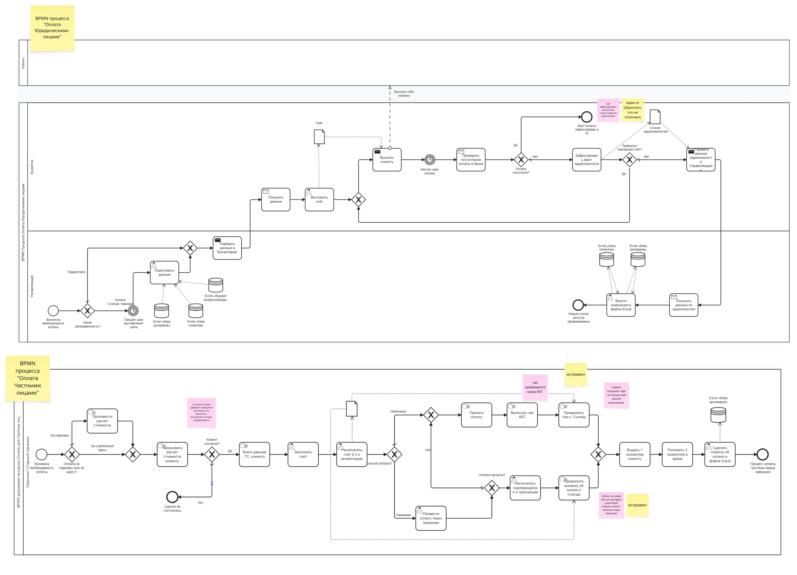

# BPMN AS-IS оплаты для физлиц и юрлиц

## Назначение

Артефакт фиксирует текущие сценарии оплаты для физических и юридических лиц и помогает увидеть различия между ручной работой по договору, выставлением счетов и оплатой на месте.

## Контекст и источник

- Этап проекта: Этап 1. Моделирование бизнеса
- Тип артефакта: BPMN
- Источник: интервью с заказчиком и моделирование команды
- Статус: рабочая версия, использованная при проектировании оплаты и задолженности

## Диаграмма

## Текстовое описание

На изображении собраны два связанных процесса: оплата для юридических лиц и оплата для физических лиц. Для юридических лиц поток завязан на счета, подтверждение платежа, проверку задолженности и актуализацию статуса допуска. Для физических лиц показана проверка задолженности, ввод идентификационных данных и номера автомобиля, выполнение оплаты онлайн или на территории парковки и последующее снятие ограничений, если долг был закрыт. В обоих случаях процесс зависит от ручной фиксации результата в рабочих таблицах и клиентской базе.

## Ключевые элементы

- Отдельные ветки для физлиц и юрлиц
- Проверка задолженности и ограничений доступа
- Выставление счета и подтверждение оплаты
- Актуализация клиентской базы и снятие блокировок после оплаты

## Логика артефакта

Юрлицо проходит через более документоемкий и согласовательный процесс, где ключевую роль играет счет и подтверждение его оплаты. Физлицо проходит более короткий поток, но он также содержит ручные проверки, необходимость повторно вносить данные и зависимость от сотрудника на КПП или от локального способа оплаты. В совокупности диаграмма показывает, что платежный контур AS-IS не отделен от операционной работы персонала и напрямую влияет на доступ на парковку.

## Выводы и решения

- В текущем процессе оплата тесно связана с ручным управлением задолженностью и доступом.
- Для физлиц и юрлиц нужны разные, но согласованные сценарии оплаты.
- Диаграмма стала входом для проектирования платежного модуля, уведомлений и правил ограничения доступа.

## Ограничения и открытые вопросы

- На схеме не формализованы все варианты ошибок платежа и повторных попыток.
- Требуется дополнительно синхронизировать AS-IS поток с будущими интеграциями платежного провайдера, терминала и ОФД.

## Связанные документы

- [../opportunity-canvas.md](../opportunity-canvas.md)
- [../impact-map.md](../impact-map.md)
- [../use-case/use-case-registry.md](../use-case/use-case-registry.md)
- [../../specs/functional-requirements/fr-parking-session.md](../../specs/functional-requirements/fr-parking-session.md)
