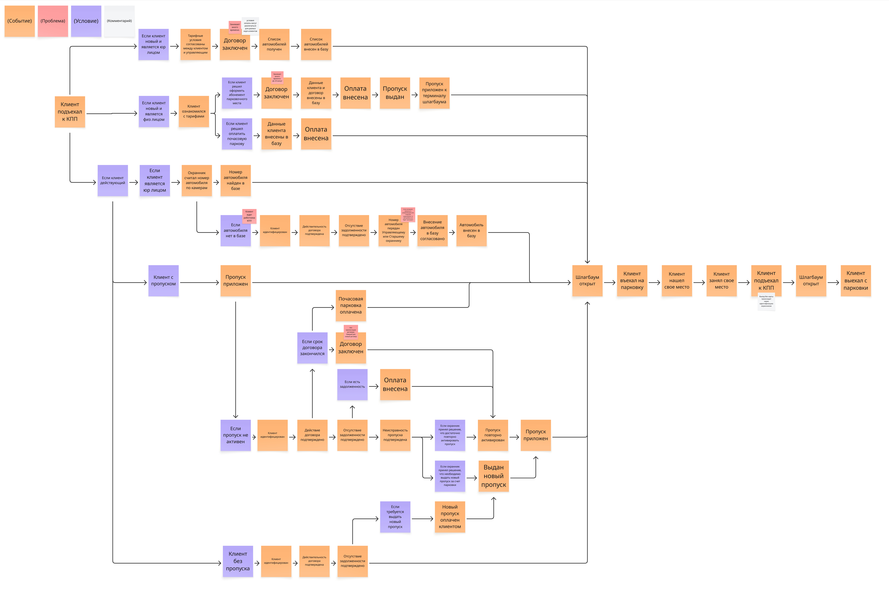

# Event Storming AS-IS

## Назначение

Артефакт фиксирует текущее течение парковочных процессов в формате Event Storming и показывает, какие события, условия и проблемы возникают в AS-IS модели работы парковки.

## Контекст и источник

- Этап проекта: Этап 1. Моделирование бизнеса
- Тип артефакта: Event Storming
- Источник: интервью с заказчиком, рабочая доска команды, перенос изображения в репозиторий
- Статус: рабочая версия, использованная как вход для последующих артефактов

## Диаграмма

## Текстовое описание

Диаграмма начинается с события, что клиент подъехал к КПП, после чего поток разветвляется в зависимости от того, может ли система идентифицировать клиента автоматически, есть ли у него действующий договор и требуется ли дополнительная проверка со стороны охраны или управляющего. В AS-IS процессе рядом с бизнес-событиями отражены проблемные места, условия и рабочие комментарии команды: ручная идентификация, зависимость от сотрудника на КПП, необходимость отдельно проверять оплату, договор и права доступа. Дальше поток охватывает заключение или продление договора, оплату, выдачу или продление пропуска, открытие шлагбаума, поиск парковочного места, занятие места, а затем отдельный выходной контур с выездом через КПП.

## Ключевые элементы

- События входа на парковку, заключения договора, оплаты, въезда, парковки и выезда
- Условия идентификации клиента, проверки договора, оплаты и пропуска
- Проблемы ручной обработки и задержек на КПП
- Комментарии о том, какие шаги зависят от охраны и управляющего

## Логика артефакта

Основная логика диаграммы показывает полный жизненный путь клиента в текущем состоянии: подъезд к КПП, идентификация, проверка оснований для допуска, оформление недостающих документов и оплат, въезд, поиск места, использование парковки и выезд. Отдельные ветки демонстрируют различие между клиентом по договору и клиентом без заранее оформленного доступа. Через проблемные стикеры диаграмма подчеркивает узкие места, которые позже легли в основу Opportunity Canvas, User Story Map и ES TO-BE.

## Выводы и решения

- AS-IS процесс критически зависит от ручных действий охраны и управляющего.
- Наиболее заметные потери времени возникают на этапах идентификации, оплаты и работы с договором.
- Диаграмма обосновывает необходимость автоматизации допуска, самообслуживания клиента и цифрового управления договорами.

## Ограничения и открытые вопросы

- На изображении зафиксирован общий поток, но не все локальные исключения детализированы до уровня формальных правил.
- Для ряда ветвей требуется последующая синхронизация с BPMN и use case, если команда уточнит роли или условия допуска.

## Связанные документы

- [parking-as-is-diagram.md](parking-as-is-diagram.md)
- [../opportunity-canvas.md](../opportunity-canvas.md)
- [../impact-map.md](../impact-map.md)
- [../../process/project-journey.md](../../process/project-journey.md)
