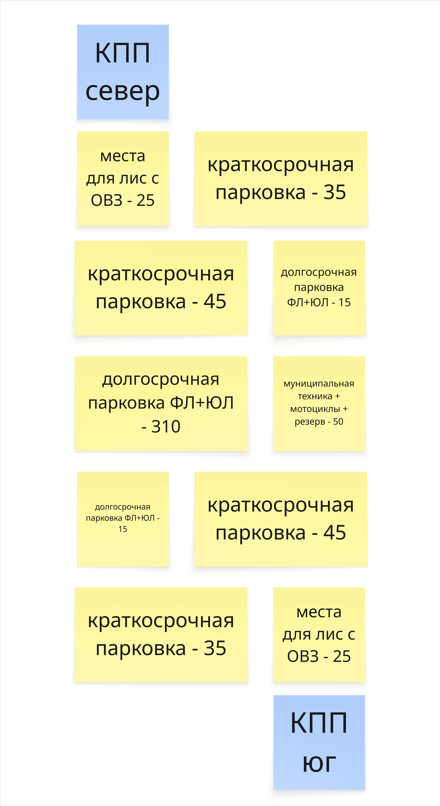

# Схема парковки AS-IS

## Оглавление

- [Назначение](#назначение)
- [Контекст и источник](#контекст-и-источник)
- [Диаграмма](#диаграмма)
- [Текстовое описание](#текстовое-описание)
- [Ключевые элементы](#ключевые-элементы)
- [Логика артефакта](#логика-артефакта)
- [Детализация содержания](#детализация-содержания)
- [Выводы и решения](#выводы-и-решения)
- [Ограничения и открытые вопросы](#ограничения-и-открытые-вопросы)
- [Связанные документы](#связанные-документы)

## Назначение

Артефакт фиксирует физическую схему парковки в текущем состоянии: расположение КПП, типы зон и их вместимость.

## Контекст и источник

- Этап проекта: Этап 1. Моделирование бизнеса
- Тип артефакта: Схема парковки / инфраструктурная схема AS-IS
- Источник: данные заказчика и рабочая схема команды
- Статус: рабочая версия, использованная в последующих артефактах

## Диаграмма



## Текстовое описание

Диаграмма показывает существующую конфигурацию парковки с двумя КПП и распределением мест по зонам. На схеме видны зоны краткосрочной и долгосрочной парковки, места для лиц с ОВЗ, а также отдельный сектор для муниципальной техники, мотоциклов и резерва. Артефакт нужен как опора для понимания текущей физической структуры объекта и ограничений при проектировании цифрового решения.

## Ключевые элементы

- КПП север и КПП юг
- Краткосрочные зоны парковки
- Долгосрочные зоны для ФЛ и ЮЛ
- Места для лиц с ОВЗ
- Зона муниципальной техники, мотоциклов и резерва

## Логика артефакта

Схема отражает не процесс, а пространственную организацию парковки. Она помогает понять, как распределены типы мест и какие физические ограничения влияют на клиентские сценарии, тарификацию, навигацию, доступ и будущую модель данных по секторам и машиноместам.

## Детализация содержания

## Условные обозначения

| Элемент | Описание |
|--------|----------|
| Синий блок | КПП (въезд/выезд) |
| Жёлтый блок | Зона парковки (тип и количество мест) |

**Сокращения:** ФЛ — физическое лицо; ЮЛ — юридическое лицо; ОВЗ — ограниченные возможности здоровья.

---

## Расположение (сверху вниз)

```
                    ┌─────────────────┐
                    │   КПП север     │
                    └────────┬────────┘
                             │
         ┌───────────────────┴───────────────────┐
         │                                       │
┌────────┴────────┐                   ┌──────────┴──────────┐
│ Места для лиц  │                   │ Краткосрочная      │
│ с ОВЗ — 25     │                   │ парковка — 35      │
└────────────────┘                   └────────────────────┘
         │                                       │
┌────────┴────────┐                   ┌──────────┴──────────┐
│ Краткосрочная   │                   │ Долгосрочная      │
│ парковка — 45   │                   │ парковка ФЛ+ЮЛ — 15│
└────────────────┘                   └────────────────────┘
         │                                       │
┌────────┴────────┐                   ┌──────────┴──────────┐
│ Долгосрочная    │                   │ Муниципальная      │
│ парковка ФЛ+ЮЛ  │                   │ техника + мотоциклы│
│ — 310           │                   │ + резерв — 50       │
└────────────────┘                   └────────────────────┘
         │                                       │
┌────────┴────────┐                   ┌──────────┴──────────┐
│ Долгосрочная   │                   │ Краткосрочная       │
│ парковка ФЛ+ЮЛ │                   │ парковка — 45      │
│ — 15           │                   └────────────────────┘
└────────────────┘                            │
         │                                       │
┌────────┴────────┐                   ┌──────────┴──────────┐
│ Краткосрочная   │                   │ Места для лиц       │
│ парковка — 35   │                   │ с ОВЗ — 25         │
└────────────────┘                   └────────────────────┘
         │                                       │
         └───────────────────┬───────────────────┘
                             │
                    ┌────────┴────────┐
                    │   КПП юг       │
                    └────────────────┘
```

---

## Зоны и вместимость

| Зона | Количество мест |
|------|-----------------|
| **КПП север** | въезд/выезд |
| Места для лиц с ОВЗ | 25 |
| Краткосрочная парковка | 35 |
| Краткосрочная парковка | 45 |
| Долгосрочная парковка ФЛ+ЮЛ | 15 |
| Долгосрочная парковка ФЛ+ЮЛ | 310 |
| Муниципальная техника + мотоциклы + резерв | 50 |
| Долгосрочная парковка ФЛ+ЮЛ | 15 |
| Краткосрочная парковка | 45 |
| Краткосрочная парковка | 35 |
| Места для лиц с ОВЗ | 25 |
| **КПП юг** | въезд/выезд |

**Итого мест по зонам:** 25 + 35 + 45 + 15 + 310 + 50 + 15 + 45 + 35 + 25 = **600** мест (без учёта КПП).

---

## Сводка по типам

| Тип зоны | Количество мест |
|----------|-----------------|
| Места для лиц с ОВЗ | 50 (25 + 25) |
| Краткосрочная парковка | 160 (35 + 45 + 45 + 35) |
| Долгосрочная парковка ФЛ+ЮЛ | 340 (15 + 310 + 15) |
| Муниципальная техника + мотоциклы + резерв | 50 |
| **Всего** | **600** |

---

*Схема AS-IS: два КПП (север, юг), зоны краткосрочной и долгосрочной парковки, места для лиц с ОВЗ у обоих КПП, центральный блок долгосрочной парковки и зона под муниципальную технику, мотоциклы и резерв.*

## Выводы и решения

- Физическая структура парковки уже задает разные режимы использования и разные типы клиентских сценариев.
- Артефакт важен для последующего моделирования зон, парковочных мест, тарифов и ограничений доступа.
- Общая вместимость и распределение по типам мест дают основу для аналитики и проектирования пользовательской навигации.

## Ограничения и открытые вопросы

- Схема показывает укрупненную структуру и не детализирует каждый сектор, номер места и маршруты движения по территории.
- При изменении фактической планировки парковки артефакт нужно синхронизировать с навигацией, контекстной диаграммой и моделью данных.

## Связанные документы

- [event-storming-as-is.md](event-storming-as-is.md)
- [uml-class-domain-as-is.md](uml-class-domain-as-is.md)
- [../context-diagram.md](../context-diagram.md)
- [../../architecture/database/erd/readme.md](../../architecture/database/erd/readme.md)
