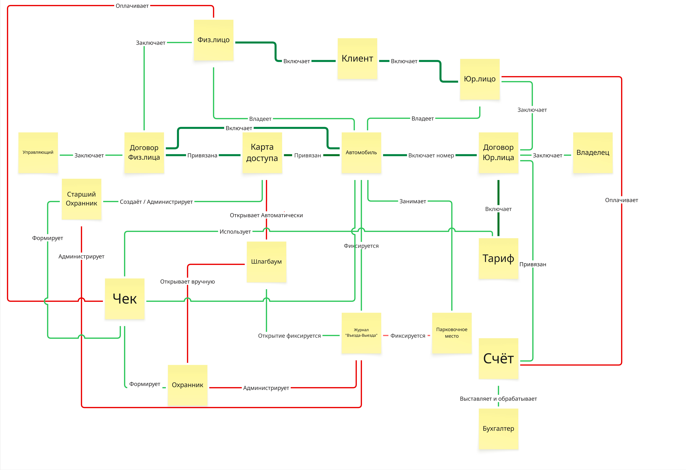

# UML Class Diagram предметной области AS-IS

## Назначение

Артефакт фиксирует ключевые сущности предметной области парковки в текущем состоянии и связи между клиентами, договорами, доступом, оплатой, парковочными местами и операционными ролями.

## Контекст и источник

- Этап проекта: Этап 1. Моделирование бизнеса
- Тип артефакта: UML Class Diagram
- Источник: рабочее моделирование команды по материалам заказчика
- Статус: рабочая версия, использованная как вход в дальнейшее проектирование данных

## Диаграмма

## Текстовое описание

Диаграмма показывает, какие объекты участвуют в текущей модели работы парковки и как они связаны друг с другом. Центральными сущностями выступают клиент, его типы "Физлицо" и "Юрлицо", договоры для этих типов клиентов, карта доступа, автомобиль, тариф, счет, чек, парковочное место, журнал въезда-выезда и шлагбаум. Отдельно на диаграмме присутствуют роли сотрудников и участников процесса: управляющий, владелец, старший охранник, охранник и бухгалтер. Через связи показано, кто заключает договор, кто администрирует доступ, как автомобиль связывается с картой доступа и тарифом, как выставляется счет и формируется чек, а также где фиксируются события проезда и использования парковочного места.

## Ключевые элементы

- Клиент как общая сущность с вариантами "Физлицо" и "Юрлицо"
- Договор с физлицом и договор с юрлицом
- Карта доступа, автомобиль, шлагбаум и журнал въезда-выезда
- Тариф, счет и чек как объекты платежного контура
- Парковочное место и роли сотрудников, работающих с процессом

## Логика артефакта

Диаграмма отражает AS-IS доменную модель как набор сущностей и бизнес-связей между ними. Договоры являются основанием для доступа и тарификации. Автомобиль привязан к клиентскому контуру и участвует в событиях допуска и фиксации использования парковки. Карта доступа и шлагбаум показывают физический контур контроля доступа, а счет и чек описывают финансовую часть процесса. Роли сотрудников встроены в диаграмму как участники, которые заключают, администрируют, формируют или обрабатывают связанные документы и операции.

## Выводы и решения

- Уже на AS-IS уровне предметная область содержит несколько взаимосвязанных контуров: клиентский, договорный, доступ, платежи и фактическое использование парковки.
- Диаграмма помогает увидеть, какие сущности обязательно должны быть отражены в концептуальной модели и ERD.
- Артефакт полезен как переходный слой между бизнес-моделированием и архитектурой данных.

## Ограничения и открытые вопросы

- Диаграмма содержит бизнес-связи, но не заменяет нормализованную модель данных и формальные ограничения БД.
- Для части отношений нужно дополнительно уточнить кратности и статусные поля при переносе в ERD.

## Связанные документы

- [parking-as-is-diagram.md](parking-as-is-diagram.md)
- [event-storming-as-is.md](event-storming-as-is.md)
- [../../architecture/database/erd/readme.md](../../architecture/database/erd/readme.md)
- [../conceptual-model-with-attributes.md](../conceptual-model-with-attributes.md)
