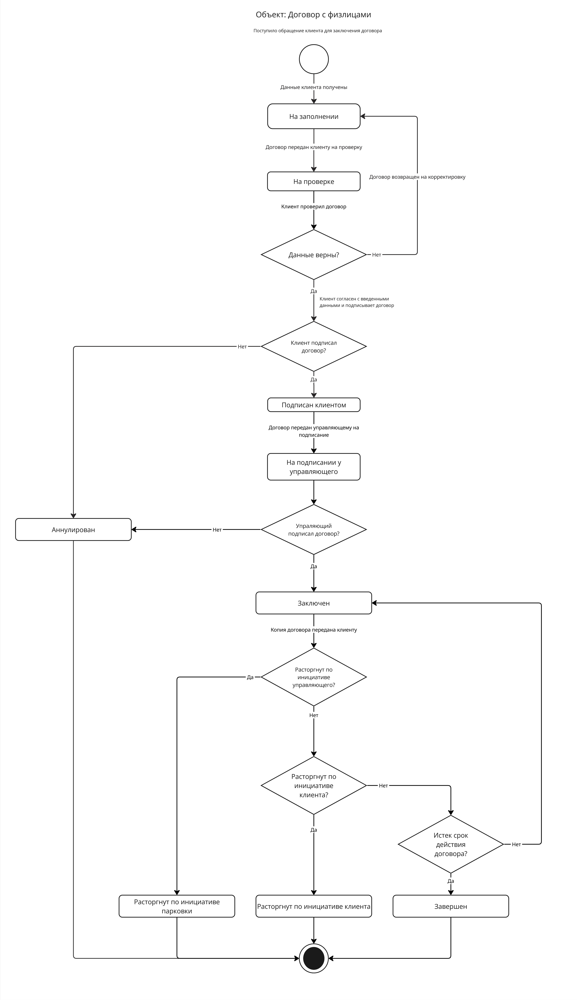

# UML StateChart договора с физлицом AS-IS

## Назначение

Артефакт описывает жизненный цикл договора с физлицом в текущем процессе и помогает увидеть, какие состояния проходит договор до заключения, аннулирования или завершения.

## Контекст и источник

- Этап проекта: Этап 1. Моделирование бизнеса
- Тип артефакта: UML StateChart Diagram
- Источник: рабочее моделирование команды по материалам заказчика
- Статус: рабочая версия, использованная для формализации процесса договора

## Диаграмма

## Текстовое описание

Диаграмма состояний показывает объект "Договор с физлицом" и его переходы между рабочими состояниями. Договор начинается в состоянии заполнения, затем переходит на проверку, после чего может быть подписан клиентом и передан на подписание управляющему. Если все проверки и подписи пройдены, договор считается заключенным. В отдельных ветках предусмотрены отмена, аннулирование, расторжение и завершение жизненного цикла. Переходы зависят от полноты введенных данных, решения клиента продолжать процесс и факта подписания со стороны ответственных лиц.

## Ключевые элементы

- Состояния подготовки, проверки и подписания договора
- Узлы принятия решения по полноте данных и продолжению процесса
- Финальные состояния заключения, аннулирования, расторжения и завершения
- Переходы, связанные с действиями клиента и управляющего

## Логика артефакта

Основной поток ведет договор от чернового заполнения к проверке и последующему подписанию. Если в данных есть ошибки, договор возвращается на доработку. Если клиент отказывается продолжать оформление или возникают основания для отмены, договор может быть аннулирован до вступления в силу. После заключения допускается отдельная ветка завершения или расторжения, что делает модель пригодной как для анализа AS-IS, так и для последующей детализации статусов в требованиях и модели данных.

## Выводы и решения

- Даже для одного типа договора жизненный цикл уже содержит несколько значимых состояний и развилок.
- Формализация статусов договора нужна для последующего проектирования use case, требований и ERD.
- Диаграмма помогает отделить черновые, проверяемые и юридически значимые статусы договора.

## Ограничения и открытые вопросы

- Требуется проверить, какие статусы должны остаться в целевой модели без упрощения или объединения.
- Переходы между завершением, аннулированием и расторжением стоит дополнительно синхронизировать с договорными требованиями.

## Связанные документы

- [../use-case/use-case-registry.md](../use-case/use-case-registry.md)
- [../user-story-map.md](../user-story-map.md)
- [../../architecture/database/erd/readme.md](../../architecture/database/erd/readme.md)
- [../../process/project-journey.md](../../process/project-journey.md)
