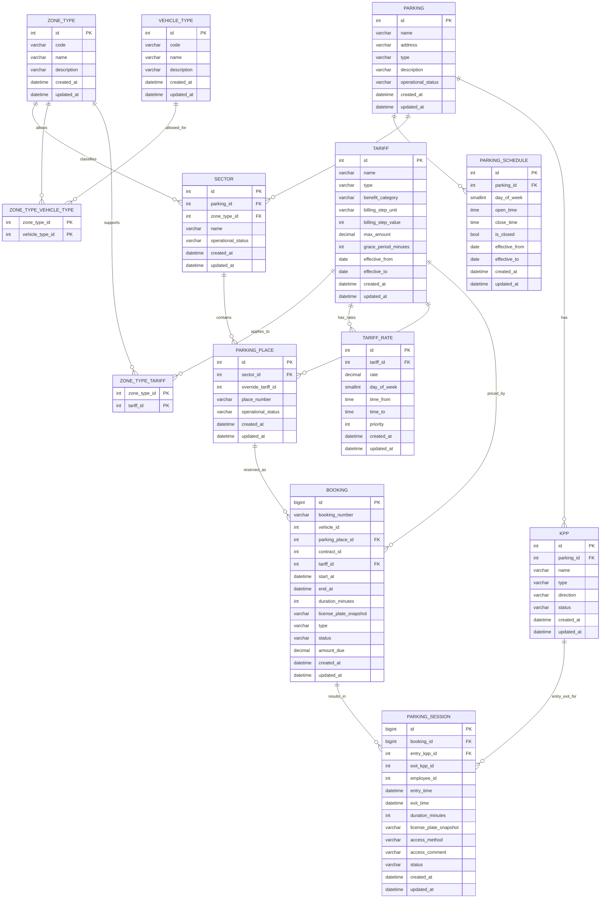
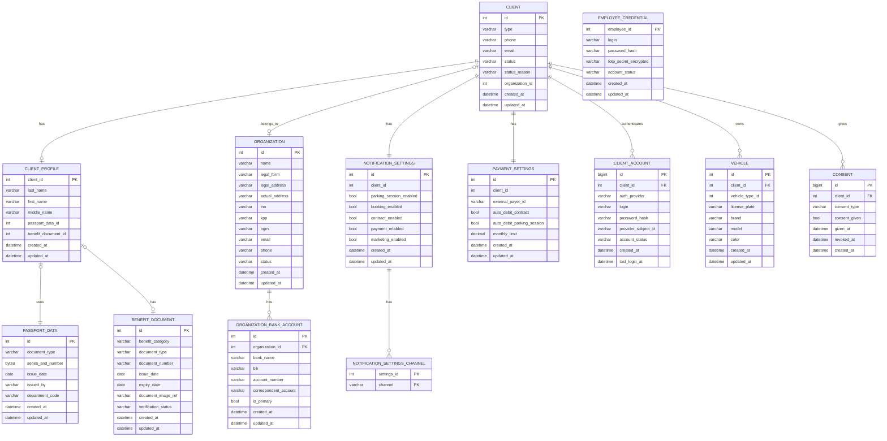
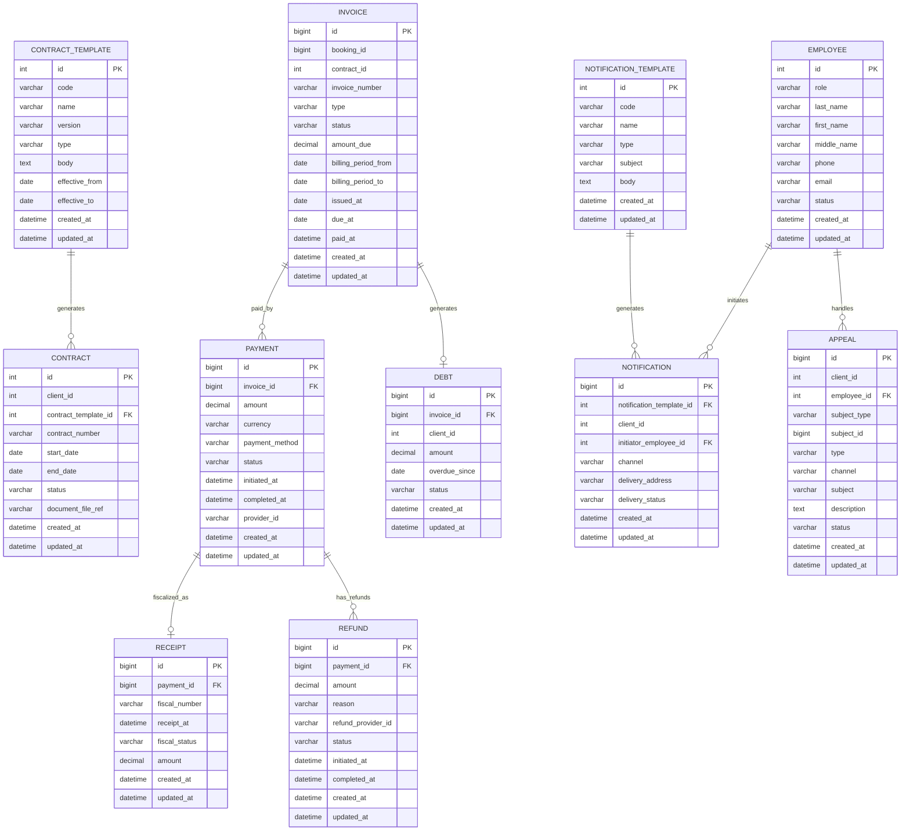

# ERD — разделение на диаграммы DrawSQL

**Дата:** 2026-03-31
**Полный ERD:** [`docs/artifacts/erd-work/temp-normalized-er-model.md`](temp-normalized-er-model.md)
**Ограничение DrawSQL:** не более 15 таблиц на диаграмму (бесплатный тариф)

## Table of Contents

- [Принцип разбиения](#принцип-разбиения)
- [Диаграмма 1 — Парковочный продукт](#диаграмма-1--парковочный-продукт)
- [Диаграмма 2 — Кто пользуется](#диаграмма-2--кто-пользуется)
- [Диаграмма 3 — Вспомогательные сервисы](#диаграмма-3--вспомогательные-сервисы)
- [Связанные документы](#связанные-документы)

---

## Принцип разбиения

Разбиение основано на DDD bounded contexts (`docs/architecture/ddd/ddd-bounded-contexts.md`).

Core-контексты (`Бронирование`, `Сессия`, `Тариф`) содержат всего 4 таблицы — они несут доменную логику, а не данные. Размещать их отдельно нет смысла. Вместо деления по типу Core/Supporting используется деление по **семантической цепочке ответственности**:

| # | Название | Вопрос | Таблиц |
| - | -------- | ------ | ------ |
| 1 | Парковочный продукт | Что продаем и как это работает | 13 |
| 2 | Кто пользуется | Кто покупает | 13 |
| 3 | Вспомогательные сервисы | Как обслуживаем | 11 |

**Кросс-контекстные ссылки** (FK без `REFERENCES` в физической схеме) обозначены в каждом разделе. В DrawSQL они **не рисуются стрелками** — документируются в **Table Notes** целевой таблицы.

---

## Диаграмма 1 — Парковочный продукт

Физическая инфраструктура + тарифы + ядро операций (бронирование и сессия).
Цепочка: `Площадка → Тариф → Бронирование → Сессия`.

**Состав (13 таблиц)**

| Схема | Таблица | DDD-контекст | Тип |
| ----- | ------- | ----------- | --- |
| `facility` | `PARKING` | Площадка | Supporting |
| `facility` | `PARKING_SCHEDULE` | Площадка | Supporting |
| `facility` | `SECTOR` | Площадка | Supporting |
| `facility` | `ZONE_TYPE` | Площадка | Supporting |
| `facility` | `VEHICLE_TYPE` | Площадка | Supporting |
| `facility` | `ZONE_TYPE_VEHICLE_TYPE` | Площадка | Supporting |
| `facility` | `ZONE_TYPE_TARIFF` | Площадка | Supporting |
| `facility` | `PARKING_PLACE` | Площадка | Supporting |
| `facility` | `KPP` | Площадка | Supporting |
| `tariff` | `TARIFF` | Тариф | Core |
| `tariff` | `TARIFF_RATE` | Тариф | Core |
| `booking` | `BOOKING` | Бронирование | Core |
| `session` | `PARKING_SESSION` | Сессия | Core |

**Mermaid-диаграмма**

**Логические FK за пределами диаграммы**

| Поле | Ссылается на | Диаграмма |
| ---- | ----------- | --------- |
| `BOOKING.vehicle_id` | `client.VEHICLE.id` | Диаграмма 2 |
| `BOOKING.contract_id` | `contract.CONTRACT.id` | Диаграмма 3 |
| `PARKING_SESSION.employee_id` | `employee.EMPLOYEE.id` | Диаграмма 3 |

**Table Notes для DrawSQL**

| Таблица | Заметка |
| ------- | ------- |
| `PARKING_SCHEDULE` | `UNIQUE(parking_id, day_of_week, effective_from)` |
| `ZONE_TYPE_VEHICLE_TYPE` | Составной PK: `(zone_type_id, vehicle_type_id)` |
| `ZONE_TYPE_TARIFF` | Составной PK: `(zone_type_id, tariff_id)` |
| `KPP` | `direction CHECK('ENTRY','EXIT','BIDIRECTIONAL')` |
| `TARIFF` | `billing_step_unit CHECK('MINUTE','HOUR','DAY')` |
| `PARKING_PLACE` | `override_tariff_id` — nullable логический FK на `TARIFF` (cross-schema, без REFERENCES) |
| `BOOKING` | `booking_number UNIQUE`; `duration_minutes` nullable (NULL пока бронь открыта); `vehicle_id` и `contract_id` — логические FK (cross-context, без REFERENCES) |
| `PARKING_SESSION` | `duration_minutes GENERATED ALWAYS AS ((EXTRACT(EPOCH FROM exit_time - entry_time)/60)::INTEGER) STORED`; `exit_kpp_id` nullable; `employee_id` — логический FK (cross-context, без REFERENCES) |

---

## Диаграмма 2 — Кто пользуется

Мастер-данные клиента, организации, ТС, PII (персональные данные) и учетные данные (инфраструктурный слой).

**Состав (13 таблиц)**

| Схема | Таблица | DDD-контекст | Тип |
| ----- | ------- | ----------- | --- |
| `client` | `CLIENT` | Клиент | Supporting |
| `client` | `CLIENT_PROFILE` | Клиент | Supporting |
| `client` | `ORGANIZATION` | Клиент | Supporting |
| `client` | `ORGANIZATION_BANK_ACCOUNT` | Клиент | Supporting |
| `client` | `NOTIFICATION_SETTINGS` | Клиент | Supporting |
| `client` | `NOTIFICATION_SETTINGS_CHANNEL` | Клиент | Supporting |
| `client` | `PAYMENT_SETTINGS` | Клиент | Supporting |
| `client` | `VEHICLE` | Клиент | Supporting |
| `client` | `CONSENT` | Клиент | Supporting |
| `auth` | `CLIENT_ACCOUNT` | Инфраструктура | — |
| `auth` | `EMPLOYEE_CREDENTIAL` | Инфраструктура | — |
| `pii` | `PASSPORT_DATA` | Клиент / PII | Supporting |
| `pii` | `BENEFIT_DOCUMENT` | Клиент / PII | Supporting |

**Mermaid-диаграмма**

**Логические FK за пределами диаграммы**

| Поле | Ссылается на | Диаграмма |
| ---- | ----------- | --------- |
| `VEHICLE.vehicle_type_id` | `facility.VEHICLE_TYPE.id` | Диаграмма 1 |
| `EMPLOYEE_CREDENTIAL.employee_id` | `employee.EMPLOYEE.id` | Диаграмма 3 |

**Table Notes для DrawSQL**

| Таблица | Заметка |
| ------- | ------- |
| `CLIENT` | `type CHECK('FL','UL')`; `status CHECK('ACTIVE','BLOCKED','PENDING')`; инвариант: при `type='FL'` → `organization_id IS NULL`, при `type='UL'` → `organization_id NOT NULL`; контролируется BEFORE INSERT/UPDATE триггером |
| `CLIENT_PROFILE` | Только для FL; `client_id` = PK и FK на `CLIENT`; `passport_data_id`/`benefit_document_id` — логические FK в схему `pii` (без REFERENCES) |
| `NOTIFICATION_SETTINGS` | `client_id NOT NULL UNIQUE` (FK инвертирован: настройки → клиент) |
| `NOTIFICATION_SETTINGS_CHANNEL` | Составной PK: `(settings_id, channel)`; `channel CHECK('SMS','EMAIL','PUSH')` |
| `PAYMENT_SETTINGS` | `client_id NOT NULL UNIQUE` (FK инвертирован аналогично NOTIFICATION_SETTINGS) |
| `ORGANIZATION` | `inn VARCHAR(12) UNIQUE`; `ogrn VARCHAR(13) UNIQUE` |
| `ORGANIZATION_BANK_ACCOUNT` | `partial UNIQUE(organization_id) WHERE is_primary=true` |
| `VEHICLE` | `license_plate NOT NULL UNIQUE`; `vehicle_type_id` — логический FK (cross-schema, без REFERENCES) |
| `EMPLOYEE_CREDENTIAL` | `employee_id` = PK и логический FK на `employee.EMPLOYEE` (cross-schema, без REFERENCES) |
| `PASSPORT_DATA` | `series_and_number` — тип `BYTEA`, зашифровано (152-ФЗ) |

---

## Диаграмма 3 — Вспомогательные сервисы

Финансы, договоры, персонал, уведомления и поддержка. Первые кандидаты на вынос в отдельные модули.

**Состав (11 таблиц)**

| Схема | Таблица | DDD-контекст | Тип |
| ----- | ------- | ----------- | --- |
| `payment` | `INVOICE` | Платеж | Supporting |
| `payment` | `PAYMENT` | Платеж | Supporting |
| `payment` | `RECEIPT` | Платеж | Supporting |
| `payment` | `REFUND` | Платеж | Supporting |
| `payment` | `DEBT` | Платеж | Supporting |
| `contract` | `CONTRACT_TEMPLATE` | Договор | Supporting |
| `contract` | `CONTRACT` | Договор | Supporting |
| `employee` | `EMPLOYEE` | Сотрудник | Supporting |
| `notification` | `NOTIFICATION_TEMPLATE` | Уведомление | Generic |
| `notification` | `NOTIFICATION` | Уведомление | Generic |
| `support` | `APPEAL` | Обращение | Supporting |

**Mermaid-диаграмма**

**Логические FK за пределами диаграммы**

| Поле | Ссылается на | Диаграмма |
| ---- | ----------- | --------- |
| `CONTRACT.client_id` | `client.CLIENT.id` | Диаграмма 2 |
| `INVOICE.booking_id` | `booking.BOOKING.id` | Диаграмма 1 |
| `INVOICE.contract_id` | `contract.CONTRACT.id` | та же диаграмма, cross-schema (без REFERENCES) |
| `DEBT.client_id` | `client.CLIENT.id` | Диаграмма 2 |
| `NOTIFICATION.client_id` | `client.CLIENT.id` | Диаграмма 2 |
| `APPEAL.client_id` | `client.CLIENT.id` | Диаграмма 2 |

**Table Notes для DrawSQL**

| Таблица | Заметка |
| ------- | ------- |
| `CONTRACT` | `contract_number UNIQUE`; `client_id` — логический FK (cross-schema, без REFERENCES) |
| `INVOICE` | `invoice_number UNIQUE`; `type CHECK('SINGLE','PERIODIC')`; при `SINGLE`: `booking_id NOT NULL`, `contract_id IS NULL`; при `PERIODIC`: `contract_id NOT NULL`, `booking_id IS NULL`; `amount_paid` не хранить — вычислять: `SELECT SUM(amount) FROM payment WHERE invoice_id=? AND status='COMPLETED'`; `booking_id` и `contract_id` — логические FK (cross-context, без REFERENCES) |
| `PAYMENT` | `partial UNIQUE(provider_id) WHERE provider_id IS NOT NULL` (идемпотентность) |
| `REFUND` | `status CHECK('INITIATED','COMPLETED','FAILED')`; `partial UNIQUE(refund_provider_id) WHERE refund_provider_id IS NOT NULL` |
| `DEBT` | `status CHECK('ACTIVE','PAID','WRITTEN_OFF')`; создается scheduled job при просрочке `INVOICE`; `client_id` — логический FK (cross-schema, без REFERENCES) |
| `NOTIFICATION` | `delivery_address NOT NULL` — адрес сохраняется на момент создания задачи, не JOIN к CLIENT; `client_id` — логический FK (cross-schema, без REFERENCES) |
| `APPEAL` | `subject_type CHECK('BOOKING','SESSION','PAYMENT','RECEIPT','CONTRACT')`; `CHECK((subject_type IS NULL) = (subject_id IS NULL))` — оба NULL или оба NOT NULL |

---

## Связанные документы

- **[Полная ERD (temp-normalized-er-model)](temp-normalized-er-model.md)** — источник истины, полные типы PostgreSQL
- **[DDD Bounded Contexts](../../architecture/ddd/ddd-bounded-contexts.md)** — основание разбиения
- **[ADR-003](../../architecture/adr/adr-003-modular-monolith.md)** — схемная изоляция bounded contexts
- **[Контекст чата (сессия 4)](chat-context-er-model-review-3-2026-03-31.md)** — последний принятый контекст ERD
