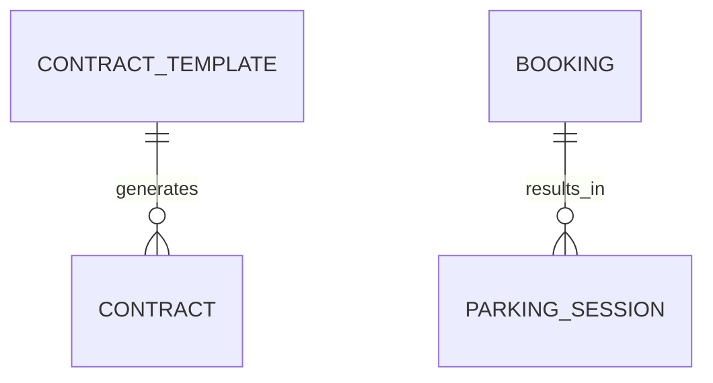

# ERD: домены `BOOKING`, `SESSION`, `CONTRACT`, `APPEAL`

**Контекст:** модель в `docs/artifacts/erd-work/temp-normalized-er-model.md`; сводка сессии — `docs/artifacts/erd-work/chat-context-er-model-review-3-2026-03-31.md`.

## Table of Contents

- [Связь между ключевыми таблицами](#связь-между-ключевыми-таблицами)
- [Таблица `CONTRACT_TEMPLATE` (полностью)](#таблица-contract_template-полностью)
- [Таблица `CONTRACT` (полностью)](#таблица-contract-полностью)
- [Таблица `BOOKING` (полностью)](#таблица-booking-полностью)
- [Таблица `PARKING_SESSION` (полностью)](#таблица-parking_session-полностью)
- [Таблица `APPEAL` (полностью)](#таблица-appeal-полностью)
- [Кросс-контекстные логические ссылки (без REFERENCES)](#кросс-контекстные-логические-ссылки-без-references)
- [Table Notes (DrawSQL)](#table-notes-drawsql)
- [Диаграмма связей (Mermaid)](#диаграмма-связей-mermaid)
- [Связанные документы](#связанные-документы)

---

## Связь между ключевыми таблицами

| Сторона A | Кардинальность | Сторона B | Условие |
|-----------|------------------|-----------|---------|
| `CONTRACT_TEMPLATE` | **1** | **0..N** | `CONTRACT` |
| `CONTRACT` | **1** | **0..N** | `BOOKING` *(логическая ссылка `BOOKING.contract_id`)* |
| `BOOKING` | **1** | **0..N** | `PARKING_SESSION` *(ADR-002: `PARKING_SESSION.booking_id NOT NULL`)* |
| `CLIENT` | **1** | **0..N** | `APPEAL` *(логическая ссылка; без `REFERENCES`, ADR-003)* |

---

## Таблица `CONTRACT_TEMPLATE` (полностью)

Схема: `contract`.

| Поле | Тип PostgreSQL | Null | Ограничения / примечания |
|------|----------------|------|---------------------------|
| `id` | `BIGINT GENERATED BY DEFAULT AS IDENTITY` | NOT NULL | `PRIMARY KEY` |
| `code` | `VARCHAR(64)` | NOT NULL | `UNIQUE` |
| `name` | `VARCHAR(200)` | NOT NULL | — |
| `version` | `VARCHAR(32)` | NOT NULL | — |
| `type` | `VARCHAR(32)` | NOT NULL | `CHECK (type IN ('INDIVIDUAL','CORPORATE'))` |
| `body` | `TEXT` | NOT NULL | — |
| `effective_from` | `DATE` | NOT NULL | — |
| `effective_to` | `DATE` | NULL | — |

---

## Таблица `CONTRACT` (полностью)

Схема: `contract`.

| Поле | Тип PostgreSQL | Null | Ограничения / примечания |
|------|----------------|------|---------------------------|
| `id` | `BIGINT GENERATED BY DEFAULT AS IDENTITY` | NOT NULL | `PRIMARY KEY` |
| `client_id` | `BIGINT` | NOT NULL | `REFERENCES client(id)` *(в пределах `client` схемы; на практике может быть логической, если схемы изолированы физически)* |
| `contract_template_id` | `BIGINT` | NULL | `REFERENCES contract_template(id)` |
| `contract_number` | `VARCHAR(64)` | NOT NULL | `UNIQUE` |
| `start_date` | `DATE` | NOT NULL | — |
| `end_date` | `DATE` | NULL | — |
| `status` | `VARCHAR(32)` | NOT NULL | `CHECK (status IN ('DRAFT','ACTIVE','EXPIRED','TERMINATED'))` |
| `document_file_ref` | `VARCHAR(512)` | NULL | — |

---

## Таблица `BOOKING` (полностью)

Схема: `booking`.

| Поле | Тип PostgreSQL | Null | Ограничения / примечания |
|------|----------------|------|---------------------------|
| `id` | `BIGINT GENERATED BY DEFAULT AS IDENTITY` | NOT NULL | `PRIMARY KEY` |
| `booking_number` | `VARCHAR(64)` | NOT NULL | `UNIQUE` |
| `vehicle_id` | `BIGINT` | NOT NULL | логическая ссылка на `client.vehicle(id)` (ADR-003) |
| `parking_place_id` | `BIGINT` | NULL | логическая ссылка на `facility.parking_place(id)` (ADR-003) |
| `contract_id` | `BIGINT` | NULL | логическая ссылка на `contract.contract(id)` (ADR-003) |
| `tariff_id` | `BIGINT` | NOT NULL | логическая ссылка на `tariff.tariff(id)` (ADR-003) |
| `start_at` | `TIMESTAMPTZ` | NOT NULL | — |
| `end_at` | `TIMESTAMPTZ` | NULL | — |
| `duration_minutes` | `INTEGER` | NULL | NULL при `end_at IS NULL`; заполняется при завершении |
| `license_plate_snapshot` | `VARCHAR(32)` | NOT NULL | иммутабельный снимок ГРЗ |
| `type` | `VARCHAR(32)` | NOT NULL | `CHECK (type IN ('AUTO', 'SHORT_TERM', 'CONTRACT'))` |
| `status` | `VARCHAR(32)` | NOT NULL | `CHECK (status IN ('PENDING','CONFIRMED','ACTIVE','COMPLETED','CANCELLED','NO_SHOW'))` |
| `amount_due` | `NUMERIC(19, 4)` | NULL | NULL при `type='AUTO'`; NOT NULL для `SHORT_TERM` и `CONTRACT` (инвариант — Application Service) |

---

## Таблица `PARKING_SESSION` (полностью)

Схема: `session`.

| Поле | Тип PostgreSQL | Null | Ограничения / примечания |
|------|----------------|------|---------------------------|
| `id` | `BIGINT GENERATED BY DEFAULT AS IDENTITY` | NOT NULL | `PRIMARY KEY` |
| `booking_id` | `BIGINT` | NOT NULL | логическая ссылка на `booking.booking(id)` (ADR-002, ADR-003) |
| `entry_kpp_id` | `BIGINT` | NULL | логическая ссылка на `facility.kpp(id)` (ADR-003) |
| `exit_kpp_id` | `BIGINT` | NULL | логическая ссылка на `facility.kpp(id)` (ADR-003) |
| `employee_id` | `BIGINT` | NULL | логическая ссылка на `employee.employee(id)` (ADR-003) |
| `entry_time` | `TIMESTAMPTZ` | NOT NULL | — |
| `exit_time` | `TIMESTAMPTZ` | NULL | — |
| `duration_minutes` | `INTEGER` | NULL | вычислимое поле (см. Table Notes) |
| `license_plate_snapshot` | `VARCHAR(32)` | NOT NULL | иммутабельный снимок ГРЗ |
| `access_method` | `VARCHAR(32)` | NOT NULL | `CHECK (access_method IN ('PLATE_RECOGNITION','QR','RFID','MANUAL'))` |
| `access_comment` | `TEXT` | NULL | — |
| `status` | `VARCHAR(32)` | NOT NULL | `CHECK (status IN ('ACTIVE','COMPLETED','INTERRUPTED'))` |

---

## Таблица `APPEAL` (полностью)

Схема: `support`.

| Поле | Тип PostgreSQL | Null | Ограничения / примечания |
|------|----------------|------|---------------------------|
| `id` | `BIGINT GENERATED BY DEFAULT AS IDENTITY` | NOT NULL | `PRIMARY KEY` |
| `client_id` | `BIGINT` | NOT NULL | логическая ссылка на `client.client(id)` (ADR-003) |
| `employee_id` | `BIGINT` | NULL | логическая ссылка на `employee.employee(id)` (ADR-003) |
| `subject_type` | `VARCHAR(32)` | NULL | `CHECK (subject_type IN ('BOOKING','SESSION','PAYMENT','RECEIPT','CONTRACT'))` |
| `subject_id` | `BIGINT` | NULL | логическая ссылка на предмет по `subject_type` |
| `type` | `VARCHAR(32)` | NOT NULL | `CHECK (type IN ('COMPLAINT','QUESTION','REQUEST','FEEDBACK'))` |
| `channel` | `VARCHAR(32)` | NOT NULL | `CHECK (channel IN ('APP','EMAIL','PHONE','CHAT'))` |
| `subject` | `VARCHAR(500)` | NOT NULL | — |
| `description` | `TEXT` | NULL | — |
| `status` | `VARCHAR(32)` | NOT NULL | `CHECK (status IN ('OPEN','IN_PROGRESS','RESOLVED','CLOSED'))` |

---

## Кросс-контекстные логические ссылки (без REFERENCES)

- `booking.BOOKING.vehicle_id -> client.VEHICLE.id`
- `booking.BOOKING.parking_place_id -> facility.PARKING_PLACE.id`
- `booking.BOOKING.contract_id -> contract.CONTRACT.id`
- `booking.BOOKING.tariff_id -> tariff.TARIFF.id`

- `session.PARKING_SESSION.booking_id -> booking.BOOKING.id`
- `session.PARKING_SESSION.entry_kpp_id -> facility.KPP.id`
- `session.PARKING_SESSION.exit_kpp_id -> facility.KPP.id`
- `session.PARKING_SESSION.employee_id -> employee.EMPLOYEE.id`

- `support.APPEAL.client_id -> client.CLIENT.id`
- `support.APPEAL.employee_id -> employee.EMPLOYEE.id`
- `support.APPEAL.subject_type + subject_id -> {booking|session|payment|receipt|contract}` *(полиморфизм)*

---

## Table Notes (DrawSQL)

- `PARKING_SESSION.duration_minutes`:
  - `GENERATED ALWAYS AS (EXTRACT(EPOCH FROM (exit_time - entry_time)) / 60)::INTEGER STORED`
- `APPEAL` инвариант предмета:
  - `CHECK ((subject_type IS NULL) = (subject_id IS NULL))`
  - индекс: `(subject_type, subject_id)`

---

## Диаграмма связей (Mermaid)

---

## Связанные документы

- [ERD (temp-normalized-er-model)](temp-normalized-er-model.md)
- [Контекст ревью ERD, сессия 9+](chat-context-er-model-review-3-2026-03-31.md)
- [ADR-002: бронирование и парковочная сессия](../../architecture/adr/adr-002-booking-vs-session.md)
- [ADR-003: модульный монолит и схемная изоляция](../../architecture/adr/adr-003-modular-monolith.md)
