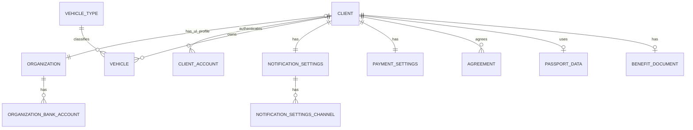

# ERD: домен `CLIENT` (ФЛ/ЮЛ) и связанные таблицы

**Контекст:** модель в `docs/artifacts/erd/erd-normalized-er-model.md`; сводки ревью — `docs/artifacts/erd/chat-context/chat-context-er-model-review-3-2026-03-31.md`, `docs/artifacts/erd/chat-context/chat-context-er-model-review-4-2026-04-01.md`.

## Table of Contents

- [Аудитные поля](#аудитные-поля)
- [Связь между ключевыми таблицами](#связь-между-ключевыми-таблицами)
- [Таблица `CLIENT`](#таблица-client)
- [Таблица `CLIENT_ACCOUNT`](#таблица-client_account)
- [Таблица `ORGANIZATION`](#таблица-organization)
- [Таблица `VEHICLE`](#таблица-vehicle)
- [Таблица `VEHICLE_TYPE`](#таблица-vehicle_type)
- [Таблица `NOTIFICATION_SETTINGS`](#таблица-notification_settings)
- [Таблица `NOTIFICATION_SETTINGS_CHANNEL`](#таблица-notification_settings_channel)
- [Таблица `PAYMENT_SETTINGS`](#таблица-payment_settings)
- [Таблица `AGREEMENT`](#таблица-agreement)
- [Таблица `ORGANIZATION_BANK_ACCOUNT`](#таблица-organization_bank_account)
- [Таблица `PASSPORT_DATA`](#таблица-passport_data)
- [Таблица `BENEFIT_DOCUMENT`](#таблица-benefit_document)
- [Связанные таблицы](#связанные-таблицы)
- [Диаграмма связей (Mermaid)](#диаграмма-связей-mermaid)
- [Схема БД и ограничения FK](#схема-бд-и-ограничения-fk)
- [Инварианты FL и UL](#инварианты-fl-и-ul)
- [Связанные документы](#связанные-документы)

---

## Аудитные поля

У **каждой** таблицы этого файла в целевой БД есть **`created_at`** и **`updated_at`**: `TIMESTAMPTZ NOT NULL DEFAULT now()`; обновление **`updated_at`** — триггером `moddatetime` (общая конвенция — `erd-normalized-er-model.md`). Ниже поля перечислены в таблицах для наглядности и переноса в DrawSQL.

---

## Связь между ключевыми таблицами

| Сторона A | Кардинальность | Сторона B | Условие |
|-----------|------------------|-----------|---------|
| `CLIENT` | **1** | **0..1** | `ORGANIZATION` *(только для ЮЛ; профиль организации)* |
| `ORGANIZATION` | **1** | **1** | `CLIENT` *(только для ЮЛ; строго 1:1)* |

Смысл (упрощенная модель): профиль ФЛ хранится **в таблице `CLIENT`** (ФИО). Паспортные данные и льготные документы хранятся в схеме `pii` и связываются с `CLIENT` через `pii.*.client_id` (логические ссылки). Для ЮЛ реквизиты вынесены в `ORGANIZATION` и связаны 1:1 с `CLIENT.type='UL'`.

---

## Таблица `CLIENT`

Схема: `client`.

| Поле | Тип PostgreSQL | Null | Ограничения / примечания |
|------|----------------|------|---------------------------|
| `id` | `BIGINT GENERATED BY DEFAULT AS IDENTITY` | NOT NULL | `PRIMARY KEY` |
| `type` | `VARCHAR(32)` | NOT NULL | `CHECK (type IN ('FL','UL'))` |
| `phone` | `VARCHAR(32)` | NULL | — |
| `email` | `VARCHAR(320)` | NULL | — |
| `status` | `VARCHAR(32)` | NOT NULL | `CHECK (status IN ('ACTIVE','BLOCKED','PENDING'))` |
| `status_reason` | `TEXT` | NULL | — |
| `last_name` | `VARCHAR(100)` | NULL/NOT NULL* | профиль ФЛ: NOT NULL при `type='FL'`, NULL при `type='UL'` |
| `first_name` | `VARCHAR(100)` | NULL/NOT NULL* | профиль ФЛ: NOT NULL при `type='FL'`, NULL при `type='UL'` |
| `middle_name` | `VARCHAR(100)` | NULL | профиль ФЛ: nullable |
| `created_at` | `TIMESTAMPTZ` | NOT NULL | `DEFAULT now()` |
| `updated_at` | `TIMESTAMPTZ` | NOT NULL | `DEFAULT now()`; обновление триггером `moddatetime` |

\* Инвариант про (не)NULL обеспечивается триггером или Application Service (см. ниже).

Терминологический контракт (для однозначности модели):

- при `type='FL'` `CLIENT` — физическое лицо;
- при `type='UL'` `CLIENT` — клиент-ЮЛ как единый субъект (одна организация = один клиент-ЮЛ); реквизиты и банковские счета хранятся в `ORGANIZATION` и `ORGANIZATION_BANK_ACCOUNT`.

---

## Таблица `CLIENT_ACCOUNT`

Схема: `auth` (инфраструктурный слой).

| Поле | Тип PostgreSQL | Null | Ограничения / примечания |
|------|----------------|------|---------------------------|
| `id` | `BIGINT GENERATED BY DEFAULT AS IDENTITY` | NOT NULL | `PRIMARY KEY` |
| `client_id` | `BIGINT` | NOT NULL | логическая ссылка на `client.client.id` (кросс-схемно, без `REFERENCES`) |
| `auth_provider` | `VARCHAR(64)` | NOT NULL | открытый список (LOCAL, PHONE, GOOGLE, YANDEX и т.п.); без `CHECK` |
| `login` | `VARCHAR(255)` | NULL | опциональный логин (если используется) |
| `phone_e164` | `VARCHAR(32)` | NULL | телефон в международном формате **E.164** (только цифры после `+`, длина по ITU-T); имя поля задает формат хранения, **по аналогии с** `email_normalized` |
| `email_normalized` | `VARCHAR(320)` | NULL | email после нормализации (lower + trim), каноническое представление для поиска и уникальности |
| `password_hash` | `VARCHAR(255)` | NULL/NOT NULL* | NULL допустим для внешних IdP; NOT NULL только при `auth_provider = 'LOCAL'` (инвариант) |
| `provider_subject_id` | `VARCHAR(255)` | NULL | — |
| `account_status` | `VARCHAR(32)` | NOT NULL | `CHECK (account_status IN ('ACTIVE','BLOCKED','PENDING_VERIFICATION'))` |
| `created_at` | `TIMESTAMPTZ` | NOT NULL | `DEFAULT now()` |
| `updated_at` | `TIMESTAMPTZ` | NOT NULL | `DEFAULT now()`; обновление триггером `moddatetime` |
| `last_login_at` | `TIMESTAMPTZ` | NULL | — |

\* Инварианты обеспечиваются триггером или Application Service:

- при `auth_provider = 'LOCAL'`: `password_hash NOT NULL` и задан хотя бы один идентификатор входа: `phone_e164 IS NOT NULL OR email_normalized IS NOT NULL OR login IS NOT NULL`;
- при внешнем IdP: `provider_subject_id NOT NULL`, `password_hash` может быть NULL.

Уникальность идентификаторов входа (рекомендуемо фиксировать индексами; DrawSQL: в Table Notes):

- `UNIQUE(phone_e164) WHERE phone_e164 IS NOT NULL`;
- `UNIQUE(email_normalized) WHERE email_normalized IS NOT NULL`;
- `UNIQUE(auth_provider, provider_subject_id) WHERE provider_subject_id IS NOT NULL`.

---

## Таблица `ORGANIZATION`

Схема: `client`.

| Поле | Тип PostgreSQL | Null | Ограничения / примечания |
|------|----------------|------|---------------------------|
| `id` | `BIGINT GENERATED BY DEFAULT AS IDENTITY` | NOT NULL | `PRIMARY KEY` |
| `client_id` | `BIGINT` | NOT NULL | `UNIQUE`; `REFERENCES client(id)` — связь 1:1 с `CLIENT` при `CLIENT.type='UL'` |
| `name` | `VARCHAR(500)` | NOT NULL | — |
| `legal_form` | `VARCHAR(64)` | NULL | без `CHECK` (значение приходит из DADATA; ADR-004) |
| `legal_address` | `TEXT` | NULL | — |
| `actual_address` | `TEXT` | NULL | — |
| `inn` | `VARCHAR(12)` | NOT NULL | `UNIQUE` |
| `kpp` | `VARCHAR(9)` | NULL | — |
| `ogrn` | `VARCHAR(13)` | NULL | `UNIQUE` (NULL допустим) |
| `email` | `VARCHAR(320)` | NULL | — |
| `phone` | `VARCHAR(32)` | NULL | — |
| `status` | `VARCHAR(32)` | NOT NULL | `CHECK (status IN ('ACTIVE','BLOCKED','PENDING'))` |
| `created_at` | `TIMESTAMPTZ` | NOT NULL | `DEFAULT now()` |
| `updated_at` | `TIMESTAMPTZ` | NOT NULL | `DEFAULT now()`; обновление триггером `moddatetime` |

---

## Таблица `VEHICLE`

Схема: `client`.

| Поле | Тип PostgreSQL | Null | Ограничения / примечания |
|------|----------------|------|---------------------------|
| `id` | `BIGINT GENERATED BY DEFAULT AS IDENTITY` | NOT NULL | `PRIMARY KEY` |
| `client_id` | `BIGINT` | NOT NULL | `REFERENCES client(id)` |
| `vehicle_type_id` | `BIGINT` | NOT NULL | логическая ссылка на `facility.vehicle_type(id)` (кросс-схемно, без `REFERENCES`, ADR-003) |
| `license_plate` | `VARCHAR(32)` | NOT NULL | `UNIQUE` |
| `brand` | `VARCHAR(100)` | NULL | — |
| `model` | `VARCHAR(100)` | NULL | — |
| `color` | `VARCHAR(64)` | NULL | — |
| `created_at` | `TIMESTAMPTZ` | NOT NULL | `DEFAULT now()` |
| `updated_at` | `TIMESTAMPTZ` | NOT NULL | `DEFAULT now()`; обновление триггером `moddatetime` |

Нормализация `license_plate`: хранится в нормализованном виде (UPPER + TRIM); нормализация применяется на уровне приложения или триггером `BEFORE INSERT/UPDATE`.

Нормализация `brand`/`model`/`color`: выполняется **перед записью в БД** на уровне приложения (например, через Dadata: подсказки по маркам + стандартизация строки ТС). В БД хранятся уже канонические строковые значения; справочники для `brand`/`model`/`color` не вводятся.

---

## Таблица `VEHICLE_TYPE`

Схема: `facility` (связанный справочник в контексте клиента).

| Поле | Тип PostgreSQL | Null | Ограничения / примечания |
|------|----------------|------|---------------------------|
| `id` | `BIGINT GENERATED BY DEFAULT AS IDENTITY` | NOT NULL | `PRIMARY KEY`; стабильный суррогатный идентификатор типа ТС (отдельный бизнес-код не вводится) |
| `name` | `VARCHAR(200)` | NOT NULL | — |
| `description` | `TEXT` | NULL | — |
| `created_at` | `TIMESTAMPTZ` | NOT NULL | `DEFAULT now()` |
| `updated_at` | `TIMESTAMPTZ` | NOT NULL | `DEFAULT now()`; обновление триггером `moddatetime` |

Связи (логические, кросс-схемные):

- `client.VEHICLE.vehicle_type_id -> facility.VEHICLE_TYPE.id` (без `REFERENCES`, ADR-003)
- `facility.ZONE_TYPE_VEHICLE_TYPE.vehicle_type_id -> facility.VEHICLE_TYPE.id` (в контексте facility, но справочник описан здесь для единого языка “Тип ТС”)

---

## Таблица `NOTIFICATION_SETTINGS`

Схема: `client`.

| Поле | Тип PostgreSQL | Null | Ограничения / примечания |
|------|----------------|------|---------------------------|
| `id` | `BIGINT GENERATED BY DEFAULT AS IDENTITY` | NOT NULL | `PRIMARY KEY` |
| `client_id` | `BIGINT` | NOT NULL | `UNIQUE`; `REFERENCES client(id)` |
| `parking_session_enabled` | `BOOLEAN` | NOT NULL | `DEFAULT false` |
| `booking_enabled` | `BOOLEAN` | NOT NULL | `DEFAULT false` |
| `contract_enabled` | `BOOLEAN` | NOT NULL | `DEFAULT false` |
| `payment_enabled` | `BOOLEAN` | NOT NULL | `DEFAULT false` |
| `marketing_enabled` | `BOOLEAN` | NOT NULL | `DEFAULT false` |
| `created_at` | `TIMESTAMPTZ` | NOT NULL | `DEFAULT now()` |
| `updated_at` | `TIMESTAMPTZ` | NOT NULL | `DEFAULT now()`; обновление триггером `moddatetime` |

Каналы доставки хранятся в отдельной таблице `NOTIFICATION_SETTINGS_CHANNEL`.

---

## Таблица `NOTIFICATION_SETTINGS_CHANNEL`

Схема: `client`.

| Поле | Тип PostgreSQL | Null | Ограничения / примечания |
|------|----------------|------|---------------------------|
| `settings_id` | `BIGINT` | NOT NULL | `REFERENCES notification_settings(id)`; входит в состав `PRIMARY KEY` |
| `channel` | `VARCHAR(32)` | NOT NULL | код канала доставки: `SMS`, `EMAIL`, `PUSH` (строковый литерал, не id); `CHECK (channel IN ('SMS','EMAIL','PUSH'))`; входит в состав `PRIMARY KEY` |
| `created_at` | `TIMESTAMPTZ` | NOT NULL | `DEFAULT now()` |
| `updated_at` | `TIMESTAMPTZ` | NOT NULL | `DEFAULT now()`; обновление триггером `moddatetime` |

Первичный ключ: `PRIMARY KEY (settings_id, channel)`.

---

## Таблица `PAYMENT_SETTINGS`

Схема: `client`.

| Поле | Тип PostgreSQL | Null | Ограничения / примечания |
|------|----------------|------|---------------------------|
| `id` | `BIGINT GENERATED BY DEFAULT AS IDENTITY` | NOT NULL | `PRIMARY KEY` |
| `client_id` | `BIGINT` | NOT NULL | `UNIQUE`; `REFERENCES client(id)` |
| `external_payer_id` | `VARCHAR(100)` | NULL | — |
| `auto_debit_contract` | `BOOLEAN` | NOT NULL | `DEFAULT false` |
| `auto_debit_parking_session` | `BOOLEAN` | NOT NULL | `DEFAULT false` |
| `monthly_limit_minor` | `BIGINT` | NULL | сумма в минорных единицах валюты (для `RUB` — копейки) |
| `created_at` | `TIMESTAMPTZ` | NOT NULL | `DEFAULT now()` |
| `updated_at` | `TIMESTAMPTZ` | NOT NULL | `DEFAULT now()`; обновление триггером `moddatetime` |

---

## Таблица `AGREEMENT`

Схема: `client`.

Фиксация согласий клиента (ПДн, маркетинг, ЭДО и т.д.). Имя таблицы **AGREEMENT** (альтернатива историческому `CONSENT`); смысл — запись о договоренности/согласии с условиями.

| Поле | Тип PostgreSQL | Null | Ограничения / примечания |
|------|----------------|------|---------------------------|
| `id` | `BIGINT GENERATED BY DEFAULT AS IDENTITY` | NOT NULL | `PRIMARY KEY` |
| `client_id` | `BIGINT` | NOT NULL | `REFERENCES client(id)` |
| `agreement_type` | `VARCHAR(64)` | NOT NULL | `CHECK (agreement_type IN ('PERSONAL_DATA','MARKETING','ELECTRONIC_DOCS'))` |
| `accepted` | `BOOLEAN` | NOT NULL | признак: согласие выдано (true) или нет |
| `accepted_at` | `TIMESTAMPTZ` | NOT NULL | момент фиксации |
| `revoked_at` | `TIMESTAMPTZ` | NULL | момент отзыва, если применимо |
| `created_at` | `TIMESTAMPTZ` | NOT NULL | `DEFAULT now()` |
| `updated_at` | `TIMESTAMPTZ` | NOT NULL | `DEFAULT now()`; обновление триггером `moddatetime` |

---

## Таблица `ORGANIZATION_BANK_ACCOUNT`

Схема: `client`.

| Поле | Тип PostgreSQL | Null | Ограничения / примечания |
|------|----------------|------|---------------------------|
| `id` | `BIGINT GENERATED BY DEFAULT AS IDENTITY` | NOT NULL | `PRIMARY KEY` |
| `organization_id` | `BIGINT` | NOT NULL | `REFERENCES organization(id)` |
| `bank_name` | `VARCHAR(255)` | NOT NULL | — |
| `bik` | `VARCHAR(9)` | NOT NULL | — |
| `account_number` | `VARCHAR(32)` | NOT NULL | — |
| `correspondent_account` | `VARCHAR(32)` | NULL | — |
| `is_primary` | `BOOLEAN` | NOT NULL | единственность “основного” обеспечивается partial unique index (см. ниже) |
| `created_at` | `TIMESTAMPTZ` | NOT NULL | `DEFAULT now()` |
| `updated_at` | `TIMESTAMPTZ` | NOT NULL | `DEFAULT now()`; обновление триггером `moddatetime` |

Инвариант “не более одного основного счета”: `CREATE UNIQUE INDEX ON organization_bank_account(organization_id) WHERE is_primary = true`.

---

## Таблица `PASSPORT_DATA`

Схема: `pii` (152-ФЗ).

| Поле | Тип PostgreSQL | Null | Ограничения / примечания |
|------|----------------|------|---------------------------|
| `id` | `BIGINT GENERATED BY DEFAULT AS IDENTITY` | NOT NULL | `PRIMARY KEY` |
| `document_type` | `VARCHAR(32)` | NOT NULL | `CHECK (document_type IN ('RF_PASSPORT','FOREIGN_PASSPORT','TEMP_ID'))` |
| `series` | `BYTEA` | NOT NULL | серия документа; рекомендуется хранить в зашифрованном виде |
| `number` | `BYTEA` | NOT NULL | номер документа; рекомендуется хранить в зашифрованном виде |
| `issue_date` | `DATE` | NOT NULL | — |
| `issued_by` | `VARCHAR(500)` | NULL | — |
| `department_code` | `VARCHAR(32)` | NULL | — |
| `client_id` | `BIGINT` | NOT NULL | логическая ссылка на `client.client.id` (кросс-схемно, без `REFERENCES`); `UNIQUE` для 0..1 паспорта на клиента |
| `created_at` | `TIMESTAMPTZ` | NOT NULL | `DEFAULT now()` |
| `updated_at` | `TIMESTAMPTZ` | NOT NULL | `DEFAULT now()`; обновление триггером `moddatetime` |

Связь с клиентом: `pii.passport_data.client_id → client.client.id` **логически** (без `REFERENCES`, ADR-003).

---

## Таблица `BENEFIT_DOCUMENT`

Схема: `pii` (152-ФЗ).

| Поле | Тип PostgreSQL | Null | Ограничения / примечания |
|------|----------------|------|---------------------------|
| `id` | `BIGINT GENERATED BY DEFAULT AS IDENTITY` | NOT NULL | `PRIMARY KEY` |
| `benefit_category` | `VARCHAR(64)` | NOT NULL | `CHECK (benefit_category IN ('DISABLED_1','DISABLED_2','DISABLED_3','VETERAN','LARGE_FAMILY','OTHER'))` |
| `document_type` | `VARCHAR(32)` | NOT NULL | `CHECK (document_type IN ('CERTIFICATE','ID_CARD','BOOKLET','OTHER'))` |
| `document_number` | `VARCHAR(64)` | NOT NULL | — |
| `issue_date` | `DATE` | NOT NULL | — |
| `expiry_date` | `DATE` | NULL | — |
| `document_image_ref` | `VARCHAR(512)` | NULL | — |
| `verification_status` | `VARCHAR(32)` | NOT NULL | `CHECK (verification_status IN ('PENDING','VERIFIED','REJECTED'))` |
| `client_id` | `BIGINT` | NOT NULL | логическая ссылка на `client.client.id` (кросс-схемно, без `REFERENCES`); `UNIQUE` для 0..1 льготного документа на клиента* |
| `created_at` | `TIMESTAMPTZ` | NOT NULL | `DEFAULT now()` |
| `updated_at` | `TIMESTAMPTZ` | NOT NULL | `DEFAULT now()`; обновление триггером `moddatetime` |

Связь с клиентом: `pii.benefit_document.client_id → client.client.id` **логически** (без `REFERENCES`, ADR-003).

\* Если требуется хранить несколько льготных документов, `UNIQUE(client_id)` убирается, добавляется политика “активный/основной документ” (например, `is_primary` или временные интервалы).

---

## Связанные таблицы

### Связанные с `CLIENT`

- **`ORGANIZATION`**: `CLIENT |o--|| ORGANIZATION` (только для UL; строго 1:1); FK: `client.organization.client_id UNIQUE REFERENCES client.client(id)`.
- **`NOTIFICATION_SETTINGS`**: `CLIENT ||--|| NOTIFICATION_SETTINGS`; FK: `client.notification_settings.client_id UNIQUE REFERENCES client.client(id)`.
- **`PAYMENT_SETTINGS`**: `CLIENT ||--|| PAYMENT_SETTINGS`; FK: `client.payment_settings.client_id UNIQUE REFERENCES client.client(id)`.
- **`CLIENT_ACCOUNT`** (схема `auth`): `CLIENT ||--o{ CLIENT_ACCOUNT`; логическая ссылка `auth.client_account.client_id` (кросс-схемно, без `REFERENCES`).
- **`VEHICLE`**: `CLIENT ||--o{ VEHICLE`; FK в схеме `client` (интра-схемно).
- **`AGREEMENT`**: `CLIENT ||--o{ AGREEMENT`; FK в схеме `client` (интра-схемно).
- **`NOTIFICATION`** (схема `notification`): `CLIENT ||--o{ NOTIFICATION`; логическая ссылка (кросс-схемно, без `REFERENCES`).
- **`APPEAL`** (схема `support`): `CLIENT ||--o{ APPEAL`; логическая ссылка (кросс-схемно, без `REFERENCES`).
- **`CONTRACT`** (схема `contract`): `CLIENT ||--o{ CONTRACT`; логическая ссылка (кросс-схемно, без `REFERENCES`).

### Связанные с профилем ФЛ внутри `CLIENT`

- **`PASSPORT_DATA`** (схема `pii`): `CLIENT` 0..1:1 `PASSPORT_DATA` через логическую ссылку `pii.passport_data.client_id → client.client.id` (без `REFERENCES`).
- **`BENEFIT_DOCUMENT`** (схема `pii`): `CLIENT` 0..1:1 `BENEFIT_DOCUMENT` через логическую ссылку `pii.benefit_document.client_id → client.client.id` (без `REFERENCES`).

### Связанные с `ORGANIZATION`

- **`CLIENT`**: `CLIENT |o--|| ORGANIZATION`; FK: `client.organization.client_id UNIQUE REFERENCES client.client(id)` (только для UL).
- **`ORGANIZATION_BANK_ACCOUNT`**: `ORGANIZATION ||--o{ ORGANIZATION_BANK_ACCOUNT`; FK: `client.organization_bank_account.organization_id REFERENCES client.organization(id)`.

### Связанные с `CLIENT_ACCOUNT`

- **`CLIENT`**: `CLIENT ||--o{ CLIENT_ACCOUNT`; логическая ссылка `auth.client_account.client_id → client.client.id` (кросс-схемно, без `REFERENCES`).

### Связанные с `VEHICLE`

- **`CLIENT`**: `CLIENT ||--o{ VEHICLE`; FK: `client.vehicle.client_id REFERENCES client.client(id)`.
- **`VEHICLE_TYPE`** (схема `facility`): логическая ссылка `client.vehicle.vehicle_type_id → facility.vehicle_type.id` (без `REFERENCES`, ADR-003).
- **`BOOKING`** (схема `booking`): в модели указана связь `VEHICLE` 1:N `BOOKING` как логическая (кросс-схемно, без `REFERENCES`).

### Связанные с `NOTIFICATION_SETTINGS`

- **`CLIENT`**: `CLIENT ||--|| NOTIFICATION_SETTINGS`; FK: `client.notification_settings.client_id UNIQUE REFERENCES client.client(id)`.
- **`NOTIFICATION_SETTINGS_CHANNEL`**: `NOTIFICATION_SETTINGS ||--o{ NOTIFICATION_SETTINGS_CHANNEL`; FK: `client.notification_settings_channel.settings_id REFERENCES client.notification_settings(id)`.

### Связанные с `PAYMENT_SETTINGS`

- **`CLIENT`**: `CLIENT ||--|| PAYMENT_SETTINGS`; FK: `client.payment_settings.client_id UNIQUE REFERENCES client.client(id)`.

### Связанные с `AGREEMENT`

- **`CLIENT`**: `CLIENT ||--o{ AGREEMENT`; FK: `client.agreement.client_id REFERENCES client.client(id)`.

### Связанные с `ORGANIZATION_BANK_ACCOUNT`

- **`ORGANIZATION`**: `ORGANIZATION ||--o{ ORGANIZATION_BANK_ACCOUNT`; FK: `client.organization_bank_account.organization_id REFERENCES client.organization(id)`.

---

## Диаграмма связей (Mermaid)

Диаграмма связей между `CLIENT`, `CLIENT_ACCOUNT`, `ORGANIZATION` (и банковскими реквизитами организации).

---

## Схема БД и ограничения FK

- У всех таблиц этого артефакта в целевой БД предусмотрены **`created_at`** и **`updated_at`** (см. раздел [Аудитные поля](#аудитные-поля)).
- Таблицы домена клиента находятся в схеме **`client`** (ADR-003: схемная изоляция bounded context).
- Профиль ФЛ (ФИО) хранится **в `CLIENT`** и включается условно (см. инварианты по `CLIENT.type`).
- `CLIENT_ACCOUNT` находится в схеме `auth` и ссылается на `CLIENT` логически (без `REFERENCES`).
- Чувствительные данные (`PASSPORT_DATA`, `BENEFIT_DOCUMENT`) находятся в схеме `pii` и связаны с `CLIENT` через поля `pii.*.client_id` (логические ссылки, без `REFERENCES`).

---

## Инварианты FL и UL

Согласно модели и контексту ревью:

- `CLIENT.type` — `CHECK (type IN ('FL','UL'))`.
- При **`type = 'FL'`**: `ORGANIZATION` отсутствует; поля профиля ФЛ в `CLIENT` заполняются: `last_name`/`first_name` NOT NULL.
- При **`type = 'UL'`**: `ORGANIZATION` существует (строго 1:1); поля профиля ФЛ в `CLIENT` (`last_name`/`first_name`/`middle_name`) должны быть NULL.

Обеспечение: `BEFORE INSERT/UPDATE` триггер или Application Service (в сводке модели также указан такой триггер для смены FL/UL).

Архитектурное решение: профиль ФЛ включен в `CLIENT`; ЮЛ профиль вынесен в `ORGANIZATION` (1:1 с `CLIENT.type='UL'`).

---

## Связанные документы

- [ERD (erd-normalized-er-model)](erd-normalized-er-model.md)
- [Контекст ревью ERD, сессия 9+](chat-context/chat-context-er-model-review-3-2026-03-31.md)
- [Контекст ревью ERD, сессия 10+](chat-context/chat-context-er-model-review-4-2026-04-01.md)
- [ADR-003: модульный монолит и схемная изоляция](../../architecture/adr/adr-003-modular-monolith.md)
