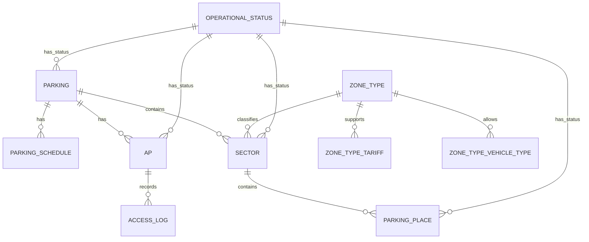

# ERD: домен `FACILITY` (инфраструктура) и `ACCESS_LOG`

**Контекст:** модель в `docs/artifacts/erd/erd-normalized-er-model.md`; сводка сессии — `docs/artifacts/erd/chat-context/chat-context-er-model-review-3-2026-03-31.md`.

## Table of Contents

- [Связь между ключевыми таблицами](#связь-между-ключевыми-таблицами)
- [Таблица `PARKING` (полностью)](#таблица-parking-полностью)
- [Таблица `PARKING_SCHEDULE` (полностью)](#таблица-parking_schedule-полностью)
- [Таблица `SECTOR` (полностью)](#таблица-sector-полностью)
- [Таблица `ZONE_TYPE` (полностью)](#таблица-zone_type-полностью)
- [Таблица `OPERATIONAL_STATUS` (полностью)](#таблица-operational_status-полностью)
- [Таблица `AP` (полностью)](#таблица-ap-полностью)
- [Таблица `PARKING_PLACE` (полностью)](#таблица-parking_place-полностью)
- [Таблица `ZONE_TYPE_VEHICLE_TYPE` (полностью)](#таблица-zone_type_vehicle_type-полностью)
- [Таблица `ZONE_TYPE_TARIFF` (полностью)](#таблица-zone_type_tariff-полностью)
- [Таблица `ACCESS_LOG` (полностью)](#таблица-access_log-полностью)
- [Кросс-контекстные логические ссылки (без REFERENCES)](#кросс-контекстные-логические-ссылки-без-references)
- [Диаграмма связей (Mermaid)](#диаграмма-связей-mermaid)
- [Связанные документы](#связанные-документы)

---

## Связь между ключевыми таблицами

| Сторона A | Кардинальность | Сторона B | Условие |
|-----------|------------------|-----------|---------|
| `PARKING` | **1** | **0..N** | `PARKING_SCHEDULE` |
| `PARKING` | **1** | **0..N** | `SECTOR` |
| `PARKING` | **1** | **0..N** | `AP` |
| `SECTOR` | **1** | **0..N** | `PARKING_PLACE` |
| `ZONE_TYPE` | **1** | **0..N** | `SECTOR` |
| `ZONE_TYPE` | **1** | **0..N** | `ZONE_TYPE_VEHICLE_TYPE` |
| `ZONE_TYPE` | **1** | **0..N** | `ZONE_TYPE_TARIFF` |
| `OPERATIONAL_STATUS` | **1** | **0..N** | `{PARKING, SECTOR, PARKING_PLACE, AP}` |
| `AP` | **1** | **0..N** | `ACCESS_LOG` *(кросс-схемно; логическая ссылка)* |

---

## Таблица `PARKING` (полностью)

Схема: `facility`.

| Поле | Тип PostgreSQL | Null | Ограничения / примечания |
|------|----------------|------|---------------------------|
| `id` | `BIGINT GENERATED BY DEFAULT AS IDENTITY` | NOT NULL | `PRIMARY KEY` |
| `name` | `VARCHAR(200)` | NOT NULL | — |
| `address` | `TEXT` | NOT NULL | — |
| `parking_type` | `VARCHAR(64)` | NOT NULL | `CHECK (parking_type IN ('SURFACE','MULTILEVEL','UNDERGROUND','ROOFTOP'))` |
| `description` | `TEXT` | NULL | — |
| `operational_status_id` | `BIGINT` | NOT NULL | `REFERENCES operational_status(id)` |

---

## Таблица `PARKING_SCHEDULE` (полностью)

Схема: `facility`.

| Поле | Тип PostgreSQL | Null | Ограничения / примечания |
|------|----------------|------|---------------------------|
| `id` | `BIGINT GENERATED BY DEFAULT AS IDENTITY` | NOT NULL | `PRIMARY KEY` |
| `parking_id` | `BIGINT` | NOT NULL | `REFERENCES parking(id)` |
| `day_of_week` | `SMALLINT` | NOT NULL | `CHECK (day_of_week BETWEEN 1 AND 7)` |
| `open_time` | `TIME` | NULL | — |
| `close_time` | `TIME` | NULL | — |
| `is_closed` | `BOOLEAN` | NOT NULL | `DEFAULT false` |
| `effective_from` | `DATE` | NOT NULL | — |
| `effective_to` | `DATE` | NULL | — |

Table Notes (DrawSQL):

- `UNIQUE (parking_id, day_of_week, effective_from)`

---

## Таблица `SECTOR` (полностью)

Схема: `facility`.

| Поле | Тип PostgreSQL | Null | Ограничения / примечания |
|------|----------------|------|---------------------------|
| `id` | `BIGINT GENERATED BY DEFAULT AS IDENTITY` | NOT NULL | `PRIMARY KEY` |
| `parking_id` | `BIGINT` | NOT NULL | `REFERENCES parking(id)` |
| `zone_type_id` | `BIGINT` | NOT NULL | `REFERENCES zone_type(id)` |
| `name` | `VARCHAR(200)` | NOT NULL | — |
| `operational_status_id` | `BIGINT` | NOT NULL | `REFERENCES operational_status(id)` |

---

## Таблица `ZONE_TYPE` (полностью)

Схема: `facility`.

| Поле | Тип PostgreSQL | Null | Ограничения / примечания |
|------|----------------|------|---------------------------|
| `id` | `BIGINT GENERATED BY DEFAULT AS IDENTITY` | NOT NULL | `PRIMARY KEY` |
| `code` | `VARCHAR(64)` | NOT NULL | `UNIQUE` |
| `name` | `VARCHAR(200)` | NOT NULL | — |
| `description` | `TEXT` | NULL | — |

---

## Таблица `OPERATIONAL_STATUS` (полностью)

Схема: `facility` (словарная).

| Поле | Тип PostgreSQL | Null | Ограничения / примечания |
|------|----------------|------|---------------------------|
| `id` | `BIGINT GENERATED BY DEFAULT AS IDENTITY` | NOT NULL | `PRIMARY KEY` |
| `code` | `VARCHAR(64)` | NOT NULL | `UNIQUE` |
| `name` | `VARCHAR(200)` | NOT NULL | — |
| `description` | `TEXT` | NULL | — |

Table Notes (DrawSQL):

- примеры `code`: `ACTIVE`, `MAINTENANCE`, `CLOSED`, `RESERVED`

---

## Таблица `AP` (полностью)

Схема: `facility`.

| Поле | Тип PostgreSQL | Null | Ограничения / примечания |
|------|----------------|------|---------------------------|
| `id` | `BIGINT GENERATED BY DEFAULT AS IDENTITY` | NOT NULL | `PRIMARY KEY` |
| `parking_id` | `BIGINT` | NOT NULL | `REFERENCES parking(id)` |
| `name` | `VARCHAR(200)` | NOT NULL | — |
| `type` | `VARCHAR(32)` | NOT NULL | `CHECK (type IN ('MANUAL','AUTOMATIC','SEMI_AUTO'))` |
| `direction` | `VARCHAR(16)` | NOT NULL | `CHECK (direction IN ('ENTRY','EXIT','BIDIRECTIONAL'))` |
| `operational_status_id` | `BIGINT` | NOT NULL | `REFERENCES operational_status(id)` |

---

## Таблица `PARKING_PLACE` (полностью)

Схема: `facility`.

| Поле | Тип PostgreSQL | Null | Ограничения / примечания |
|------|----------------|------|---------------------------|
| `id` | `BIGINT GENERATED BY DEFAULT AS IDENTITY` | NOT NULL | `PRIMARY KEY` |
| `sector_id` | `BIGINT` | NOT NULL | `REFERENCES sector(id)` |
| `override_tariff_id` | `BIGINT` | NULL | кросс-схемная логическая ссылка на `tariff.tariff(id)` (ADR-003) |
| `place_number` | `VARCHAR(32)` | NOT NULL | — |
| `is_reserved` | `BOOLEAN` | NOT NULL | `DEFAULT false`; зарезервировано (забронировано) |
| `is_occupied` | `BOOLEAN` | NOT NULL | `DEFAULT false`; фактически занято |
| `operational_status_id` | `BIGINT` | NOT NULL | `REFERENCES operational_status(id)` |

---

## Таблица `ZONE_TYPE_VEHICLE_TYPE` (полностью)

Схема: `facility` (таблица связи M:N).

| Поле | Тип PostgreSQL | Null | Ограничения / примечания |
|------|----------------|------|---------------------------|
| `zone_type_id` | `BIGINT` | NOT NULL | `REFERENCES zone_type(id)` |
| `vehicle_type_id` | `BIGINT` | NOT NULL | логическая ссылка на `facility.vehicle_type(id)` (описана в клиентском артефакте) |

Первичный ключ: `PRIMARY KEY (zone_type_id, vehicle_type_id)`.

---

## Таблица `ZONE_TYPE_TARIFF` (полностью)

Схема: `facility` (таблица связи M:N).

| Поле | Тип PostgreSQL | Null | Ограничения / примечания |
|------|----------------|------|---------------------------|
| `zone_type_id` | `BIGINT` | NOT NULL | `REFERENCES zone_type(id)` |
| `tariff_id` | `BIGINT` | NOT NULL | кросс-схемная логическая ссылка на `tariff.tariff(id)` (ADR-003) |

Первичный ключ: `PRIMARY KEY (zone_type_id, tariff_id)`.

---

## Таблица `ACCESS_LOG` (полностью)

Схема: `report` (append-only журнал).

| Поле | Тип PostgreSQL | Null | Ограничения / примечания |
|------|----------------|------|---------------------------|
| `id` | `BIGINT GENERATED BY DEFAULT AS IDENTITY` | NOT NULL | `PRIMARY KEY` |
| `ap_id` | `BIGINT` | NOT NULL | логическая ссылка на `facility.ap(id)` (без `REFERENCES`, ADR-003) |
| `vehicle_id` | `BIGINT` | NULL | логическая ссылка на `client.vehicle(id)` |
| `direction` | `VARCHAR(8)` | NOT NULL | `CHECK (direction IN ('IN', 'OUT'))` |
| `decision` | `VARCHAR(16)` | NOT NULL | `CHECK (decision IN ('ALLOW', 'DENY', 'MANUAL'))` |
| `reason` | `TEXT` | NULL | — |
| `decided_at` | `TIMESTAMPTZ` | NOT NULL | — |

Table Notes (DrawSQL):

- append-only (INSERT only)

---

## Кросс-контекстные логические ссылки (без REFERENCES)

- `facility.PARKING_PLACE.override_tariff_id -> tariff.TARIFF.id`
- `facility.ZONE_TYPE_TARIFF.tariff_id -> tariff.TARIFF.id`
- `facility.ZONE_TYPE_VEHICLE_TYPE.vehicle_type_id -> facility.VEHICLE_TYPE.id` *(описано в `erd-relationships-client-client-profile.md`)*
- `report.ACCESS_LOG.ap_id -> facility.AP.id`
- `report.ACCESS_LOG.vehicle_id -> client.VEHICLE.id`

---

## Диаграмма связей (Mermaid)

---

## Связанные документы

- [ERD (erd-normalized-er-model)](erd-normalized-er-model.md)
- [Контекст ревью ERD, сессия 9+](chat-context/chat-context-er-model-review-3-2026-03-31.md)
- [ADR-003: модульный монолит и схемная изоляция](../../architecture/adr/adr-003-modular-monolith.md)
