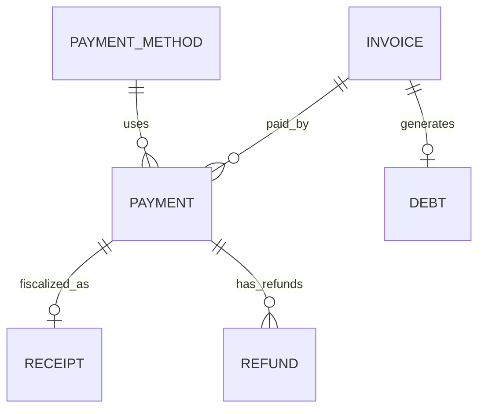

# ERD: домен `PAYMENT` (billing)

**Контекст:** модель в `docs/artifacts/erd/erd-normalized-er-model.md`; сводка сессии — `docs/artifacts/erd/chat-context/chat-context-er-model-review-3-2026-03-31.md`.

## Table of Contents

- [Связь между ключевыми таблицами](#связь-между-ключевыми-таблицами)
- [Таблица `INVOICE` (полностью)](#таблица-invoice-полностью)
- [Таблица `PAYMENT` (полностью)](#таблица-payment-полностью)
- [Таблица `RECEIPT` (полностью)](#таблица-receipt-полностью)
- [Таблица `REFUND` (полностью)](#таблица-refund-полностью)
- [Таблица `DEBT` (полностью)](#таблица-debt-полностью)
- [Таблица `PAYMENT_METHOD` (полностью)](#таблица-payment_method-полностью)
- [Кросс-контекстные логические ссылки (без REFERENCES)](#кросс-контекстные-логические-ссылки-без-references)
- [Table Notes (DrawSQL)](#table-notes-drawsql)
- [Диаграмма связей (Mermaid)](#диаграмма-связей-mermaid)
- [Связанные документы](#связанные-документы)

---

## Связь между ключевыми таблицами

| Сторона A | Кардинальность | Сторона B | Условие |
|-----------|------------------|-----------|---------|
| `INVOICE` | **1** | **0..N** | `PAYMENT` |
| `PAYMENT_METHOD` | **1** | **0..N** | `PAYMENT` |
| `PAYMENT` | **1** | **0..1** | `RECEIPT` |
| `PAYMENT` | **1** | **0..N** | `REFUND` |
| `INVOICE` | **1** | **0..1** | `DEBT` |

---

## Таблица `INVOICE` (полностью)

Схема: `payment`.

| Поле | Тип PostgreSQL | Null | Ограничения / примечания |
|------|----------------|------|---------------------------|
| `id` | `BIGINT GENERATED BY DEFAULT AS IDENTITY` | NOT NULL | `PRIMARY KEY` |
| `booking_id` | `BIGINT` | NULL | логическая ссылка на `booking.booking(id)` (ADR-003) |
| `contract_id` | `BIGINT` | NULL | логическая ссылка на `contract.contract(id)` (ADR-003) |
| `invoice_number` | `VARCHAR(64)` | NOT NULL | `UNIQUE` |
| `type` | `VARCHAR(32)` | NOT NULL | `CHECK (type IN ('SINGLE','PERIODIC'))` |
| `status` | `VARCHAR(32)` | NOT NULL | `CHECK (status IN ('ISSUED','PAID','OVERDUE','CANCELLED'))` |
| `amount_due` | `NUMERIC(19, 4)` | NOT NULL | — |
| `billing_period_from` | `DATE` | NULL | — |
| `billing_period_to` | `DATE` | NULL | — |
| `issued_at` | `DATE` | NOT NULL | — |
| `due_at` | `DATE` | NULL | — |
| `paid_at` | `TIMESTAMPTZ` | NULL | — |

Table Notes (DrawSQL):

- инвариант SINGLE/PERIODIC (условные NOT NULL / NULL):
  - при `type='PERIODIC'`: `contract_id NOT NULL`, `billing_period_from NOT NULL`, `billing_period_to NOT NULL`, `booking_id IS NULL`
  - при `type='SINGLE'`: `booking_id NOT NULL`, `contract_id IS NULL`, `billing_period_from/to IS NULL`
- оплаченная сумма не хранится (`amount_paid` отсутствует): `SELECT COALESCE(SUM(amount), 0) FROM payment WHERE invoice_id=? AND status='COMPLETED'`

---

## Таблица `PAYMENT` (полностью)

Схема: `payment`.

| Поле | Тип PostgreSQL | Null | Ограничения / примечания |
|------|----------------|------|---------------------------|
| `id` | `BIGINT GENERATED BY DEFAULT AS IDENTITY` | NOT NULL | `PRIMARY KEY` |
| `invoice_id` | `BIGINT` | NOT NULL | логическая ссылка на `payment.invoice(id)` (в пределах схемы может быть `REFERENCES`) |
| `amount` | `NUMERIC(19, 4)` | NOT NULL | — |
| `currency` | `CHAR(3)` | NOT NULL | `DEFAULT 'RUB'` |
| `payment_method_id` | `BIGINT` | NOT NULL | `REFERENCES payment_method(id)` |
| `status` | `VARCHAR(32)` | NOT NULL | `CHECK (status IN ('INITIATED','COMPLETED','FAILED','REFUNDED','CANCELLED'))` |
| `initiated_at` | `TIMESTAMPTZ` | NOT NULL | — |
| `completed_at` | `TIMESTAMPTZ` | NULL | — |
| `provider_id` | `VARCHAR(512)` | NULL | idempotency key (partial unique, см. Table Notes) |

Table Notes (DrawSQL):

- `CREATE UNIQUE INDEX ON payment(provider_id) WHERE provider_id IS NOT NULL`

---

## Таблица `RECEIPT` (полностью)

Схема: `payment`.

| Поле | Тип PostgreSQL | Null | Ограничения / примечания |
|------|----------------|------|---------------------------|
| `id` | `BIGINT GENERATED BY DEFAULT AS IDENTITY` | NOT NULL | `PRIMARY KEY` |
| `payment_id` | `BIGINT` | NOT NULL | `REFERENCES payment(id)` |
| `fiscal_number` | `VARCHAR(64)` | NOT NULL | `UNIQUE` |
| `receipt_at` | `TIMESTAMPTZ` | NOT NULL | — |
| `fiscal_status` | `VARCHAR(32)` | NOT NULL | `CHECK (fiscal_status IN ('PENDING','ISSUED','FAILED'))` |
| `amount` | `NUMERIC(19, 4)` | NOT NULL | — |

---

## Таблица `REFUND` (полностью)

Схема: `payment`.

| Поле | Тип PostgreSQL | Null | Ограничения / примечания |
|------|----------------|------|---------------------------|
| `id` | `BIGINT GENERATED BY DEFAULT AS IDENTITY` | NOT NULL | `PRIMARY KEY` |
| `payment_id` | `BIGINT` | NOT NULL | `REFERENCES payment(id)` |
| `amount` | `NUMERIC(19, 4)` | NOT NULL | — |
| `reason` | `TEXT` | NULL | — |
| `refund_provider_id` | `VARCHAR(512)` | NULL | idempotency key (partial unique, см. Table Notes) |
| `status` | `VARCHAR(32)` | NOT NULL | `CHECK (status IN ('INITIATED','COMPLETED','FAILED'))` |
| `initiated_at` | `TIMESTAMPTZ` | NOT NULL | — |
| `completed_at` | `TIMESTAMPTZ` | NULL | — |

Table Notes (DrawSQL):

- `CREATE UNIQUE INDEX ON refund(refund_provider_id) WHERE refund_provider_id IS NOT NULL`

---

## Таблица `DEBT` (полностью)

Схема: `payment`.

| Поле | Тип PostgreSQL | Null | Ограничения / примечания |
|------|----------------|------|---------------------------|
| `id` | `BIGINT GENERATED BY DEFAULT AS IDENTITY` | NOT NULL | `PRIMARY KEY` |
| `invoice_id` | `BIGINT` | NOT NULL | `REFERENCES invoice(id)` |
| `client_id` | `BIGINT` | NOT NULL | логическая ссылка на `client.client(id)` (ADR-003) |
| `amount` | `NUMERIC(19, 4)` | NOT NULL | иммутабельный снимок суммы долга |
| `remaining_amount` | `NUMERIC(19, 4)` | NOT NULL | текущий остаток; `CHECK (remaining_amount >= 0 AND remaining_amount <= amount)` |
| `overdue_since` | `DATE` | NOT NULL | дата просрочки (= `INVOICE.due_at`) |
| `status` | `VARCHAR(32)` | NOT NULL | `CHECK (status IN ('ACTIVE','PAID','WRITTEN_OFF'))` |

Table Notes (DrawSQL):

- `CHECK (remaining_amount >= 0 AND remaining_amount <= amount)` (DrawSQL UI не поддерживает CHECK)
- при `remaining_amount = 0` Payment Service устанавливает `status = 'PAID'` в той же транзакции

---

## Таблица `PAYMENT_METHOD` (полностью)

Схема: `payment` (словарная).

| Поле | Тип PostgreSQL | Null | Ограничения / примечания |
|------|----------------|------|---------------------------|
| `id` | `BIGINT GENERATED BY DEFAULT AS IDENTITY` | NOT NULL | `PRIMARY KEY` |
| `code` | `VARCHAR(64)` | NOT NULL | `UNIQUE` |
| `name` | `VARCHAR(200)` | NOT NULL | — |
| `description` | `TEXT` | NULL | — |

Table Notes (DrawSQL):

- примеры `code`: `CARD`, `SBP`, `ACCOUNT_DEBIT`, `CASH`

---

## Кросс-контекстные логические ссылки (без REFERENCES)

- `payment.INVOICE.booking_id -> booking.BOOKING.id`
- `payment.INVOICE.contract_id -> contract.CONTRACT.id`
- `payment.DEBT.client_id -> client.CLIENT.id`

---

## Table Notes (DrawSQL)

- partial unique индексы:
  - `payment.provider_id`: `CREATE UNIQUE INDEX ON payment(provider_id) WHERE provider_id IS NOT NULL`
  - `refund.refund_provider_id`: `CREATE UNIQUE INDEX ON refund(refund_provider_id) WHERE refund_provider_id IS NOT NULL`

---

## Диаграмма связей (Mermaid)

---

## Связанные документы

- [ERD (erd-normalized-er-model)](erd-normalized-er-model.md)
- [Контекст ревью ERD, сессия 9+](chat-context/chat-context-er-model-review-3-2026-03-31.md)
- [ADR-003: модульный монолит и схемная изоляция](../../architecture/adr/adr-003-modular-monolith.md)
