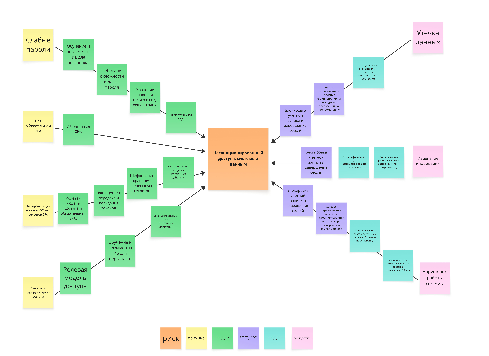

# Bow-Tie: несанкционированный доступ к системе и данным

## Назначение

Артефакт визуализирует один из ключевых ИБ-рисков проекта и показывает связь между причинами риска, центральным событием, последствиями и барьерами управления.

## Контекст и источник

- Этап проекта: Этап 4. Основы информационной безопасности
- Тип артефакта: Bow-Tie Diagram
- Источник: анализ угроз проекта и рабочая диаграмма команды
- Статус: рабочая версия, использованная для конкретизации ИБ-контрмер

## Диаграмма

## Текстовое описание

В центре диаграммы находится риск "Несанкционированный доступ к системе и данным". Слева собраны основные причины и условия возникновения этого риска: слабые пароли, отсутствие обязательной двухфакторной аутентификации, компрометация токенов SSO или секретов второго фактора, ошибки разграничения доступа и организационные пробелы. Между причинами и центральным событием расположены превентивные барьеры: требования к сложности пароля, обязательная 2FA, ролевая модель доступа, ротация и защита токенов, шифрование, журналирование и обучение персонала. Справа показаны последствия инцидента, включая утечку данных, изменение информации и нарушение работы системы, а также уменьшающие и восстанавливающие меры: блокировка учетной записи, завершение сессий, ограничение доступа, расследование, восстановление работы и другие ответные действия.

## Ключевые элементы

- Центральное событие: несанкционированный доступ к системе и данным
- Причины риска: слабые пароли, отсутствие 2FA, ошибки RBAC, компрометация токенов
- Превентивные барьеры: 2FA, парольная политика, защита токенов, шифрование, журналирование
- Последствия: утечка данных, изменение данных, нарушение работы системы
- Реактивные и восстанавливающие барьеры: блокировка, завершение сессий, расследование, восстановление

## Логика артефакта

Bow-Tie отражает логику слева направо: от источников и причин к центральному инциденту, а затем к последствиям. Барьеры до центрального события уменьшают вероятность реализации риска, а барьеры после события снижают масштаб ущерба и ускоряют восстановление. Такой формат полезен тем, что связывает технические и организационные меры в одной картине и помогает проверять полноту ИБ-требований.

## Выводы и решения

- Риск несанкционированного доступа требует одновременно превентивных и реактивных мер.
- Для проекта критичны обязательная 2FA, ролевая модель, защита секретов, журналирование и готовность к реагированию.
- Диаграмма дополняет реестр рисков и помогает перевести ИБ-анализ в конкретные требования к системе.

## Ограничения и открытые вопросы

- Диаграмма иллюстрирует один конкретный риск и не заменяет полный реестр угроз.
- Набор барьеров нужно периодически синхронизировать с архитектурными решениями, интеграциями и НФТ.

## Связанные документы

- [infosec-analyze-parking.md](infosec-analyze-parking.md)
- [threat-vulnerability-remediation-context.md](threat-vulnerability-remediation-context.md)
- [context/bow-tie-examples.md](context/bow-tie-examples.md)
- [../../specs/nonfunctional-requirements/nfr-external-quality.md](../../specs/nonfunctional-requirements/nfr-external-quality.md)
