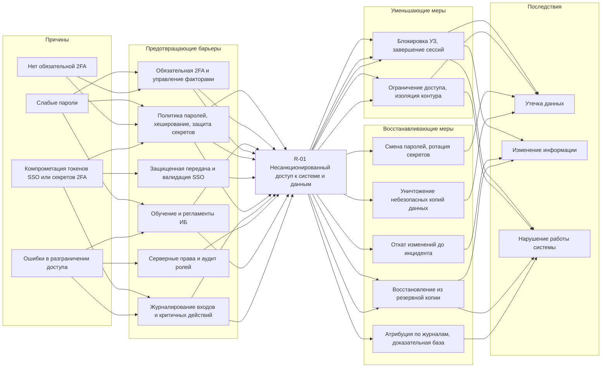
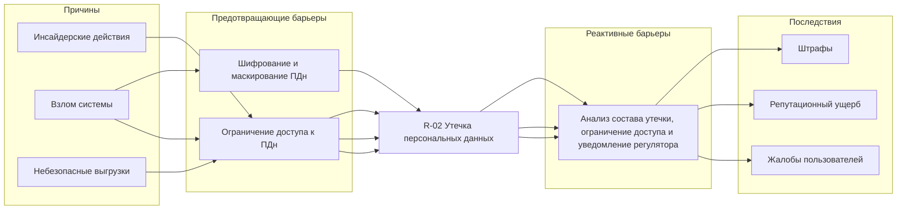

# Примеры диаграммы "Галстук-бабочка" (Bow-Tie)

Эта страница подготовлена по приложенным изображениям и служит **примером формы** для наших Bow-Tie диаграмм по рискам из ИБ-артефакта (`docs/artifacts/infosec/infosec-analyze-parking.md`).

## Шаблон (общая логика)

### Расшифровка элементов шаблона

- **Слева (Причины)**: источники угроз и уязвимости, которые могут привести к реализации риска.
- **Барьеры (слева от центра)**: предотвращающие меры (preventive barriers), снижают вероятность наступления центрального события.
- **Центр (Риск / Top Event)**: центральное событие, которое описывает "что именно пошло не так" (одна фраза, максимально конкретно).
- **Барьеры (справа от центра)**:
  - уменьшающие меры (mitigative barriers), снижают тяжесть последствий;
  - восстанавливающие меры (recovery barriers), ускоряют восстановление и возврат в нормальный режим.
- **Справа (Последствия)**: последствия для бизнеса/ИБ (конфиденциальность, целостность, доступность, финансы, репутация и т.п.).

Рекомендуемый порядок работы:

1. Выбрать риск (`R-xx`) и сформулировать **центральное событие** (Top Event).
2. Слева перечислить 3–7 причин (угроза + уязвимость), которые реально актуальны для проекта.
3. Для каждой причины указать 1–3 предотвращающих барьера (контрмеры).
4. Справа перечислить последствия (3–7 пунктов).
5. Для каждого последствия указать уменьшающие/восстанавливающие барьеры.

## Пример (раскрытие медданных)

> В изображении показан пример на другой предметной области ("раскрытие мед.данных"). Мы используем его только как пример структуры: причины → барьеры → риск → барьеры → последствия.

### Транскрипция основных узлов (как прочитано с изображения)

#### Центральное событие (риск)

- **Раскрытие мед.данных**

#### Причины (слева)

- **Плохое обучение сотрудников**
- **Несоответствие квалификации персонала**
- **Избыточный уровень доступа к информации**
- **Несоблюдение регламентов ИБ**
- **Саботаж**

#### Предотвращающие меры (слева, зеленые стикеры)

- **Организация обучения**
- **Тестирование персонала на знание ИБ**
- **Шифрование данных**
- **Многофакторная авторизация**
- **Ролевая модель доступа**
- **Регулярное обновление паролей**
- **Проверка кандидата СБ при найме**
- **Журналирование**

#### Реакция/восстановление и уменьшающие меры (справа, фиолетовые/бирюзовые стикеры)

- **Блокировка учетной записи**
- **Изменение всех паролей в системе**
- **Мероприятия по устранению уязвимостей (из мат. куда?)** (формулировка на изображении частично неразборчива)
- **Маркетинговые меры по восстановлению репутации**
- **Обращение в суд на виновника**

#### Последствия (справа, розовые стикеры)

- **Утечка информации**
- **Регуляторные риски**
- **Отток клиентов**
- **Потеря прибыли**
- **Судебные иски**
- **Штрафы по закону об обработке ПД** (формулировка на изображении частично неразборчива)

## Как использовать это как пример для парковки

Для наших рисков (например, `R-02 Утечка персональных данных`, `R-07 Потеря доступности системы`, `R-08 Компрометация системы через загрузку файлов`) аналогично:

- центр: одно центральное событие;
- слева: источники угроз + уязвимости из `infosec-analyze-parking.md`;
- справа: последствия из реестра рисков;
- барьеры: контрмеры из раздела "Контрмеры по рискам".

## Bow-Tie для парковки: R-01 "Несанкционированный доступ к системе и данным"

Ниже приведен пример Bow-Tie для риска **R-01** с формулировками, согласованными с [реестром рисков и контрмерами](../infosec-analyze-parking.md#реестр-рисков-иб) и разделом [«Чувствительные данные и методы защиты»](../infosec-analyze-parking.md#чувствительные-данные-и-методы-защиты) в `infosec-analyze-parking.md`.

### Пояснение по правому берегу диаграммы

- **Уменьшающие меры** — быстро останавливают активный несанкционированный доступ и снижают текущий ущерб (локализация инцидента).
- **Восстанавливающие меры** — возвращают защищаемые данные и сервис к приемлемому состоянию: отзыв доверия к скомпрометированным учетным данным, откат целостности, восстановление доступности, расследование по следам (в том числе в духе практики разборов инцидентов с чувствительными данными, вроде телемедицины).

### Текстовая диаграмма

**Центральное событие (риск)**:

- **R-01 Несанкционированный доступ к системе и данным**

**Причины (слева)**:

- **Слабые пароли**
- **Нет обязательной 2FA**
- **Компрометация токенов SSO или секретов 2FA**
- **Ошибки в разграничении доступа**

**Предотвращающие барьеры (слева от центра)**:

- **NFR-R01-P1. Политика паролей, хеширование и защита секретов при хранении**
  - Требования к сложности и длине пароля; хранение паролей только в виде хеша с солью; запрет хранения в открытом виде.
  - Ограничение числа попыток входа; блокировка учетной записи при подозрительной активности.
  - Шифрование при хранении секретов TOTP и токенов SSO; запрет вывода секретов в логи и интерфейсы без необходимости.
- **NFR-R01-P2. Обязательная 2FA для внутренних ролей и управление факторами**
  - 2FA по TOTP для охранника, управляющего, владельца (как в матрице аутентификации в ИБ-артефакте).
  - Процедура сброса и перевыпуска 2FA при компрометации или увольнении.
- **NFR-R01-P3. Передача и обработка токенов SSO в защищенном виде**
  - Передача только по TLS/HTTPS; проверка подписи и срока действия токена; короткие интервалы жизни там, где это уместно.
  - Не передавать токены в URL и реферерах; не журналировать тело токена; ограничить аудиторию и область применения токена.
- **NFR-R01-P4. Серверное разграничение доступа и пересмотр ролей (без замены политикой «только 2FA»)**
  - Проверка полномочий на сервере при каждом обращении к объекту; принцип минимально необходимых прав.
  - Периодический аудит матрицы ролей и исправление ошибочно выданных прав (см. также V-01 в ИБ-артефакте).
- **NFR-R01-P5. Обучение и регламенты ИБ для персонала**
  - Вводный инструктаж по учетным записям и работе с ПДн; ежегодное обновление краткого регламента.
- **NFR-R01-P6. Журналирование входов и критичных действий**
  - Логирование входов, смены ролей, ручного открытия шлагбаума и прочих критичных операций из реестра ИБ-артефакта.

**Группировка по веткам слева (причина → предотвращающая мера)**:

- **Слабые пароли**
  - NFR-R01-P1 (политика паролей, хеширование, лимиты попыток, шифрование секретов при хранении).
  - NFR-R01-P2 (2FA как дополнительный барьер к украденному паролю).
  - NFR-R01-P5.
- **Нет обязательной 2FA**
  - NFR-R01-P2.
  - NFR-R01-P1 (сильный первый фактор не отменяет необходимости 2FA для внутренних ролей).
- **Компрометация токенов SSO или секретов 2FA**
  - NFR-R01-P3 (защищенная передача и валидация токенов).
  - NFR-R01-P1 (шифрование хранения, перевыпуск секретов).
  - NFR-R01-P6 (следы для расследования).
- **Ошибки в разграничении доступа**
  - NFR-R01-P4 (серверные проверки и аудит ролей — опора не на «отсутствие 2FA», а на модель прав и процедуры).
  - NFR-R01-P5, NFR-R01-P6.

**Последствия (справа)**:

- Утечка данных.
- Изменение информации.
- Нарушение работы системы.

**Уменьшающие меры (справа от центра)**:

- **NFR-R01-M1. Блокировка учетной записи и завершение сессий**
  - Заблокировать подозрительную учетную запись; принудительно завершить активные сессии и отозвать выпущенные токены обновления, где применимо.
- **NFR-R01-M2. Сетевое ограничение и изоляция административного контура при подозрении на компрометацию**
  - Временно сузить доступ с подозрительных адресов или сегментов до минимума, необходимого для расследования.

**Восстанавливающие меры (справа от центра)**:

- **NFR-R01-R1. Принудительная смена паролей и ротация скомпрометированных секретов**
  - Обязательная смена пароля для затронутых и смежных учетных записей; перевыпуск секретов 2FA; ротация ключей интеграций и параметров SSO при выявлении компрометации.
- **NFR-R01-R2. Уничтожение данных недопустимого распространения**
  - Обеспечить безопасное удаление локальных копий и черновых выгрузок, если выявлены вне контура; отозвать разосланные файлы/ссылки там, где это возможно; сократить дальнейшее копирование утечки (в дополнение к уведомлениям по ПДн — см. реактивные меры R-02 в ИБ-артефакте).
- **NFR-R01-R3. Откат информации до несанкционированного изменения**
  - Восстановление затронутых записей из резервной копии на контрольную дату или применение журнала аудита для отката к согласованному состоянию.
- **NFR-R01-R4. Восстановление работы системы из резервной копии и по регламенту**
  - Восстановление БД и критичных компонентов из шифрованных резервных копий (согласовано с R-06/V-08 в ИБ-артефакте); проверка целостности после восстановления.
- **NFR-R01-R5. Идентификация злоумышленника и фиксация доказательной базы**
  - Корреляция журналов (время входа, IP, устройство, измененные объекты); сохранение цепочек для внутреннего разбора и при необходимости для передачи в уполномоченные органы (подход аналогичен расследованию несанкционированного доступа к чувствительным данным в телемедицине).

**Группировка по веткам справа (последствие → барьеры)**:

- **Утечка данных**
  - Уменьшающие: NFR-R01-M1, NFR-R01-M2.
  - Восстанавливающие: NFR-R01-R1 (смена паролей и ротация секретов), NFR-R01-R2 (уничтожение небезопасных копий и ограничение распространения), при необходимости сценарии уведомления регулятора по ПДн (кросс-ссылка на R-02).
- **Изменение информации**
  - Уменьшающие: NFR-R01-M1.
  - Восстанавливающие: NFR-R01-R3 (откат до состояния до изменения), при массовых повреждениях — NFR-R01-R4.
- **Нарушение работы системы**
  - Уменьшающие: NFR-R01-M1, NFR-R01-M2 (локализация влияния на доступность).
  - Восстанавливающие: NFR-R01-R4 (восстановление сервиса и данных из резервных копий), NFR-R01-R5 (расследование и атрибуция действий по журналам; меры против повторения).

### Mermaid

## Bow-Tie для парковки: R-02 "Утечка персональных данных"

Ниже приведен пример Bow-Tie для риска **R-02** с формулировками, которые соответствуют `docs/artifacts/infosec/infosec-analyze-parking.md`.

### Текстовая диаграмма

**Центральное событие (риск)**:

- **R-02 Утечка персональных данных**

**Причины (слева)**:

- **Взлом системы**
- **Инсайдерские действия**
- **Небезопасные выгрузки**

**Предотвращающие барьеры (слева от центра)**:

- **Шифрование и маскирование ПДн**
  - Защитить ПДн в БД.
  - Ограничить отображение чувствительных полей.
- **Ограничение доступа к ПДн**
  - Ограничить просмотр, поиск и массовые выгрузки по ролям.

**Группировка барьеров по веткам (для размещения на стрелках)**:

- **Взлом системы**
  - Шифрование и маскирование ПДн.
  - Ограничение доступа к ПДн.
- **Инсайдерские действия**
  - Ограничение доступа к ПДн.
- **Небезопасные выгрузки**
  - Ограничение доступа к ПДн.

**Последствия (справа)**:

- Штрафы.
- Репутационный ущерб.
- Жалобы пользователей.

**Реактивные барьеры (справа от центра)**:

- **Анализ состава утечки, ограничение доступа и уведомление регулятора**
  - Провести разбор инцидента.
  - Определить объем затронутых ПДн.
  - Закрыть источник утечки.
  - При наличии оснований уведомить Роскомнадзор: в течение 24 часов — об инциденте, в течение 72 часов — о результатах внутреннего расследования.

### Mermaid

