# Временная ER-модель с нормализацией

## Table of Contents

- [Related Documents](#related-documents)
- [Назначение документа](#назначение-документа)
- [Легенда имен](#легенда-имен)
- [Соглашения по типам данных (PostgreSQL)](#соглашения-по-типам-данных-postgresql)
- [Атрибуты по сущностям (PostgreSQL)](#атрибуты-по-сущностям-postgresql)
- [Таблицы](#таблицы)
- [Сводка ключевых связей](#сводка-ключевых-связей)
- [Замечания по реализации](#замечания-по-реализации)
- [Статус документа](#статус-документа)

## Related Documents

- [Концептуальная модель с атрибутами](conceptual-model-with-attributes.md)
- [Нормализация сущности Клиент (предложение)](temp-client-entity-normalization-proposal.md)
- [ADR-002: бронирование и парковочная сессия](../architecture/adr/adr-002-booking-vs-session.md)
- [Глоссарий проекта](project-glossary.md)
- [ФТ: парковочная сессия](../specs/functional-requirements/fr-parking-session.md)

```mermaid
erDiagram
    PARKING ||--o{ PARKING_SCHEDULE : has
    PARKING ||--o{ SECTOR : contains
    PARKING ||--o{ KPP : has

    ZONE_TYPE ||--o{ SECTOR : classifies
    ZONE_TYPE ||--o{ ZONE_TYPE_VEHICLE_TYPE : allows
    VEHICLE_TYPE ||--o{ ZONE_TYPE_VEHICLE_TYPE : allowed_for
    ZONE_TYPE ||--o{ ZONE_TYPE_TARIFF : supports
    TARIFF ||--o{ ZONE_TYPE_TARIFF : applies_to
    TARIFF ||--o{ TARIFF_RATE : has_rates

    SECTOR ||--o{ PARKING_PLACE : contains
    TARIFF ||--o{ PARKING_PLACE : overrides

    CLIENT ||--o| CLIENT_PROFILE : has
    CLIENT |o--o| ORGANIZATION : belongs_to
    CLIENT ||--|| NOTIFICATION_SETTINGS : has
    NOTIFICATION_SETTINGS ||--o{ NOTIFICATION_SETTINGS_CHANNEL : has
    CLIENT ||--|| PAYMENT_SETTINGS : has
    CLIENT ||--o{ CLIENT_ACCOUNT : authenticates
    CLIENT ||--o{ VEHICLE : owns
    CLIENT ||--o{ CONSENT : gives
    CLIENT ||--o{ NOTIFICATION : receives
    CLIENT ||--o{ APPEAL : creates

    CLIENT_PROFILE o|--|| PASSPORT_DATA : uses
    CLIENT_PROFILE o|--o| BENEFIT_DOCUMENT : has
    ORGANIZATION ||--o{ ORGANIZATION_BANK_ACCOUNT : has

    CONTRACT_TEMPLATE ||--o{ CONTRACT : generates
    CLIENT ||--o{ CONTRACT : has

    VEHICLE_TYPE ||--o{ VEHICLE : classifies

    CONTRACT ||--o{ BOOKING : governs
    VEHICLE ||--o{ BOOKING : booked_for
    PARKING_PLACE ||--o{ BOOKING : reserved_as
    TARIFF ||--o{ BOOKING : priced_by

    BOOKING ||--o{ PARKING_SESSION : results_in
    KPP ||--o{ PARKING_SESSION : entry_exit_for
    EMPLOYEE ||--o{ PARKING_SESSION : handles
    EMPLOYEE ||--|| EMPLOYEE_CREDENTIAL : authenticates

    BOOKING ||--o{ INVOICE : billed_as
    INVOICE ||--o{ PAYMENT : paid_by
    PAYMENT ||--o| RECEIPT : fiscalized_as
    PAYMENT ||--o{ REFUND : has_refunds
    INVOICE ||--o| DEBT : generates

    EMPLOYEE ||--o{ NOTIFICATION : initiates
    NOTIFICATION_TEMPLATE ||--o{ NOTIFICATION : generates

    EMPLOYEE ||--o{ APPEAL : handles

    PARKING {
        uuid id
        string name
        string address
        string type
        string description
        string operational_status
    }

    PARKING_SCHEDULE {
        uuid id
        uuid parking_id
        int day_of_week
        time open_time
        time close_time
        bool is_closed
        date effective_from
        date effective_to
    }

    SECTOR {
        uuid id
        uuid parking_id
        uuid zone_type_id
        string name
        string operational_status
    }

    ZONE_TYPE {
        uuid id
        string code
        string name
        string description
    }

    VEHICLE_TYPE {
        uuid id
        string code
        string name
        string description
    }

    ZONE_TYPE_VEHICLE_TYPE {
        uuid zone_type_id
        uuid vehicle_type_id
    }

    ZONE_TYPE_TARIFF {
        uuid zone_type_id
        uuid tariff_id
    }

    PARKING_PLACE {
        uuid id
        uuid sector_id
        uuid override_tariff_id
        string place_number
        string operational_status
    }

    CLIENT {
        uuid id
        string type
        string phone
        string email
        string status
        string status_reason
        int organization_id
    }

    CLIENT_PROFILE {
        uuid client_id
        string last_name
        string first_name
        string middle_name
        uuid passport_data_id
        uuid benefit_document_id
    }

    CLIENT_ACCOUNT {
        uuid id
        uuid client_id
        string auth_provider
        string login
        string password_hash
        string provider_subject_id
        string account_status
        datetime created_at
        datetime last_login_at
    }

    NOTIFICATION_SETTINGS {
        uuid id
        uuid client_id
        bool parking_session_enabled
        bool booking_enabled
        bool contract_enabled
        bool payment_enabled
        bool marketing_enabled
    }

    NOTIFICATION_SETTINGS_CHANNEL {
        int settings_id
        string channel
    }

    PAYMENT_SETTINGS {
        uuid id
        uuid client_id
        string external_payer_id
        bool auto_debit_contract
        bool auto_debit_parking_session
        decimal monthly_limit
    }

    PASSPORT_DATA {
        uuid id
        string document_type
        string series_and_number
        date issue_date
        string issued_by
        string department_code
    }

    BENEFIT_DOCUMENT {
        uuid id
        string benefit_category
        string document_type
        string document_number
        date issue_date
        date expiry_date
        string document_image_ref
        string verification_status
    }

    ORGANIZATION {
        uuid id
        string name
        string legal_form
        string legal_address
        string actual_address
        string inn
        string kpp
        string ogrn
        string email
        string phone
        string status
    }

    ORGANIZATION_BANK_ACCOUNT {
        uuid id
        uuid organization_id
        string bank_name
        string bik
        string account_number
        string correspondent_account
        bool is_primary
    }

    CONSENT {
        uuid id
        uuid client_id
        string consent_type
        bool consent_given
        datetime given_at
        datetime revoked_at
    }

    EMPLOYEE {
        uuid id
        string role
        string last_name
        string first_name
        string middle_name
        string phone
        string email
        string status
    }

    EMPLOYEE_CREDENTIAL {
        uuid employee_id
        string login
        string password_hash
        string totp_secret_encrypted
        string account_status
    }

    VEHICLE {
        uuid id
        uuid client_id
        uuid vehicle_type_id
        string license_plate
        string brand
        string model
        string color
    }

    KPP {
        uuid id
        uuid parking_id
        string name
        string type
        string direction
        string status
    }

    TARIFF {
        uuid id
        string name
        string type
        string benefit_category
        string billing_step_unit
        int billing_step_value
        decimal max_amount
        int grace_period_minutes
        date effective_from
        date effective_to
    }

    TARIFF_RATE {
        uuid id
        uuid tariff_id
        decimal rate
        int day_of_week
        time time_from
        time time_to
        int priority
    }

    CONTRACT_TEMPLATE {
        uuid id
        string code
        string name
        string version
        string type
        string body
        date effective_from
        date effective_to
    }

    CONTRACT {
        uuid id
        uuid client_id
        uuid contract_template_id
        string contract_number
        date start_date
        date end_date
        string status
        string document_file_ref
    }

    BOOKING {
        uuid id
        string booking_number
        uuid vehicle_id
        uuid parking_place_id
        uuid contract_id
        uuid tariff_id
        datetime start_at
        datetime end_at
        int duration_minutes
        string license_plate_snapshot
        string type
        string status
        decimal amount_due
    }

    INVOICE {
        uuid id
        uuid booking_id
        uuid contract_id
        string invoice_number
        string type
        string status
        decimal amount_due
        date billing_period_from
        date billing_period_to
        date issued_at
        date due_at
        datetime paid_at
    }

    PARKING_SESSION {
        uuid id
        uuid booking_id
        uuid entry_kpp_id
        uuid exit_kpp_id
        uuid employee_id
        datetime entry_time
        datetime exit_time
        string license_plate_snapshot
        string access_method
        string access_comment
        string status
    }

    PAYMENT {
        uuid id
        uuid invoice_id
        decimal amount
        string currency
        string payment_method
        string status
        datetime initiated_at
        datetime completed_at
        string provider_id
    }

    RECEIPT {
        uuid id
        uuid payment_id
        string fiscal_number
        datetime receipt_at
        string fiscal_status
        decimal amount
    }

    REFUND {
        bigint id
        bigint payment_id
        decimal amount
        string reason
        string refund_provider_id
        string status
        datetime initiated_at
        datetime completed_at
    }

    DEBT {
        bigint id
        bigint invoice_id
        int client_id
        decimal amount
        date overdue_since
        string status
    }

    NOTIFICATION_TEMPLATE {
        uuid id
        string code
        string name
        string type
        string subject
        string body
    }

    NOTIFICATION {
        uuid id
        uuid notification_template_id
        uuid client_id
        uuid initiator_employee_id
        string channel
        string delivery_address
        string delivery_status
    }

    APPEAL {
        uuid id
        uuid client_id
        uuid employee_id
        string subject_type
        uuid subject_id
        string type
        string channel
        string subject
        string description
        string status
    }
```



> В блоке `erDiagram` выше типы атрибутов условные (`uuid`, `string`, …) и не задают физическую схему. Полный перечень атрибутов с целевыми типами PostgreSQL — в разделе [Атрибуты по сущностям (PostgreSQL)](#атрибуты-по-сущностям-postgresql); политика PK, деньги и время — в [Соглашения по типам данных (PostgreSQL)](#соглашения-по-типам-данных-postgresql).

## Назначение документа

Этот документ фиксирует **временную нормализованную ER-модель** на основе текущей концептуальной модели предметной области парковочной платформы.

Связь «бронирование — парковочная сессия» и отсутствие парковочной сессии без бронирования согласованы с решением **Option D** в [ADR-002](../architecture/adr/adr-002-booking-vs-session.md) (сессия опирается на `BOOKING`).

Цель модели:

- показать, как концептуальные сущности могут быть преобразованы в более строгую логическую схему;
- устранить основные замечания по 1НФ, 3НФ и 4НФ;
- зафиксировать кандидатов в будущие таблицы и связи между ними.

Основные отличия от исходной концептуальной модели:

- `Клиент` разделен на общую сущность, подтипы `КлиентФЛ` и `КлиентЮЛ`, а также `Учетная запись клиента`;
- `Организация.банковскиеРеквизиты` вынесены в отдельную таблицу `ORGANIZATION_BANK_ACCOUNT`;
- `Парковка.временнойРежим` вынесен в отдельную таблицу `PARKING_SCHEDULE`;
- `Счет` (`INVOICE`) выделен как отдельная сущность финансового требования между основанием начисления и фактом оплаты;
- полиморфная ссылка в `Обращение` заменена набором явных nullable-FK на допустимые предметы обращения;
- `M:N` связи оформлены отдельными таблицами.

## Легенда имен

В Mermaid используются ASCII-имена сущностей и атрибутов для совместимости с редакторами и рендерерами; в тексте ниже пояснения по-русски. Две линии `CLIENT` — `CONTRACT` (`signs` и `owns`) отражают одну доменную связь «клиент — договор» в разных группах связей на диаграмме; при необходимости диаграмму можно упростить до одной линии.

## Соглашения по типам данных (PostgreSQL)

Раздел согласован с целевыми практиками производительности и эксплуатации (индексы под FK, компактные ключи, денежная точность) в духе ролей **database-optimizer** и **backend-architect**: не подменяет физическую миграцию и может уточняться при реализации.

### Идентификаторы: не везде `BIGINT`

В PostgreSQL разница — **4 байта** у `INTEGER` против **8 байт** у `BIGINT` на значение в PK/FK и в индексах; на больших объемах это заметно, но для большинства одной установки парковочной платформы узкое место чаще в запросах и индексах, а не в типе int. Имеет смысл **разделять по смыслу нагрузки и роста**, а не ставить `BIGINT` всем подряд.

| Уровень | Тип PK/FK | Когда применять |
|---------|-----------|-----------------|
| **Справочники и инфраструктура** | **`INTEGER`** (`GENERATED … AS IDENTITY` / `SERIAL`) | Кардинальность в одной БД ожидается далеко ниже **2·10^9** строк: типы зон и ТС, тариф как строка справочника, парковки, сектора, КПП, места, шаблоны договоров и уведомлений, сотрудники, организации, клиенты, ТС, договоры, паспорт/льгота как документы, настройки клиента, график парковки. |
| **Потоки событий и денег** | **`BIGINT`** | Непрерывные вставки и длинный горизонт хранения без риска исчерпания диапазона: **бронирования, счета, платежи, парковочные сессии, чеки**, экземпляры **уведомлений**, **обращения**; при необходимости — **согласия** и **учетные записи клиента**, если политика хранения предполагает очень большие объемы. |
| **Узкие числовые домены** | **`SMALLINT`** | Только где диапазон гарантированно мал: например **день недели** 1–7 (с `CHECK`), редко — иные малые коды. |
| **Публичный / внешний id** | **`UUID`** | Точечно: публичный API, сквозные ключи между системами; опционально **`public_id UUID UNIQUE`** рядом с внутренним **`INTEGER` или `BIGINT`**. |

- **Тип FK** всегда совпадает с типом целевого PK (включая `NULL` для опциональных связей). Смешивать в одной схеме `INTEGER` и `BIGINT` для разных таблиц — нормально; главное — **согласованность в связке родитель–потомок**.
- Справочники с полем **`code`** — по-прежнему `VARCHAR` + `UNIQUE`; PK остается числовым (`INTEGER` или `BIGINT` по строке таблицы ниже), если не принято решение о текстовом PK для крошечного справочника.

### Деньги, время, текст, булевы

- Суммы в валюте (тарифы, бронь, счет, платеж, чек, лимиты) — **`NUMERIC(19, 4)`** (или уже согласованная точность домена); тип `money` в PostgreSQL для целевой схемы не использовать как дефолт.
- Моменты событий (въезд, выезд, оплата, уведомления, согласия) — **`TIMESTAMPTZ`**; календарные даты без времени суток — **`DATE`**.
- Длительность в минутах (`duration_minutes`, льготные/тарифные интервалы) — **`INTEGER`**: диапазона `SMALLINT` может не хватить (например сутки = 1440 минут; длинные периоды — больше).
- Для **минут льготы/тарифа** (`grace_period_minutes` и т.п.) — тоже **`INTEGER`**, если домен допускает значения больше ~32767; иначе — `SMALLINT` + `CHECK`.
- Строки: осмысленные лимиты — **`VARCHAR(n)`**; длинный неструктурированный текст — **`TEXT`** (`CONTRACT_TEMPLATE.body`, описания, комментарии).
- Флаги — **`BOOLEAN`**.

### Идемпотентность и внешние платежные ссылки

- Идентификатор операции у провайдера и ключи идемпотентности — **`TEXT`** или **`VARCHAR(512)`** с **`UNIQUE`** по канонической строке от PSP, без принудительного приведения к UUID, если формат в контракте не фиксирован как UUID.
- Поле вроде `provider_subject_id` у учетной записи — **`VARCHAR(255)`** или **`TEXT`** по фактической длине у IdP.

### Сводка: сущность — PK и типы ключевых полей

В таблице ниже **PK/FK** — целочисленные; **`INT`** = `INTEGER`. Тип FK в дочерней таблице совпадает с типом PK родителя.

| Сущность | PK | Ключевые атрибуты (целевой PostgreSQL) |
|----------|-----|----------------------------------------|
| `PARKING` | INT | `name` VARCHAR, `address` TEXT, прочие строки VARCHAR/TEXT по смыслу |
| `PARKING_SCHEDULE` | INT | FK **INT** на парковку; `day_of_week` **SMALLINT** + `CHECK` 1–7; `open_time`/`close_time` TIME; даты DATE |
| `SECTOR` | INT | FK **INT** на парковку и на тип зоны |
| `ZONE_TYPE`, `VEHICLE_TYPE` | INT | `code` VARCHAR UNIQUE; наименования VARCHAR/TEXT |
| `ZONE_TYPE_VEHICLE_TYPE`, `ZONE_TYPE_TARIFF` | составной PK (INT, INT) | FK типов совпадают с PK `ZONE_TYPE` / `VEHICLE_TYPE` / `TARIFF` |
| `PARKING_PLACE` | INT | `place_number` VARCHAR; FK **INT** на сектор и опционально на тариф |
| `CLIENT` | INT | `type` CHECK('FL','UL'); `status` CHECK; `organization_id` INTEGER nullable `REFERENCES organization(id)` (инта-схемный FK) |
| `CLIENT_PROFILE` | PK = FK **INT** (`client_id`) | только для FL; `passport_data_id`/`benefit_document_id` — логические FK в схему `pii` |
| `CLIENT_ACCOUNT` | **BIGINT** (или INT при умеренном объеме) | схема `auth`; `login` VARCHAR; `auth_provider` VARCHAR |
| `NOTIFICATION_SETTINGS`, `PAYMENT_SETTINGS` | INT | FK `client_id` INTEGER NOT NULL UNIQUE; булевы BOOLEAN; `monthly_limit` NUMERIC(19,4) |
| `NOTIFICATION_SETTINGS_CHANNEL` | составной PK (INT, VARCHAR) | FK INT на `NOTIFICATION_SETTINGS`; `channel` VARCHAR CHECK('SMS','EMAIL','PUSH') |
| `PASSPORT_DATA`, `BENEFIT_DOCUMENT` | INT | схема `pii` (152-ФЗ); `series_and_number` BYTEA (зашифровано); даты DATE |
| `ORGANIZATION` | INT | ИНН/КПП/ОГРН VARCHAR; адреса TEXT |
| `ORGANIZATION_BANK_ACCOUNT` | INT | FK **INT** на организацию; реквизиты VARCHAR; `is_primary` BOOLEAN |
| `CONSENT` | **BIGINT** (или INT) | FK **INT** на клиента; `given_at`/`revoked_at` TIMESTAMPTZ — при очень большом числе строк предпочтительнее **BIGINT** PK |
| `EMPLOYEE` | INT | контакты VARCHAR; credential-данные вынесены в `EMPLOYEE_CREDENTIAL` (схема `auth`) |
| `EMPLOYEE_CREDENTIAL` | INT (PK=FK) | схема `auth`; `login` VARCHAR UNIQUE; `totp_secret_encrypted` TEXT |
| `VEHICLE` | INT | FK **INT** на клиента и тип ТС; `license_plate` VARCHAR `UNIQUE` (с нормализацией) |
| `KPP` | INT | FK **INT** на парковку; `direction` VARCHAR `CHECK` |
| `TARIFF` | INT | `billing_step_unit` VARCHAR CHECK; `billing_step_value` INTEGER; `effective_from/to` DATE; нет поля `rate` — в `TARIFF_RATE` |
| `TARIFF_RATE` | INT | FK **INT** на тариф; `rate` NUMERIC(19,4); `day_of_week` SMALLINT; `time_from/to` TIME |
| `CONTRACT_TEMPLATE` | INT | `body` TEXT; период DATE |
| `CONTRACT` | INT | FK **INT** на клиента; `contract_number` VARCHAR `UNIQUE`; файл VARCHAR/TEXT ref |
| `BOOKING` | **BIGINT** | PK брони — **BIGINT**; FK на ТС, место, договор, тариф — логические (без REFERENCES); `start_at`/`end_at` TIMESTAMPTZ; `license_plate_snapshot` VARCHAR; `amount_due` NUMERIC(19,4) |
| `INVOICE` | **BIGINT** | `booking_id` **BIGINT** nullable; `invoice_number` VARCHAR `UNIQUE`; `type` CHECK('SINGLE','PERIODIC'); `billing_period_from/to` DATE; `amount_due` NUMERIC(19,4); оплаченная сумма — вычислять через `SUM(payment.amount)` |
| `PARKING_SESSION` | **BIGINT** | FK на бронирование (логический); `duration_minutes` GENERATED ALWAYS AS STORED; `license_plate_snapshot` VARCHAR |
| `PAYMENT` | **BIGINT** | FK **BIGINT** на счет; `amount` NUMERIC(19,4); время TIMESTAMPTZ; идемпотентность/внешний id — TEXT/VARCHAR UNIQUE |
| `RECEIPT` | **BIGINT** | FK **BIGINT** на платеж; сумма NUMERIC(19,4); `receipt_at` TIMESTAMPTZ |
| `REFUND` | **BIGINT** | схема `payment`; FK **BIGINT** на `PAYMENT`; `amount` NUMERIC(19,4); `refund_provider_id` VARCHAR PARTIAL UNIQUE; `status` CHECK |
|| `DEBT` | **BIGINT** | схема `payment`; FK **BIGINT** на `INVOICE`; `client_id` INTEGER логический; `amount` NUMERIC(19,4); `overdue_since` DATE; `status` CHECK |
| `NOTIFICATION_TEMPLATE` | INT | `body` TEXT; `subject` VARCHAR |
| `NOTIFICATION` | **BIGINT** | схема `notification`; FK без REFERENCES; `delivery_address` VARCHAR(320) NOT NULL |
| `APPEAL` | **BIGINT** | схема `support`; `subject_type` VARCHAR CHECK; `subject_id` BIGINT; CHECK((subject_type IS NULL)=(subject_id IS NULL)) |

**Смешение `INT` и `BIGINT`:** у таблицы с **`BIGINT` PK** столбцы FK на родителей с **`INTEGER` PK** остаются типа **`INTEGER`** — в PostgreSQL так и задают (PK шире, чем FK-ссылка на «толстый» корень не нужна). Унификация «везде `BIGINT` для PK» упрощает правила ценой размера индексов на справочниках; «везде `INT`» экономит место, но для **BOOKING/PAYMENT/SESSION** запас по диапазону меньше — для потоковых таблиц разумнее **`BIGINT` PK**.

Индексы: на каждом столбце FK на стороне «многие» — B-tree (и частичные индексы под типовые `WHERE`, когда появятся профили нагрузки).

### Аудитные поля и перечисления (применяются ко всем таблицам)

- **Аудитные метки** — все таблицы несут `created_at TIMESTAMPTZ NOT NULL DEFAULT now()` и `updated_at TIMESTAMPTZ NOT NULL DEFAULT now()`. Обновление `updated_at` обеспечивается триггером `moddatetime`. Для краткости эти поля не повторяются в каждом разделе ниже, но подразумеваются везде.
- **Поля-перечисления** (`status`, `type`, `channel` и аналоги) — хранить как `VARCHAR(n)` с `CHECK(field IN (...))` или через `CREATE DOMAIN`. Конкретные допустимые значения фиксируются в ФТ и миграциях; в этом документе тип указывается как `VARCHAR(n)`.
- **Схемная изоляция** — таблицы распределяются по PostgreSQL-схемам в соответствии с bounded context (ADR-003): `facility`, `booking`, `session`, `tariff`, `payment`, `contract`, `client`, `support`, `employee`, `notification`, `auth`, `pii`. В REFERENCES ниже имена схем опущены — уточняются в миграциях.

## Атрибуты по сущностям (PostgreSQL)

Ниже — **целевой тип PostgreSQL для каждого атрибута** из диаграммы. **`INT`** = `INTEGER`. `NULL` допускается там, где в модели связь опциональна или поле необязательно по смыслу; иначе `NOT NULL` (в миграциях уточнять по ФТ).

> **DrawSQL.app — совместимость.** DrawSQL (PostgreSQL dialect) поддерживает: `INTEGER`, `BIGINT`, `SMALLINT`, `VARCHAR(n)`, `TEXT`, `BOOLEAN`, `DATE`, `TIME`, `TIMESTAMPTZ`, `NUMERIC(p,s)`, `CHAR(n)`, `BYTEA`, `UUID`. **Не поддерживаются в UI:** `CHECK` constraints, `GENERATED ALWAYS AS`, частичные индексы (`WHERE`), составные UNIQUE, `DEFAULT`-значения, типы-массивы (`TEXT[]`). Для каждого несовместимого элемента ниже добавлена пометка *DrawSQL*. Используйте поле **Table Notes** / Description в DrawSQL для документирования этих ограничений.

### `PARKING`

| Атрибут | Тип PostgreSQL |
|---------|------------------|
| `id` | `INTEGER` `GENERATED BY DEFAULT AS IDENTITY` `PRIMARY KEY` |
| `name` | `VARCHAR(200)` `NOT NULL` |
| `address` | `TEXT` `NOT NULL` |
| `type` | `VARCHAR(64)` `NOT NULL` |
| `description` | `TEXT` |
| `operational_status` | `VARCHAR(32)` `NOT NULL` |

### `PARKING_SCHEDULE`

| Атрибут | Тип PostgreSQL |
|---------|------------------|
| `id` | `INTEGER` `GENERATED BY DEFAULT AS IDENTITY` `PRIMARY KEY` |
| `parking_id` | `INTEGER` `NOT NULL` `REFERENCES parking(id)` |
| `day_of_week` | `SMALLINT` `NOT NULL` `CHECK (day_of_week BETWEEN 1 AND 7)` |
| `open_time` | `TIME` |
| `close_time` | `TIME` |
| `is_closed` | `BOOLEAN` `NOT NULL` `DEFAULT false` |
| `effective_from` | `DATE` `NOT NULL` |
| `effective_to` | `DATE` |

Уникальное ограничение: `UNIQUE (parking_id, day_of_week, effective_from)`. *DrawSQL: составные UNIQUE в UI не задаются — используйте **Import from SQL** или укажите в Table Notes.*

### `SECTOR`

| Атрибут | Тип PostgreSQL |
|---------|------------------|
| `id` | `INTEGER` `GENERATED BY DEFAULT AS IDENTITY` `PRIMARY KEY` |
| `parking_id` | `INTEGER` `NOT NULL` `REFERENCES parking(id)` |
| `zone_type_id` | `INTEGER` `NOT NULL` `REFERENCES zone_type(id)` |
| `name` | `VARCHAR(200)` `NOT NULL` |
| `operational_status` | `VARCHAR(32)` `NOT NULL` |

### `ZONE_TYPE`

| Атрибут | Тип PostgreSQL |
|---------|------------------|
| `id` | `INTEGER` `GENERATED BY DEFAULT AS IDENTITY` `PRIMARY KEY` |
| `code` | `VARCHAR(64)` `NOT NULL` `UNIQUE` |
| `name` | `VARCHAR(200)` `NOT NULL` |
| `description` | `TEXT` |

### `VEHICLE_TYPE`

| Атрибут | Тип PostgreSQL |
|---------|------------------|
| `id` | `INTEGER` `GENERATED BY DEFAULT AS IDENTITY` `PRIMARY KEY` |
| `code` | `VARCHAR(64)` `NOT NULL` `UNIQUE` |
| `name` | `VARCHAR(200)` `NOT NULL` |
| `description` | `TEXT` |

### `ZONE_TYPE_VEHICLE_TYPE`

| Атрибут | Тип PostgreSQL |
|---------|------------------|
| `zone_type_id` | `INTEGER` `NOT NULL` `REFERENCES zone_type(id)` |
| `vehicle_type_id` | `INTEGER` `NOT NULL` `REFERENCES vehicle_type(id)` |

Составной первичный ключ: `PRIMARY KEY (zone_type_id, vehicle_type_id)`.

### `ZONE_TYPE_TARIFF`

| Атрибут | Тип PostgreSQL |
|---------|------------------|
| `zone_type_id` | `INTEGER` `NOT NULL` `REFERENCES zone_type(id)` |
| `tariff_id` | `INTEGER` `NOT NULL` `REFERENCES tariff(id)` |

Составной первичный ключ: `PRIMARY KEY (zone_type_id, tariff_id)`.

### `PARKING_PLACE`

| Атрибут | Тип PostgreSQL |
|---------|------------------|
| `id` | `INTEGER` `GENERATED BY DEFAULT AS IDENTITY` `PRIMARY KEY` |
| `sector_id` | `INTEGER` `NOT NULL` `REFERENCES sector(id)` |
| `override_tariff_id` | `INTEGER` `REFERENCES tariff(id)` |
| `place_number` | `VARCHAR(32)` `NOT NULL` |
| `operational_status` | `VARCHAR(32)` `NOT NULL` |

### `CLIENT`

| Атрибут | Тип PostgreSQL |
|---------|------------------|
| `id` | `INTEGER` `GENERATED BY DEFAULT AS IDENTITY` `PRIMARY KEY` |
| `type` | `VARCHAR(32)` `NOT NULL` `CHECK (type IN ('FL','UL'))` |
| `phone` | `VARCHAR(32)` |
| `email` | `VARCHAR(320)` |
| `status` | `VARCHAR(32)` `NOT NULL` `CHECK (status IN ('ACTIVE','BLOCKED','PENDING'))` |
| `status_reason` | `TEXT` |
| `organization_id` | `INTEGER` `REFERENCES organization(id)` — `NOT NULL` при `type='UL'`, `NULL` при `type='FL'`. `CLIENT` и `ORGANIZATION` находятся в одной схеме `client`, поэтому FK-constraint безопасен. Инвариант (NOT NULL для UL) проверяется триггером или Application Service. |

### `CLIENT_PROFILE`

> Таблица профиля клиента-физического лица. Существует только при `CLIENT.type = 'FL'`. При `type = 'UL'` запись в этой таблице отсутствует.

| Атрибут | Тип PostgreSQL |
|---------|------------------|
| `client_id` | `INTEGER` `PRIMARY KEY` `REFERENCES client(id)` |
| `last_name` | `VARCHAR(100)` `NOT NULL` |
| `first_name` | `VARCHAR(100)` `NOT NULL` |
| `middle_name` | `VARCHAR(100)` |
| `passport_data_id` | `INTEGER` — логическая ссылка на `pii.passport_data(id)` (без `REFERENCES`; схемная изоляция) |
| `benefit_document_id` | `INTEGER` — логическая ссылка на `pii.benefit_document(id)` (без `REFERENCES`; схемная изоляция) |

### `CLIENT_ACCOUNT`

> **Схема `auth` (инфраструктурный слой).** Таблица содержит credential-данные клиента и выделена из доменной схемы `client`. Только инфраструктурный слой аутентификации имеет доступ к этой схеме напрямую.

| Атрибут | Тип PostgreSQL |
|---------|------------------|
| `id` | `BIGINT` `GENERATED BY DEFAULT AS IDENTITY` `PRIMARY KEY` |
| `client_id` | `INTEGER` `NOT NULL` |
| `auth_provider` | `VARCHAR(64)` `NOT NULL` |
| `login` | `VARCHAR(255)` `NOT NULL` |
| `password_hash` | `VARCHAR(255)` `NOT NULL` |
| `provider_subject_id` | `VARCHAR(255)` |
| `account_status` | `VARCHAR(32)` `NOT NULL` |
| `created_at` | `TIMESTAMPTZ` `NOT NULL` `DEFAULT now()` |
| `last_login_at` | `TIMESTAMPTZ` |

### `NOTIFICATION_SETTINGS`

| Атрибут | Тип PostgreSQL |
|---------|------------------|
| `id` | `INTEGER` `GENERATED BY DEFAULT AS IDENTITY` `PRIMARY KEY` |
| `client_id` | `INTEGER` `NOT NULL` `UNIQUE` `REFERENCES client(id)` |
| `parking_session_enabled` | `BOOLEAN` `NOT NULL` `DEFAULT false` |
| `booking_enabled` | `BOOLEAN` `NOT NULL` `DEFAULT false` |
| `contract_enabled` | `BOOLEAN` `NOT NULL` `DEFAULT false` |
| `payment_enabled` | `BOOLEAN` `NOT NULL` `DEFAULT false` |
| `marketing_enabled` | `BOOLEAN` `NOT NULL` `DEFAULT false` |

Каналы доставки хранятся в отдельной таблице `NOTIFICATION_SETTINGS_CHANNEL`.

### `NOTIFICATION_SETTINGS_CHANNEL`

| Атрибут | Тип PostgreSQL |
|---------|------------------|
| `settings_id` | `INTEGER` `NOT NULL` `REFERENCES notification_settings(id)` |
| `channel` | `VARCHAR(32)` `NOT NULL` `CHECK (channel IN ('SMS','EMAIL','PUSH'))` |

Составной первичный ключ: `PRIMARY KEY (settings_id, channel)`. *DrawSQL: отметьте оба поля как PK через флажок — DrawSQL поддерживает составные PK при PostgreSQL dialect.*

### `PAYMENT_SETTINGS`

| Атрибут | Тип PostgreSQL |
|---------|------------------|
| `id` | `INTEGER` `GENERATED BY DEFAULT AS IDENTITY` `PRIMARY KEY` |
| `client_id` | `INTEGER` `NOT NULL` `UNIQUE` `REFERENCES client(id)` |
| `external_payer_id` | `VARCHAR(100)` |
| `auto_debit_contract` | `BOOLEAN` `NOT NULL` `DEFAULT false` |
| `auto_debit_parking_session` | `BOOLEAN` `NOT NULL` `DEFAULT false` |
| `monthly_limit` | `NUMERIC(19, 4)` |

### `PASSPORT_DATA`

> **Схема `pii` (152-ФЗ).** Таблица хранится в отдельной схеме с ограниченными GRANT-правами. Только модуль `Клиент` (роль `client_app_role`) имеет доступ к данной схеме. `series_and_number` рекомендуется хранить в зашифрованном виде (pgcrypto или шифрование на уровне приложения с ротацией ключей).

| Атрибут | Тип PostgreSQL |
|---------|------------------|
| `id` | `INTEGER` `GENERATED BY DEFAULT AS IDENTITY` `PRIMARY KEY` |
| `document_type` | `VARCHAR(32)` `NOT NULL` |
| `series_and_number` | `BYTEA` `NOT NULL` — *DrawSQL: тип `BYTEA` поддерживается в PostgreSQL dialect* |
| `issue_date` | `DATE` `NOT NULL` |
| `issued_by` | `VARCHAR(500)` |
| `department_code` | `VARCHAR(32)` |

### `BENEFIT_DOCUMENT`

> **Схема `pii` (152-ФЗ).** Аналогично `PASSPORT_DATA` — ограниченный доступ.

| Атрибут | Тип PostgreSQL |
|---------|------------------|
| `id` | `INTEGER` `GENERATED BY DEFAULT AS IDENTITY` `PRIMARY KEY` |
| `benefit_category` | `VARCHAR(64)` `NOT NULL` `CHECK (benefit_category IN ('DISABLED_1','DISABLED_2','DISABLED_3','VETERAN','LARGE_FAMILY','OTHER'))` |
| `document_type` | `VARCHAR(32)` `NOT NULL` |
| `document_number` | `VARCHAR(64)` `NOT NULL` |
| `issue_date` | `DATE` `NOT NULL` |
| `expiry_date` | `DATE` |
| `document_image_ref` | `VARCHAR(512)` |
| `verification_status` | `VARCHAR(32)` `NOT NULL` |

### `ORGANIZATION`

| Атрибут | Тип PostgreSQL |
|---------|------------------|
| `id` | `INTEGER` `GENERATED BY DEFAULT AS IDENTITY` `PRIMARY KEY` |
| `name` | `VARCHAR(500)` `NOT NULL` |
| `legal_form` | `VARCHAR(64)` |
| `legal_address` | `TEXT` |
| `actual_address` | `TEXT` |
| `inn` | `VARCHAR(12)` `UNIQUE` — ИНН однозначно идентифицирует юридическое лицо; UNIQUE исключает дубли и документирует функциональную зависимость |
| `kpp` | `VARCHAR(9)` |
| `ogrn` | `VARCHAR(13)` `UNIQUE` — ОГРН тоже уникален; *NULL допустим при поэтапном заполнении реквизитов* |
| `email` | `VARCHAR(320)` |
| `phone` | `VARCHAR(32)` |
| `status` | `VARCHAR(32)` `NOT NULL` |

`inn UNIQUE` — устраняет потенциальное нарушение BCNF: ИНН функционально определяет организацию, без UNIQUE `name`/`kpp` транзитивно зависели бы от `inn`, а не от `id`. При `inn IS NOT NULL` PostgreSQL гарантирует уникальность через B-tree индекс. *Null-значения UNIQUE не конфликтуют между собой в PostgreSQL.*

### `ORGANIZATION_BANK_ACCOUNT`

| Атрибут | Тип PostgreSQL |
|---------|------------------|
| `id` | `INTEGER` `GENERATED BY DEFAULT AS IDENTITY` `PRIMARY KEY` |
| `organization_id` | `INTEGER` `NOT NULL` `REFERENCES organization(id)` |
| `bank_name` | `VARCHAR(255)` `NOT NULL` |
| `bik` | `VARCHAR(9)` `NOT NULL` |
| `account_number` | `VARCHAR(32)` `NOT NULL` |
| `correspondent_account` | `VARCHAR(32)` |
| `is_primary` | `BOOLEAN` `NOT NULL` — *DrawSQL: тип `BOOLEAN`; снять Unique. Частичный индекс указать в Table Notes: `CREATE UNIQUE INDEX ON organization_bank_account(organization_id) WHERE is_primary = true`* |

Единственность основного счёта обеспечивается частичным уникальным индексом: `CREATE UNIQUE INDEX ON organization_bank_account(organization_id) WHERE is_primary = true`.

### `CONSENT`

| Атрибут | Тип PostgreSQL |
|---------|------------------|
| `id` | `BIGINT` `GENERATED BY DEFAULT AS IDENTITY` `PRIMARY KEY` |
| `client_id` | `INTEGER` `NOT NULL` `REFERENCES client(id)` |
| `consent_type` | `VARCHAR(64)` `NOT NULL` `CHECK (consent_type IN ('PERSONAL_DATA','MARKETING','ELECTRONIC_DOCS'))` |
| `consent_given` | `BOOLEAN` `NOT NULL` |
| `given_at` | `TIMESTAMPTZ` `NOT NULL` |
| `revoked_at` | `TIMESTAMPTZ` |

### `EMPLOYEE`

| Атрибут | Тип PostgreSQL |
|---------|------------------|
| `id` | `INTEGER` `GENERATED BY DEFAULT AS IDENTITY` `PRIMARY KEY` |
| `role` | `VARCHAR(64)` `NOT NULL` |
| `last_name` | `VARCHAR(100)` `NOT NULL` |
| `first_name` | `VARCHAR(100)` `NOT NULL` |
| `middle_name` | `VARCHAR(100)` |
| `phone` | `VARCHAR(32)` |
| `email` | `VARCHAR(320)` |
| `status` | `VARCHAR(32)` `NOT NULL` |

### `EMPLOYEE_CREDENTIAL`

> **Схема `auth` (инфраструктурный слой).** Credential-данные сотрудника вынесены из доменной таблицы `employee`. `totp_secret_encrypted` хранится в зашифрованном виде (алгоритм и ротация ключей фиксируются в политике ИБ).

| Атрибут | Тип PostgreSQL |
|---------|------------------|
| `employee_id` | `INTEGER` `PRIMARY KEY` |
| `login` | `VARCHAR(64)` `NOT NULL` `UNIQUE` |
| `password_hash` | `VARCHAR(255)` `NOT NULL` |
| `totp_secret_encrypted` | `TEXT` |
| `account_status` | `VARCHAR(32)` `NOT NULL` |
| `created_at` | `TIMESTAMPTZ` `NOT NULL` `DEFAULT now()` |
| `last_login_at` | `TIMESTAMPTZ` |

### `VEHICLE`

| Атрибут | Тип PostgreSQL |
|---------|------------------|
| `id` | `INTEGER` `GENERATED BY DEFAULT AS IDENTITY` `PRIMARY KEY` |
| `client_id` | `INTEGER` `NOT NULL` `REFERENCES client(id)` |
| `vehicle_type_id` | `INTEGER` `NOT NULL` `REFERENCES vehicle_type(id)` |
| `license_plate` | `VARCHAR(32)` `NOT NULL` `UNIQUE` |
| `brand` | `VARCHAR(100)` |
| `model` | `VARCHAR(100)` |
| `color` | `VARCHAR(64)` |

`license_plate` хранится в нормализованном виде (UPPER + TRIM); нормализация применяется на уровне приложения или триггером `BEFORE INSERT/UPDATE`.

### `KPP`

| Атрибут | Тип PostgreSQL |
|---------|------------------|
| `id` | `INTEGER` `GENERATED BY DEFAULT AS IDENTITY` `PRIMARY KEY` |
| `parking_id` | `INTEGER` `NOT NULL` `REFERENCES parking(id)` |
| `name` | `VARCHAR(200)` `NOT NULL` |
| `type` | `VARCHAR(32)` `NOT NULL` |
| `direction` | `VARCHAR(16)` `NOT NULL` `CHECK (direction IN ('ENTRY','EXIT','BIDIRECTIONAL'))` |
| `status` | `VARCHAR(32)` `NOT NULL` |

### `TARIFF`

| Атрибут | Тип PostgreSQL |
|---------|------------------|
| `id` | `INTEGER` `GENERATED BY DEFAULT AS IDENTITY` `PRIMARY KEY` |
| `name` | `VARCHAR(200)` `NOT NULL` |
| `type` | `VARCHAR(32)` `NOT NULL` |
| `benefit_category` | `VARCHAR(64)` |
| `billing_step_unit` | `VARCHAR(16)` `NOT NULL` `CHECK (billing_step_unit IN ('MINUTE','HOUR','DAY'))` |
| `billing_step_value` | `INTEGER` `NOT NULL` `DEFAULT 1` |
| `max_amount` | `NUMERIC(19, 4)` |
| `grace_period_minutes` | `INTEGER` `NOT NULL` `DEFAULT 0` |
| `effective_from` | `DATE` `NOT NULL` |
| `effective_to` | `DATE` |

### `TARIFF_RATE`

Ставки тарифа в зависимости от дня недели и времени суток. При отсутствии записи на конкретный интервал применяется базовая ставка (запись с `day_of_week IS NULL` и `time_from IS NULL`).

| Атрибут | Тип PostgreSQL |
|---------|------------------|
| `id` | `INTEGER` `GENERATED BY DEFAULT AS IDENTITY` `PRIMARY KEY` |
| `tariff_id` | `INTEGER` `NOT NULL` `REFERENCES tariff(id)` |
| `rate` | `NUMERIC(19, 4)` `NOT NULL` |
| `day_of_week` | `SMALLINT` `CHECK (day_of_week BETWEEN 1 AND 7)` |
| `time_from` | `TIME` |
| `time_to` | `TIME` |
| `priority` | `INTEGER` `NOT NULL` `DEFAULT 0` |

Уникальность применимой ставки по тарифу, дню и времени обеспечивается бизнес-логикой приложения.

### `CONTRACT_TEMPLATE`

| Атрибут | Тип PostgreSQL |
|---------|------------------|
| `id` | `INTEGER` `GENERATED BY DEFAULT AS IDENTITY` `PRIMARY KEY` |
| `code` | `VARCHAR(64)` `NOT NULL` `UNIQUE` |
| `name` | `VARCHAR(200)` `NOT NULL` |
| `version` | `VARCHAR(32)` `NOT NULL` |
| `type` | `VARCHAR(32)` `NOT NULL` |
| `body` | `TEXT` `NOT NULL` |
| `effective_from` | `DATE` `NOT NULL` |
| `effective_to` | `DATE` |

### `CONTRACT`

| Атрибут | Тип PostgreSQL |
|---------|------------------|
| `id` | `INTEGER` `GENERATED BY DEFAULT AS IDENTITY` `PRIMARY KEY` |
| `client_id` | `INTEGER` `NOT NULL` `REFERENCES client(id)` |
| `contract_template_id` | `INTEGER` `REFERENCES contract_template(id)` |
| `contract_number` | `VARCHAR(64)` `NOT NULL` `UNIQUE` |
| `start_date` | `DATE` `NOT NULL` |
| `end_date` | `DATE` |
| `status` | `VARCHAR(32)` `NOT NULL` |
| `document_file_ref` | `VARCHAR(512)` |

### `BOOKING`

| Атрибут | Тип PostgreSQL |
|---------|------------------|
| `id` | `BIGINT` `GENERATED BY DEFAULT AS IDENTITY` `PRIMARY KEY` |
| `booking_number` | `VARCHAR(64)` `NOT NULL` `UNIQUE` |
| `vehicle_id` | `INTEGER` `NOT NULL` |
| `parking_place_id` | `INTEGER` |
| `contract_id` | `INTEGER` |
| `tariff_id` | `INTEGER` `NOT NULL` |
| `start_at` | `TIMESTAMPTZ` `NOT NULL` |
| `end_at` | `TIMESTAMPTZ` |
| `duration_minutes` | `INTEGER` — nullable; `NULL` для открытых бронирований без фиксированного конца (`end_at IS NULL`); устанавливается Application Service при завершении брони |
| `license_plate_snapshot` | `VARCHAR(32)` `NOT NULL` |
| `type` | `VARCHAR(32)` `NOT NULL` |
| `status` | `VARCHAR(32)` `NOT NULL` |
| `amount_due` | `NUMERIC(19, 4)` `NOT NULL` |

Все FK в `BOOKING` хранятся без `REFERENCES`-constraint (схемная изоляция ADR-003). `license_plate_snapshot` — иммутабельный снимок ГРЗ на момент создания брони.

### `INVOICE`

> Таблица принадлежит схеме `payment` (контекст `Платёж`). FK на `booking` и `contract` хранятся без `REFERENCES`-constraint (схемная изоляция ADR-003).

| Атрибут | Тип PostgreSQL |
|---------|------------------|
| `id` | `BIGINT` `GENERATED BY DEFAULT AS IDENTITY` `PRIMARY KEY` |
| `booking_id` | `BIGINT` |
| `contract_id` | `INTEGER` |
| `invoice_number` | `VARCHAR(64)` `NOT NULL` `UNIQUE` |
| `type` | `VARCHAR(32)` `NOT NULL` `CHECK (type IN ('SINGLE','PERIODIC'))` |
| `status` | `VARCHAR(32)` `NOT NULL` |
| `amount_due` | `NUMERIC(19, 4)` `NOT NULL` |
| `billing_period_from` | `DATE` |
| `billing_period_to` | `DATE` |
| `issued_at` | `DATE` `NOT NULL` |
| `due_at` | `DATE` |
| `paid_at` | `TIMESTAMPTZ` |

При `type = 'PERIODIC'`: `contract_id NOT NULL`, `billing_period_from NOT NULL`, `billing_period_to NOT NULL`, `booking_id IS NULL`. При `type = 'SINGLE'`: `booking_id NOT NULL`. Инвариант проверяется триггером или Application Service. *DrawSQL: условные NOT NULL в UI не задаются — указать в Table Notes.*

Оплаченная сумма по счёту вычисляется через запрос: `SELECT COALESCE(SUM(amount), 0) FROM payment WHERE invoice_id = ? AND status = 'COMPLETED'`. Поле `amount_paid` не хранится — исключает риск рассинхронизации между кэшем и фактом.

### `PARKING_SESSION`

| Атрибут | Тип PostgreSQL |
|---------|------------------|
| `id` | `BIGINT` `GENERATED BY DEFAULT AS IDENTITY` `PRIMARY KEY` |
| `booking_id` | `BIGINT` `NOT NULL` |
| `entry_kpp_id` | `INTEGER` |
| `exit_kpp_id` | `INTEGER` |
| `employee_id` | `INTEGER` |
| `entry_time` | `TIMESTAMPTZ` `NOT NULL` |
| `exit_time` | `TIMESTAMPTZ` |
| `duration_minutes` | `INTEGER` `GENERATED ALWAYS AS (EXTRACT(EPOCH FROM (exit_time - entry_time)) / 60)::INTEGER STORED` — *DrawSQL: тип `INTEGER`, NOT NULL снять; вычислимое поле в UI недоступно — добавить в Table Notes: `GENERATED ALWAYS AS (EXTRACT(EPOCH FROM (exit_time - entry_time)) / 60)::INTEGER STORED`* |
| `license_plate_snapshot` | `VARCHAR(32)` `NOT NULL` |
| `access_method` | `VARCHAR(32)` `NOT NULL` |
| `access_comment` | `TEXT` |
| `status` | `VARCHAR(32)` `NOT NULL` |

FK в `PARKING_SESSION` хранятся без `REFERENCES`-constraint (схемная изоляция ADR-003). `license_plate_snapshot` — иммутабельный снимок ГРЗ ТС на момент въезда.

### `PAYMENT`

| Атрибут | Тип PostgreSQL |
|---------|------------------|
| `id` | `BIGINT` `GENERATED BY DEFAULT AS IDENTITY` `PRIMARY KEY` |
| `invoice_id` | `BIGINT` `NOT NULL` |
| `amount` | `NUMERIC(19, 4)` `NOT NULL` |
| `currency` | `CHAR(3)` `NOT NULL` |
| `payment_method` | `VARCHAR(32)` `NOT NULL` |
| `status` | `VARCHAR(32)` `NOT NULL` |
| `initiated_at` | `TIMESTAMPTZ` `NOT NULL` |
| `completed_at` | `TIMESTAMPTZ` |
| `provider_id` | `VARCHAR(512)` — *DrawSQL: тип `VARCHAR(512)`, без Unique-флажка. Частичный уникальный индекс указать в Table Notes: `CREATE UNIQUE INDEX ON payment(provider_id) WHERE provider_id IS NOT NULL`* |

`provider_id` — idempotency key от платёжного провайдера. Частичный уникальный индекс: `CREATE UNIQUE INDEX ON payment(provider_id) WHERE provider_id IS NOT NULL`.

### `RECEIPT`

| Атрибут | Тип PostgreSQL |
|---------|------------------|
| `id` | `BIGINT` `GENERATED BY DEFAULT AS IDENTITY` `PRIMARY KEY` |
| `payment_id` | `BIGINT` `NOT NULL` `REFERENCES payment(id)` |
| `fiscal_number` | `VARCHAR(64)` `NOT NULL` |
| `receipt_at` | `TIMESTAMPTZ` `NOT NULL` |
| `fiscal_status` | `VARCHAR(32)` `NOT NULL` |
| `amount` | `NUMERIC(19, 4)` `NOT NULL` |

### `REFUND`

> Таблица принадлежит схеме `payment`. Фиксирует факт возврата средств — отдельную транзакцию у PSP с собственным идентификатором, суммой и статусом.

| Атрибут | Тип PostgreSQL |
|---------|------------------|
| `id` | `BIGINT` `GENERATED BY DEFAULT AS IDENTITY` `PRIMARY KEY` |
| `payment_id` | `BIGINT` `NOT NULL` `REFERENCES payment(id)` |
| `amount` | `NUMERIC(19, 4)` `NOT NULL` |
| `reason` | `TEXT` |
| `refund_provider_id` | `VARCHAR(512)` — idempotency key возврата у PSP. Частичный уникальный индекс: `CREATE UNIQUE INDEX ON refund(refund_provider_id) WHERE refund_provider_id IS NOT NULL`. *DrawSQL: тип `VARCHAR(512)`, без Unique-флажка; индекс указать в Table Notes* |
| `status` | `VARCHAR(32)` `NOT NULL` `CHECK (status IN ('INITIATED','COMPLETED','FAILED'))` |
| `initiated_at` | `TIMESTAMPTZ` `NOT NULL` |
| `completed_at` | `TIMESTAMPTZ` |

### `DEBT`

> Таблица принадлежит схеме `payment`. Фиксирует просроченную задолженность клиента-ЮЛ по периодическому счёту. Создаётся scheduled job при `INVOICE.due_at < now()` и `status != 'PAID'`.

| Атрибут | Тип PostgreSQL |
|---------|------------------|
| `id` | `BIGINT` `GENERATED BY DEFAULT AS IDENTITY` `PRIMARY KEY` |
| `invoice_id` | `BIGINT` `NOT NULL` `REFERENCES invoice(id)` |
| `client_id` | `INTEGER` `NOT NULL` — логическая ссылка (без `REFERENCES`; схемная изоляция) |
| `amount` | `NUMERIC(19, 4)` `NOT NULL` — сумма задолженности на момент создания |
| `overdue_since` | `DATE` `NOT NULL` — дата возникновения просрочки (= `INVOICE.due_at`) |
| `status` | `VARCHAR(32)` `NOT NULL` `CHECK (status IN ('ACTIVE','PAID','WRITTEN_OFF'))` |

### `NOTIFICATION_TEMPLATE`

| Атрибут | Тип PostgreSQL |
|---------|------------------|
| `id` | `INTEGER` `GENERATED BY DEFAULT AS IDENTITY` `PRIMARY KEY` |
| `code` | `VARCHAR(64)` `NOT NULL` `UNIQUE` |
| `name` | `VARCHAR(200)` `NOT NULL` |
| `type` | `VARCHAR(32)` `NOT NULL` |
| `subject` | `VARCHAR(500)` |
| `body` | `TEXT` `NOT NULL` |

### `NOTIFICATION`

> Таблица принадлежит схеме `notification`. FK на `client` и `employee` хранятся без `REFERENCES`-constraint (схемная изоляция ADR-003). Адресат доставки передаётся в поле `delivery_address` и не требует JOIN к `CLIENT`.

| Атрибут | Тип PostgreSQL |
|---------|------------------|
| `id` | `BIGINT` `GENERATED BY DEFAULT AS IDENTITY` `PRIMARY KEY` |
| `notification_template_id` | `INTEGER` |
| `client_id` | `INTEGER` `NOT NULL` |
| `initiator_employee_id` | `INTEGER` |
| `channel` | `VARCHAR(32)` `NOT NULL` |
| `delivery_address` | `VARCHAR(320)` `NOT NULL` |
| `delivery_status` | `VARCHAR(32)` `NOT NULL` |

### `APPEAL`

> Таблица принадлежит схеме `support`. Все FK хранятся без `REFERENCES`-constraint (схемная изоляция ADR-003). Предмет обращения задаётся полиморфной парой `subject_type + subject_id`.

| Атрибут | Тип PostgreSQL |
|---------|------------------|
| `id` | `BIGINT` `GENERATED BY DEFAULT AS IDENTITY` `PRIMARY KEY` |
| `client_id` | `INTEGER` `NOT NULL` |
| `employee_id` | `INTEGER` |
| `subject_type` | `VARCHAR(32)` `CHECK (subject_type IN ('BOOKING','SESSION','PAYMENT','RECEIPT','CONTRACT'))` |
| `subject_id` | `BIGINT` |
| `type` | `VARCHAR(32)` `NOT NULL` |
| `channel` | `VARCHAR(32)` `NOT NULL` |
| `subject` | `VARCHAR(500)` `NOT NULL` |
| `description` | `TEXT` |
| `status` | `VARCHAR(32)` `NOT NULL` |

`subject_type IS NULL AND subject_id IS NULL` — обращение без конкретного предмета; `subject_type IS NOT NULL AND subject_id IS NOT NULL` — предмет задан. Инвариант: оба поля либо оба NULL, либо оба NOT NULL — обеспечивается `CHECK ((subject_type IS NULL) = (subject_id IS NULL))`. *DrawSQL: CHECK не поддерживается в UI — указать в Table Notes. Индекс `(subject_type, subject_id)` также добавить в Table Notes.*

---

## Таблицы

### 1. `PARKING` — Парковка

Назначение: парковочный объект, в рамках которого определяются сектора, КПП и график работы.

Ключевые поля:

- `id` — идентификатор парковки;
- `name` — наименование;
- `address` — адрес;
- `type` — тип парковки;
- `description` — описание;
- `operational_status` — статус эксплуатации.

Связи:

- одна парковка имеет много записей графика работы;
- одна парковка имеет много секторов;
- одна парковка имеет много КПП.

### 2. `PARKING_SCHEDULE` — График работы парковки

Назначение: нормализованное представление режима работы парковки по дням недели и периодам действия.

Ключевые поля:

- `id`;
- `parking_id`;
- `day_of_week`;
- `open_time`;
- `close_time`;
- `is_closed`;
- `effective_from`;
- `effective_to`.

Связи:

- каждая запись графика относится к одной парковке.

### 3. `SECTOR` — Сектор

Назначение: логически или физически выделенная часть парковки.

Ключевые поля:

- `id`;
- `parking_id`;
- `zone_type_id`;
- `name`;
- `operational_status`.

Связи:

- каждый сектор принадлежит одной парковке;
- каждый сектор относится к одному типу зоны;
- один сектор содержит много парковочных мест.

### 4. `ZONE_TYPE` — Тип зоны

Назначение: справочник бизнес-режимов зон парковки.

Ключевые поля:

- `id`;
- `code`;
- `name`;
- `description`.

Связи:

- один тип зоны назначается многим секторам;
- один тип зоны может допускать много типов ТС через таблицу связи;
- один тип зоны может поддерживать много тарифов через таблицу связи.

### 5. `VEHICLE_TYPE` — Тип ТС

Назначение: справочник категорий транспортных средств.

Ключевые поля:

- `id`;
- `code`;
- `name`;
- `description`.

Связи:

- один тип ТС назначается многим транспортным средствам;
- один тип ТС может быть разрешен во многих типах зон через таблицу связи.

### 6. `ZONE_TYPE_VEHICLE_TYPE` — Разрешенный тип ТС в типе зоны

Назначение: нормализованная таблица `M:N` между `ZONE_TYPE` и `VEHICLE_TYPE`.

Ключевые поля:

- `zone_type_id`;
- `vehicle_type_id`.

Связи:

- каждая запись связывает один тип зоны с одним типом ТС.

Рекомендация:

- использовать составной первичный ключ `(zone_type_id, vehicle_type_id)`.

### 7. `ZONE_TYPE_TARIFF` — Применимость тарифа к типу зоны

Назначение: нормализованная таблица `M:N` между `ZONE_TYPE` и `TARIFF`.

Ключевые поля:

- `zone_type_id`;
- `tariff_id`.

Связи:

- каждая запись связывает один тип зоны с одним тарифом.

Рекомендация:

- использовать составной первичный ключ `(zone_type_id, tariff_id)`.

### 8. `PARKING_PLACE` — Парковочное место

Назначение: конкретное физическое место в секторе.

Ключевые поля:

- `id`;
- `sector_id`;
- `override_tariff_id`;
- `place_number`;
- `operational_status`.

Связи:

- каждое место принадлежит одному сектору;
- место может иметь опциональный индивидуальный тариф;
- место может фигурировать во многих бронированиях.

Комментарий:

- производные поля вроде `reserved`, `physically_occupied`, `current_booking_id` намеренно не включены в базовую таблицу, так как их лучше рассчитывать или материализовывать отдельно.

### 9. `CLIENT` — Клиент

Назначение: общая сущность клиента как получателя услуг парковки.

Ключевые поля:

- `id`;
- `type` — `'FL'` (физическое лицо) или `'UL'` (юридическое лицо);
- `phone`;
- `email`;
- `status`;
- `status_reason`.

Связи:

- при `type = 'FL'`: существует запись в `CLIENT_PROFILE`, `organization_id IS NULL`;
- при `type = 'UL'`: нет записи в `CLIENT_PROFILE`, `organization_id NOT NULL` (логическая ссылка на `ORGANIZATION`);
- инвариант обеспечивается триггером или Application Service;
- настройки уведомлений и настройки оплаты ссылаются на клиента через FK в `NOTIFICATION_SETTINGS.client_id` и `PAYMENT_SETTINGS.client_id` (а не наоборот);
- один клиент может иметь много учётных записей (схема `auth`);
- один клиент может иметь много ТС, согласий, договоров, уведомлений и обращений.

### 10. `CLIENT_PROFILE` — Профиль клиента ФЛ

Назначение: профиль клиента-физического лица. Существует только при `CLIENT.type = 'FL'`. При `type = 'UL'` запись в этой таблице отсутствует; организация ссылается напрямую через `CLIENT.organization_id`.

Ключевые поля:

- `client_id` — PK и FK на `CLIENT`;
- `last_name`;
- `first_name`;
- `middle_name`;
- `passport_data_id` — логическая ссылка на `pii.PASSPORT_DATA`;
- `benefit_document_id` — логическая ссылка на `pii.BENEFIT_DOCUMENT`.

Связи:

- запись относится к одному клиенту;
- может ссылаться на паспортные данные (схема `pii`);
- может ссылаться на льготный документ (схема `pii`).

### 12. `CLIENT_ACCOUNT` — Учетная запись клиента

Назначение: данные аутентификации клиента и его способов входа.

Ключевые поля:

- `id`;
- `client_id`;
- `auth_provider`;
- `login`;
- `password_hash`;
- `provider_subject_id`;
- `account_status`;
- `created_at`;
- `last_login_at`.

Связи:

- одна учетная запись принадлежит одному клиенту;
- один клиент может иметь одну или несколько учетных записей.

Комментарий:

- именно сюда вынесены локальная аутентификация и SSO-идентичности.

### 13. `NOTIFICATION_SETTINGS` — Настройки уведомлений

Назначение: предпочтения клиента по типам уведомлений.

Ключевые поля:

- `id`;
- `client_id`;
- `parking_session_enabled`;
- `booking_enabled`;
- `contract_enabled`;
- `payment_enabled`;
- `marketing_enabled`.

Связи:

- одна запись настроек принадлежит одному клиенту;
- одна запись настроек имеет один или несколько разрешённых каналов через `NOTIFICATION_SETTINGS_CHANNEL`.

### 13а. `NOTIFICATION_SETTINGS_CHANNEL` — Разрешённый канал

Назначение: нормализованная таблица допустимых каналов доставки уведомлений.

Ключевые поля:

- `settings_id` — FK на `NOTIFICATION_SETTINGS`;
- `channel` — `'SMS'`, `'EMAIL'`, `'PUSH'`.

Рекомендация:

- составной первичный ключ `(settings_id, channel)` исключает дублирование канала.

### 14. `PAYMENT_SETTINGS` — Настройки оплаты

Назначение: настройки автосписания и лимитов клиента.

Ключевые поля:

- `id`;
- `external_payer_id`;
- `auto_debit_contract`;
- `auto_debit_parking_session`;
- `monthly_limit`.

Связи:

- одна запись настроек оплаты принадлежит одному клиенту.

### 15. `PASSPORT_DATA` — Паспортные данные

Назначение: отдельное хранение реквизитов удостоверяющего документа клиента-ФЛ.

Ключевые поля:

- `id`;
- `document_type`;
- `series_and_number`;
- `issue_date`;
- `issued_by`;
- `department_code`.

Связи:

- может использоваться одним профилем `CLIENT_PROFILE`.

### 16. `BENEFIT_DOCUMENT` — Льготный документ

Назначение: документ, подтверждающий право на льготу.

Ключевые поля:

- `id`;
- `benefit_category`;
- `document_type`;
- `document_number`;
- `issue_date`;
- `expiry_date`;
- `document_image_ref`;
- `verification_status`.

Связи:

- может использоваться одним профилем `CLIENT_PROFILE`.

### 17. `ORGANIZATION` — Организация

Назначение: юридическое лицо клиента-ЮЛ.

Ключевые поля:

- `id`;
- `name`;
- `legal_form`;
- `legal_address`;
- `actual_address`;
- `inn`;
- `kpp`;
- `ogrn`;
- `email`;
- `phone`;
- `status`.

Связи:

- организация связана с одним клиентом-ЮЛ через `CLIENT.organization_id`;
- организация может иметь много банковских счетов.

### 18. `ORGANIZATION_BANK_ACCOUNT` — Банковский счет организации

Назначение: нормализованное хранение банковских реквизитов организации.

Ключевые поля:

- `id`;
- `organization_id`;
- `bank_name`;
- `bik`;
- `account_number`;
- `correspondent_account`;
- `is_primary`.

Связи:

- каждый счет принадлежит одной организации;
- одна организация может иметь много счетов.

### 19. `CONSENT` — Согласие

Назначение: история юридически значимых согласий клиента.

Ключевые поля:

- `id`;
- `client_id`;
- `consent_type`;
- `consent_given`;
- `given_at`;
- `revoked_at`.

Связи:

- каждое согласие принадлежит одному клиенту;
- один клиент может иметь много записей согласия.

### 20. `EMPLOYEE` — Сотрудник

Назначение: служебный профиль сотрудника парковки (контекст `Сотрудник`). Credential-данные (`login`, `password_hash`, `totp_secret_encrypted`) вынесены в `EMPLOYEE_CREDENTIAL` (схема `auth`).

Ключевые поля:

- `id`;
- `role`;
- `last_name`;
- `first_name`;
- `middle_name`;
- `phone`;
- `email`;
- `status`.

Связи:

- сотрудник может обрабатывать парковочные сессии (как actor reference);
- сотрудник может инициировать уведомления;
- сотрудник может обрабатывать обращения.

### 20а. `EMPLOYEE_CREDENTIAL` — Учётные данные сотрудника

Назначение: credential-модель сотрудника, вынесенная в инфраструктурную схему `auth`. `totp_secret_encrypted` хранится в зашифрованном виде.

Ключевые поля:

- `employee_id` — PK совпадает с `EMPLOYEE.id`;
- `login`;
- `password_hash`;
- `totp_secret_encrypted`;
- `account_status`.

### 21. `VEHICLE` — Транспортное средство

Назначение: транспортное средство клиента.

Ключевые поля:

- `id`;
- `client_id`;
- `vehicle_type_id`;
- `license_plate`;
- `brand`;
- `model`;
- `color`.

Связи:

- каждое ТС принадлежит одному клиенту;
- каждое ТС относится к одному типу ТС;
- одно ТС может участвовать во многих бронированиях.

### 22. `KPP` — КПП

Назначение: точка въезда, выезда или двустороннего проезда. Поле `direction` явно кодирует направление движения и используется политиками доступа `ПолитикаДопускаНаВъезд` / `ПолитикаДопускаНаВыезд`.

Ключевые поля:

- `id`;
- `parking_id`;
- `name`;
- `type`;
- `direction` — `'ENTRY'`, `'EXIT'` или `'BIDIRECTIONAL'`;
- `status`.

Связи:

- каждый КПП принадлежит одной парковке;
- КПП может использоваться как точка въезда или выезда во многих парковочных сессиях.

### 23. `TARIFF` — Тариф

Назначение: правило тарификации парковки. Конкретные ставки (в т.ч. зависящие от времени суток/дня недели) хранятся в `TARIFF_RATE`. Поле `effective_from`/`effective_to` поддерживает версионирование тарифов.

Ключевые поля:

- `id`;
- `name`;
- `type`;
- `benefit_category`;
- `billing_step_unit` — единица тарифного шага: `'MINUTE'`, `'HOUR'`, `'DAY'`;
- `billing_step_value` — количество единиц в одном шаге;
- `max_amount`;
- `grace_period_minutes`;
- `effective_from`;
- `effective_to`.

Связи:

- тариф может быть применим ко многим типам зон через `ZONE_TYPE_TARIFF`;
- тариф имеет одну или несколько ставок через `TARIFF_RATE`;
- тариф может использоваться многими бронированиями;
- тариф может быть опционально назначен конкретному парковочному месту.

### 23а. `TARIFF_RATE` — Ставка тарифа

Назначение: ставки тарифа с поддержкой дифференциации по дню недели и времени суток.

Ключевые поля:

- `id`;
- `tariff_id`;
- `rate` — ставка `NUMERIC(19,4)`;
- `day_of_week` — день недели 1–7 или NULL (любой);
- `time_from`, `time_to` — интервал времени или NULL (весь день);
- `priority` — приоритет применения при пересечении правил (больше = выше приоритет).

### 24. `CONTRACT_TEMPLATE` — Шаблон договора

Назначение: шаблон текста и условий договора.

Ключевые поля:

- `id`;
- `code`;
- `name`;
- `version`;
- `type`;
- `body`;
- `effective_from`;
- `effective_to`.

Связи:

- один шаблон договора может породить много договоров.

### 25. `CONTRACT` — Договор

Назначение: юридическое соглашение между клиентом и оператором парковки.

Ключевые поля:

- `id`;
- `client_id`;
- `contract_template_id` — в целевой физической схеме допускает **NULL**, если договор может существовать без привязки к шаблону (согласование с концептуальной моделью);
- `contract_number`;
- `start_date`;
- `end_date`;
- `status`;
- `document_file_ref`.

Связи:

- договор принадлежит одному клиенту;
- договор может ссылаться на один шаблон;
- договор может использоваться во многих бронированиях;
- договор может фигурировать во многих обращениях.

### 26. `BOOKING` — Бронирование

Назначение: запись о плановом использовании парковочного пространства.

Ключевые поля:

- `id`;
- `booking_number`;
- `vehicle_id` — ID ТС (без FK-constraint; схемная изоляция);
- `parking_place_id` — конкретное место (опционально);
- `contract_id` — договор (опционально; без FK-constraint);
- `tariff_id` — применённый тариф (без FK-constraint);
- `start_at`;
- `end_at` — необязательное поле; фиксируется при завершении брони или задаётся при предварительном бронировании;
- `duration_minutes` — nullable; `NULL` для открытых бронирований (`end_at IS NULL`); устанавливается при завершении;
- `duration_minutes`;
- `license_plate_snapshot` — ГРЗ ТС на момент создания брони (иммутабельный снимок);
- `type`;
- `status`;
- `amount_due`.

Связи:

- бронирование создаётся для одного ТС;
- бронирование может ссылаться на конкретное место;
- бронирование может ссылаться на договор;
- бронирование рассчитывается по одному тарифу;
- по одному бронированию может быть много счетов;
- по одному бронированию может быть много парковочных сессий;
- по одному бронированию может быть много обращений.

Комментарий:

- `booking_number` — внешний человекочитаемый идентификатор для интерфейсов, уведомлений, поиска;
- `amount_due` — снимок расчёта тарифа на момент создания брони; не пересчитывается автоматически; юридически авторитетны суммы в `INVOICE.amount_due`;
- `sector_id` удалён: сектор выводится через `parking_place_id → parking_place.sector_id`.

### 27. `PARKING_SESSION` — Парковочная сессия

Назначение: фактический период нахождения ТС на парковке.

Ключевые поля:

- `id`;
- `booking_id` — обязательная ссылка на бронирование (инвариант ADR-002; без FK-constraint);
- `entry_kpp_id`, `exit_kpp_id` — КПП въезда и выезда (без FK-constraint);
- `employee_id` — сотрудник, если допуск был ручным (без FK-constraint);
- `entry_time`;
- `exit_time`;
- `duration_minutes` — `GENERATED ALWAYS AS` (вычисляется из `exit_time - entry_time`; NULL пока сессия активна);
- `license_plate_snapshot` — ГРЗ ТС на момент въезда (иммутабельный снимок);
- `access_method`;
- `access_comment`;
- `status`.

Связи:

- каждая сессия относится к одному бронированию;
- каждая сессия может ссылаться на КПП въезда и КПП выезда;
- каждая сессия может ссылаться на сотрудника, если допуск был ручным.

### 28. `INVOICE` — Счёт

Назначение: финансовое требование к оплате. Принадлежит контексту `Платёж` (схема `payment`). Поддерживает два типа: `SINGLE` (разовый счёт по бронированию) и `PERIODIC` (консолидированный счёт ЮЛ за период по договору).

Ключевые поля:

- `id`;
- `booking_id` — заполнен при `type = 'SINGLE'`, NULL при `type = 'PERIODIC'` (без FK-constraint);
- `contract_id` — обязателен при `type = 'PERIODIC'` (без FK-constraint);
- `invoice_number` — уникальный бизнес-ключ;
- `type` — `'SINGLE'` или `'PERIODIC'`;
- `status`;
- `amount_due` — выставленная к оплате сумма;
- `billing_period_from`, `billing_period_to` — период начисления (заполняются при `type = 'PERIODIC'`);
- `issued_at`;
- `due_at`;
- `paid_at` — момент полного погашения.

Связи:

- один счёт может быть оплачен одним или несколькими платежами;
- счёт может существовать без платежей.

Комментарий:

- `INVOICE` отделяет начисление от факта поступления денег;
- для ЮЛ и постоплаты консолидированный счёт (`PERIODIC`) объединяет несколько бронирований за расчётный период.

### 29. `PAYMENT` — Платеж

Назначение: факт поступления денег в счет оплаты ранее выставленного счета.

Ключевые поля:

- `id`;
- `invoice_id`;
- `amount`;
- `currency`;
- `payment_method`;
- `status`;
- `initiated_at`;
- `completed_at`;
- `provider_id`.

Связи:

- каждый платеж относится к одному счету;
- один платеж может иметь один чек;
- один платеж может фигурировать во многих обращениях.

Комментарий:

- связь `PAYMENT -> INVOICE` позволяет поддержать частичную оплату и единый учет задолженности;
- бронирование и при необходимости договор доступны по цепочке `PAYMENT -> INVOICE -> BOOKING` (в т.ч. `BOOKING.contract_id`).

### 30. `RECEIPT` — Чек

Назначение: фискальный документ по платежу.

Ключевые поля:

- `id`;
- `payment_id`;
- `fiscal_number`;
- `receipt_at`;
- `fiscal_status`;
- `amount`.

Связи:

- чек относится к одному платежу;
- один чек может фигурировать во многих обращениях.

### 31. `REFUND` — Возврат

Назначение: факт возврата средств по платежу. Фиксирует отдельную транзакцию возврата у PSP с собственным идентификатором и статусом жизненного цикла.

Ключевые поля:

- `id`;
- `payment_id` — FK на платёж, по которому производится возврат;
- `amount` — сумма возврата (может быть меньше суммы платежа — частичный возврат);
- `reason` — причина возврата;
- `refund_provider_id` — идентификатор транзакции возврата у PSP;
- `status` — `'INITIATED'`, `'COMPLETED'`, `'FAILED'`;
- `initiated_at`, `completed_at`.

Связи:

- каждый возврат относится к одному платежу;
- один платёж может иметь несколько возвратов (частичные возвраты).

Комментарий:

- при создании `REFUND` следует отправить запрос к PSP с `payment.provider_id` → получить `refund_provider_id`;
- при завершении возврата может потребоваться новый фискальный чек (тип «возврат»).

### 32. `DEBT` — Задолженность

Назначение: просроченная задолженность клиента-ЮЛ по периодическому счёту. Создаётся scheduled job при `INVOICE.due_at < now()` и `INVOICE.status != 'PAID'`.

Ключевые поля:

- `id`;
- `invoice_id` — FK на просроченный счёт;
- `client_id` — логическая ссылка на клиента (без FK-constraint; схемная изоляция);
- `amount` — сумма задолженности на момент создания;
- `overdue_since` — дата возникновения просрочки (= `INVOICE.due_at`);
- `status` — `'ACTIVE'`, `'PAID'`, `'WRITTEN_OFF'`.

Связи:

- каждая задолженность относится к одному счёту;
- один счёт имеет не более одной активной задолженности.

Комментарий:

- при поступлении оплаты по счёту — `DEBT.status = 'PAID'`;
- `WRITTEN_OFF` — списание по решению менеджмента.

### 33. `NOTIFICATION_TEMPLATE` — Шаблон уведомления

Назначение: шаблон текста и темы уведомления.

Ключевые поля:

- `id`;
- `code`;
- `name`;
- `type`;
- `subject`;
- `body`.

Связи:

- один шаблон может использоваться во многих уведомлениях.

### 32. `NOTIFICATION` — Уведомление

Назначение: задача на доставку сообщения клиенту. Принадлежит контексту `Уведомление` (схема `notification`). Физически автономна: не требует JOIN к `CLIENT` для отправки — адресат хранится в `delivery_address`.

Ключевые поля:

- `id`;
- `notification_template_id` (логическая ссылка без FK-constraint);
- `client_id` (логическая ссылка без FK-constraint);
- `initiator_employee_id` (логическая ссылка без FK-constraint);
- `channel`;
- `delivery_address` — фактический адресат на момент постановки задачи (телефон или email);
- `delivery_status`.

Связи:

- уведомление адресуется одному клиенту;
- уведомление может быть сформировано по одному шаблону;
- уведомление может быть инициировано сотрудником.

### 33. `APPEAL` — Обращение

Назначение: вопрос, жалоба или претензия клиента. Принадлежит контексту `Обращение` (схема `support`).

Ключевые поля:

- `id`;
- `client_id` (без FK-constraint);
- `employee_id` — обработчик (без FK-constraint);
- `subject_type` — тип предмета обращения: `'BOOKING'`, `'SESSION'`, `'PAYMENT'`, `'RECEIPT'`, `'CONTRACT'` или NULL;
- `subject_id` — ID предмета обращения или NULL (без FK-constraint);
- `type`;
- `channel`;
- `subject`;
- `description`;
- `status`.

Связи:

- обращение всегда принадлежит одному клиенту;
- обращение может обрабатываться одним сотрудником;
- обращение может ссылаться на один предмет из допустимого набора через `subject_type + subject_id`.

Комментарий:

- `subject_type` и `subject_id` — полиморфная пара вместо пяти отдельных nullable-FK; изолирует схему `support` от прямых зависимостей на другие схемы;
- инвариант: оба поля либо оба NULL, либо оба NOT NULL — обеспечивается `CHECK ((subject_type IS NULL) = (subject_id IS NULL))`.

---

## Сводка ключевых связей

### Структура парковки

- `PARKING` 1:N `PARKING_SCHEDULE`
- `PARKING` 1:N `SECTOR`
- `PARKING` 1:N `KPP`
- `SECTOR` 1:N `PARKING_PLACE`
- `ZONE_TYPE` 1:N `SECTOR`

### Ограничения и тарификация

- `ZONE_TYPE` M:N `VEHICLE_TYPE` через `ZONE_TYPE_VEHICLE_TYPE`
- `ZONE_TYPE` M:N `TARIFF` через `ZONE_TYPE_TARIFF`
- `TARIFF` 1:N `TARIFF_RATE`
- `TARIFF` 1:N `BOOKING` (логическая ссылка без FK-constraint)
- `TARIFF` 1:N `PARKING_PLACE` как опциональный override

### Клиенты и идентичность

- `CLIENT` 1:0..1 `CLIENT_PROFILE` (только для FL)
- `CLIENT` 0..1:1 `ORGANIZATION` (только для UL; `CLIENT.organization_id REFERENCES organization(id)` — интра-схемный FK)
- `CLIENT` 1:1 `NOTIFICATION_SETTINGS` (FK в `NOTIFICATION_SETTINGS.client_id`)
- `CLIENT` 1:1 `PAYMENT_SETTINGS` (FK в `PAYMENT_SETTINGS.client_id`)
- `CLIENT` 1:N `CLIENT_ACCOUNT` (схема `auth`)
- `EMPLOYEE` 1:1 `EMPLOYEE_CREDENTIAL` (схема `auth`)
- `CLIENT_PROFILE` 0..1:1 `PASSPORT_DATA` (схема `pii`)
- `CLIENT_PROFILE` 0..1:1 `BENEFIT_DOCUMENT` (схема `pii`)
- `ORGANIZATION` 1:N `ORGANIZATION_BANK_ACCOUNT`

### Эксплуатация и договоры

- `CLIENT` 1:N `VEHICLE`
- `CLIENT` 1:N `CONTRACT`
- `VEHICLE` 1:N `BOOKING` (логическая ссылка без FK-constraint)
- `CONTRACT` 1:N `BOOKING` (логическая ссылка без FK-constraint)
- `BOOKING` 1:N `INVOICE` (логическая ссылка; `booking_id` nullable при `type='PERIODIC'`)
- `INVOICE` 1:N `PAYMENT`
- `BOOKING` 1:N `PARKING_SESSION`
- `PAYMENT` 1:0..1 `RECEIPT`
- `PAYMENT` 1:N `REFUND`
- `INVOICE` 1:0..1 `DEBT`

### Коммуникации и поддержка

- `CLIENT` 1:N `NOTIFICATION`
- `NOTIFICATION_TEMPLATE` 1:N `NOTIFICATION`
- `CLIENT` 1:N `APPEAL`
- `EMPLOYEE` 1:N `APPEAL`
- предмет обращения задаётся полиморфной парой `subject_type + subject_id` (без FK-constraints)

---

## Замечания по реализации

### 1. Что хранить как базовые таблицы

В этой модели в диаграмму включены только базовые нормализованные таблицы.

Не включены как отдельные базовые таблицы:

- кэш статуса занятости места;
- текущая активная сессия места;
- агрегаты аналитики;
- materialized views.

### 2. Что можно денормализовать позже

Если потребуется оптимизация чтения, позже можно добавить:

- проекцию текущего состояния `PARKING_PLACE`;
- проекцию текущей активной парковочной сессии;
- снапшоты расчетных сумм и длительностей.

Но такие структуры лучше делать не первичными таблицами предметной области, а производными представлениями.

### 3. Что требует бизнес-инвариантов

Для корректной реализации этой модели важны инварианты:

- у `CLIENT` при `type = 'FL'` существует запись `CLIENT_PROFILE` и `organization_id IS NULL`; при `type = 'UL'` нет записи `CLIENT_PROFILE` и `organization_id IS NOT NULL`;
- у `APPEAL` `subject_type` и `subject_id` либо оба NULL, либо оба NOT NULL;
- у `PARKING_SESSION` каждая запись должна ссылаться на существующее `BOOKING` (проверяется Application Service из-за отсутствия FK-constraint);
- у `INVOICE` при `type = 'SINGLE'` — `booking_id NOT NULL`; при `type = 'PERIODIC'` — `contract_id NOT NULL`, `booking_id IS NULL`;
- у `PAYMENT` каждая запись должна ссылаться на существующее `INVOICE` (проверяется Application Service);
- у `DEBT` на один `INVOICE` не более одной записи со `status = 'ACTIVE'`;
- у `REFUND.amount` сумма не должна превышать `PAYMENT.amount` (проверяется Application Service);
- для `ZONE_TYPE_VEHICLE_TYPE` и `ZONE_TYPE_TARIFF` используются составные PK.

### 4. Как закреплять инварианты в PostgreSQL

| Инвариант | CHECK на строке | Триггер / приложение |
|-----------|-----------------|----------------------|
| FL/UL инвариант клиента | `CHECK(type IN ('FL','UL'))` на `CLIENT.type` | `BEFORE INSERT/UPDATE` триггер: при FL — создать `CLIENT_PROFILE` и обнулить `organization_id`; при UL — удалить `CLIENT_PROFILE`, проверить `organization_id NOT NULL` |
| `APPEAL.subject_type / subject_id` | `CHECK ((subject_type IS NULL) = (subject_id IS NULL))` | — |
| `INVOICE` тип/поля | частично через `type CHECK` | триггер или Application Service |
| Консистентность FK без REFERENCES | — | Application Service (валидация при записи) |
| `PARKING_SCHEDULE` уникальность | `UNIQUE (parking_id, day_of_week, effective_from)` | — |
| `ORGANIZATION_BANK_ACCOUNT.is_primary` единственность | `CREATE UNIQUE INDEX ... WHERE is_primary = true` | — |
| `PAYMENT.provider_id` уникальность | `CREATE UNIQUE INDEX ... WHERE provider_id IS NOT NULL` | — |
| `REFUND.refund_provider_id` уникальность | `CREATE UNIQUE INDEX ... WHERE refund_provider_id IS NOT NULL` | — |
| `DEBT`: один активный долг на счёт | — | Application Service проверяет `WHERE invoice_id = ? AND status = 'ACTIVE'` перед созданием |
| Уникальность пар в `ZONE_TYPE_*` | составной PK | — |

### 5. Критические индексы

> **Примечание (PostgreSQL):** FK-constraints **не** создают автоматические индексы на ссылающейся колонке. Нужно создавать явно.
> **DrawSQL:** индексы не отображаются в UI — документируйте их здесь и в Table Notes каждой таблицы.

```sql
-- ═══════════════════════════════════════════════════════
-- ОПЕРАЦИОННЫЙ ПУТЬ КПП (критический: sub-10ms)
-- ═══════════════════════════════════════════════════════
CREATE UNIQUE INDEX ON vehicle(license_plate);             -- LPR-распознавание на въезде

-- ═══════════════════════════════════════════════════════
-- БРОНИРОВАНИЯ
-- ═══════════════════════════════════════════════════════
CREATE INDEX ON booking(status) WHERE status IN ('ACTIVE','PENDING');
CREATE INDEX ON booking(start_at, end_at);
CREATE INDEX ON booking(vehicle_id);          -- JOIN vehicle→booking
CREATE INDEX ON booking(parking_place_id);    -- поиск броней по месту
CREATE INDEX ON booking(contract_id);         -- периодический счёт по договору
CREATE INDEX ON booking(tariff_id);           -- аудит тарифа

-- ═══════════════════════════════════════════════════════
-- ПАРКОВОЧНЫЕ СЕССИИ
-- ═══════════════════════════════════════════════════════
CREATE INDEX ON parking_session(status) WHERE status = 'ACTIVE';
CREATE INDEX ON parking_session(entry_time DESC);
CREATE INDEX ON parking_session(booking_id);  -- JOIN booking→session (КРИТИЧНО)

-- ═══════════════════════════════════════════════════════
-- ФИНАНСЫ
-- ═══════════════════════════════════════════════════════
CREATE INDEX ON invoice(status);
CREATE INDEX ON invoice(booking_id);          -- SINGLE-счёт → бронь
CREATE INDEX ON invoice(contract_id);         -- PERIODIC-счёт → договор
CREATE INDEX ON invoice(due_at) WHERE status NOT IN ('PAID','CANCELLED');  -- задолженности

CREATE INDEX ON payment(invoice_id);          -- оплаты по счёту (КРИТИЧНО)
CREATE INDEX ON payment(invoice_id, status, amount) WHERE status = 'COMPLETED';
                                              -- покрывающий индекс для SUM(amount) WHERE invoice_id=? AND status='COMPLETED'
CREATE INDEX ON payment(status) WHERE status NOT IN ('COMPLETED','CANCELLED');

CREATE INDEX ON receipt(payment_id);          -- чек по платежу
CREATE INDEX ON refund(payment_id);           -- возвраты по платежу
CREATE INDEX ON debt(invoice_id);             -- долг по счёту
CREATE INDEX ON debt(client_id);              -- все долги клиента
CREATE INDEX ON debt(status) WHERE status = 'ACTIVE';

-- ═══════════════════════════════════════════════════════
-- КЛИЕНТ И КОНТРАКТЫ
-- ═══════════════════════════════════════════════════════
CREATE INDEX ON contract(client_id);          -- все договоры клиента
CREATE INDEX ON vehicle(client_id);           -- все ТС клиента
CREATE INDEX ON consent(client_id);           -- согласия клиента
CREATE INDEX ON notification(client_id);      -- уведомления клиента
CREATE INDEX ON appeal(client_id);            -- обращения клиента
CREATE INDEX ON appeal(employee_id);          -- обращения у сотрудника
CREATE INDEX ON appeal(subject_type, subject_id);  -- полиморфный поиск

-- ═══════════════════════════════════════════════════════
-- ТАРИФ И ИНФРАСТРУКТУРА
-- ═══════════════════════════════════════════════════════
CREATE INDEX ON tariff_rate(tariff_id);       -- ставки тарифа
CREATE INDEX ON parking_schedule(parking_id); -- уже покрыт PK, но явно
CREATE INDEX ON organization_bank_account(organization_id);  -- счета организации
```

### 6. Анализ нормализации и архитектурные замечания

#### Нормализация (1НФ / 2НФ / 3НФ)

| Таблица | Статус | Комментарий |
|---------|--------|-------------|
| Все | **1НФ ✅** | Все атрибуты атомарны; `TEXT[]` заменён отдельной таблицей (`NOTIFICATION_SETTINGS_CHANNEL`) |
| `ZONE_TYPE_VEHICLE_TYPE`, `ZONE_TYPE_TARIFF` | **2НФ ✅** | Составные PK без не-ключевых атрибутов |
| `BOOKING.amount_due` | **3НФ — намеренная денормализация** | Снимок расчёта тарифа на момент создания брони; не пересчитывается автоматически |
| `PARKING_SESSION.duration_minutes` | **3НФ — вычислимое поле** | `GENERATED ALWAYS AS STORED` — PostgreSQL гарантирует консистентность |
| `TARIFF_RATE` | **3НФ ✅** | `rate` зависит от `(tariff_id, day_of_week, time_from, time_to)` — корректная частичная специализация тарифа |
| `ORGANIZATION.inn` | **BCNF ✅ исправлено** | `inn VARCHAR(12) UNIQUE` добавлен; `ogrn UNIQUE` добавлен. Null-значения в PostgreSQL UNIQUE не конфликтуют между собой |

#### Архитектурные замечания

1. **✅ `CLIENT.organization_id` → `REFERENCES organization(id)` применено:** `CLIENT` и `ORGANIZATION` находятся в одной схеме `client` — FK-constraint безопасен и даёт DB-level referential integrity.

2. **✅ `BOOKING.duration_minutes` → nullable применено:** `NULL` для открытых бронирований (`end_at IS NULL`); устанавливается Application Service при завершении брони.

3. **✅ Покрывающий индекс `payment(invoice_id, status, amount)` добавлен:** покрывает запрос `SUM(amount) WHERE invoice_id=? AND status='COMPLETED'` без обращения к heap.

4. **`DEBT.client_id` — логический FK (cross-schema):** индекс `ON debt(client_id)` добавлен в секцию 5. Application Service проверяет существование клиента при создании `DEBT`.

5. **Создание настроек при регистрации клиента:** `NOTIFICATION_SETTINGS` и `PAYMENT_SETTINGS` имеют `UNIQUE(client_id)`. Application Service обязан создавать дефолтные записи при регистрации клиента — иначе нарушится инвариант `CLIENT 1:1 NOTIFICATION_SETTINGS`. *(Не требует изменений в схеме — это контракт Application Service.)*

### 7. Схема `report` (контекст `Отчёт`)

Контекст `Отчёт` не имеет операционных таблиц в этой модели. Аналитические агрегаты и read-модели формируются через проекции доменных событий от `Бронирование`, `Сессия`, `Платёж`, `Доступ` и других контекстов. Физически — отдельная схема `report` с materialized views или отдельной read replica (ADR-003, Trade-offs).

## Статус документа

Временный рабочий черновик нормализованной ER-модели.
