# Demo 1 Presentation Deck

Автоматически сформировано из исходного PDF-файла презентации.

## Источник

- Количество слайдов: 16
- Изображения слайдов: [Индекс слайдов Demo 1](slides/readme.md)

## Слайды

### 1. АВТОМАТИЗАЦИЯ ЧАСТНОГО ПАРКИНГА

### 2. Контекст и текущая ситуация

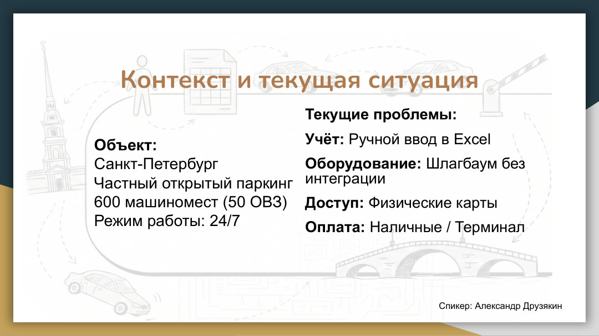

### 3. Результаты исследования

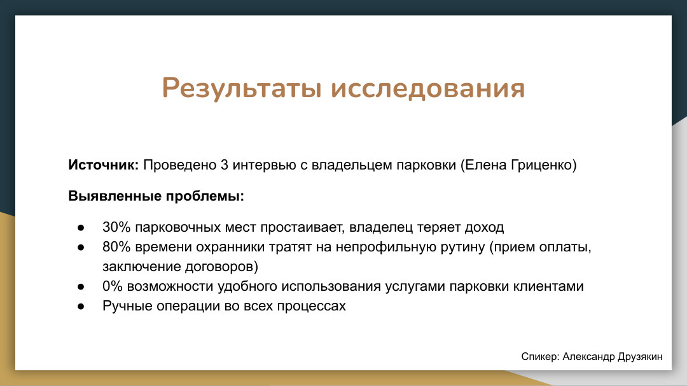

### 4. Event Storming AS-IS (Визуализация хаоса)

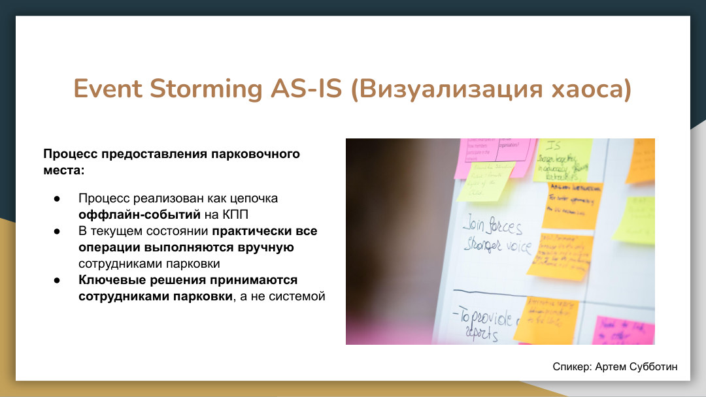

### 5. Моделирование бизнес-процессов (BPMN)

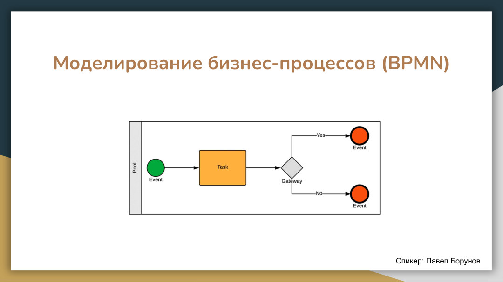

### 6. BPMN - Big Picture

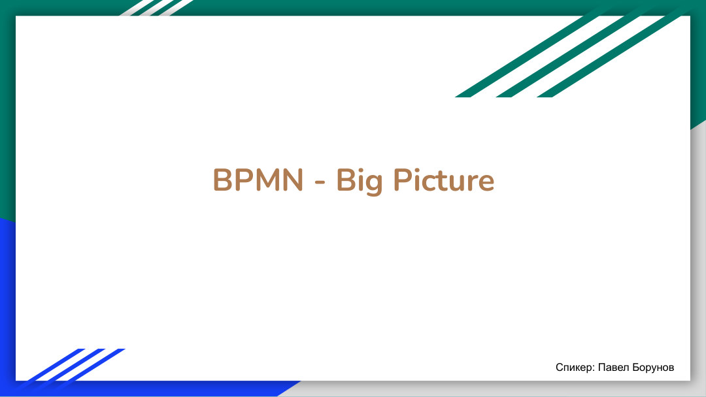

### 7. Недостаток №1: доступ к парковке как

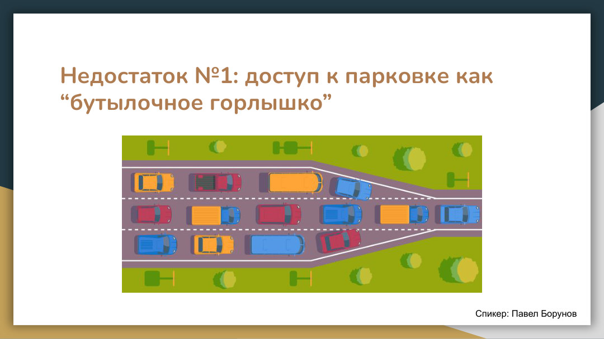

### 8. Недостаток №2: рассинхронизация данных

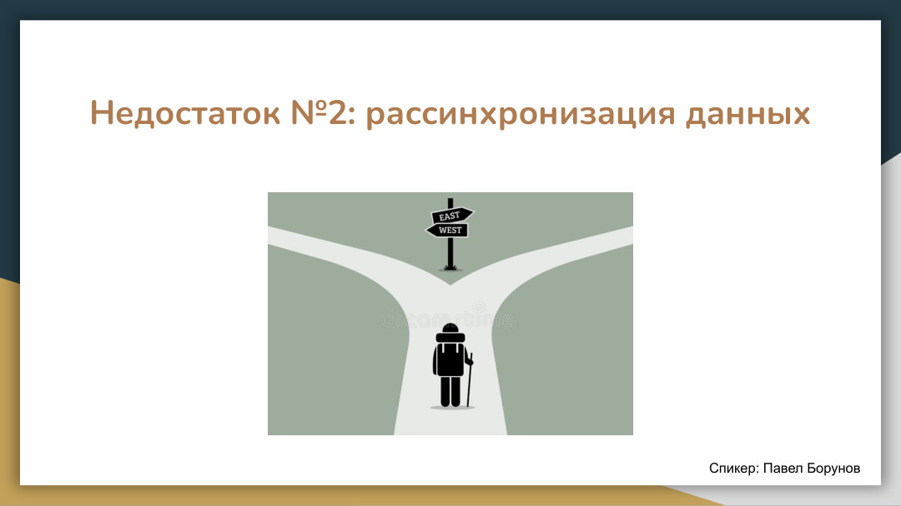

### 9. Недостаток №3: таблицы повсюду

### 10. Выводы

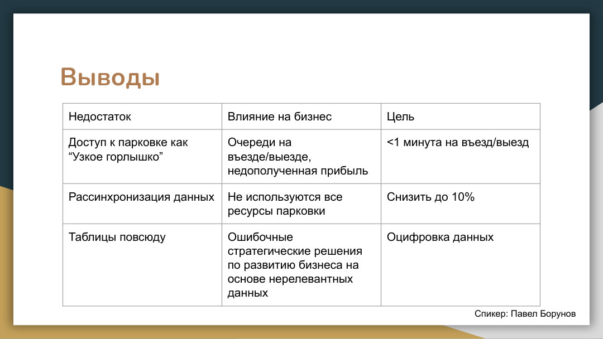

### 11. Моделирование предметной области

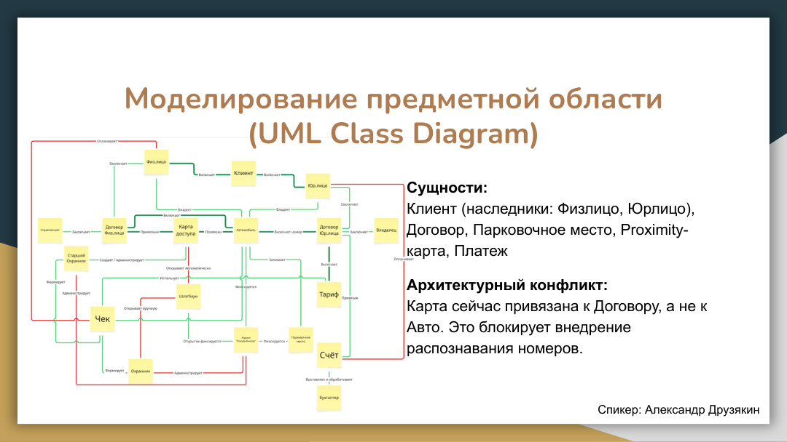

### 12. Моделирование состояний (UML State machine)

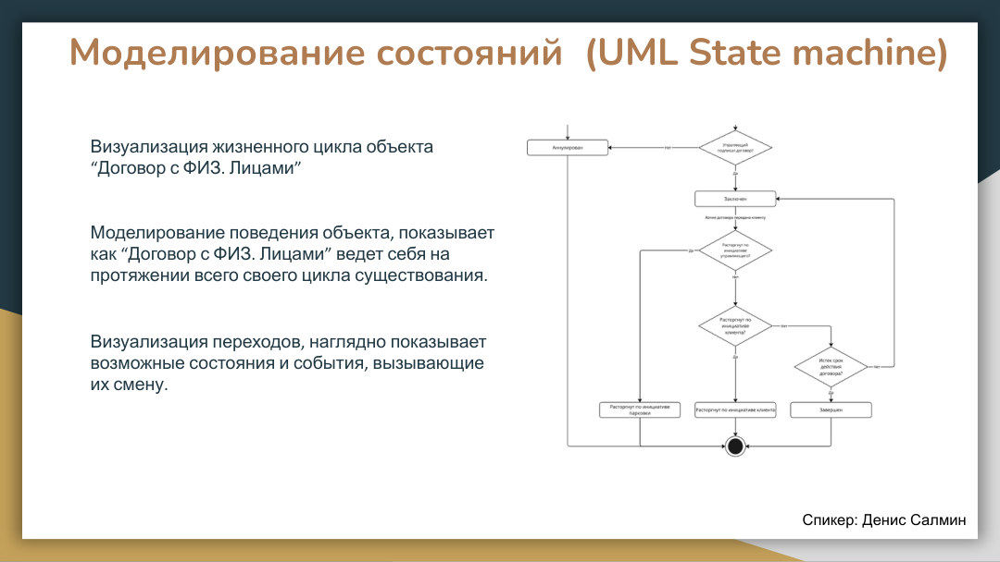

### 13. Opportunity Canvas

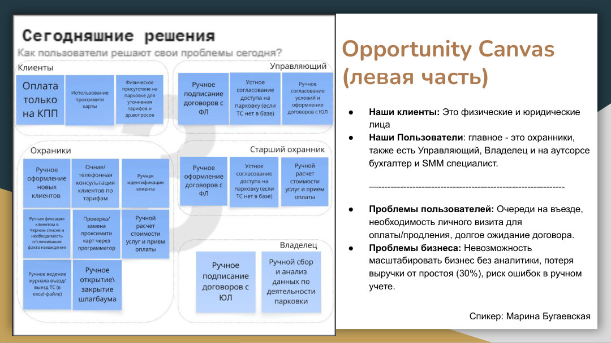

### 14. Problem Statement

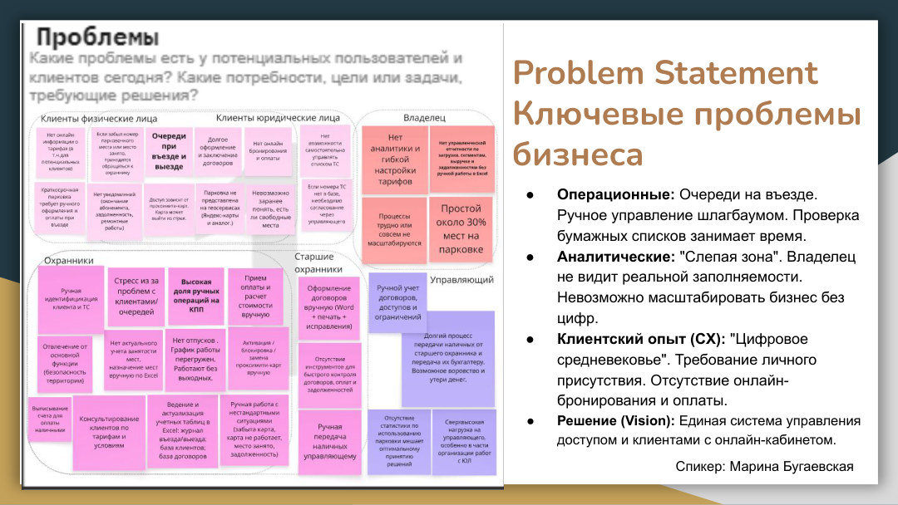

### 15. Сложности и вызовы этапа

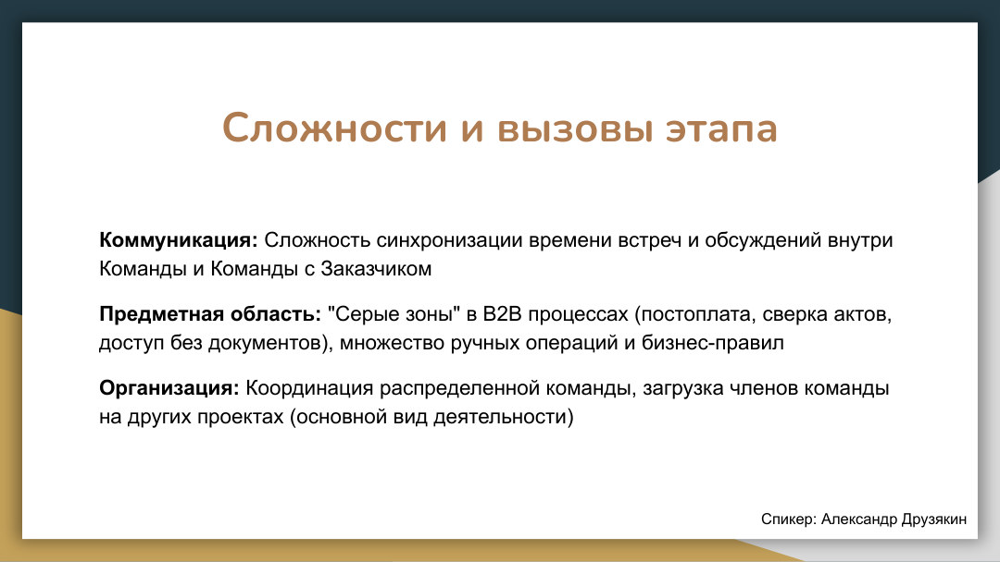

### 16. Заключение

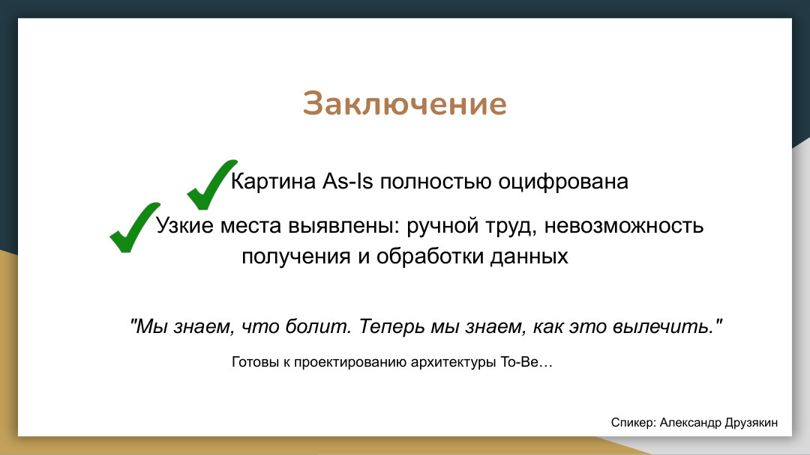
