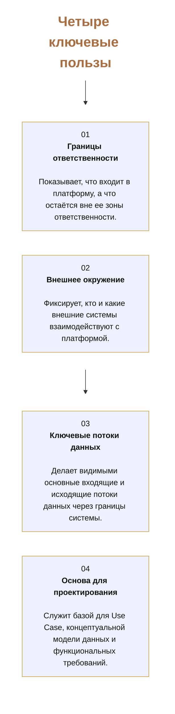
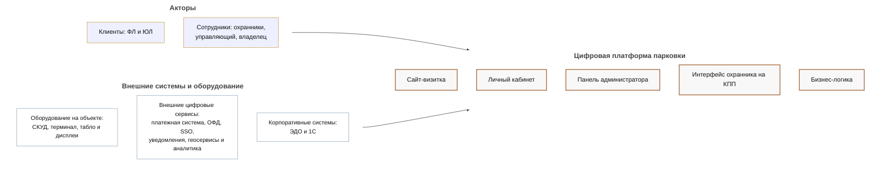
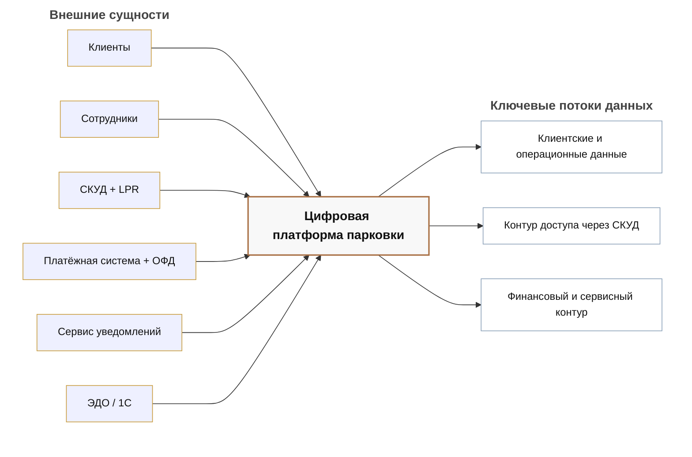
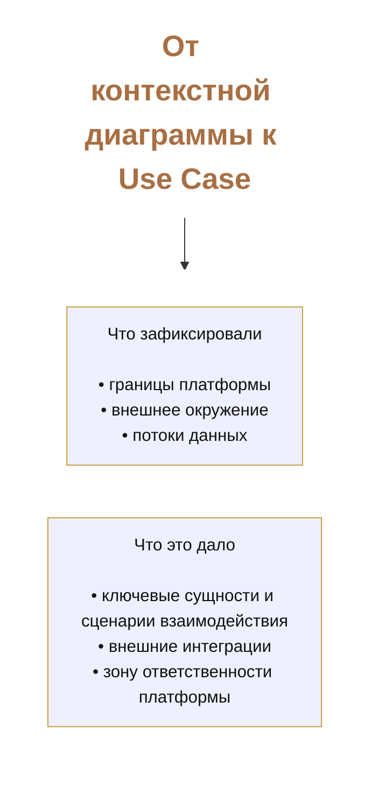

# Макеты слайдов: контекстная диаграмма цифровой платформы парковки

Ниже собраны все мокапы блока про контекстную диаграмму в одном файле.
Они соответствуют текущей последовательности слайдов `1.jpg`-`5.jpg` и тексту выступления из [demo-3-context-diagram-presentation-3-min.md](../demo-3-context-diagram-presentation-3-min.md).

---

## Оглавление

1. [Слайд 1. Контекстная диаграмма](#слайд-1-контекстная-диаграмма)
2. [Как это лучше перенести на реальный слайд](#как-это-лучше-перенести-на-реальный-слайд)
3. [Слайд 2. Четыре ключевые пользы](#слайд-2-четыре-ключевые-пользы)
4. [Практические советы по переносу в слайд](#практические-советы-по-переносу-в-слайд)
5. [Слайд 3. Границы системы и внешнее окружение](#слайд-3-границы-системы-и-внешнее-окружение)
6. [Как это лучше перенести на реальный слайд](#как-это-лучше-перенести-на-реальный-слайд-1)
7. [Слайд 4. Ключевые потоки данных](#слайд-4-ключевые-потоки-данных)
8. [Рекомендуемая таблица для слайда](#рекомендуемая-таблица-для-слайда)
9. [Слайд 5. От контекстной диаграммы к Use Case](#слайд-5-от-контекстной-диаграммы-к-use-case)
10. [Как это лучше перенести на реальный слайд](#как-это-лучше-перенести-на-реальный-слайд-2)

## Слайд 1. Контекстная диаграмма

Первый слайд работает как титульный вход в блок.
Он должен быть максимально простым:

- крупный заголовок по центру;
- без дополнительных карточек и перегрузки;
- задача слайда: ввести тему блока.

## Как это лучше перенести на реальный слайд

- Оставить только заголовок `Контекстная диаграмма`.
- Не добавлять подпояснений и списков.
- Использовать слайд как короткую отбивку перед содержательной частью.

---

## Слайд 2. Четыре ключевые пользы

Ниже черновой макет второго слайда в формате `Mermaid`.
Он показывает композицию слайда с четырьмя карточками пользы:

- заголовок сверху;
- 4 блока в сетке `2x2`;
- короткие формулировки внутри карточек.

## Практические советы по переносу в слайд

- Делайте сетку `2x2`, а не 4 карточки в одну линию.
- Заголовок лучше оставить коротким и крупным: `Четыре ключевые пользы`.
- В каждой карточке оставьте:
  - большой номер;
  - короткий заголовок;
  - 2-3 строки описания.

---

## Слайд 3. Границы системы и внешнее окружение

Ниже макет третьего слайда в формате `Mermaid`.
Он показывает композицию, соответствующую текущему `jpg`-слайду:

- слева два блока внешнего окружения;
- справа платформа как единая система;
- между ними связи взаимодействия.

## Как это лучше перенести на реальный слайд

- Слева разместить 2 карточки:
  - `Акторы`
  - `Внешние системы и оборудование`
- Справа разместить контейнер `Цифровая платформа парковки`.
- Между ними провести 2 стрелки взаимодействия.

---

## Слайд 4. Ключевые потоки данных

Ниже макет четвертого слайда в формате `Mermaid`.
Он показывает рекомендуемую композицию для слайда про основные потоки данных через границы платформы:

- внешние сущности слева;
- платформа в центре;
- укрупнённые потоки справа.

## Рекомендуемая таблица для слайда

| Внешняя сущность | В платформу | Из платформы |
|---|---|---|
| Клиенты | Профиль, ТС, параметры бронирования и договора | Тарифы и правила, статусы доступа, сессии и оплаты, уведомления |
| Сотрудники | Параметры тарифов, секторов, договоров и бронирований | Статусы доступа, данные по сессиям и оплате |
| СКУД + LPR | ГРЗ, дата-время, КПП, въезд/выезд | Решение о доступе: разрешен/запрещен, команда на открытие |
| Платёжная система + ОФД | Статус платежа, статус фискализации, фискальный чек | Сумма к оплате, запрос на оплату, чек к фискализации |
| Сервис уведомлений | Статус отправки | Уведомление, канал, адресат |
| ЭДО / 1С | Статусы документов/сверки | Выгрузки по оплатам и сессиям |

---

## Слайд 5. От контекстной диаграммы к Use Case

Ниже макет пятого слайда в формате `Mermaid`.
Он нужен как короткий переход от блока про контекстную диаграмму к следующему разделу презентации:

- что было зафиксировано на уровне контекста;
- что это дало для анализа;
- почему дальше логично перейти к `Use Case`.

## Как это лучше перенести на реальный слайд

- По центру сделать 2 смысловых блока:
  - `Что зафиксировали`
  - `Что это дало`
- Между ними добавить стрелку или визуальную связь слева направо.
