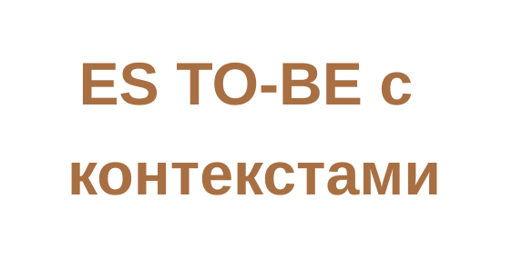
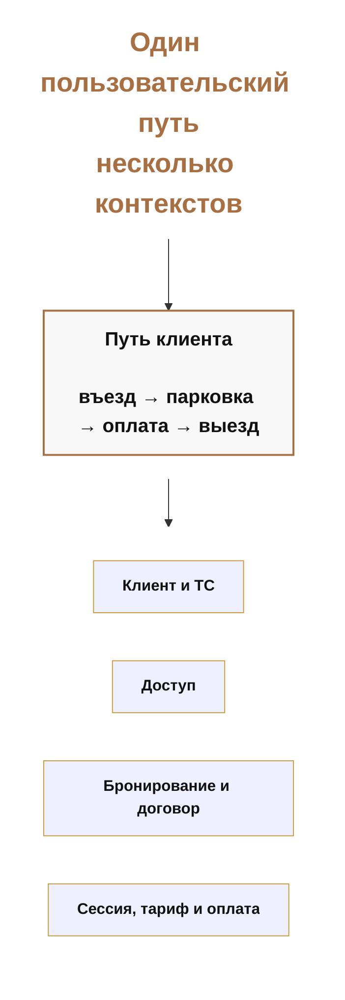
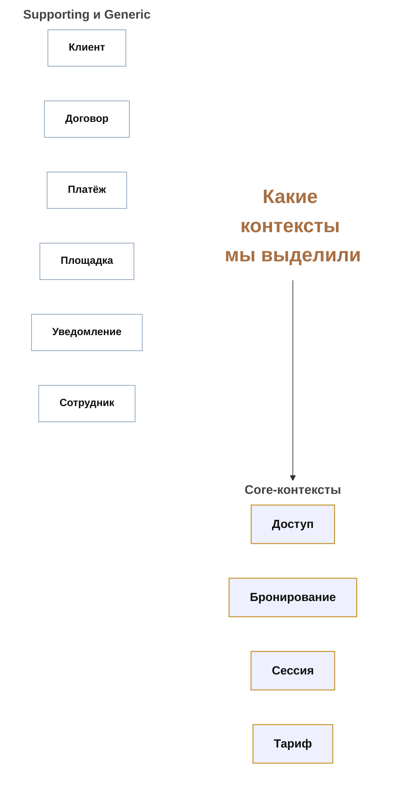
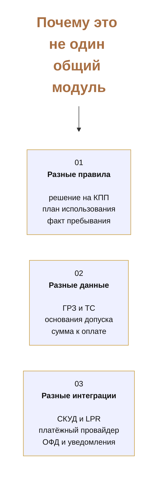
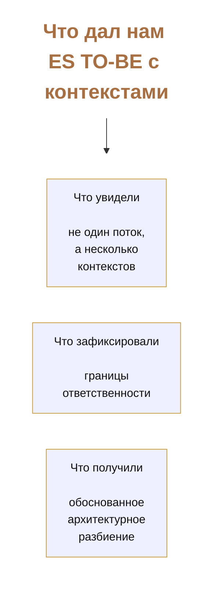

# Макеты слайдов: ES TO-BE с контекстами

Ниже собраны черновые макеты блока про `ES TO-BE с выделенными контекстами` в одном файле.

Они сделаны в логике и композиции, близкой к прошлым презентационным markdown-мокапам проекта.

Файл нужен как промежуточная заготовка перед переносом в реальные слайды.

---

## Оглавление

1. [Слайд 1. ES TO-BE с контекстами](#слайд-1-es-to-be-с-контекстами)
2. [Как это лучше перенести на реальный слайд](#как-это-лучше-перенести-на-реальный-слайд)
3. [Слайд 2. Один пользовательский путь, несколько контекстов](#слайд-2-один-пользовательский-путь-несколько-контекстов)
4. [Практические советы по переносу в слайд](#практические-советы-по-переносу-в-слайд)
5. [Слайд 3. Какие контексты мы выделили](#слайд-3-какие-контексты-мы-выделили)
6. [Как это лучше перенести на реальный слайд](#как-это-лучше-перенести-на-реальный-слайд-1)
7. [Слайд 4. Почему это не один общий модуль](#слайд-4-почему-это-не-один-общий-модуль)
8. [Практические советы по переносу в слайд](#практические-советы-по-переносу-в-слайд-1)
9. [Слайд 5. Как из контекстов получаются компоненты архитектуры](#слайд-5-как-из-контекстов-получаются-компоненты-архитектуры)
10. [Как это лучше перенести на реальный слайд](#как-это-лучше-перенести-на-реальный-слайд-2)
11. [Слайд 6. Что дал нам ES TO-BE с контекстами](#слайд-6-что-дал-нам-es-to-be-с-контекстами)
12. [Практические советы по переносу в слайд](#практические-советы-по-переносу-в-слайд-2)

## Слайд 1. ES TO-BE с контекстами

Первый слайд работает как вход в ваш блок.

Он должен быть очень простым:

- короткий заголовок;
- без перегрузки деталями;
- задача слайда: обозначить тему и переключить внимание на доменную декомпозицию.

## Как это лучше перенести на реальный слайд

- Оставить только крупный заголовок `ES TO-BE с контекстами`.
- Не добавлять подпояснения и длинные подзаголовки.
- Использовать этот слайд как короткую отбивку перед содержательной частью.

---

## Слайд 2. Один пользовательский путь, несколько контекстов

Второй слайд нужен, чтобы быстро объяснить главную мысль блока:

- для пользователя парковка выглядит как один сценарий;
- для системы это набор разных смысловых контуров;
- именно отсюда рождается архитектурное разбиение.

## Практические советы по переносу в слайд

- Заголовок оставить коротким.
- По центру вынести один крупный блок `Путь клиента`.
- Ниже показать 4 карточки-контекста в одну линию или в сетке `2x2`.
- На этом слайде не нужно объяснять связи между контекстами подробно.

---

## Слайд 3. Какие контексты мы выделили

Третий слайд показывает уже не просто крупные контуры, а более явное архитектурное чтение диаграммы:

- какие контексты попадают в ядро;
- какие являются поддерживающими;
- почему это уже похоже на будущую модульную декомпозицию.

## Как это лучше перенести на реальный слайд

- Сделать 2 горизонтальные зоны:
  - `Core-контексты`;
  - `Supporting и Generic`.
- Core-контексты визуально выделить цветом сильнее.
- Supporting-контексты лучше показать более спокойно, как второй уровень важности.
- Не выводить все 12 bounded contexts, иначе слайд станет перегруженным.

---

## Слайд 4. Почему это не один общий модуль

Этот слайд объясняет смысл границ.

Его задача не в том, чтобы заново перечислить контексты, а в том, чтобы показать причину декомпозиции.

## Практические советы по переносу в слайд

- Использовать 3 карточки в одну линию.
- Оставить короткие заголовки: `Разные правила`, `Разные данные`, `Разные интеграции`.
- Если текста окажется много, сократить каждую карточку до 2 строк.
- Этот слайд должен читаться за 5–7 секунд даже без вашего объяснения.

---

## Слайд 5. Как из контекстов получаются компоненты архитектуры

Пятый слайд показывает переход от доменной модели к архитектурному разбиению.

Он нужен как мост между `ES TO-BE` и следующими архитектурными артефактами.

```mermaid
flowchart LR
    T["Как из контекстов получаются<br/>компоненты архитектуры"]

    subgraph L["ES TO-BE контексты"]
        direction TB
        A["Доступ"]
        B["Бронирование"]
        C["Сессия"]
        D["Тариф"]
        E["Клиент, Договор,<br/>Платёж, Площадка"]
    end

    M["Границы ответственности<br/><br/>кто чем владеет<br/>что является мастер-данными<br/>через что идут связи"]

    subgraph R["Будущие компоненты"]
        direction TB
        F["Доступ"]
        G["Бронирование"]
        H["Сессия"]
        I["Тариф"]
        J["Поддерживающие компоненты"]
    end

    T --> L
    L --> M
    M --> R

    classDef title fill:#ffffff,stroke:#ffffff,color:#a86f43,font-size:26px,font-weight:bold;
    classDef side fill:#eef0ff,stroke:#c89b3c,color:#111111,stroke-width:1px,font-size:15px;
    classDef center fill:#f8f8f8,stroke:#a86f43,color:#111111,stroke-width:2px,font-size:16px,font-weight:bold;
    classDef group fill:#ffffff,stroke:#ffffff,color:#444444,font-size:18px,font-weight:bold;

    class T title;
    class A,B,C,D,E,F,G,H,I,J side;
    class M center;
    class L,R group;
```

## Как это лучше перенести на реальный слайд

- Слева разместить 1 колонку `ES TO-BE контексты`.
- По центру сделать один смысловой блок `Границы ответственности`.
- Справа показать будущие компоненты архитектуры.
- В реальном слайде лучше оставить по 4–5 элементов, не больше.

---

## Слайд 6. Что дал нам ES TO-BE с контекстами

Финальный слайд нужен как спокойный вывод.

Он завершает ваш блок и фиксирует практическую пользу артефакта.

## Практические советы по переносу в слайд

- Этот слайд лучше делать очень чистым и коротким.
- Оставить 3 карточки:
  - `Что увидели`;
  - `Что зафиксировали`;
  - `Что получили`.
- Использовать его как финальную фиксацию пользы вашего блока.
- Если нужно сократить время, этот слайд можно объединить со слайдом 5.
