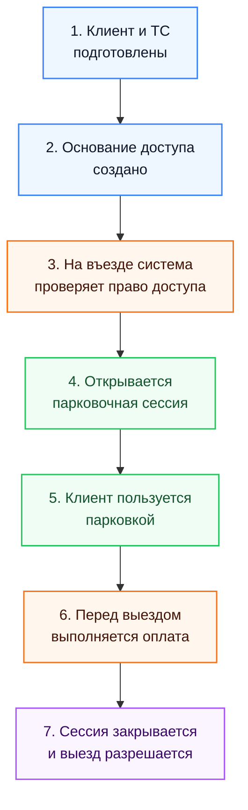

# Слайд 2: ES TO-BE без контекстов для Google Slides

## Назначение

Этот файл подготовлен как основа для второго слайда презентации `demo-4`. Он показывает упрощенную ES TO-BE схему без контекстов и уже адаптирован под компоновку Google Slides в формате `16:9`.

## Рекомендуемый заголовок слайда

`ES TO-BE как единый сквозной сценарий`

## Рекомендуемая композиция слайда

- Верхняя зона: короткий заголовок.
- Центральная зона: одна крупная вертикальная диаграмма.
- Правая или нижняя зона: 3 коротких вывода.
- Не показывать контексты, исключения, интеграционные детали и альтернативные ветки.

## Mermaid-макет для слайда

## Как перенести в Google Slides

### Вариант 1. Основной

- Заголовок разместить сверху слева.
- Диаграмму поставить по центру слайда.
- Каждый блок сделать как отдельную карточку с одинаковой шириной.
- Между блоками оставить заметный вертикальный воздух, чтобы схема читалась с расстояния.

### Вариант 2. Более презентационный

- Слева оставить диаграмму из 7 шагов.
- Справа вынести 3 тезиса:
- `единый путь для клиента`
- `несколько связанных бизнес-состояний`
- `оплата влияет на корректный выезд`

## Что лучше убрать со слайда

- Названия bounded contexts.
- Подробности про договор vs бронирование.
- Внешние системы и интеграции.
- Точки отказа и исключения.
- Мелкие доменные события из полной ES-доски.

## Зачем такая компоновка

- Вертикальная схема лучше читается в Google Slides, чем длинная горизонтальная лента.
- Семь крупных шагов достаточно, чтобы объяснить сквозную логику за `20–30 секунд`.
- Такой слайд хорошо работает как мост между полной ES-доской и следующим слайдом про контексты.
