# Слайд: Сквозной поток с выделенными контекстами

## Назначение

Этот слайд нужен как переход от общей TO-BE логики к разговору о контекстах. Он показывает не полный Event Storming, а укрупненный поток, внутри которого уже видны зоны ответственности системы.

## Рекомендуемый заголовок

`Один поток клиента, несколько контекстов системы`

## Тезис слайда

Для клиента парковка выглядит как один непрерывный сценарий, но внутри него работают разные доменные контуры с собственными правилами и состояниями.

## Mermaid-макет

```mermaid
flowchart LR
    accTitle: End-to-end flow with highlighted contexts
    accDescr: Слайд показывает сквозной пользовательский путь и выделяет внутри него основные доменные контексты системы.

    subgraph ctx_profile["Клиент и ТС"]
        direction LR
        client["Клиент зарегистрирован"]
        vehicle["ТС и ГРЗ привязаны"]
    end

    subgraph ctx_booking["Бронирование и договор"]
        direction LR
        basis["Создано основание доступа"]
    end

    subgraph ctx_access["Доступ"]
        direction LR
        gate_in["Проверка права въезда"]
        gate_out["Проверка права выезда"]
    end

    subgraph ctx_session["Парковочная сессия"]
        direction LR
        entry["Въезд разрешен"]
        session["Сессия открыта"]
        usage["Использование парковки"]
        close["Сессия закрыта"]
    end

    subgraph ctx_payment["Оплата"]
        direction LR
        payment["Оплата выполнена"]
    end

    client --> vehicle
    vehicle --> basis
    basis --> gate_in
    gate_in --> entry
    entry --> session
    session --> usage
    usage --> payment
    payment --> close
    close --> gate_out

    classDef profile fill:#e8f1ff,stroke:#2563eb,stroke-width:2px,color:#0f172a
    classDef booking fill:#ecfccb,stroke:#65a30d,stroke-width:2px,color:#1f2937
    classDef access fill:#fff7ed,stroke:#ea580c,stroke-width:2px,color:#431407
    classDef session fill:#f5f3ff,stroke:#7c3aed,stroke-width:2px,color:#2e1065
    classDef payment fill:#fdf2f8,stroke:#db2777,stroke-width:2px,color:#500724

    class client,vehicle profile
    class basis booking
    class gate_in,gate_out access
    class entry,session,usage,close session
    class payment payment
```

## Как поставить на слайд

- Заголовок оставить в одну строку.
- Диаграмму растянуть почти на всю ширину слайда.
- Контексты оставить цветными зонами, а не отдельной легендой.
- Не добавлять мелкие события и альтернативные ветки, чтобы не потерять главную мысль.

## Что проговаривать устно

- Пользователь видит один путь: въезд, парковка, оплата, выезд.
- Но внутри этого пути система переключается между разными контекстами.
- Именно из этих зон ответственности потом выводятся архитектурные компоненты.
