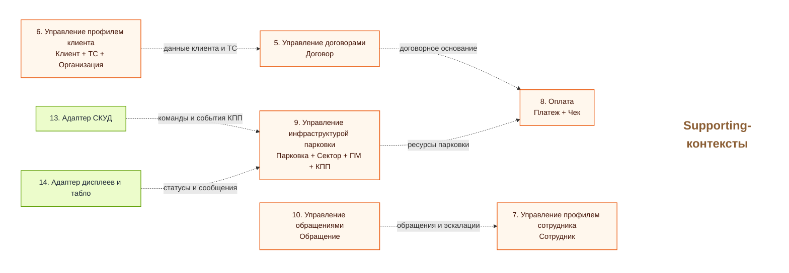
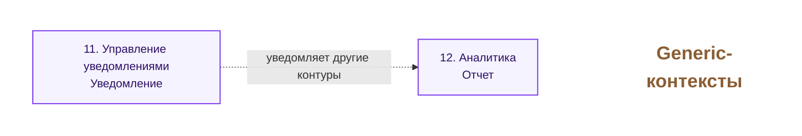

# Слайд: Контексты ES TO-BE по группам

## Назначение

Этот файл показывает контексты ES TO-BE не одной перегруженной схемой, а несколькими отдельными диаграммами по группам: `Core`, `Supporting` и `Generic`. Такой формат удобнее для Google Slides и для пошагового объяснения архитектурной декомпозиции.

## Рекомендуемый заголовок

`Контексты ES TO-BE по группам ответственности`

## Как использовать в презентации

- Вариант 1: собрать один слайд с тремя отдельными блоками `Core`, `Supporting`, `Generic`.
- Вариант 2: сделать 2 слайда:
- слайд 1: `Core`
- слайд 2: `Supporting + Generic`
- Вариант 3: показать сначала `Core`, а затем отдельным кадром supporting и generic-контуры.

## Диаграмма 1. Core

## Диаграмма 2. Supporting

## Диаграмма 3. Generic

## Как лучше собрать в Google Slides

- Если нужен один слайд, разместить 3 диаграммы вертикально: `Core` сверху, `Supporting` по центру, `Generic` снизу.
- Если нужен более читаемый формат, вынести `Core` на отдельный слайд, а `Supporting` и `Generic` показать следующим слайдом.
- Самым насыщенным по цвету сделать `Core`, supporting оставить спокойнее, generic показать как сервисный нижний слой.

## Что проговаривать устно

- `Core` содержит основную бизнес-логику парковочной платформы.
- `Supporting` обеспечивает ядро документами, профилями, инфраструктурой, оплатой и интеграционными адаптерами.
- `Generic` дает сквозные сервисы, которые используются разными контекстами.
