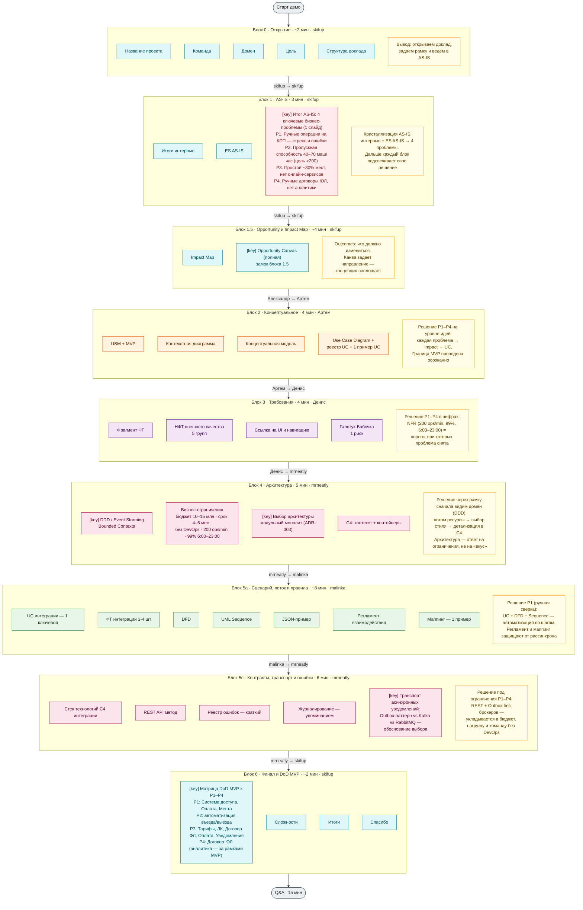
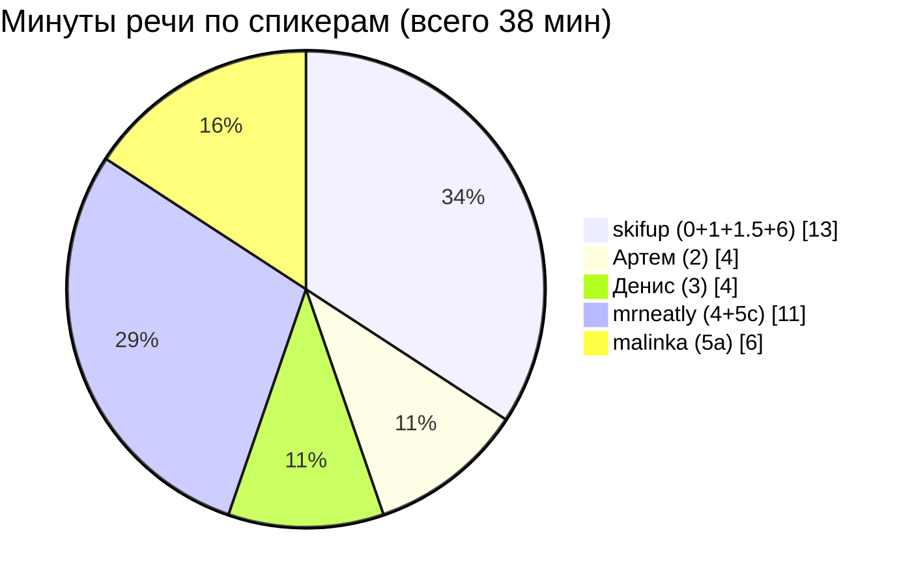

# Карта слайдов и спикеров — Демо 5

Визуализация структуры доклада по [плану 2026-04-25-demo-5-final](./2026-04-25-demo-5-final.md): 10 блоков по порядку выступления (0, 1, 1.5, 2, 3, 4, 5а, 5c, 6 + Q&A), артефакты на слайдах внутри блоков, спикеры выделены цветом, в каждом блоке — короткий вывод и связь с бизнес-проблемами.

Тайминг — 38 минут речи + 7 минут буфер = 45 минут на сцене. Подробности — в [talk-structure, таблица тайминга](./talk-structure.md#тайминг-доклада-на-сцене).

## Сквозная идея доклада

Драматургия простая: **skifup в финале блока 1 (AS-IS) показывает один слайд с 4 ключевыми бизнес-проблемами** — это естественный итог разбора интервью и ES AS-IS, а не «обещание» из открытия. Все 4 проблемы держим на одном слайде, чтобы аудитория видела общую картину разом, а не пролистывала четыре отдельных. Дальше каждый следующий блок в своей колонке артефактов подсвечивает, как именно его решения эти проблемы закрывают. **Финальный замок — блок 6**: матрица «**DoD MVP + NFR + Canvas-метрики** × 4 проблемы». Один DoD MVP не закрывает все 4 проблемы (числовые цели и метрики живут в NFR и Canvas, а аналитика владельцу осознанно вынесена за рамки MVP — [USM раздел 12](../../artifacts/user-story-map.md#12-отчётность-и-аналитика), протокол №4) — поэтому замок строится из трех источников вместе.

Источник формулировок 4 проблем — [протоколы интервью №2, №3, №5](../../interviews/protocols/) и ES AS-IS. Цифры на слайде — из тех же источников: пропускная способность 40–70 → 200 маш/час, простой 30% → <10%. Opportunity Canvas показывается единственный раз в блоке 1.5 как замок блока — после Impact Map.

Блок 4 идет своим порядком: **DDD → бизнес-ограничения → выбор архитектуры → C4**. Сначала показываем, что мы вообще моделируем (предметная область и контексты), потом — рамку ресурсов, потом — какой архитектурный стиль выбран под эту рамку, и только после этого детализируем его в C4.

## Легенда спикеров

| Цвет       | Спикер             | Зона ответственности                | Слоты        |
| ---------- | ------------------ | ----------------------------------- | ------------ |
| голубой    | **skifup**         | открытие, AS-IS, Opportunity, финал | 0, 1, 1.5, 6 |
| оранжевый  | **Артем (cejidb)** | концептуальное                      | 2            |
| фиолетовый | **Денис**          | требования                          | 3            |
| розовый    | **mrneatly**       | архитектура, контракты, транспорт   | 4, 5c        |
| зеленый    | **malinka**        | сценарий, поток и правила обмена    | 5а           |

Дополнительные пометки:

- 🔴 красный — 4 бизнес-проблемы (озвучивает skifup в финале блока 1, как итог AS-IS);
- [key] — ключевые «несгораемые» слайды блока (нерезаемые при сокращении);
- 🟡 желтый — выводы и пометки «как блок закрывает проблему».

## Карта блоков, артефактов и выводов

## Матрица замка — блок 6

Финальная матрица — нерезаемый артефакт. Один DoD MVP не закрывает все 4 проблемы: числовые цели сидят в NFR, бизнес-метрики — в Opportunity Canvas, а аналитика владельцу осознанно за границами MVP. Поэтому источников замка три, и для P4 честно проговариваем «отложено».

| Проблема                                           | DoD MVP                                                                                                                                                           | NFR                                              | Canvas-метрики / границы MVP                                                                                                                                                           |
| -------------------------------------------------- | ----------------------------------------------------------------------------------------------------------------------------------------------------------------- | ------------------------------------------------ | -------------------------------------------------------------------------------------------------------------------------------------------------------------------------------------- |
| **P1.** Ручные операции на КПП                     | ✅ Система доступа (автофиксация въезда/выезда, синхронизация, экран охранника), Оплата (онлайн+терминал, автофиксация), Места (realtime-статусы), общий критерий | —                                                | —                                                                                                                                                                                      |
| **P2.** Пропускная способность 40–70 → 200 маш/час | ⚠️ автоматизация в «Системе доступа» — техническое условие                                                                                                        | ✅ NFR-EXT-PERF-\* (200 ops/min) — числовая цель | ✅ Canvas: «пропускная способность ≥200 маш/час»                                                                                                                                       |
| **P3.** Простой 30% + нет онлайн-сервисов          | ✅ Тарифы, Доступ к сервису, Договор ФЛ, Автопарк, Оплата, Уведомления                                                                                            | —                                                | ✅ Canvas: «средний простой <10%», «>80% клиентов онлайн за 6 мес»                                                                                                                     |
| **P4.** Ручные договоры ЮЛ + нет аналитики         | ⚠️ Договор: «управляющий оформляет договоры со стороны парковки» — закрывает ручную часть ЮЛ                                                                      | —                                                | ❎ **Аналитика владельцу — за границами MVP** ([USM §12](../../artifacts/user-story-map.md#12-отчётность-и-аналитика), протокол №4: «аналитика в специальном виде не нужна на релизе») |

## Матрица «проблема → решение по блокам»

Короткий обзор, какой блок чем закрывает проблему. Полная версия (с дословными формулировками) — в скрипте блока 6, задачи [2.1](./2026-04-25-demo-5-final.md#фаза-2-тексты-выступлений) и [3.2](./2026-04-25-demo-5-final.md#фаза-3-слайды-в-google-slides).

| Блок             | Где «звучит» проблема                      | Чем закрывается на этом уровне                                  |
| ---------------- | ------------------------------------------ | --------------------------------------------------------------- |
| 0 Открытие       | —                                          | задаем рамку, ведем в AS-IS                                     |
| 1 AS-IS          | проявление + кристаллизация P1–P4 в финале | признаем боль, формулируем 4 проблемы как сквозной трекер       |
| 1.5 Opportunity  | outcomes через Impact Map → OC правая      | P1–P4 → измеримые цели и решения; канва — замок блока 1.5       |
| 2 Концептуальное | привязка через USM + UC                    | проблема → UC внутри MVP; граница MVP проведена осознанно       |
| 3 Требования     | NFR-цифры                                  | определяем, при каких порогах проблема снята                    |
| 4 Архитектура    | DDD → ограничения → стиль → C4             | модульный монолит (ADR-003) — выбран под ресурсы                |
| 5а Сценарий      | привязка по P1 «ручная сверка»             | DFD + Sequence показывают шаги автоматизации                    |
| 5c Контракты     | ADR Outbox vs брокеры                      | техническая реализация в рамках бюджета и команды без DevOps    |
| 6 Финал          | DoD + NFR + Canvas × P1–P4                 | замок из трех источников; P4 «аналитика» — честно как «вне MVP» |

## Передачи микрофона

7 переходов между блоками — мост строится между блоками, не между людьми. Имя спикера вшивается только когда меняется человек. Дословные фразы прописываются в скриптах обоих участников (см. [пункт 2.7 плана](./2026-04-25-demo-5-final.md#фаза-2-тексты-выступлений)).

| #   | Переход блоков | Смена спикера            | Фраза-мостик                                             |
| --- | -------------- | ------------------------ | -------------------------------------------------------- |
| 1   | 1 → 1.5        | skifup → skifup (внутри) | «AS-IS показала боль — теперь outcomes, как мы ее лечим» |
| 2   | 1.5 → 2        | Александр → Артем        | «Канва задает направление — концепция воплощает»         |
| 3   | 2 → 3          | Артем → Денис            | «Концепция очерчена — числовые требования»               |
| 4   | 3 → 4          | Денис → mrneatly         | «Требования зафиксированы — как это устроено внутри»     |
| 5   | 4 → 5а         | mrneatly → malinka       | «Стиль выбран — нырок в ключевую интеграцию»             |
| 6   | 5а → 5c        | malinka → mrneatly       | «Сценарий показан — стек под ним»                        |
| 7   | 5c → 6         | mrneatly → skifup        | «Стек закрыт — финал»                                    |

## Распределение нагрузки

