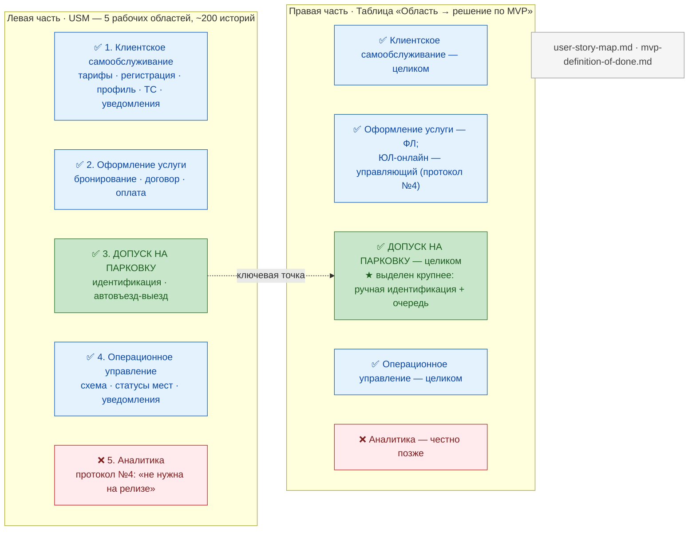
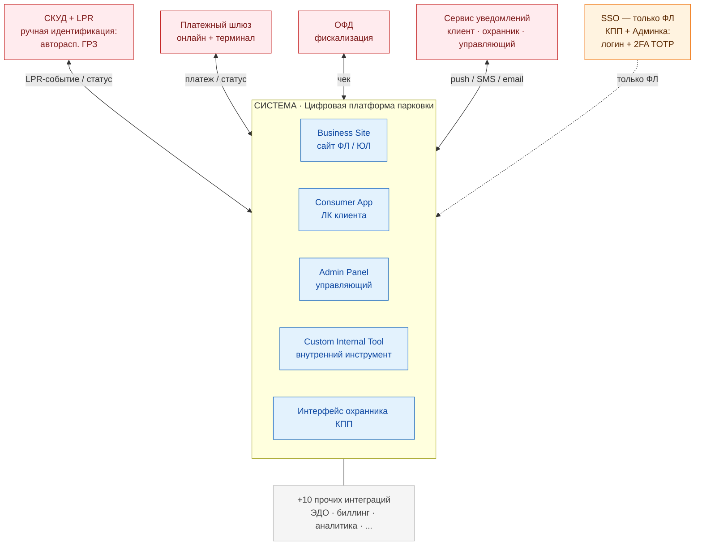
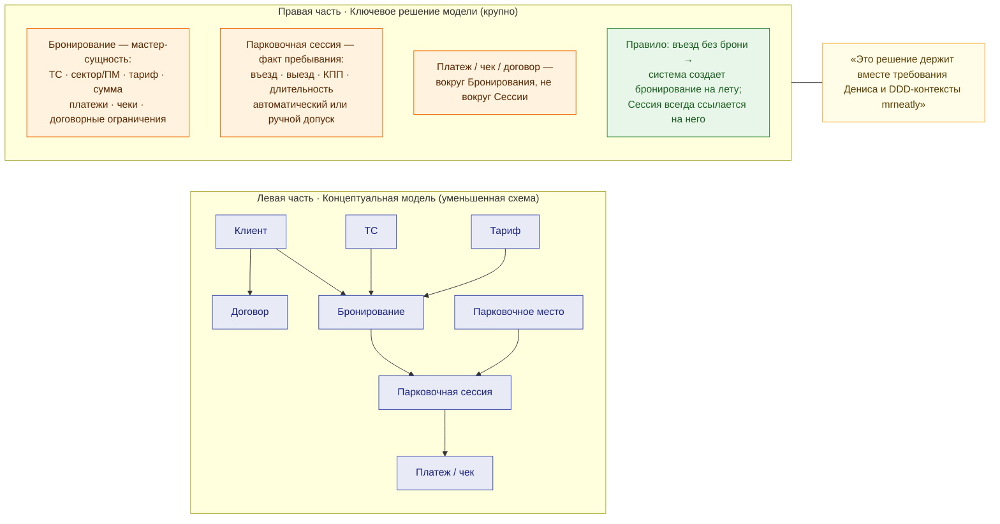
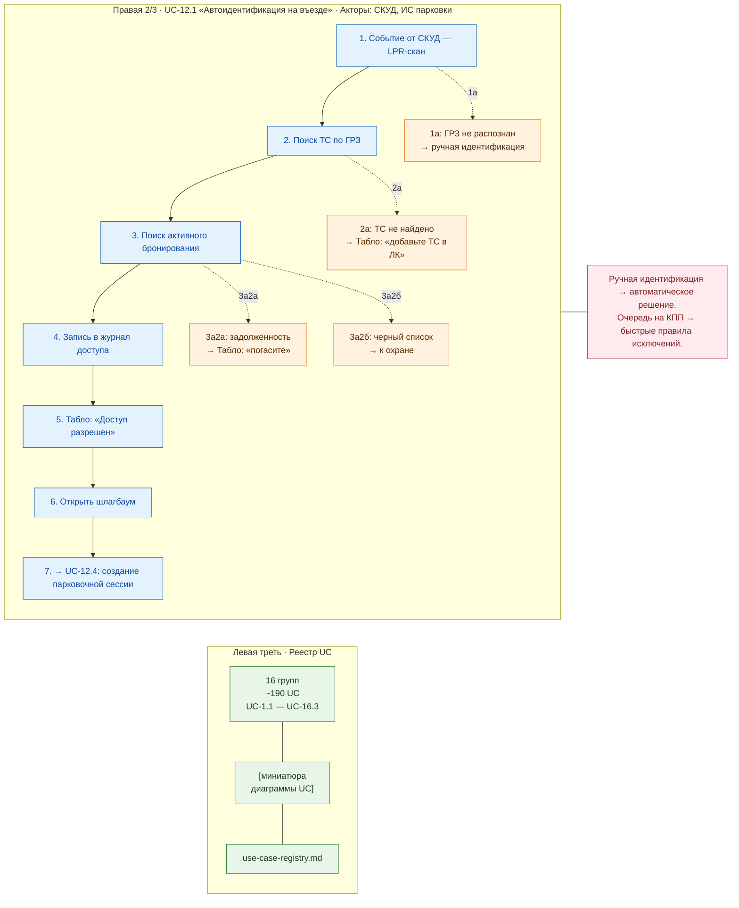

# Макеты слайдов — Блок 2 · Артем

Визуальные макеты четырех слайдов блока 2 (~4 мин).
Источник содержания — [demo-5-script.md](../demo-5-script.md#артем-cejidb--блок-2), тайминг и крюки — там же.

---

## S1 · USM + MVP (~80 сек)

**Заголовок:** «MVP: что берем в первый релиз, а что честно не обещаем»
**Крюк:** что берем в первый релиз, а что честно не обещаем — USM как общий язык с бизнесом.

---

## S2 · Контекстная диаграмма (~85 сек)

**Заголовок:** «Граница системы — это решение про состав поставки и интеграции»
**Крюк:** где граница системы и какие интеграции снимают ручную идентификацию.

---

## S3 · Концептуальная модель (~60 сек)

**Заголовок:** «Сущности домена: бронирование отделено от факта стоянки»
**Крюк:** общий язык для требований Дениса и архитектуры mrneatly.

---

## S4 · UC: диаграмма + реестр + 1 пример (~90 сек)

**Заголовок:** «От концепции — к сценарию на въезде»
**Крюк:** 4 расширения UC-12.1 — ручная идентификация становится автоматическим решением, охранник не импровизирует.

