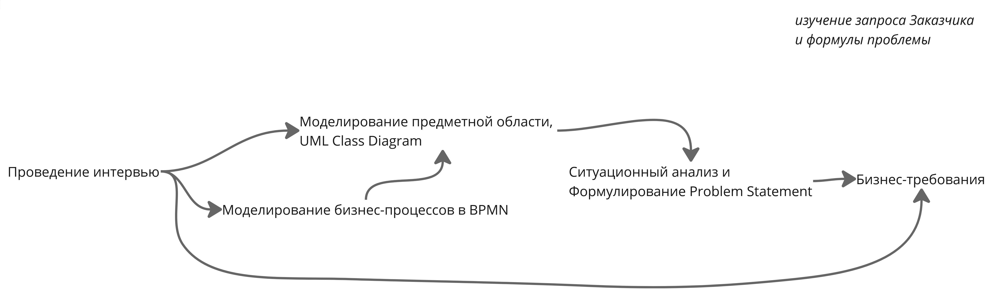
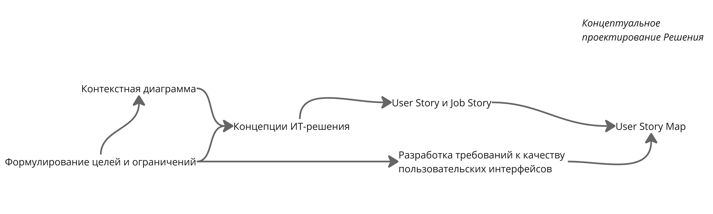
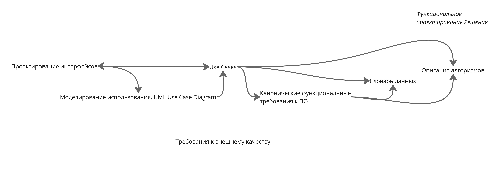
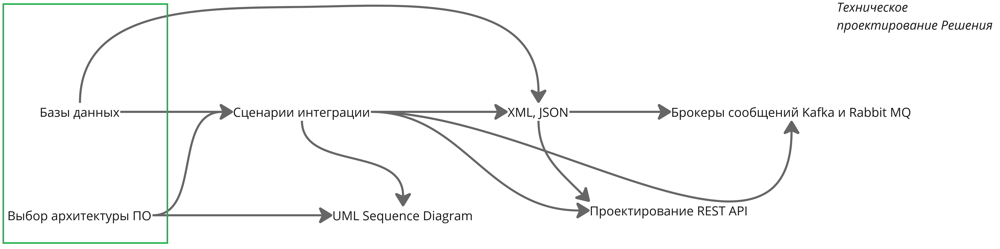
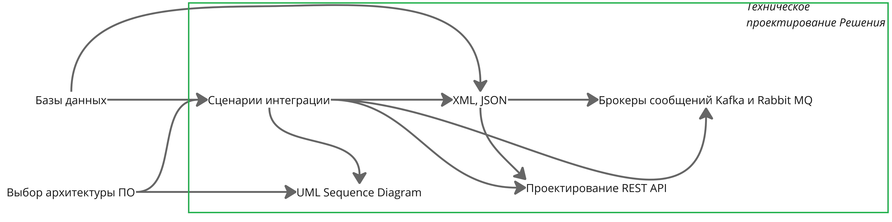

# История развития проекта

Документ описывает путь проекта от исследования бизнеса заказчика до проектирования целевого решения, архитектуры и интеграций.

## Оглавление

- [Назначение](#назначение)
- [Этап 1. Исследование бизнеса заказчика](#этап-1-исследование-бизнеса-заказчика)
- [Этап 2. Концептуальное проектирование решения](#этап-2-концептуальное-проектирование-решения)
- [Этап 3. Функциональное проектирование решения](#этап-3-функциональное-проектирование-решения)
- [Этап 4. Техническое проектирование решения. Архитектура](#этап-4-техническое-проектирование-решения-архитектура)
- [Этап 5. Техническое проектирование решения. Интеграции](#этап-5-техническое-проектирование-решения-интеграции)
- [Демо-дни как контрольные точки](#демо-дни-как-контрольные-точки)
- [Связанные документы](#связанные-документы)

## Назначение

Документ фиксирует общую логику развития проекта.

Он нужен для анализа того, как развивался проект, в какой последовательности принимались решения и как формировались артефакты.

## Общая схема этапов

## Этап 1. Исследование бизнеса заказчика

На первом этапе команда собрала у заказчика информацию о текущих AS-IS процессах парковки.

На основании этого материала были собраны и обсуждались артефакты, описывающие текущее состояние бизнеса и предметной области.

В работе фигурировали следующие типы артефактов:

- ES AS-IS.
- BPMN.
- UML Class Diagram.
- UML StateChart Diagram.

Каноничные артефакты этого этапа, уже оформленные в репозитории:

- [Event Storming AS-IS](../artifacts/as-is/event-storming-as-is.md) — фиксирует ключевые события, роли и болевые точки текущего процесса.
- [Схема парковки AS-IS](../artifacts/as-is/parking-as-is-diagram.md) — показывает текущее устройство парковки и основных участников процесса.
- [UML Class Diagram предметной области AS-IS](../artifacts/as-is/uml-class-domain-as-is.md) — описывает сущности предметной области и связи между ними в текущем состоянии.
- [UML StateChart договора с физлицом AS-IS](../artifacts/as-is/uml-state-contract-with-individual.md) — показывает жизненный цикл договора с физическим лицом.
- [BPMN AS-IS идентификации клиента](../artifacts/as-is/bpmn-client-identification.md) — описывает текущий процесс идентификации клиента.
- [BPMN AS-IS заключения договора](../artifacts/as-is/bpmn-contract-signing.md) — фиксирует текущий порядок заключения договора.
- [BPMN AS-IS оплаты для физлиц и юрлиц](../artifacts/as-is/bpmn-payment-individual-and-legal-clients.md) — описывает текущие сценарии оплаты для физлиц и юрлиц.
- [BPMN AS-IS предоставления парковочного места](../artifacts/as-is/bpmn-provide-parking-space.md) — показывает процесс предоставления парковочного места.
- [BPMN AS-IS поиска парковочного места](../artifacts/as-is/bpmn-search-parking-space.md) — описывает текущий поиск свободного парковочного места.
- [BPMN AS-IS выезда с парковки](../artifacts/as-is/bpmn-parking-exit.md) — фиксирует текущий процесс выезда с парковки.

Для этого этапа в структуре репозитория подготовлен раздел `docs/artifacts/as-is/`.

Связанные протоколы интервью:

- [Протокол интервью №1.1](../interviews/protocols/interview-protocol-1-1-2026-01-21-v01.md) — фиксирует исходный контекст парковки, текущее состояние и ключевые ограничения.
- [Протокол интервью №1.2](../interviews/protocols/interview-protocol-1-2-2026-01-23-v01.md) — уточняет и валидирует AS-IS сценарии въезда, оплаты, договоров и выезда.
- [Протокол интервью №2](../interviews/protocols/interview-protocol-2-2026-01-27-v01.md) — закрепляет валидацию BPMN и дополняет понимание текущих процессов.

### Глоссарий проекта (сквозной артефакт)

- [Глоссарий терминов проекта](../artifacts/project-glossary.md) — фиксирует согласованный словарь терминов проекта.

Сквозной артефакт: первоначально формируется в ходе исследования бизнеса, пополняется на этапах 2–5.

## Этап 2. Концептуальное проектирование решения

Этот этап был посвящен переходу от понимания проблемной ситуации к описанию целевого решения.

### 2.1. Постановка и согласование цели

Команда выполнила ситуационный анализ и сформулировала проблему бизнеса.

На этой основе была собрана и согласована с заказчиком левая часть Opportunity Canvas: пользователи и клиенты, проблемы, сегодняшние решения и проблемы бизнеса.

Затем были определены цель и границы системы.

Целевая формулировка звучит так: увеличить долю клиентов, использующих парковку через онлайн-ресурсы, с 0% до 80% от общего количества клиентов на дату запуска решения в течение 6 месяцев после ввода системы в эксплуатацию.

После этого были оформлены Impact Map и карточка проекта.

Связанные артефакты:

- [Opportunity Canvas](../artifacts/opportunity-canvas.md) — фиксирует проблемную ситуацию, ценность решения и критерии успеха.
- [Impact Map](../artifacts/impact-map.md) — связывает бизнес-цель с ролями, влияниями и продуктовыми поставками.
- [Карточка проекта](../artifacts/project-charter.md) — закрепляет рамки проекта, его цель и ключевые договоренности.

Связанные протоколы интервью:

- [Протокол интервью №2](../interviews/protocols/interview-protocol-2-2026-01-27-v01.md) — фиксирует обсуждение Opportunity Canvas и валидацию бизнес-процессов.
- [Протокол интервью №3](../interviews/protocols/interview-protocol-3-2026-02-04-v01.md) — закрепляет Impact Map и переход к следующему уровню проектирования решения.

### 2.2. User Story Map и границы MVP

На этом шаге была подготовлена User Story Map.

Система была разделена на поставки.

Для MVP был согласован Definition of Done.

Связанные артефакты:

- [User Story Map](../artifacts/user-story-map.md) — раскладывает пользовательские сценарии по шагам и поставкам.
- [MVP Definition of Done](mvp-definition-of-done.md) — фиксирует критерии готовности для MVP.
- [Индекс спецификаций](../specs/readme.md) — собирает формальные требования проекта в единую структуру.

Связанные протоколы интервью:

- [Протокол интервью №4](../interviews/protocols/interview-protocol-4-2026-02-11-v01.md) — фиксирует согласование терминологии, User Story Map и границ MVP.
- [Протокол интервью №7](../interviews/protocols/interview-protocol-7-2026-03-04-v01.md) — подтверждает финальный вариант User Story Map для MVP.

### 2.3. Контекстная диаграмма. Граница системы

Команда разработала контекстную диаграмму, которая легла в основу дальнейшего проектирования.

Связанные артефакты:

- [Контекстная диаграмма](../artifacts/context-diagram.md) — показывает границы системы и ее внешние взаимодействия.

### 2.4. Концептуальная модель

Параллельно с контекстной диаграммой развивалась концептуальная модель данных.

> Расширение: на схеме Этапа 2 присутствует блок концептуального проектирования.

Связанные артефакты:

- [Концептуальная модель с атрибутами](../artifacts/conceptual-model-with-attributes.md) — описывает сущности и атрибуты будущей системы на концептуальном уровне.

### 2.5. Требования к качеству пользовательских интерфейсов

На этом шаге были сформулированы требования к качеству интерфейсов, которые впоследствии влияли на проектирование wireframe.

> Расширение: на схеме Этапа 2 присутствует блок разработки требований к качеству пользовательских интерфейсов.

Связанные артефакты:

- [Требования к качеству UI](../specs/nonfunctional-requirements/nfr-ui-quality.md) — фиксирует требования к удобству использования и качеству интерфейсов.

### 2.6. ES TO-BE

После ES AS-IS команда перешла к ES TO-BE и согласовывала целевую логику с заказчиком.

На этапе 2 эта линия использовалась для описания TO-BE сценариев и будущего поведения системы.

Позже тот же материал стал входом для этапа 4, где на его основе выделялись доменные контексты, границы модулей и переход к C4.

Артефакты ES TO-BE, относящиеся прежде всего к этому этапу:

- [ES TO-BE SD: Командная диаграмма](../artifacts/es-to-be/es-tobe-sd-team-board.md) — показывает общую TO-BE доску с ключевыми доменными потоками.
- [ES TO-BE SD: Предоставление парковочного места и проверка права доступа](../artifacts/es-to-be/es-tobe-sd-access-and-parking-flow.md) — описывает целевой сценарий допуска и предоставления парковочного места.
- [ES TO-BE BP: Краткосрочное и долгосрочное бронирование, договор](../artifacts/es-to-be/es-tobe-bp-booking-and-contract.md) — фиксирует TO-BE процесс бронирования и работы с договором.
- [ES TO-BE BP: Оплата](../artifacts/es-to-be/es-tobe-bp-payment.md) — описывает целевой процесс оплаты.
- [ES TO-BE BP: Управление профилем клиента и списком ТС](../artifacts/es-to-be/es-tobe-bp-client-profile-and-vehicles.md) — показывает TO-BE логику управления профилем клиента и списком ТС.

Артефакт, который продолжает эту линию уже в архитектурном слое этапа 4:

- [ES TO-BE SD: Контексты](../architecture/ddd/es-tobe-sd-contexts.md) — переводит TO-BE материал в контексты модулей и архитектурные границы.

Связанные протоколы интервью:

- [Протокол интервью №5](../interviews/protocols/interview-protocol-5-2026-02-18-v01.md) — фиксирует обсуждение концепции TO-BE и ключевых решений по целевому процессу.
- [Протокол интервью №6](../interviews/protocols/interview-protocol-6-2026-02-25-v01.md) — закрепляет финальную концепцию TO-BE на уровне Big Picture.
- [Протокол интервью №7](../interviews/protocols/interview-protocol-7-2026-03-04-v01.md) — фиксирует детализацию TO-BE и обсуждение подпроцессов.

## Этап 3. Функциональное проектирование решения

Артефакты этого этапа развивались параллельно со вторым этапом и затем использовались при переходе к техническому проектированию.

На этом этапе команда выстраивала полную функциональную модель системы: от Use Case до требований, анализа рисков, схемы навигации и wireframe.

### 3.1. Use Case

Команда разработала диаграмму вариантов использования, реестр Use Case и CRUDL.

Связанные артефакты:

- [UML Use Case Diagram](../artifacts/use-case/use-case-diagram.md) — показывает основные сценарии использования и актеров.
- [Реестр Use Case](../artifacts/use-case/use-case-registry.md) — собирает перечень use case в структурированном виде.
- [CRUDL по ролям и сущностям](../artifacts/use-case/crudl.md) — связывает операции системы с объектами предметной области.
- Детальные сценарии использования (`UC-*.md`) — описывают конкретные варианты использования с основным и альтернативными потоками.

### 3.2. Функциональные и нефункциональные требования

В репозитории основной пласт этого знания живет в `docs/specs/`.

Основные направления:

- функциональные требования к ПО, частично основанные на детально проработанных use case;
- требования к внешнему качеству ПО;
- ограничения на решение и реализацию.

Связанные артефакты:

- [Индекс функциональных требований](../specs/functional-requirements/readme.md) — собирает функциональные требования к системе (6 файлов).
- [Индекс нефункциональных требований](../specs/nonfunctional-requirements/readme.md) — фиксирует требования к внешнему качеству ПО.
- [Индекс ограничений](../specs/constraints/readme.md) — задает ограничения на решение и реализацию.

Связанные протоколы интервью:

- [Протокол интервью №4](../interviews/protocols/interview-protocol-4-2026-02-11-v01.md) — задает терминологию и границы MVP, которые легли в основу требований.
- [Протокол интервью №6](../interviews/protocols/interview-protocol-6-2026-02-25-v01.md) — уточняет ключевые правила TO-BE, влияющие на требования к оплате, доступу и интерфейсам.
- [Протокол интервью №7](../interviews/protocols/interview-protocol-7-2026-03-04-v01.md) — подтверждает требования к MVP, навигации и интерфейсам.

### 3.3. Анализ угроз и рисков

Параллельно с другими задачами этапа были подготовлены артефакты по анализу угроз и уязвимостей.

Связанные артефакты:

- [Анализ угроз, уязвимостей и их устранение](../artifacts/infosec/infosec-analyze-parking.md) — анализирует угрозы, уязвимости и меры защиты.
- [Bow-Tie: несанкционированный доступ к системе и данным](../artifacts/infosec/bow-tie-unauthorized-access-to-system-and-data.md) — визуализирует риск несанкционированного доступа и меры контроля.

### 3.4. Схема навигации и wireframe

На основе накопленных артефактов была сформирована схема навигации.

После этого с помощью AI-агента был собран прототип `ui/`.

Связанные артефакты:

- [Карта навигации](../artifacts/navigation-map.md) — описывает структуру экранов и переходов между ними.
- [Wireframe — цифровая платформа парковки](../../ui/README.md) — фиксирует состав и устройство собранного интерфейсного прототипа.
- [Задеплоенная версия wireframe](https://boisterous-heliotrope-94df12.netlify.app/) — открывает макеты в браузере без локальной сборки.

Связанные протоколы интервью:

- [Протокол интервью №6](../interviews/protocols/interview-protocol-6-2026-02-25-v01.md) — закрепляет навигацию и экранные формы MVP.
- [Протокол интервью №7](../interviews/protocols/interview-protocol-7-2026-03-04-v01.md) — уточняет схему навигации и доработанные макеты интерфейсов.

### 3.5. Алгоритмы DRAKON

Как учебное и вспомогательное направление отдельно описывались алгоритмы на языке DRAKON.

> Расширение относительно demo-5: блок «Описание алгоритмов» присутствует на схеме Этапа 3.

Связанные артефакты:

- [Индекс алгоритмических артефактов](../artifacts/algorithms/readme.md) — объединяет алгоритмические артефакты, подготовленные как вспомогательные материалы.

### 3.6. Словарь данных

Параллельно с функциональным проектированием был подготовлен словарь данных.

Связанные артефакты:

- [Словарь данных (импорт из buildin)](../architecture/database/erd/data-dictionary-buildin-import.md) — фиксирует атрибуты и описания сущностей предметной области.

### 3.7. Постановка задачи разработчику

Команда приступила к оформлению постановок задач разработчику на основе зафиксированных требований и архитектурного контекста. Постановки задач опираются на детальные UC, спецификации, физическую схему БД и C4-контекст.

Связанные артефакты:

- [Индекс спецификаций](../specs/readme.md) — задает базу требований для постановки задач на разработку.
- [Индекс постановок задач на разработку](../specs/dev-tasks/readme.md) — собирает шаблон и конкретные постановки задач для передачи в разработку.
- [Постановка задачи: UC-3.1 «Добавить ТС»](../specs/dev-tasks/uc-3-1-add-vehicle.md) — декомпозиция по компонентам (БД, фронтенд, бэкенд), включая валидацию ГРЗ по форматам РФ, СНГ и Европы.
- [Индекс архитектуры](../architecture/readme.md) — собирает архитектурный контекст, на который опирается разработчик.

## Этап 4. Техническое проектирование решения. Архитектура

На этом этапе команда углубилась в архитектуру системы.

### 4.1. Доменная декомпозиция (DDD)

На этом шаге Event Storming использовался уже не для описания AS-IS или TO-BE сценария как такового, а для выделения контекстов модулей по DDD.

В качестве входа здесь использовались результаты ES TO-BE из предыдущих этапов.

Команда определилась с общей архитектурой решения и выбрала подход модульного монолита.

Связанные артефакты:

- [ES TO-BE SD: Контексты](../architecture/ddd/es-tobe-sd-contexts.md) — фиксирует выделенные контексты и их связи.
- [ES TO-BE SD: Командная диаграмма](../artifacts/es-to-be/es-tobe-sd-team-board.md) — дает исходную TO-BE доску для архитектурной декомпозиции.
- [Индекс DDD материалов](../architecture/ddd/readme.md) — объединяет DDD-материалы по контекстам и границам модулей.

### 4.2. Архитектурные ограничения и решения (ADR)

Параллельно с доменной декомпозицией фиксировались ключевые архитектурные решения.

Связанные артефакты:

- [Индекс ADR](../architecture/adr/readme.md) — фиксирует ключевые архитектурные решения проекта (ADR-001 — ADR-008).

### 4.3. C4-модель

После выбора архитектурного подхода началась проработка C4-модели.

Связанные артефакты:

- [Индекс C4 материалов](../architecture/c4/readme.md) — собирает C4-представление системы на разных уровнях.

### 4.4. Архитектура данных

Параллельно с архитектурой команда углубилась в разработку модели данных.

В качестве целевой СУБД был выбран PostgreSQL.

ERD детально прорабатывалась в `drawsql.app`.

Связанные артефакты:

- [Индекс архитектуры данных и БД](../architecture/database/readme.md) — задает общий контур архитектуры данных и БД.
- [ERD](../architecture/database/erd/readme.md) и [DDL ERD для PostgreSQL (`public`)](../../sql/database/chartdb-postgresql-erd-normalized-public.sql) — собирает каноничные материалы по ERD, словарю данных и актуальной SQL-схеме.
- [DDL ERD для PostgreSQL](../../sql/database/chartdb-postgresql-erd-normalized.sql) — хранит актуальную схему данных для полной ERD-модели.

## Этап 5. Техническое проектирование решения. Интеграции

Этот этап посвящен интеграциям и межсистемному взаимодействию. Команда прорабатывала каждый интеграционный сценарий последовательно — от UC до API-спеки — параллельно закрывая направление обмена сообщениями через брокеры. Все интеграционные артефакты собраны в разделе `docs/architecture/integration/`.

### 5.1. DFD L1 — контур потоков данных

Исходной точкой этапа стал DFD уровня 1: он декомпозировал платформу на компоненты, задал набор внешних систем и определил контур потоков данных для всех последующих интеграционных артефактов.

Связанные артефакты:

- [DFD Level 1](../artifacts/dfd-l1.md) — декомпозирует платформу на 20 компонентов, единое хранилище PostgreSQL и 10 внешних систем; задает контур потоков данных для последующих интеграционных артефактов.

### 5.2. Интеграционный UC и требования к интеграции

Для каждого интеграционного сценария команда сначала описывала детальный UC, затем фиксировала функциональные требования к интеграции (`INT-*`).

Детально был проработан UC-8.2 — заключение договора с юридическим лицом через ЭДО: маршрут согласования Клиент → Владелец, SLA 7 дней на каждый этап подписания, расширения для ошибок и просрочек.

Связанные артефакты:

- [UC-8.2: Создать договор с ЮЛ через ЭДО](../artifacts/use-case/uc-8-2-create-contract-legal-entity.md) — детальный сценарий: основной поток (~18 шагов) и 6 расширений (`3а`, `7а`, `10а`, `10б`, `12а`, `12б`).
- [Требования к интеграции](../specs/integration/integration-requirements.md) — INT-014 (Договор ↔ ЭДО: webhook + polling fallback, SLA 7 дней) и INT-015 (Договор → Агент уведомлений: 4 события).

### 5.3. Регламент взаимодействия ИС

На основе UC и требований был оформлен регламент взаимодействия: сначала структура таблиц (v1), затем наполнение ссылками на конкретные payload-ы (v2).

Связанные артефакты:

- [Регламент взаимодействия ИС](../architecture/integration/is-interaction-regulation.md) — сводит в одну таблицу направления межсистемного обмена для блоков СКУД, онлайн-оплаты и документооборота через ЭДО.

### 5.4. UML Sequence

Для ключевых интеграционных сценариев построены диаграммы последовательности с явным показом участников, REST-эндпойнтов, outbox-механики и ветвей по ошибкам.

Связанные артефакты:

- [UML Sequence — UC-10.2 Онлайн-оплата краткосрочной аренды](../architecture/integration/sequence-uc-10-2-pay-online-short-term-rental.md) — последовательность вызовов в сценарии онлайн-оплаты.
- [UML Sequence — UC-12.1 Автоматическая идентификация на въезде](../architecture/integration/sequence-uc-12-1-pass-auto-identification-entry.md) — цепочка проверок от фиксации ГРЗ до решения `ALLOW/DENY` с reject-ветками и асинхронным уведомлением через дисплей.

### 5.5. JSON payload и JSON Schema

Для REST-эндпойнтов подготовлены каноничные примеры запросов и ответов, а также формальные JSON Schema.

Связанные артефакты:

- [JSON-пример ответа — UC-10.2-1](../architecture/integration/payload-uc-10-2-payment.md) — каноничные примеры полезной нагрузки ответа по оплате.
- [JSON-схема ответа — UC-10.2-1](../architecture/integration/schema-uc-10-2-payment.md) — формальная JSON Schema ответа по оплате.

### 5.6. Маппинг данных с внешними системами

Для платежной интеграции был подготовлен маппинг внутренней модели оплат на объекты API внешнего провайдера.

Связанные артефакты:

- [Маппинг обмена данными с ЮKassa](../architecture/integration/yookassa-data-mapping.md) — соответствие внутренней модели оплат объектам API внешнего платежного провайдера.

### 5.7. Интеграции через обмен сообщениями

Параллельно с синхронными интеграциями команда проработала асинхронное взаимодействие через брокеры сообщений. Для надежной доставки событий принят Outbox-паттерн.

Связанные артефакты:

- [DFD конвейера потоков данных Kafka — онлайн-бронирование](../architecture/integration/message-flow-kafka-online-booking.md) — двухуровневые DFD K-L1 / K-L2 (учебный TO-BE) для сквозной цепочки «создать бронь → выставить счет → оплатить → подтвердить → уведомить» с явным показом outbox-таблиц, CDC-процесса и адаптеров внешних интеграций.
- [Требования к Kafka — конвейер онлайн-бронирования](../architecture/integration/kafka-requirements.md) — две таблицы (технические параметры топиков и семантика доставки) для `Topic_BookingCreated`, `Topic_PaymentCompleted`, `Topic_BookingConfirmed`: число разделов, retention, ключ партиционирования, идемпотентность, ack-семантика.
- [DFD конвейера потоков данных RabbitMQ — рассылка уведомлений](../architecture/integration/message-flow-rabbitmq-notification.md) — двухуровневые DFD R-L1 / R-L2 (учебный TO-BE) для work queue команд на отправку SMS / Email / Push внутри Notification bounded context: Direct exchange `notification.direct` с тремя routing keys + Fanout DLX `notification.dlx` с одной DLQ.
- [Требования к RabbitMQ — конвейер рассылки уведомлений](../architecture/integration/rabbitmq-requirements.md) — таблица обменников и очередей (4 строки) и раздел «Параметры детально» с расшифровкой `durable`, `x-dead-letter-exchange`, `x-message-ttl`, `x-max-length` и обоснованием отсутствия `x-max-priority`.

Связанные артефакты (индекс):

- [Индекс интеграционной архитектуры](../architecture/integration/readme.md) — задает общую структуру раздела интеграций.

## Демо-дни как контрольные точки

Результаты по этапам регулярно выносились на демо-дни. Каноничным источником аналитики остаются `docs/artifacts/`, `docs/specs/` и `docs/architecture/`; материалы демонстраций хранятся в `docs/demo-days/`.

Связанные материалы:

- [Demo 1](../demo-days/demo-1/readme.md) — Этап 1: исследование бизнеса (ES AS-IS, BPMN, UML Class, UML StateChart, ситуационный анализ).
- [Demo 2](../demo-days/demo-2/readme.md) — Этап 2: концептуальное проектирование (Impact Map, Opportunity Canvas, User Story Map, NFR UI).
- [Demo 3](../demo-days/demo-3/readme.md) — Этап 3: функциональное проектирование (ES TO-BE, Use Case, навигация, концептуальная модель, FR/NFR).
- [Demo 4](../demo-days/demo-4/readme.md) — Этап 4: архитектура (анализ угроз Bow-Tie, ES TO-BE с контекстами, C4, ERD).
- [Demo 5](../demo-days/demo-5/readme.md) — Этап 5 + финальный обзор всех этапов: интеграции (DFD, Sequence, JSON/XML, брокеры, маппинг).

## Связанные документы

- [Главный README проекта](../../README.md) — дает верхнеуровневый обзор репозитория и структуры материалов.
- [Гайд по размещению артефактов](artifact-placement-guide.md) — помогает раскладывать документы по этапам, описанным в истории проекта.
- [Шаблон артефакта из изображения](templates/artifact-from-image-template.md) — нужен для нормализации артефактов, которые входят в траекторию проекта как изображения.
- [Индекс артефактов](../artifacts/readme.md) — ведет к каноничным аналитическим материалам по этапам.
- [Индекс спецификаций](../specs/readme.md) — собирает требования, выросшие из ранних этапов проекта.
- [Индекс архитектуры](../architecture/readme.md) — показывает архитектурное продолжение аналитических этапов.
- [Индекс Demo Days](../demo-days/readme.md) — связывает этапы проекта с демонстрационными контрольными точками.
